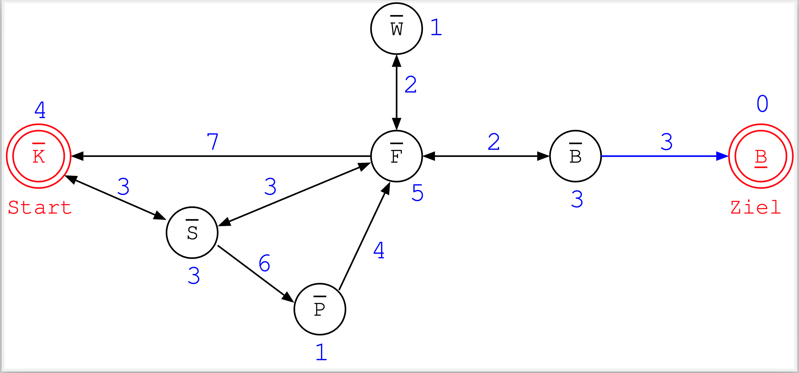

::: tldr
**Durchführung: Präsenz**

Die Klausur wird dieses Semester elektronisch stattfinden. Dazu werden wir den
E-Assessment-ILIAS der HSBI nutzen.

Die Klausur wird in den Räumen der HSBI am Campus Minden unter Aufsicht
durchgeführt. Hier werden Ihnen Rechner für den Zugang zum Prüfungs-ILIAS zur
Verfügung gestellt, Sie benötigen nur Ihre HSBI-Zugangsdaten (Username, Passwort),
einen Studierendenausweis und Personalausweis sowie Ihren DIN-A4-Spickzettel.

**Ablauf der Klausur**

Die Prüfung (das ILIAS-Objekt) selbst schalte ich zum Start der Prüfung online. Sie
loggen sich vor Ort in den ILIAS mit Ihren HSBI-Zugangsdaten ein und können die
Prüfung nach dem gemeinsamen Start beginnen. Nach Ablauf der Bearbeitungszeit
beenden Sie die Prüfung und loggen sich wieder aus. Parallel zur Prüfung werde ich
in einer Zoom-Sitzung zur Verfügung stehen, in der Sie Fragen stellen können.

**Hilfsmittel und Themen**

Als Hilfsmittel ist ein Spickzettel (DIN A4, beidseitig beschrieben) zugelassen.

Es wird keines der behandelten Themen ausgeschlossen, allerdings eignen sich manche
Themen etwas besser für Klausurfragen als andere ...
:::

::: youtube
1.  Fragetypen-Demo
    -   **Video** zur Fragetypen-Demo: \[[YT](https://youtu.be/cITcFlYWM40)\],
        \[[HSBI](https://www.hsbi.de/medienportal/video/pr2-prfungsvorbereitung-fragendemo/51dbc795071ecf07dabb595a946f519d)\]
    -   [**Fragetypen-Demo** im
        ILIAS](https://www.hsbi.de/elearning/goto.php/tst/1352273)
2.  Hinweise zur Prüfung: \[[YT](https://youtu.be/Oi3Y_tnIlJg)\],
    \[[HSBI](https://www.hsbi.de/medienportal/video/pr2-prfungsvorbereitung-hinweise-zur-prfung/7d6462b1b7257c84392184c91743a2e5)\]
:::

# Elektronische Klausur: Termin, Materialien

## Termin

Die schriftliche Prüfung erfolgt durch eine Klausur, die als digitale Prüfung auf
einem Prüfungs-ILIAS durchgeführt wird.

Die Klausur wird in Präsenz in den Rechnerpools am Campus Minden durchgeführt.

Es wird in beiden Prüfungszeiträumen ein Termin angeboten. Die Termine werden vom
Prüfungsamt bekannt gegeben.

Dauer: siehe Aushang bzw. Mail.

## Zugelassene Hilfsmittel: DIN-A4-Spickzettel (beidseitig)

Sie dürfen **einen** Spickzettel im **DIN-A4**-Format benutzen, der beidseitig
beschrieben sein kann.

Ich möchte Sie hier noch einmal ermuntern, diesen Zettel tatsächlich manuell zu
erstellen (also ganz traditionell zu **schreiben**), da bereits der Schreibvorgang
einen gewissen Lerneffekt bewirkt! (Wenn Sie sich bewusst dafür entscheiden, können
Sie den Spickzettel natürlich auch ausdrucken.)

## Einsicht

Die Prüfungseinsicht findet möglichst zeitnah und online statt. Details werden per
Mail bekanntgegeben.

# Technische Vorbereitungen

Sie benötigen am Prüfungstag:

1.  **HSBI-Zugangsdaten**: Username, Passwort

    Bei der Durchführung der Prüfung am Campus Minden wird Ihnen ein Rechner zur
    Verfügung gestellt. Dort läuft voraussichtlich ein Browser im Kiosk-Mode, wo Sie
    sich am Prüfungs-ILIAS anmelden. Dazu benötigen Sie Ihre HSBI-Zugangsdaten, mit
    denen Sie sich auch im "normalen" ILIAS anmelden.

2.  **Studierendenausweis** und Personalausweis

    An der Prüfung dürfen nur Personen teilnehmen, die dafür im LSF/CAT angemeldet
    sind. Es findet eine entsprechende Kontrolle statt. Halten Sie dazu Ihren
    Studierendenausweis und Personalausweis bereit.

# Bearbeitung des E-Assessment

1.  Lesen Sie sich die Hinweise auf der Startseite durch

2.  Bearbeiten Sie die Aufgaben in **einem einzigen** Browser-Tab

    **Öffnen Sie die Aufgaben *NICHT* in parallelen Tabs!** Es kann sonst zu
    Fehlfunktionen von ILIAS kommen.

    Bewegen Sie sich **nicht per Browser-Navigation** ("vor", "zurück" im Browser)
    durch die Aufgaben, sondern nutzen Sie dafür die **Buttons "nächste Frage",
    "Weiter" oder "Zurück" in ILIAS**!

3.  Hinweis zur Anzeige der restlichen Bearbeitungsdauer

    Wenn Sie den Browser bzw. das Tab mit der Prüfung im Laufe der Prüfung
    verlassen, wird Ihnen bei der Rückkehr unter Umständen eine falsche restliche
    Bearbeitungsdauer angezeigt. Sie können die Anzeige korrigieren/aktualisieren,
    indem Sie einfach zu einer vorigen oder nächsten Aufgabe navigieren.

    Hinweis: Die restliche Bearbeitungsdauer wird im Test nur dann angezeigt, wenn
    diese Funktion von den Prüfenden aktiviert wurde.

4.  Parallel zum E-Assessment läuft eine Zoom-Session, dort können Sie Fragen
    stellen

# Fragetypen-Demo

In Ihrem ILIAS-Kurs finden Sie eine
[**Fragetypen-Demo**](https://www.hsbi.de/elearning/goto.php/tst/1352273) mit den
wichtigsten Fragetypen. Machen Sie sich mit der Mechanik der Fragetypen vertraut und
schauen Sie sich die Kommentare bei den einzelnen Aufgaben an. Sie können die Demo
bei Bedarf beliebig oft wiederholen.

# Hinweise zu den Inhalten

-   Klausurrelevant: Vorlesung und Praktikum
-   Für Verständnis u.U. hilfreich: Studium der vertiefenden Literaturangaben

\smallskip

-   **Fragen**:
    -   Schauen Sie sich die Challenges an ...
    -   Schauen Sie sich die Praktikumsaufgaben an ...
    -   Überlegen Sie sich, was zu einem Themengebiet im Rahmen einer Prüfung
        möglich ist und (wie) gefragt werden könnte ...

::: center
**Können vor Kennen**
:::

# Beispiele für mögliche Fragen

## Breitensuche

Betrachten Sie den folgenden Graphen:

{width="60%"}

Mittels Breitensuche (Variante "Tree-Search") soll der kürzeste Weg von "K" nach "B"
gefunden werden. Die folgende Queue stellt den aktuellen Zustand der Suche dar:

`[KSF, KSP]`

Führen Sie den nächsten Schritt des Breitensuche-Algorithmus durch und geben Sie die
resultierende Queue an. Achten Sie auf die korrekte Sortierung und halten Sie sich
an die vorgegebene Notation.

*Hinweis*: Die vorgegebene Queue kann willkürlich konstruiert sein und muss nicht
viel mit Breitensuche zu tun haben.

## Suche und Constraints

-   Worin liegt der Unterschied zwischen einem Knoten und einem Zustand?
-   Was ist ein Suchbaum? Wo liegt der Unterschied zum Zustandsraum?
-   Muss der Suchbaum über eine eigene Datenstruktur realisiert werden?
-   Was bedeutet Kantenkonsistenz?

Erklären Sie die jeweiligen Begriffe nachvollziehbar. Nutzen Sie dazu ein eigenes
kleines Beispiel.

## Handsimulation Perzeptron

Gegeben sei folgendes Perzeptron mit den Gewichten $w_0=0, w_1=0, w_2=0$. Betrachten
Sie den folgenden Eingabevektor $x_0=1, x_1=1, x_2=0$ mit der Klasse $+1$. Geben Sie
für diesen Vektor folgende Werte an:

(a) Skalarprodukt $\mathbf{w}^T \mathbf{x}$,
(b) Aktivierung $\text{sgn}(\mathbf{w}^T \mathbf{x})$.
(c) Falls notwendig, führen Sie einen Lernschritt durch. Nutzen Sie dabei
    $\alpha=1$.

Geben Sie die resultierenden (neuen) Gewichte an (auch wenn Sie keinen Lernschritt
durchführen mussten).

## Entscheidungsbäume mit ID3

Gegeben sei folgender Trainingsdatensatz ...

Mit Hilfe von ID3 soll für diesen Datensatz ein Entscheidungsbaum konstruiert
werden. Der Algorithmus läuft schon und hat das Merkmal $x_2$ als Wurzelknoten
ausgewählt. Beschreiben Sie detailliert, wie ID3 die nächste Ebene aufbaut. Gehen
Sie dabei konkret auch auf den Algorithmus ein. Geben Sie die eingesetzten Formeln
für Entropien und Gains an und erklären Sie Ihr Vorgehen.

*Hinweis*: Sie sollen die Formeln nur einsetzen, aber nicht ausrechnen.

## CSP

Betrachten Sie das folgende Constraintproblem:

-   $\mathrm{C}_1 = \{(a,b) |   a \ne b\}$
-   $\mathrm{C}_2 = \{(b,c) |   b \ne c\}$
-   $\mathrm{C}_3 = \{(a,c) |   a = c\}$

\smallskip

-   $D_a=D_b=D_c=\{1,2,3,4,5\}$, $D_d=\{1,2,5\}$, $D_e=\{1,3\}$

\bigskip

Zeigen Sie per Handsimulation, wie der Algorithmus AC-3 schrittweise
Kantenkonsistenz herstellt. Hier ist die Queue in einem bestimmten Schritt: ...
Führen Sie einen Schritt durch und geben Sie die resultierende Queue an. Erklären
Sie Ihr Ergebnis.

## NB

Betrachten Sie den folgenden Datensatz: ... "Trainieren" Sie für diesen Datensatz
einen vollständigen Naive-Bayes-Klassifikator. Nutzen Sie die Variante "Multinomial
NB". Geben Sie alle Bestandteile an. Erklären Sie Ihr Vorgehen nachvollziehbar.

*Hinweis*: Sie brauchen die Brüche nicht ausrechnen.
