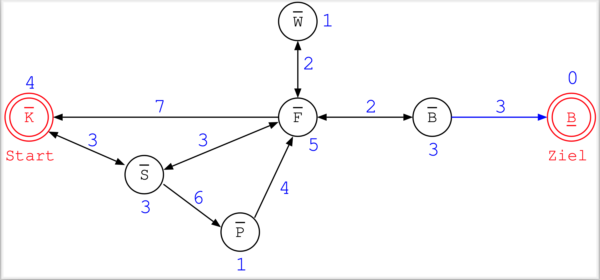

## Elektronische Klausur: Termin, Materialien

### Termin

Die Prüfung erfolgt durch eine Klausur, die als digitale Prüfung auf einem Prüfungs-ILIAS
durchgeführt wird.

Es wird angestrebt, die Klausur in Präsenz in den Rechnerpools am Campus Minden durchzuführen.
Falls dies wegen der Corona-Situation oder anderer Umstände nicht möglich sein sollte, wird
die Klausur als "Open-Book-Ausarbeitung" im Home-Office durchgeführt.

Es wird in beiden Prüfungszeiträumen ein Termin angeboten. Die Termine werden vom Prüfungsamt
bekannt gegeben.

Dauer jeweils 90 Minuten.

*   Die konkrete Durchführungsform [(in Präsenz am Campus Minden oder im Home-Office)]{.notes}
    wird Ihnen [spätestens]{.notes} zwei Wochen vor der Prüfung über das LSF bekanntgegeben

### Zugelassene Hilfsmittel

:::::: {.tabs groupid="modus"}
::: {.tab title="Präsenz (in Minden)"}

**Zugelassene Materialien**: [**DIN-A4-Spickzettel (beidseitig)**]{.alert}

Sie dürfen **einen** Spickzettel im **DIN-A4**-Format benutzen, der beidseitig beschrieben
sein kann.

Ich möchte Sie hier noch einmal ermuntern, diesen Zettel tatsächlich manuell zu erstellen
(also ganz traditionell zu **schreiben**), da bereits der Schreibvorgang einen gewissen
Lerneffekt bewirkt!

:::
::: {.tab title="Open-Book-Ausarbeitung (Homeoffice)"}

Falls die Prüfung als Open-Book-Ausarbeitung im Home-Office durchgeführt werden sollte, dürfen
Sie alle Unterlagen benutzen.

*   Ausnahme: **Keine Hilfe durch Dritte!** (insbesondere keine Zusammenarbeit, keine Kommunikation)

    Sie sollen die Prüfung eigenständig bearbeiten. Hilfe von Dritten sowie jegliche Kommunikation
    mit Dritten ist in keinem Fall zugelassen und wird als Täuschungsversuch gewertet.

:::
::::::

### Einsicht

*   Prüfungseinsicht: Zeitnah; Bekanntgabe per Mail

## Technische Vorbereitungen

:::::: {.tabs groupid="modus"}
::: {.tab title="Präsenz (in Minden)"}

Diese Bemerkungen betreffen die Durchführung als Präsenzprüfung in den Räumen am Campus Minden.

*   **HSBI-Zugangsdaten**: Username, Passwort

    Bei der Durchführung der Prüfung am Campus Minden wird Ihnen ein Rechner zur Verfügung
    gestellt. Dort läuft voraussichtlich ein Browser im Kiosk-Mode, wo Sie sich am Prüfungs-ILIAS
    anmelden. Dazu benötigen Sie ihre HSBI-Zugangsdaten, mit denen Sie sich auch im "normalen"
    ILIAS anmelden.

*   **Studierendenausweis** und Personalausweis

    An der Prüfung dürfen nur Personen teilnehmen, die dafür im LSF angemeldet sind. Es findet
    eine entsprechende Kontrolle statt. Halten Sie Ihren Studierendenausweis und Personalausweis
    bereit.

:::
::: {.tab title="Open-Book-Ausarbeitung (Homeoffice)"}

Diese Bemerkungen betreffen die Durchführung aus dem Home-Office mit Ihrer Hardware. Bei der
Durchführung in Präsenz in den Räumen am Campus Minden werden die technischen Details von uns
für Sie vorbereitet sein.

*   **Rechner**: Nutzen Sie für die Prüfung einen stationären Rechner oder ein Notebook.

    Vermeiden Sie die Verwendung von Tablets und Smartphones! Bei der Verwendung von Tablets
    kann es unter Umständen zu Darstellungsproblemen kommen. Smartphones sind aufgrund des kleinen
    Bildschirms für die Prüfungsdurchführung schlicht ungeeignet.

    Bei fehlendem Zugang zu einem entsprechenden Endgerät kontaktieren Sie bitte frühzeitig die
    Prüfungsverantwortlichen.

*   **Netz**: Stabil genug? Belastbar genug?

    Wenn Sie keinen Zugang zu einer ausreichend stabilen Internetverbindung haben, setzen Sie sich
    frühzeitig mit Ihren Prüfungsverantwortlichen in Verbindung.

*   **VPN**: Der Prüfungs-ILIAS ist nur im HSBI-VPN erreichbar.

    Installieren Sie den VPN-Client (Anleitung: [hsbi.de/dvz/faq/cat/7](https://www.hsbi.de/dvz/faq/cat/7))
    und testen Sie im Vorfeld der Prüfung bei aktivierter VPN-Verbindung den Zugang zur Prüfungsplattform
    [eassessment.hsbi.de](https://eassessment.hsbi.de). Zugangsdaten wie im normalen
    ILIAS.

    Achtung: Auch wenn Sie sich in den Räumen der HSBI befinden, müssen Sie oft die VPN-Verbindung aktivieren,
    um Zugang zur Prüfungsplattform zu erhalten.

*   **Browser**: [Nutzen Sie einen der]{.notes} Standardbrowser (Edge, Firefox, Safari, Chrome/Chromium)
    in der Standardeinstellung: insbesondere JavaScript und Cookies müssen aktiviert/erlaubt sein.

    Deaktivieren Sie sämtliche Browser-Erweiterungen wie z.B. Ad-Blocker (AdBlockPlus, uBlock, ...) oder
    JavaScript-Blocker (No-Script, Ghostery, ...) für den Prüfungszeitraum.

    **Nutzen Sie Ihren Browser nicht im Privacy-Modus!**

*   **HSBI-Zugangsdaten**: Username, Passwort

    Bei der Durchführung der Prüfung als Open-Book-Ausarbeitung führen Sie die Prüfung auf Ihrer
    eigenen Hardware im Home-Office durch. Auch hier müssen Sie sich am Prüfungs-ILIAS anmelden.
    Dazu benötigen Sie ihre HSBI-Zugangsdaten, mit denen Sie sich auch im "normalen" ILIAS anmelden.

:::
::::::

## Bearbeitung des E-Assessment

1.  Lesen Sie sich die Hinweise auf der Startseite durch

2.  Bearbeiten Sie die Aufgaben in **einem einzigen** Browser-Tab

    [**Öffnen Sie die Aufgaben _NICHT_ in parallelen Tabs!**]{.alert}
    Es kann sonst zu Fehlfunktionen von ILIAS kommen.

    Bewegen Sie sich nicht per Browser-Navigation ("vor", "zurück" im Browser)
    durch die Aufgaben, sondern nutzen Sie dafür die Buttons "nächste Frage",
    "Weiter" oder "Zurück" vom ILIAS!

3.  Hinweis zu Anzeige der restlichen Bearbeitungsdauer

    Wenn Sie den Browser bzw. das Tab mit der Prüfung im Laufe der Prüfung verlassen,
    wird Ihnen bei der Rückkehr unter Umständen eine falsche restliche Bearbeitungsdauer
    angezeigt. Sie können die Anzeige korrigieren/aktualisieren, indem Sie einfach zu einer
    vorigen oder nächsten Aufgabe navigieren.

    Hinweis: Die restliche Bearbeitungsdauer wird im Test nur dann angezeigt, wenn diese
    Funktion von den Prüfenden aktiviert wurde.

4.  Parallel zum E-Assessment läuft eine Zoom-Session, dort können Sie Fragen stellen

5.  Verbindungsprobleme (Home-Office):
    *   Bei kurzzeitigen Verbindungsabbrüchen loggen Sie sich einfach wieder ein
    *   Wenn die Probleme länger dauern, gilt der Versuch als nicht unternommen
        [(außer Sie haben die Probleme aktiv herbeigeführt, dann kann das als
        Täuschungsversuch gewertet werden, vgl. RPO §22a (4))]{.notes}

6.  Erklärung "Eigenständige Bearbeitung" (max. 24h nach Prüfungsende)

    Sie müssen eine Erklärung der eigenständigen Bearbeitung in der vorbereiteten Aufgabe im separaten
    "Test" im Prüfungsraum abgeben. Ohne diese Erklärung wird Ihre Prüfung nicht bearbeitet/gewertet!

    Dazu haben Sie maximal 24 Stunden nach Beendigung der Prüfung Zeit.

## Fragetypen-Demo

In Ihrem ILIAS-Kurs finden Sie eine
[**Fragetypen-Demo**](https://www.hsbi.de/elearning/goto.php?target=tst_1258630&client_id=FH-Bielefeld)
mit den wichtigsten Fragetypen. Machen Sie sich mit der Mechanik der Fragetypen vertraut und schauen
Sie sich die Kommentare bei den einzelnen Aufgaben an. Sie können die Demo bei Bedarf beliebig oft
wiederholen.

## Hinweise zu den Inhalten

*   Klausurrelevant: Vorlesung und Praktikum
*   Für Verständnis u.U. hilfreich: Studium der vertiefenden Literaturangaben

\smallskip

*   **Fragen**:
    *   Schauen Sie sich die Quizzes an ...
    *   Schauen Sie sich die Praktikumsaufgaben an ...
    *   Überlegen Sie sich, was zu einem Themengebiet im Rahmen einer Prüfung
        möglich ist und (wie) gefragt werden könnte :)

::: center
[**Können vor Kennen :-)**]{.alert}
:::

## Beispiele für mögliche Fragen

### Breitensuche

Betrachten Sie den folgenden Graphen:

{width="60%"}

Führen Sie eine Handsimulation der Breitensuche durch. Start ist
"K", Ziel ist "B".

\bigskip

Geben Sie den Zustand der Queue in jedem Schritt an.

### Suche

*   Worin liegt der Unterschied zwischen einem Knoten und einem Zustand?
*   Was ist ein Suchbaum? Wo liegt der Unterschied zum Zustandsraum?
*   Muss der Suchbaum über eine eigene Datenstruktur realisiert werden?
*   Was bedeutet Kantenkonsistenz?

### Handsimulation Perzeptron

Führen Sie den Perzeptron-Lernalgorithmus in Handsimulation durch.
Lernen Sie die Boolesche Funktion OR. Die Trainingsmenge ist: ...

Ihr Programm soll eine Tabelle mit den Spalten

> $w_1$, $w_2$, $-\theta$, $x_1$, $x_2$, $k$,  $\sum_{i=1}^n w_i x_i - \theta$,
> Vorhersage, Änderung? (=,+,-)

ausgeben, die eine Zeile für jeden Lernschritt enthält.
Geben Sie die vollständige Lerntabelle an.

\smallskip

Anders als in der Vorlesung besprochen, sollen die Gewichte $w_1$ und $w_2$
sowie die Schwelle $\theta$ jeweils mit dem Wert $0$ initialisiert werden.
Die Lernschrittweite $\alpha$ sei $0.5$. Nutzen Sie die
$\operatorname{sign}$-Funktion als Aktivierungsfunktion:
$$
\operatorname{sign}(x) = \left\{
    \begin{array}{ll}
    0 & \text{falls } x<0\\
    1 & \text{sonst}
    \end{array}
\right.
$$

Zeichnen Sie eine geometrische Interpretation Ihres Perzeptrons nach dem
Lernen (Trennebene,  Gewichtsvektor, Trainingsbeispiele).

### Entscheidungsbäume mit ID3

Gegeben sei folgender Trainingsdatensatz ...

\bigskip

Bauen Sie mit Hilfe von ID3 einen Entscheidungsbaum auf.
Welches Attribut würde als erster Test verwendet werden und warum? Wie
bestimmt sich die Reihenfolge der weiteren Attribute?

\bigskip

Als Hilfe gegeben: Einige wichtige Logarithmen zur Basis 2

### CSP

Betrachten Sie das folgende Constraintproblem:

*   $\mathrm{C}_1 = \{(a,b) |   a \ne b\}$
*   $\mathrm{C}_2 = \{(b,c) |   b \ne c\}$
*   $\mathrm{C}_3 = \{(a,c) |   a = c\}$

\smallskip

*   $D_a=D_b=D_c=\{1,2,3,4,5\}$, $D_d=\{1,2,5\}$, $D_e=\{1,3\}$

\bigskip

Zeichnen Sie den zugehörigen Constraintgraphen.

\bigskip

Zeigen Sie per Handsimulation, wie der Algorithmus AC-3 schrittweise
Kantenkonsistenz herstellt.

### Backpropagation

In der Vorlesung wurde die Delta-Regel bzw. die Gewichtsupdates bei der
Backpropagation für die Ausgabeschicht und die davor liegende letzte
Hidden-Layer unter Verwendung der Transferfunktion $g(a) = 1/(1+\exp(-a))$
vorgerechnet.

\bigskip

Leiten Sie die Gewichtsupdates für die letzte und die vorletzte Schicht
unter Verwendung der alternativen Transferfunktion $g(a) = \tanh(a)$  her.

<!-- DO NOT REMOVE - THIS IS A LAST SLIDE TO INDICATE THE LICENSE AND POSSIBLE EXCEPTIONS (IMAGES, ...). -->
::: slides
## LICENSE

Unless otherwise noted, this work is licensed under CC BY-SA 4.0.
:::
