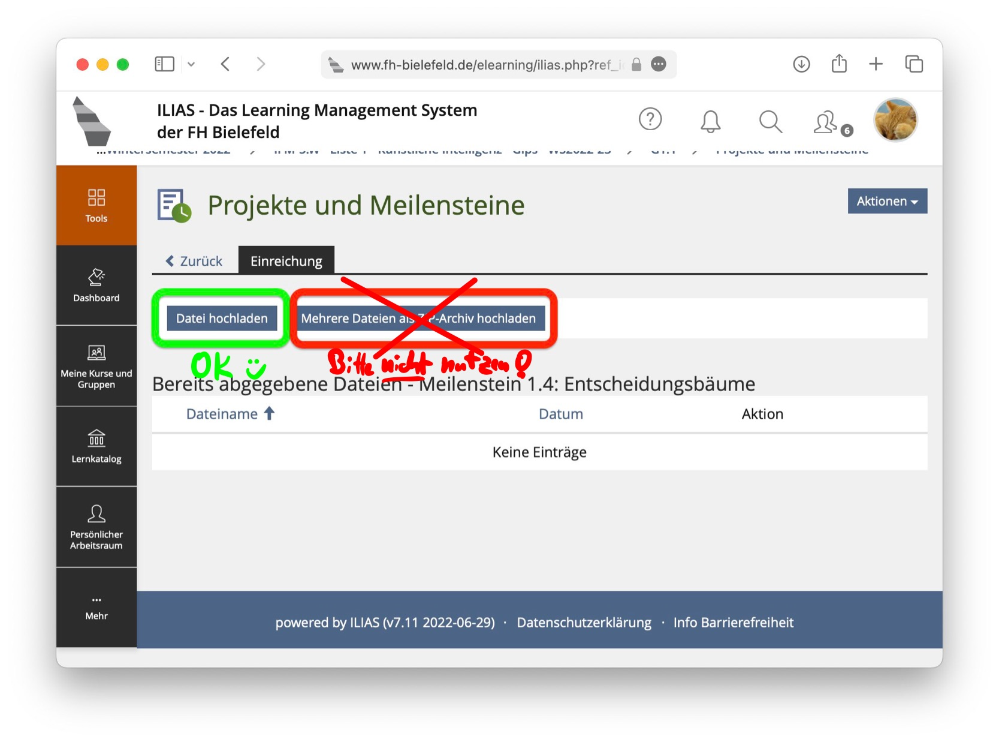

## Co-Teaching und Online-Unterricht

Wir werden die Vorlesungen an beiden Hochschulen (TDU, HSBI) im Co-Teaching gemeinsam
durchführen. Deshalb werden alle Sitzungen (Vorlesung/Sprechstunde und Übung/Praktikum)
online über Zoom durchgeführt.

## Flipped Classroom

Wir drehen die Vorlesungen vom Ablauf her "um" - daher die Bezeichnung "Flipped Classroom".

Beim Flipped Classroom arbeiten Sie sich **vor der jeweiligen Vorlesung** selbstständig
durch das für die jeweilige Woche bereitgestellte Material: Skript, Videos, Quizzes,
Literaturhinweise, ..., gern auch bereits durch die Übungsaufgaben.

In der gemeinsamen Vorlesungssitzung präsentieren wir keinen neuen Stoff, sondern können
gemeinsam auf Ihre Fragen zum aktuellen Thema eingehen und im Plenum oder in Kleingruppen
passende Fallstudien lösen.

Das setzt voraus, dass Sie vorbereitet in die Stunde kommen und sich aktiv einbringen.

## Prüfungsform "Testat plus Klausur"

Die Prüfung an sich besteht aus einer **Klausur**, die Sie in jedem der beiden Prüfungszeiträume
absolvieren können. Die Klausurnote entspricht der Note für das Modul.

Für die erfolgreiche Teilnahme am Praktikum erhalten Sie ein **Testat**. Sie erhalten die CPS
für das Modul erst, wenn Sie das Testat haben.

Testat und Note sind im Prinzip unabhängig voneinander: Sie können nur das Testat machen oder
nur an der Klausur teilnehmen. Sie benötigen aber beide Elemente, um das Modul abschließen zu
können.

Prüfung (Termin 1+2): Die Termine werden rechtzeitig vom Prüfungsamt bekannt gegeben. Sie
benötigen am Prüfungstag Ihre HSBI-Zugangsdaten (User, Passwort), einen Studierendenausweis und
Personalausweis sowie Ihren DIN-A4-Spickzettel. Prüfungsrelevant sind die im "Fahrplan"
verlinkten Inhalte.

## Praktium/Übung

### Bearbeitung der Übungsaufgaben

Die Übungsaufgaben sollen in internationalen 2er-Teams (oder anderenfalls einzeln)
bearbeitet und gelöst werden.

Das Diskutieren der Themen untereinander ist vorteilhaft, das Teilen von
Lösungen ist nicht erlaubt!

Das gegenseitige Kennenlernen und die Team-Bildung für die Bearbeitung der Übungsaufgaben
erfolgt in der ersten Übung/im ersten Praktikum am Mittwoch, dem 12.10.2022 (Woche 41).

### Gruppenwahl

Wir haben in diesem Semester an der HSBI zwei Praktikumstermine (G1 und G2) und an der
TDU drei Übungstermine (G1, G2, G3). Jede Person ist vom Stundenplan her einem dieser
Termine zugeordnet.

In jedem Übungs-/Praktikumstermin werden mehrere feste Kleingruppen gebildet, die dann
gemeinsam im Semester in Breakout-Sessions arbeiten.

In G1 und G2 werden je 3..4 Studierende der TDU und 4..5 Studierende der HSBI gemeinsam
in den Breakout-Sessions arbeiten. In G3 werden die Kleingruppen mit 10..11 Studierenden
der TDU gebildet.

Hierzu treten Sie bitte am Anfang des Semesters einmalig im Kursraum im ILIAS einer der
dort angebotenen Kleingruppen bei, die zu Ihrem Stundenplan-Zeitslot passt. Die Passwörter
werden per Ankündigung in der Lehrveranstaltung bekannt gegeben.

*   HSBI: Beitritt zu den Breakout-Gruppen in G1 und G2 vom 05.10.2022 11:00 Uhr bis
    08.10.2022 16:00 Uhr (DE)
*   TDU: Beitritt zu den Breakout-Gruppen in G1, G2 und G3 vom 08.10.2022 19:00 Uhr
    bis 11.10.2022 23:55 Uhr (TR)

Die Kleingruppen im ILIAS haben eine Kennzeichnung, die wir auch im Zoom für die
Breakout-Sessions nutzen. So finden Sie im Zoom zu "Ihrer" Kleingruppe und können
selbstständig in "Ihre" Breakout-Session gehen.

### Abgabe der Lösungen

Bei Textaufgaben laden Sie Ihre Lösungen als **PDF-Datei** im ILIAS hoch. Sie
können die Lösung in einer Textdatei (Markdown, LaTeX, Word, ...) bearbeiten
und als PDF exportieren. Alternativ können Sie Ihre Lösung auf Papier
aufschreiben und mit einer App wie zum Beispiel CamScanner ein PDF erzeugen.

Programmieraufgaben laden Sie bitte als **Zip-Archiv** der jeweiligen
Quell-Dateien im ILIAS hoch.

Die Poster laden bitte jeweils als **PDF-Datei** im ILIAS hoch.

**Wichtig**: Jede Person muss ihre Lösung eigenständig im ILIAS hochladen.
Das gilt auch, wenn Sie in internationalen 2er-Teams zusammenarbeiten.

{width="80%"}

### Vorstellung der Lösungen

Die Vorstellung Ihrer Lösung im Praktikum kann mit einem Medium Ihrer Wahl
stattfinden. Sie können zum Beispiel Ihren Bildschirm teilen und Ihre Lösung
erklären. Sie brauchen nicht extra eine Präsentation anfertigen!

### How to Review

Nach der Ablauf der Deadline wird Ihnen durch ILIAS ein oder mehrere Reviews
zugewiesen. Sie finden die Review-Kriterien (als Checklisten) und die
anzufertigenden Reviews im ILIAS - gehen Sie dazu im Praktikumsbereich auf
die jeweilige Aufgabe.

Während des Praktikums/der Übung füllen Sie bitte die Review-Checklisten aus
und stellen Sie diese im ILIAS ein.

Die Reviews werden automatisch innerhalb Ihrer Kleingruppe (Breakout-Gruppe)
verteilt. Sie finden die angeforderten Reviews im ILIAS in der jeweiligen Aufgabe.

{width="80%"}

Gehen Sie **nach der Deadline** und **vor Ihrer Übung/Ihrem Praktikum** bitte ins
ILIAS in die Aufgabe und klicken auf den Button "Feedback geben", um nachzuschauen,
wem Sie ein Peer-Feedback geben sollen. Da hier lediglich die ILIAS-Kürzel angezeigt
werden, müssen Sie zudem zu Begin der Übung bzw. des Praktikums innerhalb Ihrer
Gruppe klarstellen, wem welches Kürzel zuzuordnen ist.

{width="80%"}

Indem Sie auf "Bearbeiten" klicken, finden Sie hier die Kriterien für die Reviews
in Form von kurzen Checklisten, sowie die Abgabe des zu bewertenden Peers, welche
Sie über den Download-Button herunterladen können. Hier ist später das Feedback
einzutragen.

{width="80%"}
{width="80%"}

In der Übung/im Praktikum füllen Sie Ihre Checklisten beim Zuhören aus und
übertragen diese bis spätestens zur angegebenen Frist ins ILIAS. Feedback-Fragen
zu den von anderen Personen vorgestellten Aufgabenteilen beantworten Sie bitte
anhand der Abgaben ihrer Feedback-Empfänger.

Wenn bei den Review-Fragen mit den "Ja/Nein"-Checkboxen alle Kriterien mit "Nein"
beantwortet werden müssten, also keine der Checkboxen angehakt werden kann, schreiben
Sie bitte einen entsprechenden Kommentar in das Freitextfeld. Sonst können Sie das
Review nicht absenden.

Unter Umständen kann es passieren, dass ILIAS Ihnen die Lösung Ihres eigenen Teams
(konkret: Ihren Teampartner) zuweist. In diesem Fall führen Sie bitte kein
vollständiges Review durch, sondern wählen Sie den entsprechenden Punkt auf der
Checkliste aus ("eigenes Team"). Außerdem kann es passieren, dass ILIAS Ihnen zwei
Mal eine Lösung des gleichen Teams zuweist, da jedes Mitglied einer Gruppe die Lösung
einzeln hochladen muss. In diesem Fall vergeben Sie bitte zwei Mal das gleiche Feedback.

Nachdem Sie fristgemäß die geforderte Anzahl an Feedbacks vergeben haben, wird in der
Aufgabe ein weiterer Button "Erhaltenes Feedback zeigen" freigeschaltet, über welchen
Sie das an Sie vergebene Feedback einsehen können.

{width="80%"}

Die Reviews sollen Ihnen zusätzlich zur Diskussion über die Lösungen in der Übung/im
Praktikum helfen, Ihre Lösung zu reflektieren und einzuordnen. Beim Erstellen der
Feedbacks sehen Sie anhand der Kriterien, welche Aspekte wichtig waren und wo Sie
vielleicht noch einmal nachschauen sollten. Das von den anderen Studierenden empfangene
Feedback kann Sie im Lernprozess unterstützen.

### Poster

Für die beiden Poster-Sessions führen Sie die Ergebnisse der jeweiligen Meilensteine
zusammen und erstellen Sie ein Poster, welches Sie dann als Lösung abgeben, vorstellen
und wofür Sie sich gegenseitig Feedback erteilen.

Eine Anleitung sowie Vorlagen finden Sie hier:
["How to create beautiful and effective academic posters in PowerPoint"](https://www.brightcarbon.com/blog/effective-academic-posters-powerpoint/).

### Punktevergabe

Sie erhalten für jeden der 7 Meilensteine und jede der beiden Poster-Sessions
bis zu 4P:

-   1P für das Hochladen der Lösung im ILIAS
-   1P für das Vorstellen der Lösung im Praktikum
-   2P für das Erstellen des Peer-Feedbacks

Ihre Lösung muss nicht unbedingt 100% korrekt sein, muss aber eine intensive
Beschäftigung mit der jeweiligen Aufgabe erkennen lassen.

**Wichtig**: Beachten Sie, dass die Punkte aufeinander aufbauen: Ohne Abgabe
der Lösung im ILIAS können Sie Ihre Lösung nicht vorstellen und auch kein
Peer-Feedback abgeben.

Für die Poster gibt es zusätzlich je bis zu 10P, die nach inhaltlichen und
formalen Kriterien durch die Dozenten vergeben werden.

Damit können Sie maximal (7+2)x 4 + 2x 10 = 56 Punkte im Praktikum erreichen.

### Verspätete Abgaben, Krankheit

Es gibt keine verspäteten Abgaben. Das sind 0P.

**Ausnahme**: Für die beiden Poster gibt es eine Nachfrist von jeweils einer Woche, d.h.
die beiden Poster können bis zu eine Woche später abgegeben werden. Dabei können dann
aber nur noch **maximal 7P je in der Nachfrist eingereichtes Poster** erreicht werden
(1P für die Abgabe, bis zu 6P von den Dozenten für die inhaltliche und formale Qualität)!

**Sonderregelung/Hinweis für TDU (2022-11-18):** Auf Grund der Überschneidung mit den
Zwischenprüfungen können für das in der Nachfrist eingereichte **Poster #1 bis zu 11P**
erreicht werden (1P für die Abgabe, bis zu 10P von den Dozenten).

HSBI/TDU: Sie können in der Nachfrist einreichen, auch wenn Sie im ersten Termin fristgerecht
eingereicht und ihr Poster vorgestellt haben. Beachten Sie aber, dass in dem Fall das
**zuletzt eingereichte Poster bewertet** wird und Sie damit auf die insgesamt 3P für das
Vorstellen und das Feedback verzichten.

Bei Krankheit/familiären Notfällen: Es ist bei den Übungsaufgaben ein gewisser Puffer für
Notfälle oder Krankheitsfälle eingeplant. Sie könnten also je nach Punktestand einmal
eine Woche fehlen und immer noch Ihr Testat (HSBI) oder eine "1.0" (TDU) erreichen.

Wenn die persönliche Ausnahmesituation länger vorliegen sollte, müssen ggf. andere
Lösungen gefunden werden, um das Semester erfolgreich abschließen zu können. Nehmen
Sie in diesem Fall zeitnah Kontakt zu Ihren Dozenten auf.

Bei 2er-Teams arbeitet bitte der jeweilige Teampartner normal weiter (Abgabe der Lösung,
Vorstellung der Lösung, Feedback), um die Punkte zu erhalten.

Die beiden Poster-Sessions bauen inhaltlich auf den jeweils davor liegenden Meilensteinen
auf. Wenn Sie einmal einen Meilenstein verpasst haben, holen Sie die Aufgabe entsprechend
bei der Erstellung des Posters nach.

## Einordnung Lernziele

Die Lernziele der einzelnen Einheiten werden in einer Einstufung nach

> *Anderson, Krathwohl (eds)*: "A Taxonomy for Learning, Teaching, and Assessing: A Revision of
> Bloom's Taxonomy of Educational Objectives", Allyn & Bacon, 2001

angegeben.

Kennen (K1)
:   Abruf von Informationen (Begriffe, Fakten, Prinzipien)
:   (erkennen, nennen, bezeichnen, wiedergeben, kennen)

Verstehen (K2)
:   Begründen und Erläutern von Aussagen zum Thema
:   (beschreiben, zusammenfassen, vergleichen, klassifizieren, begründen, erklären)

Anwenden (K3)
:   Übertragung von erworbenem Wissen auf neue Situationen oder Anwendung zur Problemlösung
:   (ausführen, anwenden, beurteilen, entwerfen, nutzen)

## Erwarteter Arbeitsaufwand

{width="50%"}

*   HSBI: **90h Selbststudium => ca. 6h Arbeitszeit pro Woche**
*   TDU: **106h Selbststudium => ca. 7h Arbeitszeit pro Woche**

Zeiten sind Richtwerte! - Manche brauchen länger, manche sind schneller ...

Die Praktikumsaufgaben sollen Ihnen helfen, sich mit den Inhalten der
Vorlesung auseinander zu setzen. Die Abgabeform und die Bedingungen an das
Testat sind bewusst so gewählt, damit Sie im Praktikum untereinander in eine
Diskussion eintreten (können). Nutzen Sie diese Chance und verhalten Sie sich
aktiv -- so macht das Praktikum Spaß und bringt allen mehr.

Studieren Sie! Studieren bedeutet, sich **selbstständig** mit einem Thema auseinander zu setzen,
zu vertiefen, zu üben, Zusammenhänge herzustellen. Die Lehrveranstaltung unterstützt Sie dabei,
indem die wichtigsten Themen ausgesucht, in eine zeitliche Reihenfolge gebracht und didaktisch
aufbereitet werden, so dass Sie sich die Inhalte leichter erschließen können. Es gibt aber viele
weitere Themen und Dinge, die nicht besprochen werden können (schon aus rein zeitlichen
Gründen), die aber (für Sie und/oder das Themengebiet) interessant sein können!

Prüfungsrelevant sind selbstverständlich nur die besprochenen Inhalte. Der Fokus liegt aber auf
dem "Können", also dem **Beherrschen** der jeweiligen Themen.
