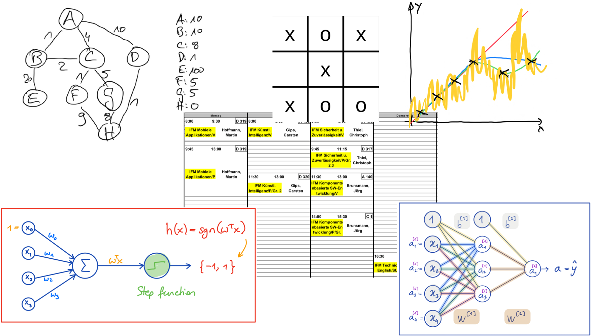

::: youtube
-   [Modulvorstellung KI](https://youtu.be/rBQZr6KDvak)
:::

# Was ist *Künstliche Intelligenz*?

{width="80%"}

[[AvB - RoboCup 2013 -
Eindhoven](https://www.flickr.com/photos/80267257@N05/10151827605) by
[RoboCup2013](https://www.flickr.com/photos/80267257@N05) on Flickr.com ([CC BY
2.0](https://creativecommons.org/licenses/by/2.0/?ref=ccsearch&atype=rich))]{.credits}

# Überblick über wichtige Methoden & Gebiete der KI

{width="82%"}

\bigskip
\bigskip
\bigskip

2 SWS Vorlesung (E-Klausur), 2 SWS Praktikum mit Testat
