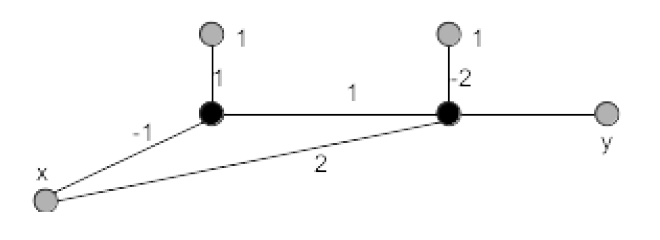

# NN.Backprop.01: Gewichtsupdates für versteckte Schichten (2P)

In der Vorlesung wurde(n) die Gewichtsupdates bei der Backpropagation für die
Ausgabeschicht und die davor liegende letzte versteckte Schicht hergeleitet, wobei in
der Ausgabeschicht die Sigmoid und in der versteckten Schicht die ReLU
Aktivierungsfunktionen eingesetzt wurden. Leiten Sie die Gewichtsupdates für die
erste versteckte Schicht (für ein Netz mit zwei echten versteckten Schichten) her.
Verwenden Sie dabei die Sigmoid Funktion als Aktivierung in allen Schichten.

*Thema*: Verständnis Backpropagation

# NN.Backprop.02: Forward- und Backpropagation (2P)

Betrachten Sie das folgende MLP mit zwei Schichten mit insgesamt zwei Zellen. Die
Gewichte sind an den Kanten angegeben. Das Netz erhält den skalaren Input $x$ und
berechnet daraus die Ausgabe $y$. Beide Zellen verwenden die Aktivierungsfunktion
$\sigma(z) = \frac{1}{ 1 + e^{-z} }$.

{width="50%"}

-   (1P) Berechnen Sie die Ausgabe $y$ für die Eingabe $(x,y_T)=(0, 0.5)$. Wie groß
    ist der Fehler?

-   (1P) Berechnen Sie die partiellen Ableitungen für die Gewichte. Wie lauten die
    Gewichtsupdates für das obige Trainingsbeispiel? Setzen Sie $\alpha = 0.01$.

# NN.Backprop.03: MLP und Backpropagation (6P)

Implementieren Sie ein Feedforward MLP mit mindestens einer versteckten Schicht.
Nutzen Sie die Cross-Entropy Verlustfunktion.

-   (2P) Implementieren Sie die Forwärtspropagation. Nutzen Sie als
    Aktivierungsfunktion in der Ausgangsschicht $g(z) = \frac{1}{ 1 + e^{-z} }$ und
    in der versteckten Schicht $g(z) = ReLU(z)$.

-   (2P) Implementieren Sie das Backpropagations-Verfahren zum Aktualisieren der
    Gewichte. Achten Sie insbesondere darauf, die bereits berechneten partiellen
    Ableitungen der jeweils hinteren Schicht wieder zu verwenden (und nicht jeweils
    erneut zu berechnen!), d.h. propagieren Sie die Fehler von hinten nach vorn durch
    das Netz.

-   (2P) Trainieren Sie das Netz für den Iris-Datensatz (iris.csv) aus dem
    [AIMA-Repository](https://github.com/aimacode/aima-data) und nutzen Sie dabei die
    Variante des stochastischen Gradientenabstiegs. Messen Sie pro Epoche (also nach
    jedem Durchlauf durch den kompletten Datensatz) den Trainingsfehler. Zeichnen Sie
    den Trainingsfehler als Diagramm über den Epochen auf.

Falls der Trainingsfehler nach einigen tausend Epochen nicht gegen einen Wert nahe
Null strebt, erweitern Sie Ihr Netz (beispielsweise eine versteckte Schicht mehr oder
mehr Zellen in der schon existierenden versteckten Schicht, ...) und trainieren Sie
es erneut. Nach wievielen Epochen ist der Trainingsfehler fast Null?

*Thema*: Verständnis MLP und Backpropagation, Gefühl für nötige Größe des Netzes
