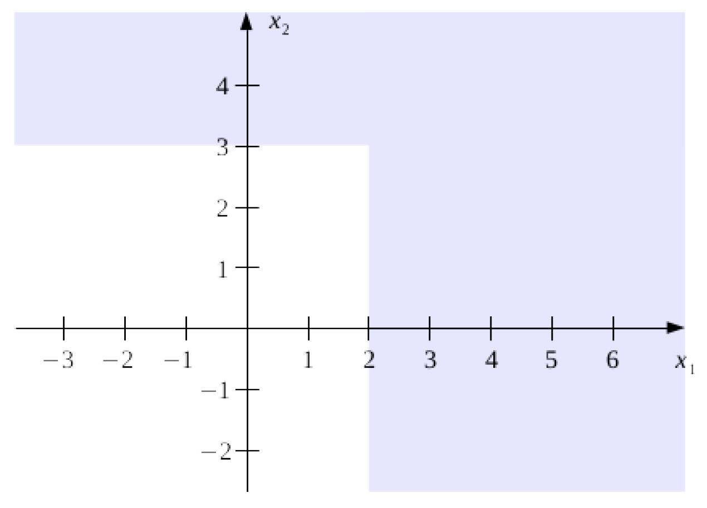

# NN.MLP.01: Perzeptron-Netze (2P)

Konstruieren Sie ein Netz mit drei Perzeptrons, welches für zwei Eingabevariablen
$x_1$ und $x_2$ die in der folgenden Abbildung blau-grau dargestellten Bereiche mit
+1 klassifiziert. Benutzen Sie die $\mathop{\text{sign}}$-Funktion als
Aktivierungsfunktion.

{width="60%"}

# NN.MLP.02: Vorwärtslauf im MLP (2P)

Gegeben sei ein MLP mit 25 Zellen in der Eingangsschicht, 64 Zellen in der ersten
versteckten Schicht, 32 Zellen in der zweiten versteckten Schicht und 4 Zellen in
der Ausgabeschicht (die Bias-Zellen nicht mitgezählt). In allen Zellen wird die ReLU
Aktivierungsfunktion verwendet.

-   Was sind die Dimensionen der Gewichtsmatrizen $W^{[1]}$, $W^{[2]}$ und $W^{[3]}$
    und der Bias-Vektoren $b^{[1]}$, $b^{[2]}$ und $b^{[3]}$?
-   Wie wird die Ausgabe berechnet? Schreiben Sie den Vorwärtslauf in
    Matrix-Notation auf. Wie könnte man die Ausgabe deuten; welches Problem könnte
    durch dieses Netzwerk möglicherweise gelöst werden?

# NN.MLP.03: Tensorflow Playground (6P)

Benutzen Sie den [Neural Network Playground](https://playground.tensorflow.org/), um
die unten gelisteten Experimente durchzuführen. Achten Sie bei allen Experimenten
auf das Verhalten der Trainings- und Testkosten. Sie können mit Hilfe der Checkbox
unter der Ausgabezelle (ganz rechts, unten) die Testdaten ein- und ausblenden. Der
Play-Knopf startet dabei das Training und der Reload-Knopf setzt das Netzwerk
zurück.

1.  (1P) Trainieren Sie ein **logistisches Regressionsmodell** zunächst auf dem
    "**Gaussian**" Datensatz (linear separierbarer Datensatz links-unten), danach
    auf den anderen Datensätzen.

2.  (3P) Trainieren Sie ein **MLP** mit

    -   einer versteckten Schicht mit 2 Neuronen,
    -   einer versteckten Schicht mit 3 Neuronen,
    -   einer versteckten Schicht mit 5 Neuronen,
    -   zwei versteckten Schichten mit jeweils 5 Neuronen pro Schicht
    -   drei versteckten Schichten mit jeweils 7 Neuronen pro Schicht
    -   vier versteckten Schichten mit jeweils 7 Neuronen pro Schicht

    auf dem kreisförmigen (**Circle**) und auf dem spiralförmigen (**Spiral**)
    Datensatz, mehrmals mit jeweils den Aktivierungsfunktionen ReLU, tanh und
    Sigmoid. Hat die Auswahl der Aktivierungsfunktion einen Einfluss auf die Form
    der Entscheidungsgrenze oder die Geschwindigkeit der Berechnung?

3.  (2P) Setzen Sie nun den **Noise-Level auf 15** und wiederholen Sie die
    Experimente. Wann kann von einer Überanpassung gesprochen werden?

Sprechen Sie für alle Experimente die folgenden Punkte an:

-   Wie verhält sich die Entscheidungsgrenze?
-   Was können Sie über Trainings- und Testkosten sagen? Entsteht eine
    Überanpassung?
-   Wie schnell wird die Entscheidungsgrenze berechnet?
-   Können alle Datenpunkte jedes mal korrekt klassifiziert werden? Warum?
-   Untersuchen und vergleichen Sie die Ausgaben der Zellen in den versteckten
    Schichten, in dem Sie die Maus über die jeweilige Zelle bewegen. Bemerken Sie
    einen wesentlichen Unterschied in den Ausgaben der ersten Schicht im Vergleich
    zu der letzten Schicht?
