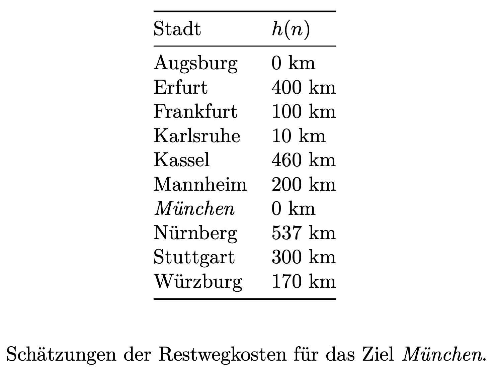

# Bonus: Möglichkeiten und Grenzen sowie Auswirkungen der KI (2P)

Recherchieren Sie, welche Probleme bereits mittels Computer- bzw. Robotereinsatz
gelöst werden können und welche aktuell noch ungelöst sind.

Recherchieren Sie Auswirkungen auf die Gesellschaft durch die KI, etwa durch
autonomes Fahren oder durch *Large Language Models* (LLM).

Hier ein paar Startpunkte:

-   "Empirical evidence of Large Language Model's influence on human spoken
    communication" (https://arxiv.org/abs/2409.01754) - Gut? Schlecht? Egal?

*Thema*: Gefühl für bereits realisierbare Aufgaben, Chancen und Risiken, Ethik

# Search.01: Problemformalisierung, Zustandsraum (3P)

Drei Elben und drei Orks befinden sich an einem Ufer eines Flusses und wollen diesen
überqueren. Es steht dazu ein Pferd zur Verfügung, welches maximal zwei Wesen tragen
kann. Das Pferd kann den Fluss nicht allein überqueren.

Gesucht ist eine Möglichkeit, alle Elben und Orks über den Fluss zu bringen. Dabei
darf zu keiner Zeit an keinem Ufer die Anzahl der sich dort befindlichen Orks größer
sein als die der dort wartenden Elben, da es sonst zu Konflikten zwischen beiden
Gruppen kommt.

1.  Formalisieren Sie das Problem (Zustände, Aktionen, Start- und Endzustand).
2.  Skizzieren Sie den Problemgraph.

*Thema*: Formalisierung von Problemen, Problemgraph

# Search.02: Suchverfahren (5P)

Betrachten Sie folgende Landkarte und Restwegschätzungen:

{width="40%"}

[[MapGermanyGraph.svg](https://commons.wikimedia.org/wiki/File:MapGermanyGraph.svg)
by [Regnaron](https://de.wikipedia.org/wiki/Benutzer:Regnaron) and
[Jahobr](https://commons.wikimedia.org/wiki/User:Jahobr) on Wikimedia Commons
([Public Domain](https://en.wikipedia.org/wiki/en:public_domain))]{.credits}

{width="40%"}

1.  Finden Sie nacheinander mit Tiefensuche (1P) und Breitensuche (1P) (jeweils in
    der Graph-Search-Variante) sowie A\* (2P) (in der Tree-Search-Variante mit der
    Verbesserung "keine Zyklen", siehe Vorlesung) jeweils einen Weg von Würzburg
    nach München.

    Vergleichen Sie die drei Algorithmen: Wie viele Einträge gibt es in der
    Datenstruktur maximal, wie oft wird die Hauptschleife durchlaufen (also ein
    Element aus der Datenstruktur entnommen, untersucht und weiterentwickelt)?

    Sie können dafür eine Handsimulation anwenden oder die Algorithmen
    implementieren. Sie können gern auch die Java-Klassen im Paket
    [`aima.core.search`](https://github.com/aimacode/aima-java/tree/AIMA3e/aima-core/src/main/java/aima/core/search)
    bzw. die Python-Klassen in
    [`search.py`](https://github.com/aimacode/aima-python/blob/master/search.py) als
    Ausgangspunkt nutzen.[^1]

2.  Dürfen die oben gegebenen Restkostenabschätzungen in A\* verwendet werden? (1P)

    -   Falls ja, warum?
    -   Falls nein, warum? Wie müssten die Abschätzungen ggf. korrigiert werden?

    Falls Sie der Meinung waren, die Abschätzungen sind nicht korrekt, korrigieren
    Sie die Abschätzungen nun und führen Sie erneut eine Suche mit A\* durch.

*Hinweis*: Reihenfolge bei gleichen $f(n)$-Kosten: alphabetische Reihenfolge, d.h.
Mannheim käme vor München, Karlsruhe vor Kassel etc.

# Search.03: Dominanz (1P)

Was bedeutet *"Eine Heuristik $h_1(n)$ dominiert eine Heuristik $h_2(n)$"*?

Wie wirkt sich die Nutzung einer dominierenden Heuristik $h_1(n)$ in A\* aus (im
Vergleich zur Nutzung einer Heuristik $h_2$, die von $h_1$ dominiert wird)?

Geben Sie selbstgewählte Beispiele an.

*Thema*: Begriff der dominierenden Heuristik (Selbststudium)

# Search.04: Beweis der Optimalität von A\* (1P)

Beweisen Sie, dass A\* in der Tree-Search-Variante bei Nutzung einer zulässigen
Heuristik optimal ist.

*Thema*: Bedeutung einer zulässigen Heuristik (Selbststudium)

[^1]: Im Python-Code tauchen immer wieder "TODO"-Marker auf - bitte mit Vorsicht
    genießen!
