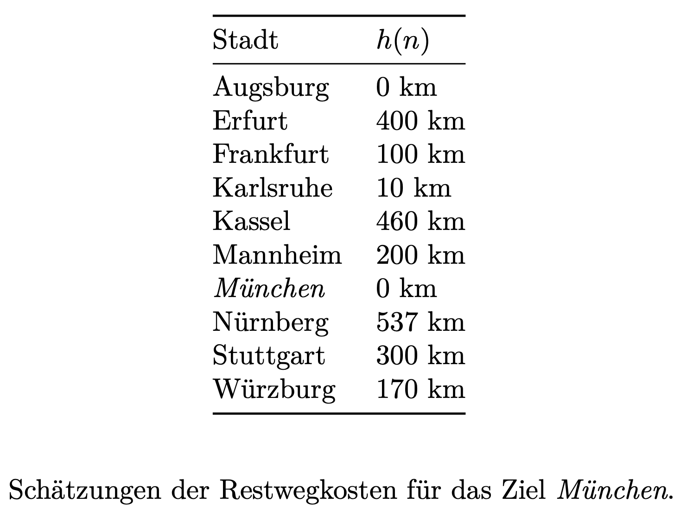

## A01.1: Möglichkeiten und Grenzen der KI (1P)

Recherchieren Sie, welche Probleme bereits mittels Computer- bzw. Robotereinsatz
gelöst werden können und welche aktuell noch ungelöst sind.

*Thema*: Gefühl für bereits realisierbare Aufgaben

## A01.2: Auswirkungen der KI (1P)

Recherchieren Sie Auswirkungen auf die Gesellschaft durch die KI, etwa
durch autonomes Fahren oder durch _Large Language Models_ (LLM).

*Thema*: Chancen und Risiken, Ethik

## A01.3: Problemformalisierung, Zustandsraum (2P)

Drei Elben und drei Orks befinden sich an einem Ufer eines Flusses und wollen
diesen überqueren. Es steht dazu ein Pferd zur Verfügung, welches maximal zwei
Wesen tragen kann. Das Pferd kann den Fluss nicht allein überqueren.

Gesucht ist eine Möglichkeit, alle Elben und Orks über den Fluss zu bringen.
Dabei darf zu keiner Zeit an keinem Ufer die Anzahl der sich dort befindlichen
Orks größer sein als die der dort wartenden Elben, da es sonst zu Konflikten
zwischen beiden Gruppen kommt.

1.  Formalisieren Sie das Problem (Zustände, Aktionen, Start- und Endzustand).
2.  Skizzieren Sie den Problemgraph.

*Thema*: Formalisierung von Problemen, Problemgraph

## A01.4: Suchverfahren (4P)

Betrachten Sie folgende Landkarte und Restwegschätzungen:

::: center
{width="40%"}

[Quelle: [MapGermanyGraph.svg](https://commons.wikimedia.org/wiki/File:MapGermanyGraph.svg) by [Regnaron](https://de.wikipedia.org/wiki/Benutzer:Regnaron) and [Jahobr](https://commons.wikimedia.org/wiki/User:Jahobr) on Wikimedia Commons ([Public Domain](https://en.wikipedia.org/wiki/en:public_domain))]{.origin}
:::

{width="40%"}

1.  Finden Sie nacheinander mit Tiefensuche (1P) und Breitensuche (1P) (jeweils in der Graph-Search-Variante)
    sowie A\* (2P) (in der Tree-Search-Variante mit der Verbesserung "keine Zyklen", siehe Vorlesung)
    jeweils einen Weg von Würzburg nach München.

    Vergleichen Sie die drei Algorithmen: Wie viele Einträge gibt es in der Datenstruktur maximal,
    wie oft wird die Hauptschleife durchlaufen (also ein Element aus der Datenstruktur entnommen,
    untersucht und weiterentwickelt)?

    Sie können dafür eine Handsimulation anwenden oder die Algorithmen implementieren. Sie können
    gern auch die Java-Klassen im Paket [`aima.core.search`] bzw. die Python-Klassen in [`search.py`]
    als Ausgangspunkt nutzen.[^aima]

2.  Dürfen die oben gegebenen Restkostenabschätzungen in A\* verwendet werden?
    *   Falls ja, warum?
    *   Falls nein, warum? Wie müssten die Abschätzungen ggf. korrigiert werden?

    Falls Sie der Meinung waren, die Abschätzungen sind nicht korrekt, korrigieren Sie die Abschätzungen
    nun und führen Sie erneut eine Suche mit A\* durch.

_Hinweis_: Reihenfolge bei gleichen $f(n)$-Kosten: alphabetische Reihenfolge, d.h. Mannheim käme
vor München, Karlsruhe vor Kassel etc.

[`aima.core.search`]: https://github.com/aimacode/aima-java/tree/AIMA3e/aima-core/src/main/java/aima/core/search
[`search.py`]: https://github.com/aimacode/aima-python/blob/master/search.py
[^aima]: Im Python-Code tauchen immer wieder "TODO"-Marker auf - bitte mit Vorsicht genießen!

## A01.6: Dominanz (1P)

Was bedeutet *"Eine Heuristik $h_1(n)$ dominiert eine Heuristik $h_2(n)$"*?

Wie wirkt sich die Nutzung einer dominierenden Heuristik $h_1(n)$ in A\*
aus (im Vergleich zur Nutzung einer Heuristik $h_2$, die von $h_1$ dominiert
wird)?

Geben Sie selbstgewählte Beispiele an.

*Thema*: Begriff der dominierenden Heuristik (Selbststudium)

## A01.7: Beweis der Optimalität von A* (1P)

Beweisen Sie, dass A* in der Tree-Search-Variante bei Nutzung einer
zulässigen Heuristik optimal ist.

*Thema*: Bedeutung einer zulässigen Heuristik (Selbststudium)

## A01.8 Bonus: Turing Test (1P)

Testen Sie einige der im Netz verfügbaren Chatbots auf deren Intelligenz.[^Links]

Notieren Sie sich eine Startfrage und messen Sie die Zeit, die Sie bei den
verschiedenen Programmen benötigen, bis Sie sicher sagen können, dass es kein
Mensch ist. Speichern Sie jeweils ein Protokoll der Dialoge. Können Sie selbst
einen Bot erstellen?

Vergleichen Sie dabei traditionelle Chatbots und LLM.

*Thema*: Turing-Test selbst erfahren

[^Links]: Starten Sie zum Beispiel auf
[github.com/DopplerHQ/awesome-bots](https://github.com/DopplerHQ/awesome-bots#popular-examples-of-bots)
oder [simonlaven.com](https://www.simonlaven.com/)
oder [cleverbot.com/](https://www.cleverbot.com/)
oder [home.pandorabots.com](https://home.pandorabots.com/en/)
oder [github.com/alice-bot](https://github.com/alice-bot).
