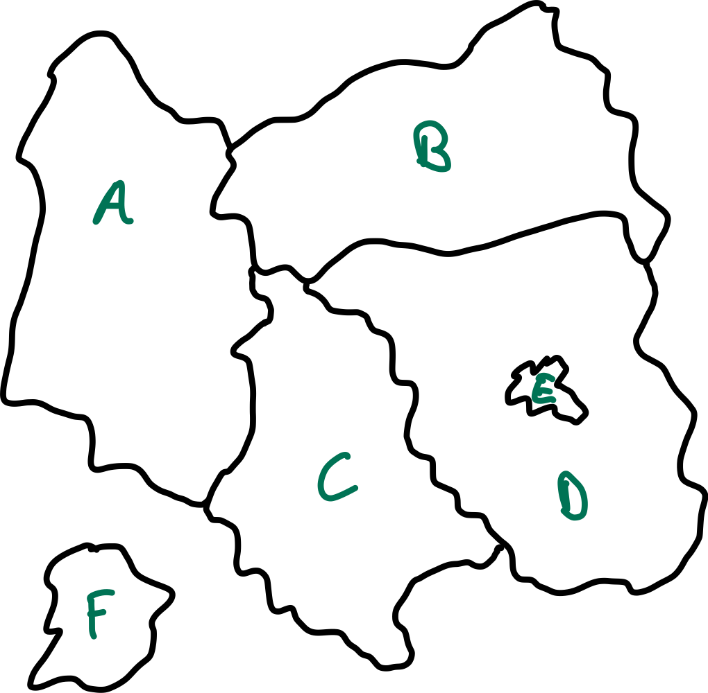

## Motivation: Einfärben von Landkarten

{width="50%"}

::: notes
Die Skizze soll eine Landkarte mit verschiedenen Ländern darstellen. Die Aufgabe
lautet: Färbe jedes Land mit einer Farbe ein, um die Übersichtlichkeit zu
erhöhen. Verwende dabei so wenig wie möglich unterschiedliche Farben. Aneinander
grenzende Länder müssen unterschiedliche Farben bekommen (=> *Constraint*).
:::

## Einfärben von Landkarten: Formalisierung

:::::: slides
{width="30%"}
::::::

\bigskip
\bigskip

*   **Variablen**: A, B, C, D, E, F
*   **Werte**: $\lbrace red, green, blue \rbrace$
*   **Constraints**: Benachbarte Regionen müssen unterschiedliche Farben haben

\smallskip

*   **Mögliche Lösung**: Zuweisung an Variablen ("Belegung")
    $\lbrace \operatorname{A} = red, \operatorname{B} = blue, \operatorname{C} = green,
    \operatorname{D} = red, \operatorname{E} = blue, \operatorname{F} = blue \rbrace$

## Definition: Constraint Satisfaction Problem (CSP)

*   Ein CSP $\langle V, D, C \rangle$ besteht aus:
    *   Menge von **Variablen** $V = \lbrace V_1, V_2, \ldots, V_n \rbrace$
    *   Je $V_i$ nicht leere **Domäne** $D_i = \lbrace d_{i,1}, d_{i,2}, \ldots, d_{i,m_i} \rbrace$
    *   Menge von **Constraints** $C = \lbrace C_1, C_2, \ldots, C_p \rbrace$ \newline
        (Randbedingungen, Abhängigkeiten zwischen Variablen)

\smallskip

*   Zuweisung/Belegung (*Assignment*) $\alpha$:
    *   Zuweisung von Werten an (einige/alle) Variablen:
        $\alpha = \lbrace X=a, Y=b, \ldots \rbrace$ \newline
        (aus den jeweiligen Wertebereichen)
    *   **Konsistente Belegung**: Randbedingungen sind nicht verletzt
    *   **Vollständige Belegung**: Alle Variablen sind belegt

\smallskip

*   **Lösung** eines CSP: Vollständige und konsistente Belegung

## Constraint-Graph

{width="80%"}

::: notes
Ein CSP kann man auch als Constraint-Graph darstellen. Die Variablen werden zu Knoten im
Graph, die Constraints zu Kanten zwischen den Knoten. Dadurch kann man die aus dem Problemlösen
bekannten Algorithmen anwenden ...
:::

## Constraints -- Arität

::: notes
Die *Arität* betrifft hier die "Stelligkeit": Wie viele Variablen stehen in
einem Constraint miteinander in Beziehung? (Also wie viele Parameter hat
ein Constraint?)
:::

*   **unär**: betrifft einzelne Variablen \newline
    Beispiel: $\operatorname{A} \neq red$

\smallskip

*   **binär**: betrifft Paare von Variablen \newline
    Beispiel: $\operatorname{A} \neq \operatorname{B}$

\smallskip

*   **höhere Ordnung**: betrifft 3 oder mehr Variablen

\bigskip

*   **Präferenzen**: "soft constraints" \newline
    Beispiel: "rot ist besser als grün"

    Abbildung über Gewichtung => Constraint-Optimierungsproblem (COP)

## Constraints -- Wertebereiche

*   **Endliche Domänen**: $d$ Werte => $O(d^n)$ mögliche Zuweisungen \newline
    (exponentiell in der Zahl der Variablen)

\smallskip

*   **Unendliche Domänen**: reelle Zahlen, natürliche Zahlen \newline
    => Keine Auflistung der erlaubten Wertekombinationen mehr möglich \newline
    => Übergang zu Gleichungen/Ungleichungen: $job_1+5<job_2$
    *   lineare Constraints
    *   nichtlineare Constraints

\bigskip

**Historische Unterscheidung**:
*   **Constraint Satisfaction**: endliche Domänen, kombinatorische Methoden
*   **Constraint Solving**: unendliche Domänen

## CSP sind überall ...

*   Stundenpläne (Klassen, Räume, Zeiten)
*   Konfiguration (Computer, Autos, ...)
*   Fahrpläne (Zug, Flug, ...)
*   Planung von komplexen Projekten
*   Sudoku :-)
*   ...

## Wrap-Up

*   Definitionen und Begriffe:
    *   Variable, (un-) endliche Domänen, Wertemenge
    *   Constraint, Arität, CSP
    *   Zuweisung, Lösung, ...

<!-- DO NOT REMOVE - THIS IS A LAST SLIDE TO INDICATE THE LICENSE AND POSSIBLE EXCEPTIONS (IMAGES, ...). -->
::: slides
## LICENSE

Unless otherwise noted, this work is licensed under CC BY-SA 4.0.
:::
