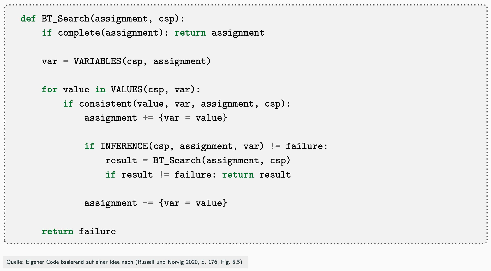
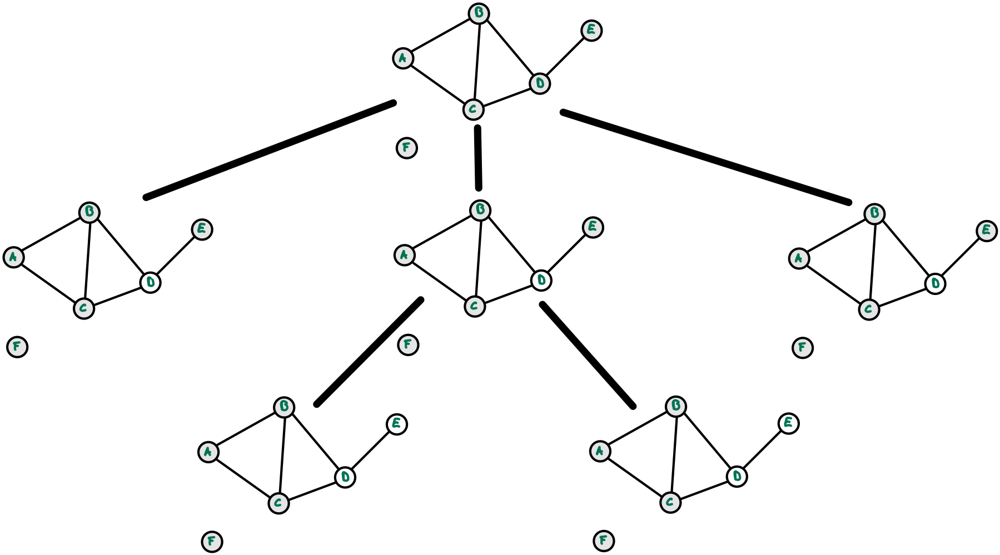

## Einfärben von Landkarten als CSP

{width="80%"}

[[Tafelbeispiel: Suche nach Lösung]{.bsp}]{.slides}


## Endliche Domänen: Formulierung als Suchproblem

``` python
def BT_Search(assignment, csp):
    if complete(assignment): return assignment

    var = VARIABLES(csp, assignment)

    for value in VALUES(csp, var):
        if consistent(value, var, assignment, csp):
            assignment += {var = value}

            if INFERENCE(csp, assignment, var) != failure:
                result = BT_Search(assignment, csp)
                if result != failure: return result

            assignment -= {var = value}

    return failure
```

[Quelle: Eigener Code basierend auf einer Idee nach [@Russell2020, p. 176, fig. 5.5]]{.origin}

::: notes
Hierbei handelt es sich um eine etwas angepasste Tiefensuche: Starte mit leerem
Assignment und weise schrittweise Variablen passende Werte zu und mache notfalls
Backtracking.
:::


## BT-Suche für CSP am Beispiel Landkartenfärbeproblem

::::::::: slides
:::::: columns
::: {.column width="40%"}

:::
::: {.column width="60%"}

:::
::::::
:::::::::

::::::::: notes
{width="80%"}
:::::::::


## Wrap-Up

*   Lösung von CSP mit endlichen Domänen mit Hilfe der Backtracking-Suche


<!-- DO NOT REMOVE - THIS IS A LAST SLIDE TO INDICATE THE LICENSE AND POSSIBLE EXCEPTIONS (IMAGES, ...). -->
::: slides
## LICENSE


Unless otherwise noted, this work is licensed under CC BY-SA 4.0.
:::
