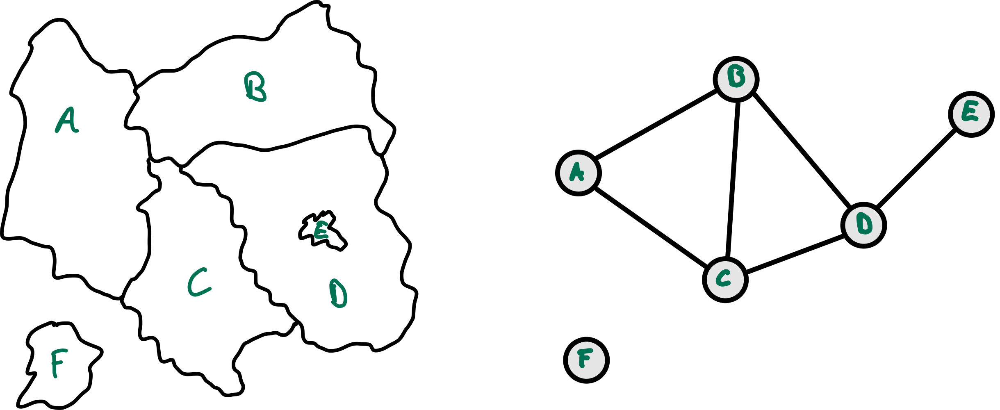
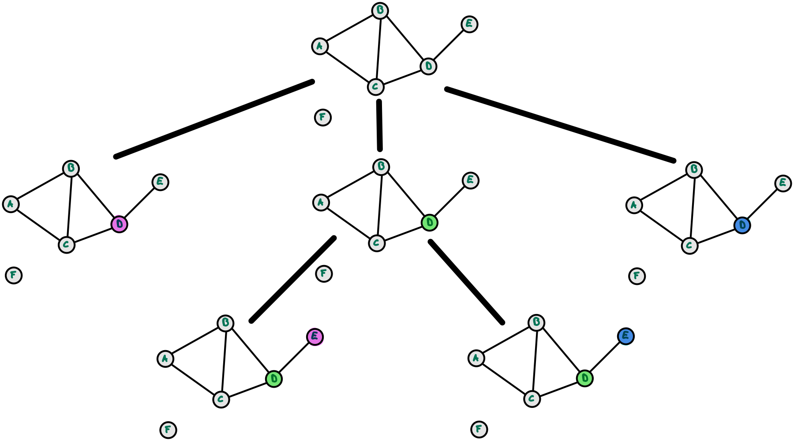

# CSP: Lösen von diskreten CSP

> [!IMPORTANT]
>
> <details open>
>
> <summary><strong>🎯 TL;DR</strong></summary>
>
> CSP’s mit endlichen Domänen lassen sich mit einer Backtracking-Suche
> lösen. Dabei wird schrittweise eine Variablen ausgewählt und dann ein
> Wert aus deren Wertebereich für die Belegung ausgewählt. Danach ruft
> sich die Backtracking-Suche rekursiv auf. Falls dabei keine Lösung
> gefunden werden kann, erfolgt Backtracking und die Belegung wird
> schließlich rückgängig gemacht und durch die nächste Möglichkeit
> ersetzt.
>
> </details>

> [!TIP]
>
> <details>
>
> <summary><strong>🎦 Videos</strong></summary>
>
> - [VL BT-Suche für CSP](https://youtu.be/DIY7F2ycyqA)
>
> </details>

## Einfärben von Landkarten als CSP



## Endliche Domänen: Formulierung als Suchproblem

``` python
def BT_Search(assignment, csp):
    if complete(assignment, csp): return assignment

    var = VARIABLES(csp, assignment)

    for value in VALUES(csp, var):
        if consistent(value, var, assignment, csp):
            assignment += {var = value}

            if INFERENCE(csp, assignment, var) != failure:
                result = BT_Search(assignment, csp)
                if result != failure: return result

            assignment -= {var = value}

    return failure
```

Quelle: Backtracking-Search: Eigener Code basierend auf einer Idee nach
([Russell und Norvig 2020](#ref-Russell2020), p. 176, fig. 5.5)

Hierbei handelt es sich um eine etwas angepasste Tiefensuche: Starte mit
leerem Assignment und weise schrittweise Variablen passende Werte zu und
mache notfalls Backtracking.

## BT-Suche für CSP am Beispiel Landkartenfärbeproblem



## Wrap-Up

- Lösung von CSP mit endlichen Domänen mit Hilfe der Backtracking-Suche

## 📖 Zum Nachlesen

Lesen Sie in ([Russell und Norvig 2020](#ref-Russell2020)) bitte den
Abschnitt 5.3 “Backtracking Search for CSPs”.

> [!NOTE]
>
> <details>
>
> <summary><strong>✅ Lernziele</strong></summary>
>
> - k3: Ich kann CSP mit endlichen Domänen mit Hilfe der BT-Suche lösen
>
> </details>

> [!TIP]
>
> <details>
>
> <summary><strong>🏅 Challenges</strong></summary>
>
> Sei ein Constraintproblem definiert durch
> $`V = \lbrace a, b, c, d, e \rbrace`$,
> $`D_{a} = D_{b} = D_{c} = D_{e} = \lbrace 1,2,3 \rbrace, D_{d} = \lbrace 1,2 \rbrace`$,
> und $`C = \lbrace c_1, c_2, c_3, c_4, c_5 \rbrace`$
>
> mit
>
> - $`c_1=\left((a,b), \ne\right)`$,
> - $`c_2=\left((b,c), \ne\right)`$,
> - $`c_3=\left((a,c), \ne\right)`$,
> - $`c_4=\left((c,d), =\right)`$, und
> - $`c_5=\left((b,e), <\right)`$.
>
> 1.  Zeichen Sie den Constraint-Graph.
> 2.  Zeigen Sie, wie der BT-Search-Algorithmus eine Lösung für das
>     Problem findet.
>
> </details>

------------------------------------------------------------------------

> [!NOTE]
>
> <details>
>
> <summary><strong>👀 Quellen</strong></summary>
>
> <div id="refs" class="references csl-bib-body hanging-indent"
> entry-spacing="0">
>
> <div id="ref-Russell2020" class="csl-entry">
>
> Russell, S., und P. Norvig. 2020. *Artificial Intelligence: A Modern
> Approach*. 4th Edition. Pearson. <http://aima.cs.berkeley.edu>.
>
> </div>
>
> </div>
>
> </details>

------------------------------------------------------------------------


Unless otherwise noted, this work is licensed under CC BY-SA 4.0.

<blockquote><p><sup><sub><strong>Last modified:</strong> 008cb24 (lecture: add challenge (CSP2), 2025-09-18)<br></sub></sup></p></blockquote>
