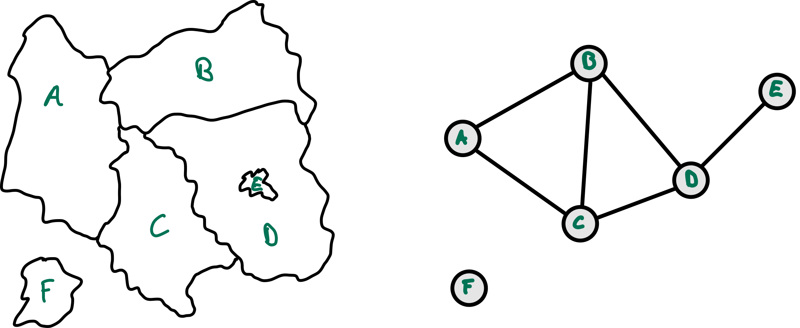
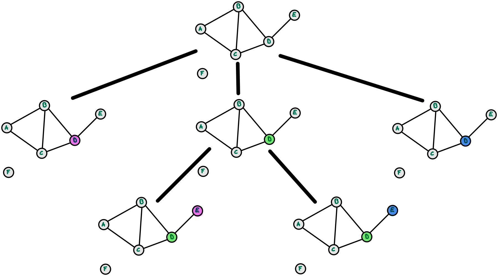

# Lösen von diskreten CSP

> [!NOTE]
> <details open>
> <summary><strong>🎯 TL;DR</strong></summary>
>
> CSP's mit endlichen Domänen lassen sich mit einer Backtracking-Suche
> lösen. Dabei wird schrittweise eine Variablen ausgewählt und dann ein
> Wert aus deren Wertebereich für die Belegung ausgewählt. Danach ruft
> sich die Backtracking-Suche rekursiv auf. Falls dabei keine Lösung
> gefunden werden kann, erfolgt Backtracking und die Belegung wird
> schließlich rückgängig gemacht und durch die nächste Möglichkeit
> ersetzt.
>
> </details>
> <details>
> <summary><strong>🎦 Videos</strong></summary>
>
> - [VL BT-Suche für CSP](https://youtu.be/DIY7F2ycyqA)
>
> </details>

## Einfärben von Landkarten als CSP

<div style="width:80%;">



</div>

## Endliche Domänen: Formulierung als Suchproblem

``` python
def BT_Search(assignment, csp):
    if complete(assignment): return assignment

    var = VARIABLES(csp, assignment)

    for value in VALUES(csp, var):
        if consistent(value, var, assignment, csp):
            assignment += {var = value}

            if INFERENCE(csp, assignment, var) != failure:
                result = BT_Search(assignment, csp)
                if result != failure: return result

            assignment -= {var = value}

    return failure
```

Quelle: Eigener Code basierend auf einer Idee nach ([Russell und Norvig
2020](#ref-Russell2020), p. 176, fig. 5.5)

Hierbei handelt es sich um eine etwas angepasste Tiefensuche: Starte mit
leerem Assignment und weise schrittweise Variablen passende Werte zu und
mache notfalls Backtracking.

## BT-Suche für CSP am Beispiel Landkartenfärbeproblem

<div style="width:80%;">



</div>

## Wrap-Up

- Lösung von CSP mit endlichen Domänen mit Hilfe der Backtracking-Suche

## 📖 Zum Nachlesen

- Russell und Norvig ([2020](#ref-Russell2020)): CSP, Backtracking:
  Abschnitt 5.3
- Kumar ([1992](#ref-Kumar1992))
- Barták ([2001](#ref-Bartak2001))

------------------------------------------------------------------------

> [!TIP]
> <details>
> <summary><strong>✅ Lernziele</strong></summary>
>
> - k3: Lösung von CSP mit endlichen Domänen mit Hilfe der BT-Suche
>
> </details>

------------------------------------------------------------------------

> [!NOTE]
> <details>
> <summary><strong>👀 Quellen</strong></summary>
>
> <div id="refs" class="references csl-bib-body hanging-indent"
> entry-spacing="0">
>
> <div id="ref-Bartak2001" class="csl-entry">
>
> Barták, R. 2001. „Theory and Practice of Constraint Propagation". In
> *Proceedings of the 3rd Workshop on Constraint Programming for
> Decision and Control*. Bd. 50.
>
> </div>
>
> <div id="ref-Kumar1992" class="csl-entry">
>
> Kumar, V. 1992. „Algorithms for Constraint Satisfaction Problems: A
> Survey". *AI Magazine* 13 (1): 32--44.
>
> </div>
>
> <div id="ref-Russell2020" class="csl-entry">
>
> Russell, S., und P. Norvig. 2020. *Artificial Intelligence: A Modern
> Approach*. 4th Edition. Pearson. <http://aima.cs.berkeley.edu>.
>
> </div>
>
> </div>
>
> </details>

------------------------------------------------------------------------

<div style="width:10%;">


</div>

Unless otherwise noted, this work is licensed under CC BY-SA 4.0.

**Exceptions:**

- Eigener Code basierend auf einer Idee nach ([Russell und Norvig
  2020](#ref-Russell2020), p. 176, fig. 5.5)

<blockquote><p><sup><sub><strong>Last modified:</strong> 5f0b0a3 (Remove Hugo: tooling: shift headings (use h1 as top-level headings), 2025-07-17)<br></sub></sup></p></blockquote>
