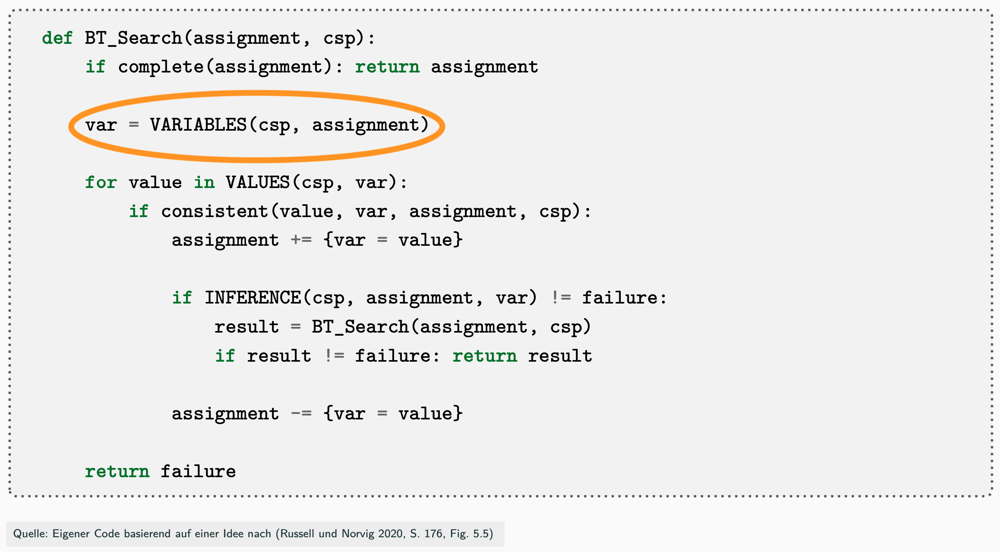
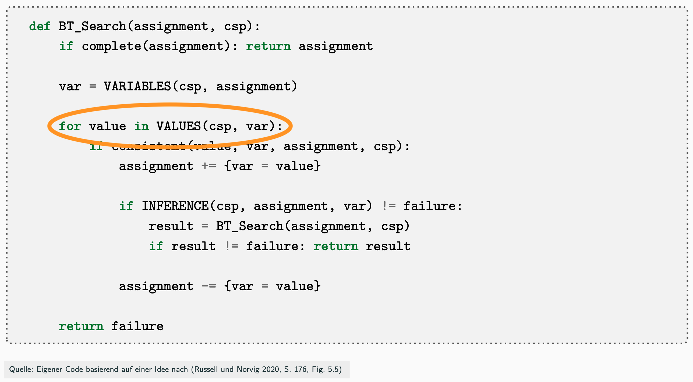

## VARIABLES: Variablen-Sortierung, Welche Variable soll betrachtet werden?

{width="65%"}

\bigskip

::: notes
[**VARIABLES**]{.alert}: Welche Variable zuerst ausprobieren?
:::

**Minimum Remaining Values (MRV)**: (vgl. [@Russell2020, S. 177])

*   Wähle Variable mit wenigsten freien Werten  [(die am meisten eingeschränkte Variable)]{.notes}

    ::: notes
    => reduziert den Verzweigungsgrad
    :::

[[Tafelbeispiel]{.ex}]{.slides}

::: notes
Beispiel:
1.  Freie Auswahl, alle haben gleich viele freie Werte (jeweils 3) => wähle A
2.  B und C haben nur noch zwei freie Werte => wähle B (oder C)
3.  C hat nur noch einen Wert, D noch zwei, der Rest drei => wähle C
:::

## VARIABLES: Gleichstand bei MRV

{width="65%"}

\bigskip

::: notes
[**VARIABLES**]{.alert}: Welche Variable zuerst ausprobieren?
:::

**Gradheuristik**: Erweiterung von *MRV* bei *Gleichstand* (vgl. [@Russell2020, S. 177])

*   Wähle Variable mit meisten Constraints auf offene  [(noch nicht zugewiesene)]{.notes}  Variablen

    ::: notes
    => reduziert den Verzweigungsgrad in späteren Schritten
    :::

[[Tafelbeispiel]{.ex}]{.slides}

::: notes
Beispiel:
1.  MRV: Alle haben gleich viele freie Werte (jeweils 3) => Gradheuristik: B, C und D haben
    die meisten Verbindungen (Constraints) auf offene Variablen => wähle B (oder C oder D)
2.  MRV: A, C und D haben nur noch zwei freie Werte => Gradheuristik: C und D haben
    je zwei Constraints auf noch offene Variablen => wähle C (oder D)
3.  MRV: A und D haben beide nur noch einen Wert => Gradheuristik: D hat
    die meisten Verbindungen (Constraints) auf offene Variablen => wähle D
:::

## VALUES: Werte-Sortierung, Welchen Wert soll ich ausprobieren?

{width="65%"}

\bigskip

::: notes
[**VALUES**]{.alert}: Welchen Wert zuerst ausprobieren?
:::

**Least Constraining Value (LCV)**: (vgl. [@Russell2020, S. 177])

*   Wähle Wert, der für verbleibende Variablen die wenigsten Werte
    ungültig macht

    ::: notes
    => verringert die Wahrscheinlichkeit für Backtracking
    :::

[[Tafelbeispiel]{.ex}]{.slides}

::: notes
Beispiel:
1.  Sei A gewählt: Alle Werte machen in den anderen Variablen einen Wert ungültig
    => freie Wahl des Wertes => wähle beispielsweise rot
2.  Sei B gewählt: Alle Werte machen in den anderen Variablen einen Wert ungültig
    => freie Wahl des Wertes => wähle beispielsweise grün
3.  Sei D gewählt: Verbleibende Werte rot und blau
    -   Wahl von rot würde für C einen Wert übrig lassen (blau)
    -   Wahl von blau würde für C **keinen** Wert übrig lassen
    => LCV: Wahl von rot!

**Hinweis**: Diese Heuristik ist in der Praxis sehr aufwändig zu berechnen! Man müsste für
jeden Wert die noch offenen Constraints anschauen und berechnen, wie viele Werte damit jeweils
ungültig gemacht werden. Die Idee ist aber dennoch interessant, und möglicherweise kann man
sie für ein reales Problem so adaptieren, dass bei der Umsetzung nur wenig zusätzlicher
Aufwand entsteht.
:::

## Wrap-Up

*   Verbesserung der BT-Suche mit Heuristiken: MRV, Gradheuristik, LCV
