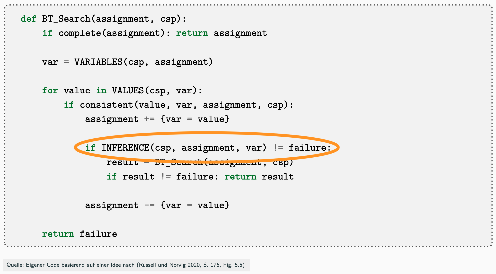
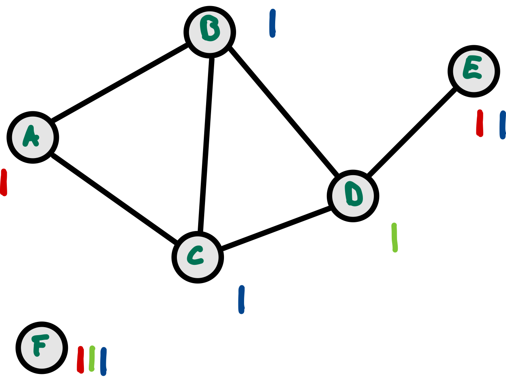
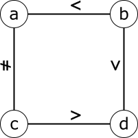
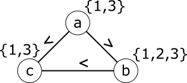

# CSP: Kantenkonsistenz und AC-3

> [!IMPORTANT]
>
> <details open>
>
> <summary><strong>🎯 TL;DR</strong></summary>
>
> Bei der Backtracking-Suche werden schrittweise Variablen belegt. Dabei
> kann eine Belegung eine Lösung im weiteren Verlauf der Suche unmöglich
> machen, so dass (viel) Backtracking notwendig wird.
>
> Beim **Forward Checking** entfernt man nach der Belegung einer
> Variablen in allen Nachbarvariablen die durch die aktuelle Belegung
> inkonsistent gewordenen Werte. Wenn dabei ein Wertebereich leer wird,
> führt die aktuelle Belegung nicht zu einer Lösung und kann sofort
> zurückgenommen werden. Allerdings findet man mit Forward Checking
> nicht alle Inkonsistenzen.
>
> Bei der **Kantenkonsistenz** prüft man, ob zu jedem Wert aus dem
> Wertebereich einer Variablen in den Nachbarvariablen mindestens ein
> passender (konsistenter) Wert existiert. Dabei werden die Constraints
> nacheinander betrachtet (nicht gleichzeitig). Wenn dies nicht der Fall
> ist, wird der Wert aus dem Wertebereich der betrachteten Variablen
> entfernt. Der AC-3-Algorithmus erzeugt schrittweise Kantenkonsistenz
> für ein CSP.
>
> Man kann den AC-3 als Vorverarbeitung nutzen und die Wertemengen *vor*
> der BT-Suche reduzieren. Eventuell findet man dabei bereits eine
> Lösung oder kann eine Lösung ausschließen. Man kann den AC-3 auch als
> Inferenzschritt in die BT-Suche einbetten (“MAC”).
> </details>

> [!TIP]
>
> <details open>
>
> <summary><strong>🎦 Videos</strong></summary>
>
> - [VL CSP, AC-3](https://youtu.be/TvF78iVDwKM)
>
> </details>

## Problem bei BT-Suche

Zuweisung eines Wertes an Variable $`X`$:

- Passt zu aktueller Belegung
- Berücksichtigt aber nicht **restliche** Constraints =\> macht weitere
  Suche u.U. unmöglich/schwerer

**Lösung**: Nach Zuweisung alle *nicht zugewiesenen Nachbarvariablen*
prüfen

## INFERENCE: Vorab-Prüfung (Forward Checking)

<picture><source media="(prefers-color-scheme: light)" srcset="images/bt_search_inference_light.png"><source media="(prefers-color-scheme: dark)" srcset="images/bt_search_inference_dark.png"></picture>

**Inference**: Frühzeitiges Erkennen von Fehlschlägen! (vgl. ([Russell
und Norvig 2021, 178](#ref-Russell2021)))

Nach Zuweisung eines Wertes an Variable $`X`$:

- Betrachte alle nicht zugewiesenen Variablen $`Y`$:
  - Falls Constraints zw. $`X`$ und $`Y`$, dann …
  - … entferne alle inkonsistenten Werte aus dem Wertebereich von $`Y`$.

Beispiel:

1.  Sei A auf rot gesetzt =\> entferne rot in B und C
2.  Sei D auf grün gesetzt =\> entferne grün in B und C und E

Problem: Für B und C bleibt nur noch blau; sind aber benachbart!

## Forward Checking findet nicht alle Inkonsistenzen!

<picture><source media="(prefers-color-scheme: light)" srcset="images/forward_checking_light.png"><source media="(prefers-color-scheme: dark)" srcset="images/forward_checking_dark.png"></picture>

- Nach $`\lbrace A=red, D=green \rbrace`$ bleibt für B und C nur noch
  blue
- B und C sind aber benachbart

## Übergang von Forward Checking zu Kantenkonsistenz

- Forward Checking erzeugt Konsistenz für alle Constraints der **gerade
  betrachteten (belegten) Variablen**.

<!-- -->

- Idee: Ausdehnen auf alle Kanten … =\> Einschränken der Wertemengen

## Definition Kantenkonsistenz (Arc Consistency)

> Eine Kante von $`X`$ nach $`Y`$ ist “konsistent”, wenn für jeden Wert
> $`x \in D_X`$ und für alle Constraints zwischen $`X`$ und $`Y`$
> jeweils ein Wert $`y \in D_Y`$ existiert, so dass der betrachtete
> Constraint durch $`(x,y)`$ erfüllt ist.

Ein CSP ist kanten-konsistent, wenn für alle Kanten des CSP Konsistenz
herrscht.

## Beispiel Kantenkonsistenz

$`V = \lbrace a,b,c,d,e \rbrace`$

$`\mathrm{C} = \lbrace ((a,b), \ne), ((b,c), \ne), ((a,c), \ne), ((c,d), =), ((b,e), <) \rbrace`$

$`D_a=D_b=D_c=\lbrace 1,2,3 \rbrace`$, $`D_d=\lbrace 1,2 \rbrace`$,
$`D_e=\lbrace 1,2,3 \rbrace`$

Einschränkung der Ausgangswertemengen (kanten-konsistent)

$`D_a=\lbrace 1,2,3 \rbrace`$, $`D_b=\lbrace 1,2 \rbrace`$,
$`D_c=\lbrace 1,2 \rbrace`$, $`D_d=\lbrace 1,2 \rbrace`$,
$`D_e=\lbrace 2,3 \rbrace`$

<div align="center">

=\> Kantenkonsistenz ist nur **lokale** Konsistenz!

</div>

*Anmerkung*: $`((a,b), \ne)`$ ist Kurzform für
$`\left((a,b), \lbrace (x,y) \in D_a \times D_b | x \ne y \rbrace\right)`$

## AC-3 Algorithmus: Herstellen von Kantenkonsistenz

``` python
def AC3(csp):
    queue = Queue(csp.arcs)
    while not queue.isEmpty():
        (x,y) = queue.dequeue()
        if ARC_Reduce(csp,x,y):
            if D_x.isEmpty(): return false
            for z in x.neighbors(): queue.enqueue(z,x)
    return true

def ARC_Reduce(csp, x, y):
    change = false
    for v in D_x:
        if not (any w in D_y and csp.C_xy(v,w)):
            D_x.remove(v);  change = true
    return change
```

Quelle: AC-3 Algorithmus: Eigener Code basierend auf einer Idee nach
([Russell und Norvig 2021](#ref-Russell2021), p. 171, fig. 5.3)

*Anmerkung*: Die Queue in AC-3 ist wie eine (mathematische) Menge zu
betrachten: Jedes Element kann nur genau einmal in einer Menge enthalten
sein. D.h. wenn man bei `queue.enqueue(z,x)` die Rückkanten von den
Nachbarn in die Queue aufnimmt, sorgt die Queue eigenständig dafür, dass
es keine doppelten Vorkommen einer Kante in der Queue gibt. (Falls die
verwendete Queue in einer Programmiersprache das nicht unterstützt,
müsste man bei `queue.enqueue(z,x)` stets abfragen, ob die Kante `(z,x)`
bereits in der Queue ist und diese dann nicht erneut hinzufügen.) AC-3
hat eine Laufzeit von $`O(d^3n^2)`$ ($`n`$ Knoten, maximal $`d`$
Elemente pro Domäne). Leider findet auch AC-3 nicht alle Inkonsistenzen
… (NP-hartes Problem).

*Hinweis*: In gewisser Weise kann man Forward Checking als ersten
Schritt bei der Herstellung von Kantenkonsistenz interpretieren.

## Einsatz des AC-3 Algorithmus

1.  Vorverarbeitung: Reduktion der Wertemengen *vor* BT-Suche
    - Nach AC-3 evtl. bereits Lösung gefunden (oder ausgeschlossen)

<!-- -->

1.  Propagation: Einbetten von AC-3 als Inferenzschritt in BT-Suche
    (**MAC** – Maintaining Arc Consistency)
    - Nach jeder Zuweisung an $`X_i`$ Aufruf von AC-3-Variante:
      - Initial nur Kanten von $`X_i`$ zu allen noch nicht zugewiesenen
        Nachbarvariablen
    - Anschließend rekursiver Aufruf von BT-Suche

## Wrap-Up

- Anwendung von Forward Checking und …
- … die Erweiterung auf alle Kanten: AC-3, Kantenkonsistenz

## 📖 Zum Nachlesen

Lesen Sie in ([Russell und Norvig 2021](#ref-Russell2021)) bitte den
Abschnitt 5.2 “Constraint Propagation”.

> [!NOTE]
>
> <details>
>
> <summary><strong>✅ Lernziele</strong></summary>
>
> - k2: Ich kann “Forward Checking” (FC) erklären
> - k2: Ich kann die Erweiterung von FC auf alle Kanten erklären
>   (Kantenkonsistenz)
> - k2: Ich kann an einem Beispiel erklären, dass Kantenkonsistenz nicht
>   globale Konsistenz bedeutet
> - k3: Ich kann den AC-3 Algorithmus anwenden
>
> </details>

> [!TIP]
>
> <details>
>
> <summary><strong>🧩 Quizzes</strong></summary>
>
> - [Selbsttest CSP, AC-3
>   (ILIAS)](https://www.hsbi.de/elearning/goto.php?target=tst_1106574&client_id=FH-Bielefeld)
>
> </details>

> [!TIP]
>
> <details>
>
> <summary><strong>🏅 Challenges</strong></summary>
>
> **Fingerübungen**
>
> 1.  Ist die Kante zwischen a und b konsistent?
>
>     <picture><source media="(prefers-color-scheme: light)" srcset="images/csp_challenge_a_light.png"><source media="(prefers-color-scheme: dark)" srcset="images/csp_challenge_a_dark.png"></picture>
>
> 2.  Wann ist der Graph lokal konsistent?
>
>     <picture><source media="(prefers-color-scheme: light)" srcset="images/csp_challenge_b_light.png"><source media="(prefers-color-scheme: dark)" srcset="images/csp_challenge_b_dark.png"></picture>
>
>     - a {1,2}; b {2,3}; c {1,2,3}; d {1,2,3}
>     - a {1,2}; b {2,3}; c {3}; d {1,2}
>     - a {1,3}; b {2,3}; c {1,3}; d {1,2,3}
>     - a {1,2}; b {2,3}; c {1,3}; d {1,2,3}
>
> 3.  Wie sieht die Queue im nächsten Schritt mit AC3 aus?
>
>     <picture><source media="(prefers-color-scheme: light)" srcset="images/csp_challenge_c_light.png"><source media="(prefers-color-scheme: dark)" srcset="images/csp_challenge_c_dark.png"></picture>
>
>     Aktuelle Queue: \[ab, ac, ba, bc, ca, cb\]
>
>     - \[bc, ba, ca, cb, ab, ac\]
>     - \[ab, ac, ba, bc, ca, cb\]
>     - \[ac, ba, bc, ca, cb\]
>     - \[ac, ba, bc, ca, cb, ba\]
>
> </details>

------------------------------------------------------------------------

> [!NOTE]
>
> <details>
>
> <summary><strong>👀 Quellen</strong></summary>
>
> <div id="refs" class="references csl-bib-body hanging-indent">
>
> <div id="ref-Russell2021" class="csl-entry">
>
> Russell, S., und P. Norvig. 2021. *Artificial Intelligence: A Modern
> Approach*. 4th Edition. Pearson. <http://aima.cs.berkeley.edu>.
>
> </div>
>
> </div>
>
> </details>

------------------------------------------------------------------------


Unless otherwise noted, this work is licensed under CC BY-SA 4.0.

<blockquote><p><sup><sub><strong>Last modified:</strong> e98a365 (lecture: use local images for challenges (CSP3), 2025-10-15)<br></sub></sup></p></blockquote>
