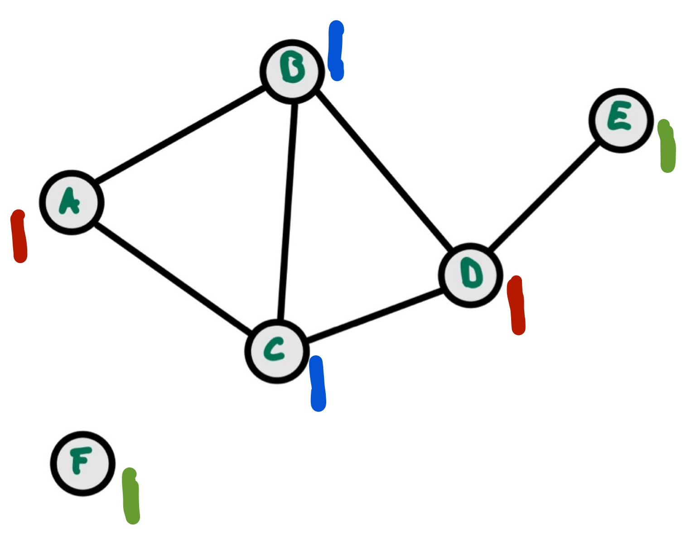

::: tldr
Die BT-Search geht schrittweise durch den Constraintgraphen, weist dem aktuellen
Knoten einen Wert aus seiner Domäne zu und geht dann zum nächsten Knoten. Sobald es
Konflikte gibt, wird Backtracking bis zum letzten Entscheidungspunkt gemacht und
dort eine andere Zuweisung ausprobiert. Das dauert oft sehr lange.

Bei der Min-Conflicts Heuristik startet man stattdessen mit einer zufällig
erzeugten, kompletten Belegung. So lange es dabei Konflikte gibt, wählt man eine der
konfliktbehafteten Variablen und ändert ihren Wert, so dass die Anzahl der dadurch
verletzten Constraints minimiert wird. Der Vorteil dieses Algorithmus ist seine
Einfachheit und Schnelligkeit, allerdings ist der Algorithmus unvollständig.

Dieses Vorgehen erinnert stark an die Suche mit Genetischen/Evolutionären
Algorithmen oder bei Simulated Annealing. Wie dort hat man bei der Min-Conflicts
Heuristik Schwierigkeiten mit Plateaus, denen man durch *Noise* und Restarts
entgegenzuwirken versucht.
:::

::: youtube
-   [VL CSP, Min-Conflicts Heuristik](https://youtu.be/Z-Xk6oCBZJ0)
:::

# Problem bei BT-Suche

{width="80%"}

::: notes
Die [BT-Search](csp2-backtrackingsearch.md) würde den Graphen ablaufen und
schrittweise dem jeweils ausgewählten Knoten eine Farbe zuweisen und dann weiter in
die Tiefe gehen. Oft sieht man erst relativ spät, dass eine bestimmte Belegung nicht
passt und weiter unten im Baum zu Konflikten führt und muss dann aufwändiges
Backtracking machen. Dadurch dauert eine Suche mit der BT-Search u.U. relativ lange,
selbst wenn man die in [CSP: Heuristiken](csp3-heuristics.md) besprochenen
Heuristiken einsetzt.
:::

# Idee: Würfeln und Schütteln

1.  **Würfeln**: Erzeuge zufällige *vollständige* Belegung

    ::: notes
    Was würde passieren, wenn wir analog zu [GA/EA](../ea/ea2-ga.md) eine
    *vollständige* Codierung wählen würden mit initial zufällig aus den Domänen
    ausgewählten Werten?
    :::

\bigskip

2.  **Schütteln**: Verändere schrittweise Werte

    ::: notes
    Was würde passieren, wenn wir danach die Konflikte "*heraus schütteln*"
    (erinnert ein bisschen an [Simulated
    Annealing](../searching/search7-annealing.md))?
    :::

# Beispiel: Einfärben von Landkarten

Ausgangszustand:

{width="75%"}

::: slides
# Beispiel (cnt.)
:::

Schritt 1: "Würfeln" [(zufällige vollständige Belegung)]{.notes}

{width="50%"}

**Problem**: Konflikt in Knoten B und C.

::: slides
# Beispiel (cnt.)
:::

Schritt 2: "Schütteln"

-   Auswahl von Knoten B
-   Auswahl einer anderen Farbe (grün - Anzahl der verbleibenden Konflikte = 0)

{width="50%"}

**Lösung erreicht.**

# Min-Conflicts Heuristik

``` python
Min-Conflicts(csp, maxSteps):
    assignment = random_complete_assignment(csp)

    for step in 1..maxSteps:
        if complete_consistent(assignment, csp): return assignment

        var = random_conflicted_variable(csp, assignment)
        value = choose_val_min_conflicts(csp, assignment, var)
        assignment += {var = value}

    return failure
```

[Min-Conflicts: Eigener Code basierend auf einer Idee nach [@Russell2020, p. 182,
fig. 5.8]]{.credits nolist="true"}

::: notes
## Hinweis

Wenn es mehrere gleichwertige Möglichkeiten gibt, nimm eine beliebige davon.

## Beobachtungen

-   Algorithmus braucht i.d.R. sehr wenige Schritte bis zur Lösung
-   Plateaus können häufig auftreten
    -   Zusätzliches Einführen von *Noise*: ersetze die deterministische Wahl des
        Wertes mit den wenigsten Konflikten (vgl. [Simulated
        Annealing](../searching/search7-annealing.md)):
        -   Mit einer Wahrscheinlichkeit \< Noise: nimm zufälligen Wert aus der
            Domäne
        -   Sonst: nimm den die Anzahl der Konflikte minimierenden Wert aus der
            Domäne
    -   Restarts können zusätzlich helfen, dadurch komplett neue zufällige Belegung
        (vgl. [GA/EA](../ea/ea2-ga.md))
-   Weitere Verbesserung: Statt einer beliebigen Variable diejenige mit den meisten
    Konflikten auswählen

## Beispiel aus der Praxis

Mit der Min-Conflicts Heuristik konnte die Rechenzeit für die Planungen für eine
Woche Beobachtungen für das Hubble-Weltraum-Teleskop von **drei Wochen** auf **10
Minuten** gesenkt werden.
([[Wikipedia](https://en.wikipedia.org/wiki/Min-conflicts_algorithm#Example)]{.credits
nolist="true"})
:::

# Diskussion

MAC (Maintaining Arc Consistency: BT-Search plus AC-3):

-   Systematische Backtracking‑Search
-   Nach jeder Variablenzuweisung wird Arc‑Consistency (AC‑3) auf den verbleibenden
    Domänen durchgesetzt
-   Vollständiger Algorithmus
-   Gute Pruning‑Eigenschaften bei starken/engen Constraints
-   Hoher Rechenaufwand pro Schritt durch wiederholte Konsistenzprüfung

\smallskip

Min-Conflicts Heuristik:

-   Lokale Repair‑Heuristik
-   Startet mit kompletter und zufälliger Belegung
-   Ändert iterativ eine konfliktbehaftete Variable auf einen Wert, der die
    wenigsten Konflikte verursacht
-   Sehr schnell in der Praxis für große, locker eingeschränkte Probleme
-   Unvollständig, heuristisch, kann stecken bleiben

\bigskip
\bigskip

Ausblick: Verwandtschaft zu SAT (Erfüllbarkeitsproblem der Aussagenlogik)

::: notes
Umformung der Constraints in aussagenlogische Formeln und Anwenden von SAT-Solvern
wie *Conflict-Driven Clause Learning* (CDCL),
*Davis-Putnam-Logemann-Loveland*-Algorithmus (DPLL), *WalkSAT* mit Hill Climbing,
... vgl. [Boolean satisfiability
problem](https://en.wikipedia.org/wiki/Boolean_satisfiability_problem).
:::

# Wrap-Up

-   Min-Conflicts ist ein skalierbares, einfach implementierbares Gegenstück zur
    vollständigen Suche
-   Typische Probleme mit Plateaus

::: readings
Lesen Sie in [@Russell2020] bitte den Abschnitt 5.4 "Local Search for CSPs".
:::

::: outcomes
-   k3: Ich kann die Min-Conflicts Heuristik erklären und anwenden
:::

::: challenges
Betrachten Sie (erneut) das folgende Problem: Sei $D=\lbrace 0, \ldots, 5 \rbrace$,
und ein Constraintproblem definiert durch $\langle
\lbrace v_1, v_2, v_3, v_4 \rbrace, \lbrace D_{v_1} = D_{v_2} = D_{v_3} = D_{v_4} = D \rbrace,
\lbrace c_1, c_2, c_3, c_4 \rbrace \rangle$

mit

-   $c_1=\left((v_1,v_2), \lbrace (x,y) \in D^2 | x+y = 3 \rbrace\right)$,
-   $c_2=\left((v_2,v_3), \lbrace (x,y) \in D^2 | x+y \le 3 \rbrace\right)$,
-   $c_3=\left((v_1,v_3), \lbrace (x,y) \in D^2 | x \le y \rbrace\right)$ und
-   $c_4=\left((v_3,v_4), \lbrace (x,y) \in D^2 | x \ne y \rbrace\right)$.

1.  Zeichen Sie den Constraint-Graph.
2.  Erzeugen Sie eine Lösung durch schrittweise Anwendung der Min-Conflicts
    Heuristik.
:::
