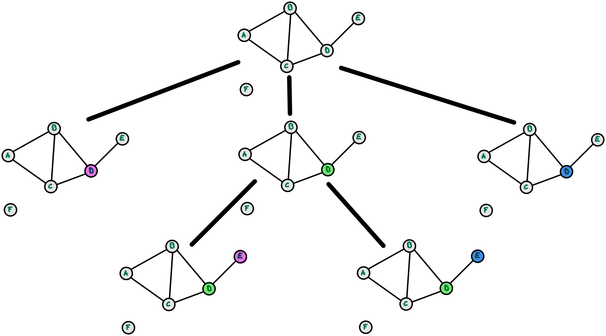
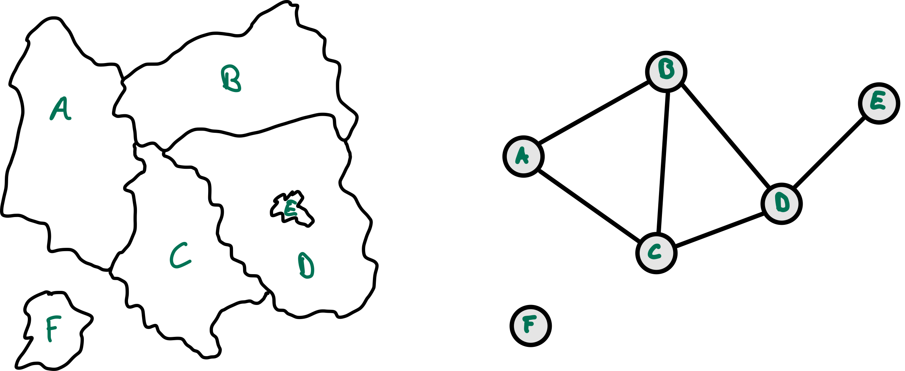
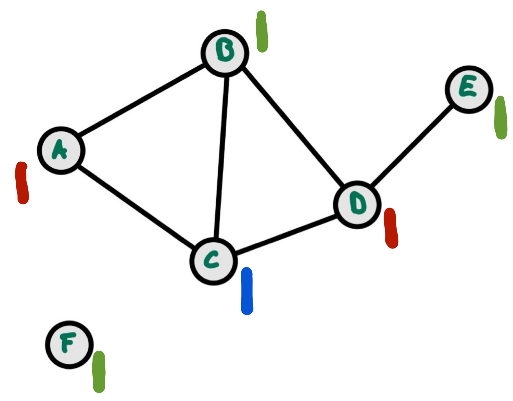

# CSP: Min-Conflicts Heuristik

> [!IMPORTANT]
>
> <details open>
>
> <summary><strong>🎯 TL;DR</strong></summary>
>
> Die BT-Search geht schrittweise durch den Constraintgraphen, weist dem
> aktuellen Knoten einen Wert aus seiner Domäne zu und geht dann zum
> nächsten Knoten. Sobald es Konflikte gibt, wird Backtracking bis zum
> letzten Entscheidungspunkt gemacht und dort eine andere Zuweisung
> ausprobiert. Das dauert oft sehr lange.
>
> Bei der Min-Conflicts Heuristik startet man stattdessen mit einer
> zufällig erzeugten, kompletten Belegung. So lange es dabei Konflikte
> gibt, wählt man eine der konfliktbehafteten Variablen und ändert ihren
> Wert, so dass die Anzahl der dadurch verletzten Constraints minimiert
> wird. Der Vorteil dieses Algorithmus ist seine Einfachheit und
> Schnelligkeit, allerdings ist der Algorithmus unvollständig.
>
> Dieses Vorgehen erinnert stark an die Suche mit
> Genetischen/Evolutionären Algorithmen oder bei Simulated Annealing.
> Wie dort hat man bei der Min-Conflicts Heuristik Schwierigkeiten mit
> Plateaus, denen man durch *Noise* und Restarts entgegenzuwirken
> versucht.
> </details>

> [!TIP]
>
> <details open>
>
> <summary><strong>🎦 Videos</strong></summary>
>
> - [VL CSP, Min-Conflicts Heuristik](https://youtu.be/Z-Xk6oCBZJ0)
>
> </details>

## Problem bei BT-Suche

<picture><source media="(prefers-color-scheme: light)" srcset="images/map_progress_light.png"><source media="(prefers-color-scheme: dark)" srcset="images/map_progress_dark.png"></picture>

Die [BT-Search](csp2-backtrackingsearch.md) würde den Graphen ablaufen
und schrittweise dem jeweils ausgewählten Knoten eine Farbe zuweisen und
dann weiter in die Tiefe gehen. Oft sieht man erst relativ spät, dass
eine bestimmte Belegung nicht passt und weiter unten im Baum zu
Konflikten führt und muss dann aufwändiges Backtracking machen. Dadurch
dauert eine Suche mit der BT-Search u.U. relativ lange, selbst wenn man
die in [CSP: Heuristiken](csp3-heuristics.md) besprochenen Heuristiken
einsetzt.

## Idee: Würfeln und Schütteln

1.  **Würfeln**: Erzeuge zufällige *vollständige* Belegung

    Was würde passieren, wenn wir analog zu [GA/EA](../ea/ea2-ga.md)
    eine *vollständige* Codierung wählen würden mit initial zufällig aus
    den Domänen ausgewählten Werten?

<!-- -->

1.  **Schütteln**: Verändere schrittweise Werte

    Was würde passieren, wenn wir danach die Konflikte “*heraus
    schütteln*” (erinnert ein bisschen an [Simulated
    Annealing](../searching/search7-annealing.md))?

## Beispiel: Einfärben von Landkarten

Ausgangszustand:

<picture><source media="(prefers-color-scheme: light)" srcset="images/map_graph_light.png"><source media="(prefers-color-scheme: dark)" srcset="images/map_graph_dark.png"></picture>

Schritt 1: “Würfeln” (zufällige vollständige Belegung)

<picture><source media="(prefers-color-scheme: light)" srcset="images/min_conflicts1_light.png"><source media="(prefers-color-scheme: dark)" srcset="images/min_conflicts1_dark.png"></picture>

**Problem**: Konflikt in Knoten B und C.

Schritt 2: “Schütteln”

- Auswahl von Knoten B
- Auswahl einer anderen Farbe (grün - Anzahl der verbleibenden Konflikte
  = 0)

<picture><source media="(prefers-color-scheme: light)" srcset="images/min_conflicts2_light.png"><source media="(prefers-color-scheme: dark)" srcset="images/min_conflicts2_dark.png"></picture>

**Lösung erreicht.**

## Min-Conflicts Heuristik

``` python
Min-Conflicts(csp, maxSteps):
    assignment = random_complete_assignment(csp)

    for step in 1..maxSteps:
        if complete_consistent(assignment, csp): return assignment

        var = random_conflicted_variable(csp, assignment)
        value = choose_val_min_conflicts(csp, assignment, var)
        assignment += {var = value}

    return failure
```

Quelle: Min-Conflicts: Eigener Code basierend auf einer Idee nach
([Russell und Norvig 2021](#ref-Russell2021), p. 182, fig. 5.8)

### Hinweis

Wenn es mehrere gleichwertige Möglichkeiten gibt, nimm eine beliebige
davon.

### Beobachtungen

- Algorithmus braucht i.d.R. sehr wenige Schritte bis zur Lösung
- Plateaus können häufig auftreten
  - Zusätzliches Einführen von *Noise*: ersetze die deterministische
    Wahl des Wertes mit den wenigsten Konflikten (vgl. [Simulated
    Annealing](../searching/search7-annealing.md)):
    - Mit einer Wahrscheinlichkeit \< Noise: nimm zufälligen Wert aus
      der Domäne
    - Sonst: nimm den die Anzahl der Konflikte minimierenden Wert aus
      der Domäne
  - Restarts können zusätzlich helfen, dadurch komplett neue zufällige
    Belegung (vgl. [GA/EA](../ea/ea2-ga.md))
- Weitere Verbesserung: Statt einer beliebigen Variable diejenige mit
  den meisten Konflikten auswählen

### Beispiel aus der Praxis

Mit der Min-Conflicts Heuristik konnte die Rechenzeit für die Planungen
für eine Woche Beobachtungen für das Hubble-Weltraum-Teleskop von **drei
Wochen** auf **10 Minuten** gesenkt werden.
(Quelle: [Wikipedia](https://en.wikipedia.org/wiki/Min-conflicts_algorithm#Example))

## Diskussion

MAC (Maintaining Arc Consistency: BT-Search plus AC-3):

- Systematische Backtracking‑Search
- Nach jeder Variablenzuweisung wird Arc‑Consistency (AC‑3) auf den
  verbleibenden Domänen durchgesetzt
- Vollständiger Algorithmus
- Gute Pruning‑Eigenschaften bei starken/engen Constraints
- Hoher Rechenaufwand pro Schritt durch wiederholte Konsistenzprüfung

Min-Conflicts Heuristik:

- Lokale Repair‑Heuristik
- Startet mit kompletter und zufälliger Belegung
- Ändert iterativ eine konfliktbehaftete Variable auf einen Wert, der
  die wenigsten Konflikte verursacht
- Sehr schnell in der Praxis für große, locker eingeschränkte Probleme
- Unvollständig, heuristisch, kann stecken bleiben

Ausblick: Verwandtschaft zu SAT (Erfüllbarkeitsproblem der
Aussagenlogik)

Umformung der Constraints in aussagenlogische Formeln und Anwenden von
SAT-Solvern wie *Conflict-Driven Clause Learning* (CDCL),
*Davis-Putnam-Logemann-Loveland*-Algorithmus (DPLL), *WalkSAT* mit Hill
Climbing, … vgl. [Boolean satisfiability
problem](https://en.wikipedia.org/wiki/Boolean_satisfiability_problem).

## Wrap-Up

- Min-Conflicts ist ein skalierbares, einfach implementierbares
  Gegenstück zur vollständigen Suche
- Typische Probleme mit Plateaus

## 📖 Zum Nachlesen

Lesen Sie in ([Russell und Norvig 2021](#ref-Russell2021)) bitte den
Abschnitt 5.4 “Local Search for CSPs”.

> [!NOTE]
>
> <details>
>
> <summary><strong>✅ Lernziele</strong></summary>
>
> - k3: Ich kann die Min-Conflicts Heuristik erklären und anwenden
>
> </details>

> [!TIP]
>
> <details>
>
> <summary><strong>🏅 Challenges</strong></summary>
>
> Betrachten Sie (erneut) das folgende Problem: Sei
> $`D=\lbrace 0, \ldots, 5 \rbrace`$, und ein Constraintproblem
> definiert durch $`\langle
> \lbrace v_1, v_2, v_3, v_4 \rbrace, \lbrace D_{v_1} = D_{v_2} = D_{v_3} = D_{v_4} = D \rbrace,
> \lbrace c_1, c_2, c_3, c_4 \rbrace \rangle`$
>
> mit
>
> - $`c_1=\left((v_1,v_2), \lbrace (x,y) \in D^2 | x+y = 3 \rbrace\right)`$,
> - $`c_2=\left((v_2,v_3), \lbrace (x,y) \in D^2 | x+y \le 3 \rbrace\right)`$,
> - $`c_3=\left((v_1,v_3), \lbrace (x,y) \in D^2 | x \le y \rbrace\right)`$
>   und
> - $`c_4=\left((v_3,v_4), \lbrace (x,y) \in D^2 | x \ne y \rbrace\right)`$.
>
> 1.  Zeichen Sie den Constraint-Graph.
> 2.  Erzeugen Sie eine Lösung durch schrittweise Anwendung der
>     Min-Conflicts Heuristik.
>
> </details>

------------------------------------------------------------------------

> [!NOTE]
>
> <details>
>
> <summary><strong>👀 Quellen</strong></summary>
>
> <div id="refs" class="references csl-bib-body hanging-indent">
>
> <div id="ref-Russell2021" class="csl-entry">
>
> Russell, S., und P. Norvig. 2021. *Artificial Intelligence: A Modern
> Approach*. 4th Edition. Pearson. <http://aima.cs.berkeley.edu>.
>
> </div>
>
> </div>
>
> </details>

------------------------------------------------------------------------


Unless otherwise noted, this work is licensed under CC BY-SA 4.0.

<blockquote><p><sup><sub><strong>Last modified:</strong> f393f68 (lecture: fix publishing year of AIMA, 2025-09-27)<br></sub></sup></p></blockquote>
