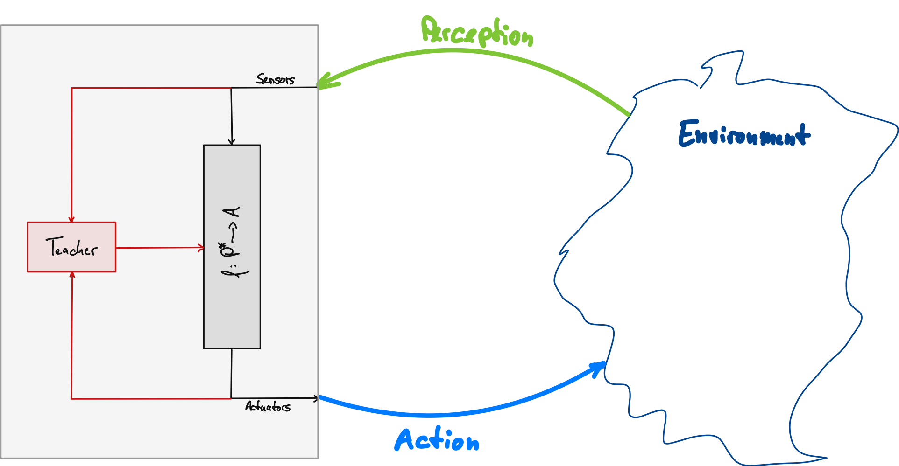
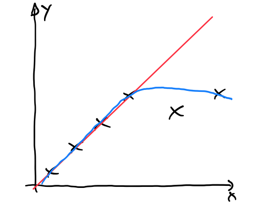
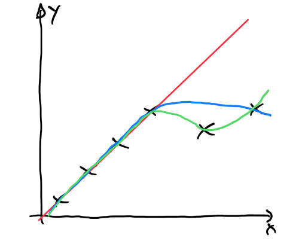
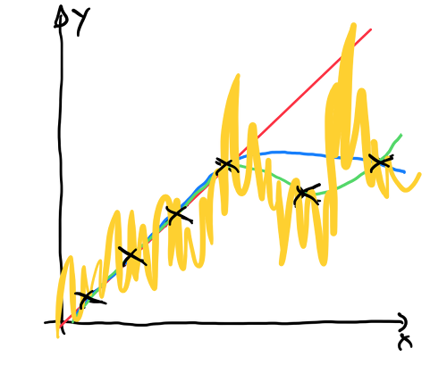

# Machine Learning 101

> [!NOTE]
> 

> 
<strong>🎯 TL;DR</strong>

>
> Lernen wird in der KI oft als Verhaltensänderung (eines Systems)
> aufgefasst. Dabei soll eine Gütefunktion optimiert werden.
>
> Je nach verfügbarem Feedback eines "Lehrers" werden typischerweise
> drei Arten von Lernen unterschieden: Überwachtes Lernen, Unüberwachtes
> Lernen, Reinforcement Lernen. Dabei stellt der Lehrer beim überwachten
> Lernen Trainingsbeispiele plus eine Vorgabe (Klasse, Funktionswert)
> zur Verfügung, während beim unüberwachten Lernen nur die
> Trainingsbeispiele bereitgestellt werden und der Algorithmus selbst
> Zusammenhänge in den Daten erkennen soll. Beim Reinforcement Learning
> erfolgt das Feedback am Ende einer Kette von Aktionen, d.h. der
> Algorithmus muss diese Bewertung auf die einzelnen Aktionen
> zurückrechnen.
>
> Beim überwachten Lernen soll eine Hypothese aufgebaut werden, die der
> echten (zu lernenden) Funktion möglichst nahe kommt. Eine konsistente
> Hypothese erklärt die Trainingsdaten, eine generalisierende Hypothese
> kann auch unbekannte Daten (die aus der selben Quelle stammen, also
> zum selben Problem gehören) korrekt bewerten. Es wird unterschieden
> zwischen Klassifikation (einige wenige diskrete Label/Klassen, die den
> Trainingsbeispielen zugeordnet sind) und Regression (Lernen eines
> Funktionsverlaufs).
>
> Merkmalsvektoren gruppieren Eigenschaften des Problems bzw. der
> Objekte, d.h. jedes Objekt kann über einen Merkmalsvektor beschrieben
> werden. Trainingsdaten sind ausgewählte Beispielobjekte (durch
> Merkmalsvektoren beschrieben) plus die Vorgabe (Klasse oder
> Funktionswert) vom Lehrer.
>
> 

> 

> 
<strong>🎦 Videos</strong>

>
> - [VL Machine Learning 101](https://youtu.be/FliWEXQZhsw)
>
> 

## Was ist Lernen?

> Verhaltensänderung eines Agenten in Richtung der Optimierung eines
> Gütefunktionals (Bewertungsfunktion) durch Erfahrung.

## Warum Lernen?

- Nicht alle Situationen vorhersehbar
- Nicht alle Details modellierbar
- Lösung oder Lösungsweg unbekannt, nicht explizit programmierbar
- Data Mining: Entdeckung neuen Wissens durch Analyse der Daten
- Selbstanpassende Programme

=\> Lernen wichtige Eigenschaft lebender Wesen :-)

## Learning Agent

## Feedback während des Lernens

- **Überwachtes Lernen**
  - Lernen durch Beobachtung
  - Vorgabe von Beispielen: Ein- und Ausgabewerte

  =\> Regression, Klassifikation

<!-- -->

- **Unüberwachtes Lernen**
  - Erkennen von Mustern in den Inputdaten, Clustering
  - Kein Feedback (!)

<!-- -->

- **Reinforcement Lernen**
  - Bewertung der Aktionen des Agenten am Ende einer Aktionsfolge

**Beispiel Kleinkind**: Lernen von Klassen/Konzepten durch Beispiele

- Zuerst ist alles "Katze" (Übergeneralisierung)
- Differenzierung durch Feedback der Umwelt; Erkennung unterschiedlicher
  Ausprägungen

## Beispiel: Kreditrisiko

- Bankkunde beantragt Kredit
- Soll er aus Sicht der Bank den Kredit bekommen?

<!-- -->

- Bankangestellter betrachtet (relevante) Merkmale des Kunden:
  - Alter, Einkommen, sozialer Status
  - Kundenhistorie bei der Bank
  - Höhe des Kredits

<!-- -->

- Bewertung des Kreditrisikos:
  - **Klassifikation**: Guter oder schlechter Kunde (Binäre
    Entscheidung: 2 Klassen)
  - **Regression**: Vorhersage Gewinn/Verlust für die Bank (Höhe des
    Gewinns/Verlusts interessant)

## Beispiel: Autoreparatur

- **Gegeben**: Eigenschaften eines Autos

  =\> Eigenschaften: Ausprägungen der Merkmale

<!-- -->

- **Gesucht**: Diagnose und Reparaturanleitung

  =\> Hypothese über den Merkmalen (Funktion $\operatorname{h}$)

## Lernen durch Beobachten: Lernen einer Funktion $\operatorname{f}$

Funktionsapproximation: Lernen einer Funktion $\operatorname{f}$ anhand
von Beispielen

- Ein Beispiel ist ein Tupel
  $(\mathbf{x}, \operatorname{f}(\mathbf{x}))$, etwa
  $$(\mathbf{x}, \operatorname{f}(\mathbf{x})) = \left(\begin{array}{ccc}
  O & O & X \\
  . & X & . \\
  X & . & .
  \end{array}, +1\right)$$

<!-- -->

- Aufgabe: Baue Hypothese $\operatorname{h}$ auf, so dass
  $\operatorname{h} \approx \operatorname{f}$.
  - Benutze dazu Menge von Beispielen =\> **Trainingsdaten**.

<!-- -->

- Ziele:
  1.  **Konsistente Hypothese**: Übereinstimmung bei Trainingsdaten
  2.  **Generalisierende Hypothese**: Korrekte Vorhersage bei
      unbekannten Daten

*Anmerkung*: Stark vereinfachtes Modell realen Lernens!

## Konstruieren einer konsistenten Hypothese

Welcher Zusammenhang ist hier dargestellt? Offenbar eine Art
Funktionsverlauf ... Wir haben für einige x-Werte die zugehörigen
y-Werte vorgegeben.

## Konstruieren einer konsistenten Hypothese (cnt.)

Die einfachste Approximation wäre eine lineare Funktion. Allerdings
werden hierbei einige Werte mehr oder weniger stark nicht korrekt
widergegeben, d.h. man hat einen relativ hohen (Trainings-) Fehler.

## Konstruieren einer konsistenten Hypothese (cnt.)

Die Hyperbel erklärt die Trainingsdaten bis auf den einen Punkt sehr
gut. Die Frage ist, ob dieser eine Punkt zum zu lernenden Zusammenhang
gehört oder ein Ausreißer ist, den man gefahrlos ignorieren kann?

## Konstruieren einer konsistenten Hypothese (cnt.)

Die grüne Hypothese ist von allen bisher gezeigten die komplexeste,
erklärt aber alle Datenpunkte. D.h. hier wäre der Trainingsfehler Null.
Zwischen den Trainingsdaten zeigt das Modell eine "glatte"
Approximation, d.h. es wird auch neue Daten, die es beim Training nicht
gesehen hat, relativ gut erklären. (Dabei liegt freilich die Annahme
zugrunde, dass alle relevanten Daten in der Trainingsmenge vorhanden
sind, d.h. dass es insbesondere zwischen den Datenpunkten keine
Ausreißer o.ä. gibt.)

## Konstruieren einer konsistenten Hypothese (cnt.)

Diese Hypothese erklärt ebenfalls sämtliche Trainingsdaten. Allerdings
schwingt die Funktion zwischen den Daten stark hin und her. Vermutlich
entspricht dies nicht dem zu lernenden Funktionsverlauf. Der
Trainingsfehler wäre wie bei der deutlich einfacheren Hypthese aus dem
letzten Schritt Null. Der Generalisierungsfehler (sprich die Abweichung,
wenn man das Modell nach Daten zwischen den Trainingspunkten fragt)
dürfte erheblich höher liegen.

D.h. hier hat das Modell einfach die Trainingsdaten auswendig gelernt,
aber nicht den Zusammenhang zwischen den Daten! Dies ist in der Regel
unerwünscht!

## Occam's Razor

**Bevorzuge die einfachste konsistente Hypothese!**

1.  Wenn es mehrere mögliche Erklärungen für einen Sachverhalt gibt, ist
    die einfachste Erklärung allen anderen vorzuziehen.
2.  Eine Erklärung ist "einfach", wenn sie möglichst wenige Variablen
    und Annahmen enthält und wenn diese in klaren logischen Beziehungen
    zueinander stehen, aus denen der zu erklärende Sachverhalt logisch
    folgt.

## Trainingsdaten und Merkmalsvektoren

Lehrer gibt Beispiele vor: Eingabe $\mathbf{x}$ und passende Ausgabe
$\operatorname{f}(\mathbf{x})$

- Ausgabe: typischerweise Skalar (Funktionswert oder Klasse) =\>
  Beispiel: Bewertung eines Spielstandes bei TicTacToe

<!-- -->

- Eingabe: (Beschreibung des) Objekt(s) oder Situation, die zur Ausgabe
  gehört =\> Beispiel: Spielstand bei TicTacToe

**Merkmalsvektoren**:

- Zusammenfassen der relevanten Merkmale zu Vektoren

## Beispiel: Schwimmen im See

Beschreibung der Faktoren, wann ich im See schwimmen möchte:

1.  Scheint die Sonne?
2.  Wie warm ist das Wasser?
3.  Wie warm ist die Luft?

- Trainingsbeispiel:
  - Eingabe: Merkmalsvektor `(sonnig, warm, warm)`
  - Ausgabe: Klasse `ja`

Dabei wird davon ausgegangen, dass jeder Faktor (jedes Merkmal) an einer
bestimmten Stelle im Merkmalsvektor aufgeführt ist. Beispielsweise
gehört das `sonnig` zur Frage "Scheint die Sonne", `warm` jeweils zur
Wasser- und zur Lufttemperatur.

Damit hat man in einem Vektor eine Situation komplett beschrieben, d.h.
einen Zustand der Welt mit den relevanten Dingen beschrieben. Diesem
Zustand kann man beispielsweise ein Label (Klasse) verpassen, hier in
diesem Fall "ja, in dieser Welt möchte ich schwimmen".

Die Trainingsmenge baut sich dann beim überwachten Lernen aus vielen
solcher Paare (Merkmalsvektor, Klasse) auf, und die Algorithmen sollen
diese Zuordnung lernen, d.h. ein Modell für diese Daten erzeugen,
welches die Daten gut erklärt und darüber hinaus für neue Daten aus der
selben Datenquelle gute Vorhersagen macht.

## Trainingsdaten -- Merkmalsvektoren

**Generell**: Merkmalsvektor für Objekt $v$:
$$    \mathbf{x}(v) = (x_1, x_2, \ldots, x_n)$$

- $n$ Merkmale (Attribute)
- Attribut $x_t$ hat $m_t$ mögliche Ausprägungen
- Ausprägung von $v$ bzgl. $x_t$: $\quad x_t(v) = i \quad$ (mit
  $i = 1 \ldots m_t$)

*Anmerkung*: Stellen Sie sich den Merkmalsvektor $\mathbf{x}$ vielleicht
wie einen Konstruktor einer Klasse `x` vor: Die einzelnen Attribute
$x_t$ sind die Parameter, aus denen der Merkmalsvektor aufgebaut
ist/wird. Jedes der Attribute hat einen Typ und damit eine bestimmte
Anzahl erlaubter Werte ("Ausprägungen") ...

**Trainingsbeispiel**:

- Tupel aus Merkmalsvektor und zugehöriger Klasse:
  $\left(\mathbf{x}(v), k\right)$

## Wrap-Up

- Lernen ist Verhaltensänderung, Ziel: Optimierung einer Gütefunktion
  - Aufbau einer Hypothese, die beobachtete Daten erklären soll
  - Arten: Überwachtes Lernen, Unüberwachtes Lernen, Reinforcement
    Lernen

<!-- -->

- Merkmalsvektoren gruppieren Eigenschaften des Problems bzw. der
  Objekte
- Trainingsdaten: Beispielobjekte (durch Merkmalsvektoren beschrieben)
  plus Vorgabe vom Lehrer

## 📖 Zum Nachlesen

- Russell und Norvig ([2020](#ref-Russell2020)): Lernen: Abschnitte 19.1
  und 19.2

------------------------------------------------------------------------

> [!TIP]
> 

> 
<strong>✅ Lernziele</strong>

>
> - k1: Definition und Arten des Lernens
> - k2: Überwachtes Lernen: Lernen durch Beobachten (mit Lehrer)
> - k2: Merkmalsvektoren, Eigenschaften, Ausprägung, Objekte, Trainingsmenge
>
> 

> 

> 
<strong>🧩 Quizzes</strong>

>
> - [Selbsttest Intro ML
>   (ILIAS)](https://www.hsbi.de/elearning/goto.php?target=tst_1106589&client_id=FH-Bielefeld)
>
> 

> 

> 
<strong>🏅 Challenges</strong>

>
> **Modellierung**
>
> Sie stehen vor der Entscheidung, ob Sie sich zur Vorbereitung auf die
> Flipped-Classroom-Sitzung noch das Skript anschauen. Welche Attribute
> benötigen Sie, um die Situation zu beschreiben?
>
> **Metriken für Klassifikatoren**
>
> Es ist wieder Wahlkampf: Zwei Kandidaten O und M bewerben sich um die
> Kanzlerschaft. Die folgende Tabelle zeigt die Präferenzen von sieben
> Wählern.
>
> | Nr. | Alter    | Einkommen | Bildung  | Kandidat | Vorhersage |
> |:----|:---------|:----------|:---------|:---------|:-----------|
> | 1   | $\ge 35$ | hoch      | Abitur   | O        | O          |
> | 2   | $< 35$   | niedrig   | Master   | O        | O          |
> | 3   | $\ge 35$ | hoch      | Bachelor | M        | M          |
> | 4   | $\ge 35$ | niedrig   | Abitur   | M        | M          |
> | 5   | $\ge 35$ | hoch      | Master   | O        | O          |
> | 6   | $< 35$   | hoch      | Bachelor | O        | M          |
> | 7   | $< 35$   | niedrig   | Abitur   | M        | O          |
>
> Auf diesem Datensatz wurde ein Klassifikator trainiert, die
> Trainingsergebnisse sind in der Tabelle unter "Vorhersage" angegeben.
>
> Bewerten Sie den Klassifikator.
>
> 

------------------------------------------------------------------------

> [!NOTE]
> 

> 
<strong>👀 Quellen</strong>

>
> 
 entry-spacing="0">
>
> 

>
> Russell, S., und P. Norvig. 2020. *Artificial Intelligence: A Modern
> Approach*. 4th Edition. Pearson. <http://aima.cs.berkeley.edu>.
>
> 

>
> 

>
> 

------------------------------------------------------------------------

Unless otherwise noted, this work is licensed under CC BY-SA 4.0.

<blockquote>
<strong>Last modified:</strong> 281b180 (lecture: fix missing math mode (DTL1), 2025-07-24) 
</blockquote>
