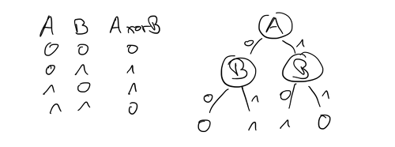

# DTL: CAL2

> [!IMPORTANT]
>
> <details open>
>
> <summary><strong>🎯 TL;DR</strong></summary>
>
> Eine Hypothese kann im einfachsten Fall als Entscheidungsbaum
> dargestellt werden. Die Merkmale bilden dabei die Knoten im Baum, und
> je Ausprägung gibt es eine Kante zu einem Nachfolgerknoten. Ein
> Merkmal bildet die Wurzel des Baums, an den Blättern sind die Klassen
> zugeordnet.
>
> Einen Entscheidungsbaum kann man zur Klassifikation eines Objekts
> schrittweise durchlaufen: Für jeden Knoten fragt man die Ausprägung
> des Merkmals im Objekt ab und wählt den passenden Ausgang aus dem
> Knoten. Wenn man am Blatt angekommen ist, hat man die Antwort des
> Baumes auf das Objekt, d.h. üblicherweise die Klasse.
>
> Den Baum kann man mit dem Algorithmus CAL2 schrittweise aufbauen. Man
> startet mit “Nichtwissen” (symbolisiert mit einem “\*”) und iteriert
> durch alle Trainingsbeispiele, bis der Baum sich nicht mehr verändert.
> Wenn der Baum auf ein Beispiel einen “\*” ausgibt, dann ersetzt man
> diesen “\*” mit der Klasse des eben betrachteten Beispiels. Wenn der
> Baum bei einem Beispiel die passende Klasse ausgibt, macht man mit dem
> nächsten Beispiel weiter. Wenn der Baum bei einem Beispiel eine andere
> Klasse ausgibt, muss das Klassensymbol im Baum (an der Stelle, wo das
> Objekt gelandet ist) durch den nächsten Test ersetzt werden: Hierzu
> nimmt man das nächste, auf diesem konkreten Pfad noch nicht verwendete
> Merkmal. CAL2 kann nur mit diskreten Attributen und disjunkten Klassen
> einen fehlerfreien Baum erzeugen.
> </details>

> [!TIP]
>
> <details open>
>
> <summary><strong>🎦 Videos</strong></summary>
>
> - [VL CAL2](https://youtu.be/bR_QVYtPRx8)
>
> </details>

## Entscheidungsbäume: Klassifikation

<picture><source media="(prefers-color-scheme: light)" srcset="images/xor-decision-tree_light.png"><source media="(prefers-color-scheme: dark)" srcset="images/xor-decision-tree_dark.png"></picture>

- Attribute als Knoten im Baum
- Ausprägungen als Test (Ausgang, Verzweigung)
- Klasse (Funktionswert) als Blatt

Erinnern Sie sich an das Beispiel mit der Auto-Reparatur aus der letzten
Sitzung.

Die relevanten Eigenschaften (Merkmale) eines Autos würden als Knoten im
Baum repräsentiert. Beispiel: “Motor startet” oder “Farbe”.

Jedes Merkmal hat eine Anzahl von möglichen Ausprägungen, diese
entsprechen den Verzweigungen am Knoten. Beispiel: “startet”, “startet
nicht” oder “rot”, “weiß”, “silber”, … .

Entsprechend kann man durch Abarbeiten des Entscheidungsbaumes am Ende
zu einer Diagnose gelangen (Klasse).

Eine andere Sichtweise ist die Nutzung als Checkliste für eine Reparatur
…

## Definition Entscheidungsbaum

- Erinnerung: **Merkmalsvektor** für Objekt $`v`$:

  - $`n`$ Merkmale (Attribute)
  - Attribut $`x_t`$ hat $`m_t`$ mögliche Ausprägungen
  - Ausprägung von $`v`$ bzgl. $`x_t`$: $`\quad x_t(v) = i \quad`$ (mit
    $`i = 1 \ldots m_t`$)

``` math
    \mathbf{x}(v) = (x_1, x_2, \ldots, x_n)
```

- **Alphabet** für Baum:

``` math
\lbrace x_t | t=1,\ldots,n \rbrace \cup \lbrace \kappa | \kappa = \ast,A,B,C,\ldots \rbrace \cup \lbrace (,) \rbrace
```

- **Entscheidungsbaum** $`\alpha`$:

``` math
\alpha = \left\lbrace  \begin{array}{ll}
        \kappa  & \text{Terminalsymbole: } \kappa = \ast,A,B, \ldots\\
        x_t(\alpha_1, \alpha_2, \ldots, \alpha_{m_t}) & x_t \text{ Testattribut mit } m_t \text{ Ausprägungen}
    \end{array}\right.
```

*Anmerkung*: Stellen Sie sich die linearisierte Schreibweise wieder wie
den (verschachtelten) Aufruf von Konstruktoren vor. Es gibt die
Oberklasse `Baum`, von der für jedes Attribut eine Klasse abgeleitet
wird. D.h. der Konstruktor für eine Attributklasse erzeugt letztlich ein
Objekt vom Obertyp `Baum`. Außerdem sind die Terminalsymbole `A`, `B`, …
Objekte vom Typ `Blatt`, welches eine Unterklasse von `Baum` ist …

Dabei wird die Anzahl der möglichen Ausprägungen für ein Attribut
berücksichtigt: Jede Ausprägung hat einen Parameter im Konstruktor.
Damit werden die Unterbäume beim Erzeugen des Knotens übergeben.

## Induktion von Entscheidungsbäumen: CAL2

1.  Anfangsschritt: $`\alpha^{(0)} = \ast`$ (totales Unwissen)

2.  $`n`$-ter Lernschritt: Objekt $`v`$ mit Klasse $`k`$, Baum
    $`\alpha^{(n-1)}`$ gibt $`\kappa`$ aus

    - $`\kappa = \ast`$: ersetze $`\ast`$ durch $`k`$
    - $`\kappa = k`$: keine Aktion nötig
    - $`\kappa \neq k`$: Fehler
      - Ersetze $`\kappa`$ mit neuem Test:
        $`\kappa \gets x_{t+1}(\ast, \ldots, \ast, k, \ast, \ldots, \ast)`$
      - $`x_{t+1}`$: nächstes Attribut, auf dem aktuellen Pfad noch
        nicht verwendet
      - Symbol $`k`$ an Position $`i`$ wenn $`x_{t+1}(v) = i`$

$`\alpha^{(n)}`$ bezeichnet den Baum im $`n`$-ten Lernschritt.

CAL2 ist ein **Meta-Algorithmus**: Es ist ein Algorithmus, um einen
Algorithmus zu lernen :-)

## Beispiel mit CAL2

| $`x_1`$ | $`x_2`$ | $`x_3`$ | $`k`$ |
|:--------|:--------|:--------|:------|
| 0       | 0       | 1       | A     |
| 1       | 0       | 0       | A     |
| 0       | 1       | 4       | B     |
| 1       | 1       | 2       | B     |
| 0       | 0       | 3       | A     |

**Ergebnis**: $`x_1(x_2(A, B), x_2(A, B))`$

*Anmerkung*: Denken Sie an die Analogie von oben. $`x_1`$ kann als
Konstruktor einer Klasse `x1` betrachtet werden, die eine Unterklasse
von `Baum` ist. Durch den Aufruf des Konstruktors wird als ein `Baum`
erzeugt.

Es gibt in $`x_1`$ zwei mögliche Ausprägungen, d.h. der Baum hat in
diesem Knoten zwei alternative Ausgänge. Diese Unterbäume werden dem
Konstruktor von `x1` direkt beim Aufruf übergeben (müssen also
Referenzen vom Typ `Baum` sein).

## CAL2: Bemerkungen

- Nur für diskrete Merkmale und disjunkte Klassen

<!-- -->

- Zyklischer Durchlauf durch Trainingsmenge
- Abbruch:
  - Alle Trainingsobjekte richtig klassifiziert =\> Kein Fehler in einem
    kompletten Durchlauf
  - (Differenzierung nötig, aber alle Merkmale verbraucht)
  - (Lernschrittzahl überschritten)

## Wrap-Up

- Darstellung der Hypothese als Entscheidungsbaum
- CAL2: diskrete Attribute, disjunkte Klassen

## 📖 Zum Nachlesen

- Unger und Wysotzki ([1981](#ref-Unger1981)): Der Vollständigkeit
  halber aufgeführt (Werk ist leider vergriffen und wird nicht mehr
  verlegt)

> [!NOTE]
>
> <details>
>
> <summary><strong>✅ Lernziele</strong></summary>
>
> - k3: Ich kann den Entscheidungsbaumlerner CAL2 auf ein Beispiel
>   anwenden
>
> </details>

> [!TIP]
>
> <details>
>
> <summary><strong>🧩 Quizzes</strong></summary>
>
> - [Selbsttest CAL2
>   (ILIAS)](https://www.hsbi.de/elearning/goto.php?target=tst_1106575&client_id=FH-Bielefeld)
>
> </details>

> [!TIP]
>
> <details>
>
> <summary><strong>🏅 Challenges</strong></summary>
>
> **Modellierung**
>
> Sie stehen vor der Entscheidung, ob Sie sich zur Vorbereitung auf die
> Flipped-Classroom-Sitzung noch das Skript anschauen.
>
> Zeichnen Sie einen Entscheidungsbaum, der Ihnen bei der Entscheidung
> hilft.
>
> **Textklassifikation**
>
> Betrachten Sie die folgenden Aussagen:
>
> > - Patient A hat weder Husten noch Fieber und ist gesund.
> > - Patient B hat Husten, aber kein Fieber und ist gesund.
> > - Patient C hat keinen Husten, aber Fieber. Er ist krank.
> > - Patient D hat Husten und kein Fieber und ist krank.
> > - Patient E hat Husten und Fieber. Er ist krank.
>
> Aufgaben:
>
> 1.  Trainieren Sie auf diesem Datensatz einen Klassifikator mit CAL2.
> 2.  Ist Patient F krank? Er hat Husten, aber kein Fieber.
>
> **Handsimulation CAL2**
>
> Zeigen Sie mit einer Handsimulation, wie CAL2 mit dem folgenden
> Trainingsdatensatz schrittweise einen Entscheidungsbaum generiert.
> Nutzen Sie die linearisierte Schreibweise.
>
> | Beispiel | $`x_1`$ | $`x_2`$ | $`x_3`$ | Klasse |
> |:--------:|:-------:|:-------:|:-------:|:------:|
> |    1     |    a    |    a    |    a    |   1    |
> |    2     |    a    |    b    |    a    |   2    |
> |    3     |    a    |    a    |    b    |   1    |
> |    4     |    b    |    a    |    b    |   1    |
> |    5     |    a    |    a    |    c    |   1    |
> |    6     |    b    |    b    |    b    |   2    |
>
> Welchen Entscheidungsbaum würde CAL2 lernen, wenn dem
> Trainingsdatensatz der Vektor $`((a,a,b), 2)`$ als Beispiel Nr. 7
> hinzugefügt werden würde?
> </details>

------------------------------------------------------------------------

> [!NOTE]
>
> <details>
>
> <summary><strong>👀 Quellen</strong></summary>
>
> <div id="refs" class="references csl-bib-body hanging-indent">
>
> <div id="ref-Unger1981" class="csl-entry">
>
> Unger, S., und F. Wysotzki. 1981. *Lernfähige Klassifizierungssysteme
> (Classifier Systems Which Are Able to Learn)*. Akademie-Verlag.
>
> </div>
>
> </div>
>
> </details>

------------------------------------------------------------------------


Unless otherwise noted, this work is licensed under CC BY-SA 4.0.

<blockquote><p><sup><sub><strong>Last modified:</strong> d12a1c1 (lecture: add DTL to title (DTL), 2025-08-29)<br></sub></sup></p></blockquote>
