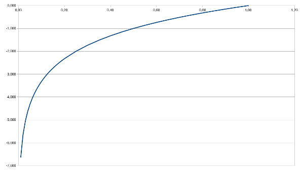

# Entropie

> [!NOTE]
>
> <details open>
>
> <summary><strong>🎯 TL;DR</strong></summary>
>
> Die Entropie kann als Maß für den Informationsgehalt einer
> Trainingsmenge betrachtet werden: Wieviele Ja/Nein-Entscheidungen sind
> nötig, um die Daten fehlerfrei zu repräsentieren?
>
> Nach der Wahl eines Attributs kann die verbleibende mittlere Entropie
> berechnet werden. Damit hat man ein Kriterium für die Auswahl von
> Attributen beim Aufbau von Entscheidungsbäumen: Nimm das Attribut,
> welches einen möglichst hohen Informationsgehalt hat. Oder
> andersherum: Wähle das Attribut, bei dem die verbleibende mittlere
> Entropie der Trainingsmenge nach der Wahl des Attributs am kleinsten
> ist.
>
> </details>
>
> <details>
>
> <summary><strong>🎦 Videos</strong></summary>
>
> - [VL Entropie](https://youtu.be/4IZYA5EWO1k)
>
> </details>

## Wie Attribute wählen?

### Erinnerung: CAL2/CAL3

- Zyklische Iteration durch die Trainingsmenge
- Ausschließlich aktuelles Objekt betrachtet
- Reihenfolge der “richtigen” Attributwahl bei Verzweigung unklar

=\> Betrachte stattdessen die komplette Trainingsmenge!

### Relevanz =\> Informationsgehalt

- Shannon/Weaver (1949): **Entropie**
  - Maß für die Unsicherheit einer Zufallsvariablen
  - Anzahl der Bits zur Darstellung der Ergebnisse eines
    Zufallsexperiments

### Beispiele

- Münze, die immer auf dem Rand landet: keine Unsicherheit, 0 Bit
- Faire Münze: Kopf oder Zahl: Entropie 1 Bit
- Fairer 4-seitiger Würfel: 4 mögliche Ausgänge: Entropie 2 Bit
- Münze, die zu 99% auf einer Seite landet: Entropie nahe Null

=\> Anzahl der Ja/Nein-Fragen, um zur gleichen Information zu kommen

## Definition der Entropie $`H(V)`$ für Zufallsvariable $`V`$

- Zufallsvariable $`V`$ =\> mögliche Werte $`v_k`$
- Wahrscheinlichkeit für $`v_k`$ sei $`p_k = P(v_k)`$

<div align="center">

$`H(V) = -\sum_k p_k \log_2 p_k`$

</div>

Hinweis:
$`\log_2 x = \frac{\log_{10} x}{\log_{10} 2} = \frac{\log x}{\log 2}`$



- Nur eine Klasse: $`\log_2 1 = 0`$ =\> $`H(V) = 0`$ Bit
- Zwei Klassen, gleichwahrscheinlich: $`\log_2 0.5 = -1`$ =\>
  $`H(V) = 1`$ Bit

## Beispiele Entropie: faire Münze

<div align="center">

Entropie: $`H(V) = -\sum_k p_k \log_2 p_k`$

</div>

- $`v_1 = \operatorname{Kopf},  v_2 = \operatorname{Zahl}`$
- $`p_1 = 0.5,  p_2 = 0.5`$
- $`H(\operatorname{Fair}) = -(0.5 \log_2 0.5 + 0.5 \log_2 0.5) = 1`$
  Bit

$`\log_2 0.5 = -1`$

## Beispiele Entropie: unfaire Münze

<div align="center">

Entropie: $`H(V) = -\sum_k p_k \log_2 p_k`$

</div>

- $`v_1 = \operatorname{Kopf},  v_2 = \operatorname{Zahl}`$

- $`p_1 = 0.99,  p_2 = 0.01`$

- $`H(\operatorname{UnFair}) = -(0.99 \log_2 0.99 + 0.01 \log_2 0.01)`$

  $`H(\operatorname{UnFair}) \approx 0.08`$ Bit

$`\log_2 0.01 \approx -6.64`$

$`\log_2 0.99 \approx -0,014`$

## Beispiele Entropie: 4-seitiger Würfel

<div align="center">

Entropie: $`H(V) = -\sum_k p_k \log_2 p_k`$

</div>

- $`v_1 = 1,  v_2 = 2,   v_3 = 3,   v_4 = 4`$
- $`p_1 = p_2 = p_3 = p_4 = 0.25`$
- $`H(\operatorname{Wuerfel}) = -4\cdot(0.25 \log_2 0.25) = 2`$ Bit

$`\log_2 0.25 = -2`$

## Entropie der Trainingsmenge: Häufigkeit der Klassen zählen

| Nr. | $`x_1`$ | $`x_2`$ | $`x_3`$ | $`k`$ |
|:----|:--------|:--------|:--------|:------|
| 1   | 0       | 0       | 0       | A     |
| 2   | 1       | 0       | 2       | A     |
| 3   | 0       | 1       | 1       | A     |
| 4   | 1       | 1       | 0       | B     |
| 5   | 0       | 1       | 1       | B     |
| 6   | 0       | 1       | 0       | A     |

- Anzahl Klasse $`A`$: 4
- Anzahl Klasse $`B`$: 2
- Gesamtzahl Beispiele: 6

Wahrscheinlichkeit für $`A`$: $`p_A = 4/6 = 0.667`$

Wahrscheinlichkeit für $`B`$: $`p_B = 2/6 = 0.333`$

``` math
\begin{array}{rcl}
    H(S) &=& -\sum_k p_k \log_2 p_k\\
         &=& -(4/6 \cdot \log_2 4/6 + 2/6 \cdot \log_2 2/6)\\
         &=& -(-0.39 -0.53) = 0.92 \operatorname{Bit}
\end{array}
```

## Mittlere Entropie nach Betrachtung von Attribut $`A`$

``` math
    R(S, A) = \sum_{v \in \operatorname{Values}(A)} \frac{|S_v|}{|S|} H(S_v)
```

- Auswahl von Attribut $`A`$ partitioniert die Trainingsmenge: Je
  Ausprägung $`v`$ von $`A`$ erhält man eine Submenge $`S_v`$

- $`R(S, A)`$ berechnet die mittlere Entropie der Trainingsmenge,
  nachdem Attribut $`A`$ ausgewählt wurde: Unsicherheit/nötige Bits nach
  Auswahl von Attribut $`A`$

## Entropie der Trainingsmenge nach Attributwahl

| Nr. | $`x_1`$ | $`x_2`$ | $`x_3`$ | $`k`$ |
|:----|:--------|:--------|:--------|:------|
| 1   | 0       | 0       | 0       | A     |
| 2   | 1       | 0       | 2       | A     |
| 3   | 0       | 1       | 1       | A     |
| 4   | 1       | 1       | 0       | B     |
| 5   | 0       | 1       | 1       | B     |
| 6   | 0       | 1       | 0       | A     |

- Sei Attribut $`x_1`$ ausgewählt
- $`x_1`$ partitioniert die Trainingsmenge
  - $`x_1=0`$ liefert $`S_0 = \lbrace 1,3,5,6 \rbrace`$
  - $`x_1=1`$ liefert $`S_1 = \lbrace 2,4 \rbrace`$
  - Häufigkeit für $`x_1=0`$: $`4/6`$
  - Häufigkeit für $`x_1=1`$: $`2/6`$
  - Gesamtzahl Beispiele: 6

``` math
\begin{array}{rcl}
    R(S, A) &=& \sum_{v \in \operatorname{Values}(A)} \frac{|S_v|}{|S|} H(S_v)\\
         &=& 4/6 \cdot H(\lbrace 1,3,5,6 \rbrace) + 2/6 \cdot H(\lbrace 2,4 \rbrace)\\
         &=& 4/6\cdot(-3/4 \cdot \log_2 3/4 - 1/4 \cdot \log_2 1/4) +\\
         && 2/6\cdot(-1/2 \cdot \log_2 1/2 - 1/2 \cdot \log_2 1/2)\\
         &=& 0.54 + 0.33 = 0.87 \operatorname{Bit}
\end{array}
```

## Ausblick: Gini Impurity

Wir haben hier die
[Entropie](https://en.wikipedia.org/wiki/Decision_tree_learning#Information_gain)
als Maß für den Informationsgehalt einer Trainingsmenge genutzt.
$`R(S,A)`$ als die mittlere Entropie nach Betrachtung von Attribut $`A`$
wird von typischen Entscheidungsbaumverfahren wie ID3 und C4.5 genutzt,
um bei einer Verzweigung das nächste möglichst aussagekräftige Merkmal
auszuwählen.

In anderen Entscheidungsbaumlernern wird stattdessen die [Gini
Impurity](https://en.wikipedia.org/wiki/Decision_tree_learning#Gini_impurity)
zur Bestimmung des Informationsgehalts eingesetzt (u.a. CART). Dieses
Maß sagt aus, wie oft man ein zufällig gezogenes Element des Datensatzes
falsch klassifizieren würde, wenn man es mit einer zufälligen Klasse
basierend auf der Verteilung der Klassen im Datensatz labeln würde.

Hierzu drei lesenswerte Blog-Einträge:

- [Deep dive into the basics of Gini Impurity in Decision Trees with
  math
  Intuition](https://medium.com/poli-data/deep-dive-into-the-basics-of-gini-impurity-in-decision-trees-with-math-intuition-46c721d4aaec)
- [Decision Trees,
  Explained](https://towardsdatascience.com/decision-trees-explained-d7678c43a59e)
- [Decision Tree Algorithm With Hands-On
  Example](https://medium.datadriveninvestor.com/decision-tree-algorithm-with-hands-on-example-e6c2afb40d38)

## Wrap-Up

- Begriff und Berechnung der Entropie: Maß für die Unsicherheit
- Begriff und Berechnung des Informationsgewinns
  - Entropie für eine Trainingsmenge
  - Mittlere Entropie nach Wahl eines Attributs

## 📖 Zum Nachlesen

- Ertel ([2017](#ref-Ertel2017)): Entscheidungsbäume: Abschnitt 8.4
- Russell und Norvig ([2020](#ref-Russell2020)): Entscheidungsbäume:
  Abschnitt 19.3
- Mitchell ([2010](#ref-Mitchell2010)): ID3: Kapitel 3

------------------------------------------------------------------------

> [!TIP]
>
> <details>
>
> <summary><strong>✅ Lernziele</strong></summary>
>
> - k3: Berechnung der Entropie und des Information Gain
>
> </details>
>
> <details>
>
> <summary><strong>🧩 Quizzes</strong></summary>
>
> - [Selbsttest Entropie
>   (ILIAS)](https://www.hsbi.de/elearning/goto.php?target=tst_1106578&client_id=FH-Bielefeld)
>
> </details>
>
> <details>
>
> <summary><strong>🏅 Challenges</strong></summary>
>
> **Entropie einer Trainingsmenge**
>
> Betrachten Sie die folgenden Aussagen:
>
> > - Patient A hat weder Husten noch Fieber und ist gesund.
> > - Patient B hat Husten, aber kein Fieber und ist gesund.
> > - Patient C hat keinen Husten, aber Fieber. Er ist krank.
> > - Patient D hat Husten und kein Fieber und ist krank.
> > - Patient E hat Husten und Fieber. Er ist krank.
>
> Aufgaben:
>
> 1.  Geben Sie die Entropie $`H(S)`$ der Trainingsmenge an.
> 2.  Berechnen Sie $`R(H,A)`$ (die mittlere Entropie der
>     Trainingsmenge, nachdem Attribut $`A`$ gesehen wurde) für die
>     einzelnen Attribute.
>
> </details>

------------------------------------------------------------------------

> [!NOTE]
>
> <details>
>
> <summary><strong>👀 Quellen</strong></summary>
>
> <div id="refs" class="references csl-bib-body hanging-indent"
> entry-spacing="0">
>
> <div id="ref-Ertel2017" class="csl-entry">
>
> Ertel, W. 2017. *Introduction to Artificial Intelligence*. 2nd
> edition. Springer. <https://doi.org/10.1007/978-3-319-58487-4>.
>
> </div>
>
> <div id="ref-Mitchell2010" class="csl-entry">
>
> Mitchell, T. 2010. *Machine Learning*. McGraw-Hill.
>
> </div>
>
> <div id="ref-Russell2020" class="csl-entry">
>
> Russell, S., und P. Norvig. 2020. *Artificial Intelligence: A Modern
> Approach*. 4th Edition. Pearson. <http://aima.cs.berkeley.edu>.
>
> </div>
>
> </div>
>
> </details>

------------------------------------------------------------------------


Unless otherwise noted, this work is licensed under CC BY-SA 4.0.

<blockquote><p><sup><sub><strong>Last modified:</strong> 80d2904 (Remove Hugo: remove cbox, 2025-07-17)<br></sub></sup></p></blockquote>
