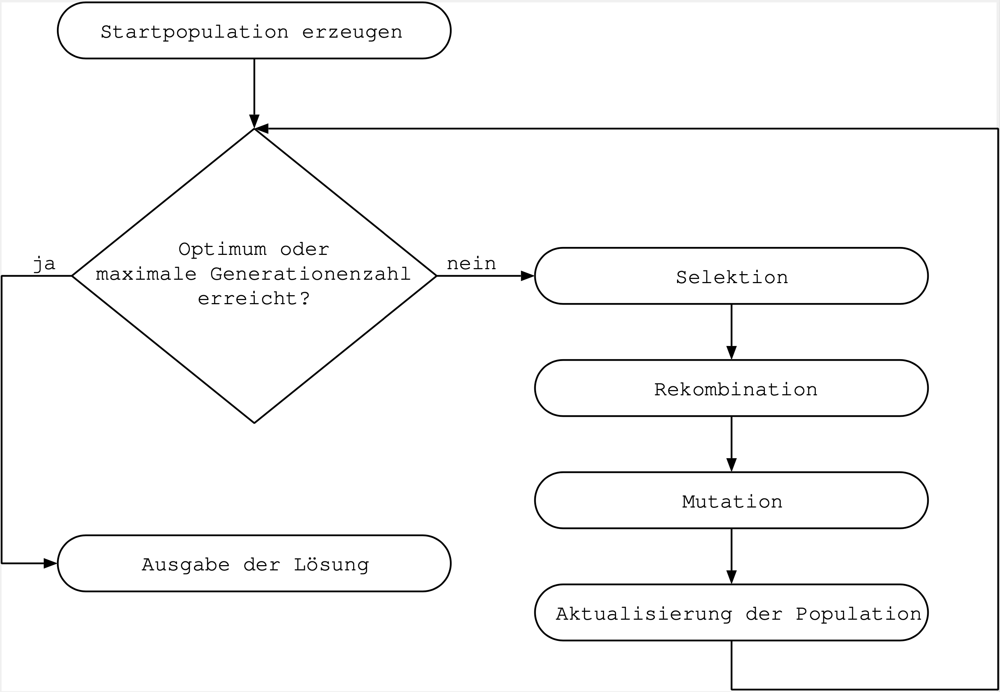
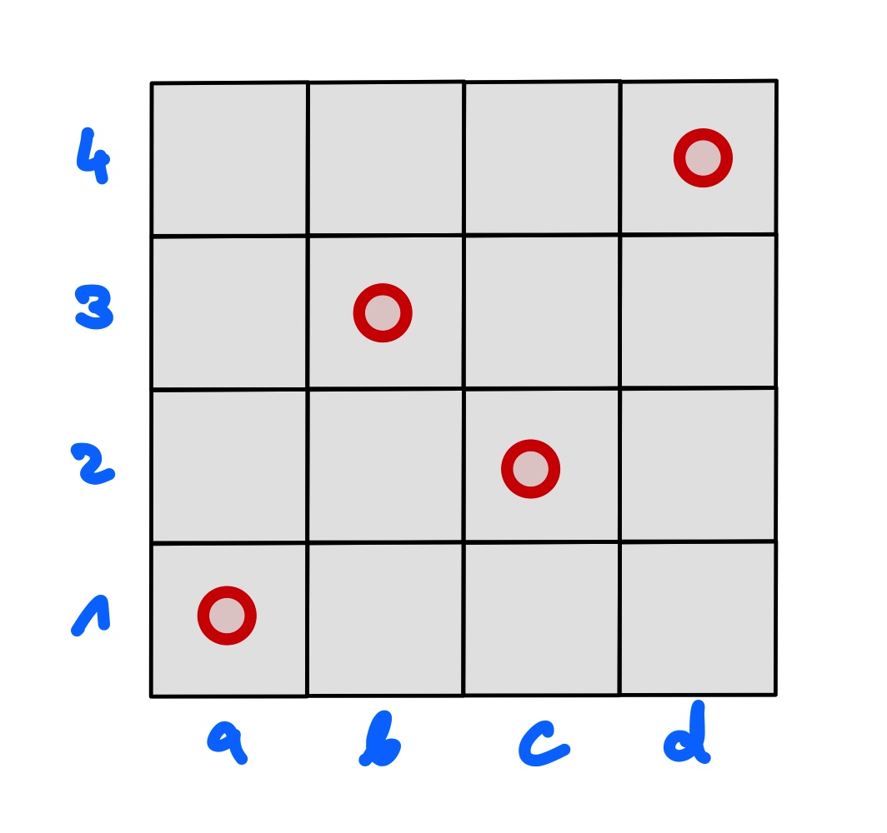

# EA: Einführung Evolutionäre Algorithmen

> [!IMPORTANT]
>
> 

>
> 
<strong>🎯 TL;DR</strong>

>
> Lokale Suchverfahren: Nur das Ergebnis zählt!
>
> Evolutionäre Algorithmen sind lokale Suchverfahren, wobei gleichzeitig
> an mehreren Stellen im Problemraum gesucht wird. Sie bedienen sich
> Mechanismen aus der Evolution: Es gibt eine Population von Individuen,
> die jedes das Problem kodieren (“vollständige Zustandsbeschreibung”)
> und damit im Laufe der Suche zu einer möglichen Lösung werden können.
>
> 

> [!TIP]
>
> 

>
> 
<strong>🎦 Videos</strong>

>
> - [VL Einführung Evolutionäre
>   Algorithmen](https://youtu.be/pKdKcPLI7V4)
>
> 

## Evolution sehr erfolgreich bei Anpassung

Quelle: [Photo Evolution](https://unsplash.com/photos/aWDgqexSxA0) by
[Johannes Plenio](https://unsplash.com/@jplenio) on Unsplash.com
([Unsplash License](https://unsplash.com/license))

**Wie funktioniert’s?**

## EA – Zutaten und Mechanismen

- Zutaten:
  - **Individuen**: Kodierung möglicher Lösungen
  - **Population** von Individuen
  - **Fitnessfunktion**: Bewertung der Angepasstheit

<!-- -->

- Mechanismen (“Operatoren”):
  - Selektion
  - Rekombination (Crossover)
  - Mutation

## EA – Allgemeiner Ablauf

## EA – Beispiel

Jedes Individuum kodiert ein Spielfeld mit einer konkreten Anordnung
**aller** Königinnen =\> **Vollständige Zustandsbeschreibung**.

Dabei korrespondiert der Index in das Array des Individuums mit der
jeweiligen Spalte des Spielfelds. Die Zahl an einer Arrayposition gibt
dann an, in welcher Zeile in dieser Spalte eine Königin ist.

Crossover: Die ausgewählten Individuen werden an der selben Stelle
aufgetrennt und die Hälften verkreuzt zu zwei neuen Individuen
zusammengesetzt. Es entstehen zwei neue Anordnungen der Königinnen (zwei
neue Spielfelder).

## EA – Strömungen

1.  **Genetische Algorithmen** (GA)
    - Holland und Goldberg (ab 1960)
    - Binäre Lösungsrepräsentation (Bitstring):
      $`\mathbf{g} = (g_1, \dots, g_m)\in \{ 0,1\}^m`$
    - Fitnessbasierte stochastische Selektion
    - $`\mu`$ Eltern erzeugen $`\mu`$ Kinder

<!-- -->

1.  **Evolutionsstrategien** (ES)
    - Rechenberg und Schwefel (ab 1960)
    - Kodierung reellwertiger Parameter:
      $`\mathbf{g} = (\mathbf{x}, \mathbf{\sigma})`$ mit
      $`\mathbf{x} = (x_1, \dots, x_n) \in \mathbb{R}^n`$
    - $`\mu`$ Eltern erzeugen $`\lambda`$ Kinder mit $`\mu \le \lambda`$

<!-- -->

1.  **Evolutionäre Programmierung** (EP)

*Hinweis*: Häufig finden sich Mischformen, beispielsweise GA mit
reellwertigen Parametern

*Hinweis*: Im Folgenden werden **Genetische Algorithmen** (GA)
betrachtet. Sie finden jeweils Hinweise auf die Gestaltung der
Operatoren bei ES.

## Anwendungsbeispiele für Evolutionäre Algorithmen

- Berechnung und Konstruktion komplexer Bauteile: beispielsweise
  Tragflächenprofile (Flugzeuge), Brücken oder Fahrzeugteile unter
  Berücksichtigung bestimmter Nebenbedingungen
- Scheduling-Probleme: Erstellung von Stunden- und Raumplänen oder
  Fahrplänen
- Berechnung verteilter Netzwerktopologien: Wasserversorgung,
  Stromversorgung, Mobilfunk
- Layout elektronischer Schaltkreise

## Wrap-Up

Lokale Suchverfahren: Nur das Ergebnis zählt!

- Evolutionäre Algorithmen: Unterschied GA und ES (grober Überblick)

## 📖 Zum Nachlesen

- Russell und Norvig ([2021](#ref-Russell2021)): GA: Abschnitt 4.1.4
- Schwefel ([1995](#ref-Schwefel1995)): Originalarbeit zu
  Evolutionsstrategien
- Michalewicz ([1996](#ref-Michalewicz1996))
- Bäck ([1996](#ref-Baeck1996))
- Nissen ([1997](#ref-Nissen1997))

> [!NOTE]
>
> 

>
> 
<strong>✅ Lernziele</strong>

>
> - k2: Ich kann die Problematik der lokalen Minima bei
>   Gradientenverfahren erklären
> - k2: Ich kann einen Überblick über die verschiedenen Strömungen bei
>   EA/GA darstellen
> - k2: Ich kann den prinzipiellen Ablauf von Genetischen Algorithmen an
>   einem Beispiel erklären
>
> 

------------------------------------------------------------------------

> [!NOTE]
>
> 

>
> 
<strong>👀 Quellen</strong>

>
> 
 entry-spacing="0">
>
> 

>
> Bäck, T. 1996. *Evolutionary Algorithms in Theory and Praxis*. Oxford
> University Press.
>
> 

>
> 

>
> Michalewicz, Z. 1996. *Genetic Algorithms + Data Structures =
> Evolution Programs*. Springer.
>
> 

>
> 

>
> Nissen, V. 1997. *Einführung in Evolutionäre Algorithmen*.
> Vieweg+Teubner Verlag.
>
> 

>
> 

>
> Russell, S., und P. Norvig. 2021. *Artificial Intelligence: A Modern
> Approach*. 4th Edition. Pearson. <http://aima.cs.berkeley.edu>.
>
> 

>
> 

>
> Schwefel, H. P. 1995. *Evolution and Optimum Seeking*. Wiley.
>
> 

>
> 

>
> 

------------------------------------------------------------------------

Unless otherwise noted, this work is licensed under CC BY-SA 4.0.

**Exceptions:**

- [Photo Evolution](https://unsplash.com/photos/aWDgqexSxA0) by
  [Johannes Plenio](https://unsplash.com/@jplenio) on Unsplash.com
  ([Unsplash License](https://unsplash.com/license))

<blockquote>
<strong>Last modified:</strong> f393f68 (lecture: fix publishing year of AIMA, 2025-09-27) 
</blockquote>
