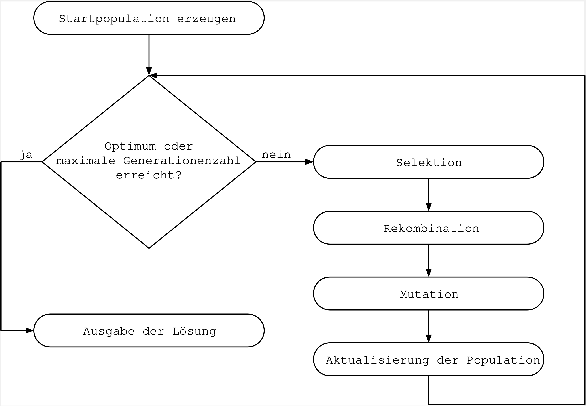
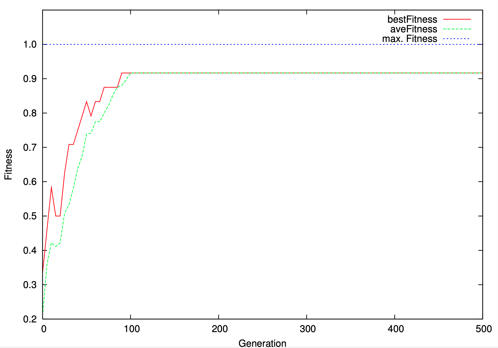
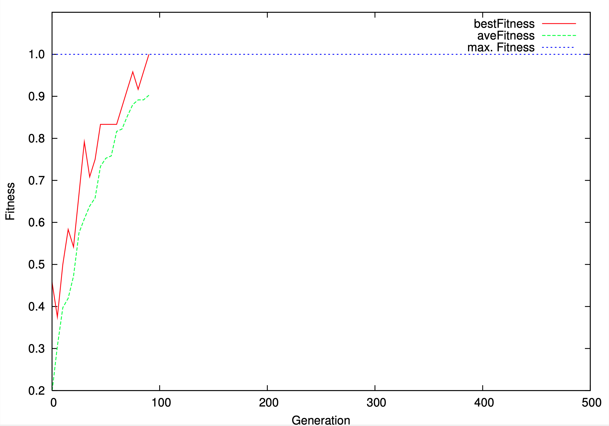

# Modellierung mit Genetischen Algorithmen

> [!NOTE]
>
> <details open>
>
> <summary><strong>🎯 TL;DR</strong></summary>
>
> Lokale Suchverfahren: Nur das Ergebnis zählt!
>
> Evolutionäre Algorithmen sind lokale Suchverfahren, wobei gleichzeitig
> an mehreren Stellen im Problemraum gesucht wird. Sie bedienen sich
> Mechanismen aus der Evolution: Es gibt eine Population von Individuen,
> die jedes das Problem kodieren (“vollständige Zustandsbeschreibung”)
> und damit im Laufe der Suche zu einer möglichen Lösung werden können.
>
> Die Individuen werden mit Hilfe einer Fitnessfunktion bewertet, wie
> gut sie bereits an das Problem angepasst sind (bzw. wie sehr sie
> bereits der gesuchten Lösung entsprechen). Über eine
> fitnessproportionale Selektion werden Individuen ausgewählt, aus denen
> mittels Rekombination (auch “Crossover” genannt) neue Individuen mit
> Eigenschaften der Eltern erzeugt werden. Über eine Mutation werden
> dann noch Elemente der neuen Individuen leicht verändert, bevor diese
> zur neuen Population werden …
>
> Durch das Anwenden von Rekombination und Mutation springt man im
> Problemraum umher. Auch wenn als Basis die fitteren (angepassteren)
> Individuen dienen, kann es wie bei allen lokalen Suchverfahren
> vorkommen, dass sich der Algorithmus in lokalen Minima (bzw. lokalen
> Maxima, je nach Richtung der Optimierung) festfrisst.
>
> </details>
>
> <details>
>
> <summary><strong>🎦 Videos</strong></summary>
>
> - [VL Modellierung mit EA/GA](https://youtu.be/Sd5AA6LIEOc)
>
> </details>

## EA – Allgemeiner Ablauf



## Kodierung Individuen

- Binäre Lösungsrepräsentation (Bitstring):
  $`\mathbf{g} = (g_1, \dots, g_m)\in \{ 0,1\}^m`$
  - String gliedert sich in $`n`$ Elemente (mit $`n \le m`$) =\> jedes
    Segment entspricht einer Problemvariablen
  - Dekodierungsfunktion $`\Gamma : \{0,1\}^m \to \mathbb{R}^n`$

  Alle relevanten Aspekte des Problems müssen in die Codierung
  einfließen!

  Bei ES hat man einen Vektor mit reellen Zahlen, wobei jeder Eintrag
  einen Parameter des Problems darstellt. Eine Dekodierungsfunktion
  benötigt man entsprechend nicht.

  Bei der Erzeugung der Startpopulation werden die Individuen
  **zufällig** (mit zufälligen Werten) initialisiert.

<!-- -->

- Fitnessfunktion $`\Phi`$ ordnet jedem Individuum $`\mathbf{g}_i`$ eine
  reelle Zahl zu:
  ``` math
  \Phi(\mathbf{g}_i) = F(\Gamma(\mathbf{g}_i)) - w\cdot\sum_j(Z_j(\Gamma(\mathbf{g}_i)))^2
  ```
  - Zielfunktion $`F`$: wie sehr genügt ein Individuum bereits dem
    Optimierungproblem
  - Strafterme $`Z_j`$: Anreicherung der Optimierung mit weiteren
    Informationen
  - Gewichte $`w`$: statisch oder dynamisch (Abkühlen)

  Die Wahl einer guten Fitnessfunktion ist oft eine Herausforderung,
  aber dennoch wichtig, da damit die Suche gesteuert wird!

## Selektion: Erstelle Matingpool mit $`\mu`$ Individuen

- Fitnessproportionale Selektion (*Roulette Wheel Selection*):
  Auswahlwahrscheinlichkeit für Individuum $`\mathbf{g}_k`$:
  ``` math
  p_{sel}(\mathbf{g}_k) = \frac{\Phi(\mathbf{g}_k)}{\sum_j \Phi(\mathbf{g}_j)}
  ```
  =\> Voraussetzung: positive Fitnesswerte

<!-- -->

- Turnier-Selektion (*Tournament Selection*):
  - Turniergröße $`\xi`$
  - Turnier: ziehe $`\xi`$ Individuen gleichverteilt (mit Zurücklegen!)
    und kopiere fittestes Individuum in den Matingpool
  - Führe $`\mu`$ Turniere durch

*Hinweis*: Es gibt noch viele weitere Selektionsmechanismen. Die
vorgestellten sind in der Praxis am gebräuchlichsten.

Über die Selektion wird der sogenannte “Selektionsdruck” aufgebaut: Wie
gut muss ein Individuum sein (im Vergleich zu den restlichen Individuen
in der Population), damit es eine Chance zur Reproduktion erhält? Dürfen
sich nur die “Guten” fortpflanzen, oder erhalten auch die “Schlechten”
eine gewisse Chance?

Da jedes Individuum einen Punkt im Suchraum darstellt, beeinflusst die
Wahl der Selektion die Geschwindigkeit der Suche, begünstigt u.U. aber
auch ein eventuelles Festfahren in lokalen Minima. Dies kann
beispielsweise geschehen, wenn immer nur die “Guten” selektiert werden,
aber die “Guten” der Population sich in der Nähe eines lokalen Minimums
befinden. Dann werden auch die Nachfolger sich wieder dort aufhalten.

## Crossover: Erzeuge zwei Nachkommen aus zwei Eltern

Festlegung der Crossover-Wahrscheinlichkeit $`p_{cross}`$ (typisch:
$`p_{cross} \ge 0.6`$)

1.  Selektiere Eltern $`\mathbf{g}_a`$ und $`\mathbf{g}_b`$
    **gleichverteilt** aus Matingpool

<!-- -->

2.  Zufallsexperiment:
    - mit $`1-p_{cross}`$: Kinder identisch zu Eltern (kein Crossover)
    - mit $`p_{cross}`$: Crossover mit $`\mathbf{g}_a`$ und
      $`\mathbf{g}_b`$
      - Ziehe $`i`$ gleichverteilt mit $`1 < i < m`$
      - Kinder aus $`\mathbf{g}_a`$ und $`\mathbf{g}_b`$ zusammenbauen:
        ``` math
        \mathbf{g}_c = (g_{a,1}, \dots, g_{a,i}, \; g_{b,{i+1}}, \dots, g_{b,m})
        ```
        und
        ``` math
        \mathbf{g}_d = (g_{b,1}, \dots, g_{b,i}, \; g_{a,{i+1}}, \dots, g_{a,m})
        ```

      =\> Trenne Eltern an gleicher Stelle auf, vertausche Bestandteile

<!-- -->

3.  Gehe zu Schritt 1, bis insg. $`\mu`$ Nachkommen

*Anmerkung*: Die Eltern werden jeweils in die Ausgangsmenge
zurückgelegt.

Mit einer kleinen Wahrscheinlichkeit sind die Kinder also identisch zu
den Eltern. Dies ist im Sinne der lokalen Suche wichtig, um bereits
erreichte gute Positionen im Suchraum nicht zu verlieren: Es könnte
sein, dass die Nachfolger alle schlechter sind …

Varianten: $`N`$-Punkt-Crossover, Shuffle-Crossover

Bei ES wird parameterweise gekreuzt. Dabei gibt es verschiedene
Möglichkeiten: Übernahme eines Parameters von einem Elternteil,
Verrechnen (beispielsweise Mitteln) der Werte beider Eltern, … Bei ES
heißt “Crossover” deshalb oft “Rekombination”.

## Mutation

- Mutationswahrscheinlichkeit $`p_{mut}`$ (typische Werte:
  $`p_{mut} = 0.01`$ oder $`p_{mut} = 0.001`$)

<!-- -->

- Für alle Individuen:
  - Mutiere jedes Gen eines Individuums mit $`p_{mut}`$:

    ``` math
    g_i^{(t+1)} = \left\{
    \begin{array}{ll}
        \neg g_i^{(t)} & \mbox{ falls } \chi_i \le p_{mut}\\[5pt]
        \phantom{\neg} g_i^{(t)} & \mbox{ sonst }
    \end{array}
    \right.
    ```

    =\>$`\chi_i`$ gleichverteilte Zufallsvariable (Intervall $`[0,1]`$),
    für jedes Bit $`g_i`$ neu bestimmen

*Anmerkung*: Die optimale Mutationsrate $`p_{mut}^*`$ ist von Länge
$`m`$ des Bitstrings abhängig; annäherbar durch
$`p_{mut}^* \approx 1/m`$.

Die beim Crossover erstellten Nachfolger liegen im Suchraum in der Nähe
der Eltern. Durch die Mutationsrate bestimmt man, ob und wie weit sich
ein Kind entfernen kann. Dies entspricht dem Bild des “Schüttelns” der
Zustandslandschaft.

Bei ES unterscheidet man Mutationswahrscheinlichkeit und Mutationsrate.
Es wird parameterweise mutiert.

## Bewertungskriterien

Vorsicht: Es handelt sich um Zufallsexperimente. Wenn man nicht nur
direkt nach einer Lösung sucht, sondern beispielsweise
Parametereinstellungen oder die Wahl der Fitnessfunktion für ein Problem
vergleichen will, muss man jeweils mehrere Experimente mit der selben
Einstellung machen und Kenngrößen berechnen.

**Geschwindigkeit: AES** *Average Evaluations to a Solution*
``` math
    \mbox{AES } = \frac{\sum\limits_{i \in \mbox{erfolgreiche Läufe}} \mbox{Generationen von Lauf } i}{\mbox{Anzahl der erfolgreichen Läufe}}
```

Die AES liegt im Intervall $`[0, maxGen]`$.

**Lösungswahrscheinlichkeit: SR** *Success Rate*
``` math
    \mbox{SR } = \frac{\mbox{Anzahl der erfolgreichen Läufe}}{\mbox{Anzahl aller Läufe}}
```

Die SR liegt im Intervall $`[0, 1]`$.

## Typische Läufe





- Populationsgröße $`\mu=15`$
- Anzahl Nachfahren $`\lambda=100`$
- Abbruch nach $`maxGen=200`$ Generationen

Stochastischer Algorithmus! Ausreichend Wiederholungen durchführen und
mitteln!

*Hinweis*: Die Parameter müssen problemabhängig gewählt werden. Zu hohe
Werte für $`\mu`$ und $`\lambda`$ führen dazu, dass man bei kleinen
Problemen mit hoher Wahrscheinlichkeit bereits am Anfang eine Lösung
“würfelt”, also gar kein GA nutzt. Wenn dies allerdings nicht passiert,
sorgt eine hohe Populationsgröße dafür, dass jeder Schritt sehr lange
dauert. Die Abbruchgrenze ist ebenfalls mit Augenmaß zu wählen: Ein zu
kleiner Wert sorgt für zu frühen Abbruch (keine Lösung!), ein zu hoher
Wert sorgt beim Festfressen des Algorithmus für eine unnötige weitere
“Suche” …

## Wrap-Up

Lokale Suchverfahren: Nur das Ergebnis zählt!

- Evolutionäre Algorithmen:
  - Begriffe: Individuum, Population, Kodierung
  - Operationen: Selektion, Rekombination, Mutation
  - Bewertung mit Fitnessfunktion

## 📖 Zum Nachlesen

- Russell und Norvig ([2020](#ref-Russell2020)): GA: Abschnitt 4.1.4
- Schwefel ([1995](#ref-Schwefel1995)): Originalarbeit zu
  Evolutionsstrategien
- Michalewicz ([1996](#ref-Michalewicz1996))
- Bäck ([1996](#ref-Baeck1996))
- Nissen ([1997](#ref-Nissen1997))

------------------------------------------------------------------------

> [!TIP]
>
> <details>
>
> <summary><strong>✅ Lernziele</strong></summary>
>
> - k3: GA: Kodierung, Fitnessfunktion, Ablauf, Operatoren, Auswertung
>
> </details>
>
> <details>
>
> <summary><strong>🧩 Quizzes</strong></summary>
>
> - [Selbsttest EA/GA
>   (ILIAS)](https://www.hsbi.de/elearning/goto.php?target=tst_1106580&client_id=FH-Bielefeld)
>
> </details>
>
> <details>
>
> <summary><strong>🏅 Challenges</strong></summary>
>
> **Sudoku**
>
> Ein $`9 \times 9`$-*Sudoku*-Rätsel soll mit einem GA gelöst werden.
>
> Geben Sie für dieses Problem jeweils eine geeignete **Kodierung** der
> Individuen, passende Operatoren (**Crossover**, **Mutation**) und eine
> geeignete **Fitnessfunktion** an, damit das Problem mit einem GA
> gelöst werden kann. Begründen Sie Ihre Wahl!
>
> Was würden Sie noch benötigen, um das Probleme mit Simulated Annealing
> lösen zu können?
>
> **Travelling Salesman Problem**
>
> Das *Travelling Salesman Problem* für 10 Städte, d.h. das Finden der
> kürzesten Route zwischen 10 Städten, soll mit einem GA gelöst werden.
>
> Geben Sie für dieses Problem jeweils eine geeignete **Kodierung** der
> Individuen, passende Operatoren (**Crossover**, **Mutation**) und eine
> geeignete **Fitnessfunktion** an, damit das Problem mit einem GA
> gelöst werden kann. Begründen Sie Ihre Wahl!
>
> Was würden Sie noch benötigen, um das Probleme mit Simulated Annealing
> lösen zu können?
>
> </details>

------------------------------------------------------------------------

> [!NOTE]
>
> <details>
>
> <summary><strong>👀 Quellen</strong></summary>
>
> <div id="refs" class="references csl-bib-body hanging-indent"
> entry-spacing="0">
>
> <div id="ref-Baeck1996" class="csl-entry">
>
> Bäck, T. 1996. *Evolutionary Algorithms in Theory and Praxis*. Oxford
> University Press.
>
> </div>
>
> <div id="ref-Michalewicz1996" class="csl-entry">
>
> Michalewicz, Z. 1996. *Genetic Algorithms + Data Structures =
> Evolution Programs*. Springer.
>
> </div>
>
> <div id="ref-Nissen1997" class="csl-entry">
>
> Nissen, V. 1997. *Einführung in Evolutionäre Algorithmen*.
> Vieweg+Teubner Verlag.
>
> </div>
>
> <div id="ref-Russell2020" class="csl-entry">
>
> Russell, S., und P. Norvig. 2020. *Artificial Intelligence: A Modern
> Approach*. 4th Edition. Pearson. <http://aima.cs.berkeley.edu>.
>
> </div>
>
> <div id="ref-Schwefel1995" class="csl-entry">
>
> Schwefel, H. P. 1995. *Evolution and Optimum Seeking*. Wiley.
>
> </div>
>
> </div>
>
> </details>

------------------------------------------------------------------------


Unless otherwise noted, this work is licensed under CC BY-SA 4.0.

<blockquote><p><sup><sub><strong>Last modified:</strong> 5f0b0a3 (Remove Hugo: tooling: shift headings (use h1 as top-level headings), 2025-07-17)<br></sub></sup></p></blockquote>
