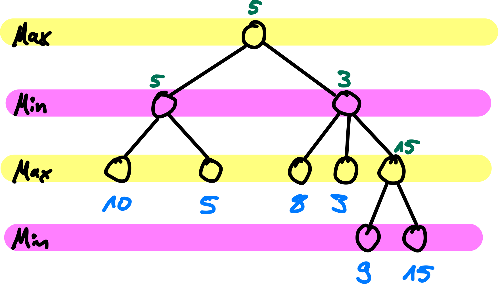

## Verbesserung Minimax-Algorithmus

::: slides
\bigskip
\bigskip
{width="80%"}
:::

::: notes
{width="40%"}
:::

\bigskip
=> **Minimax-Baum**: [Verbesserungen möglich?]{.alert}

[[Tafelbeispiel: Baum und Verbesserungen]{.bsp}]{.slides}


## Alpha-beta-Pruning

Minimax-Algorithmus mit zusätzlichen Informationen:

*   $\alpha$: bisher bester Wert für MAX (höchster Wert)
*   $\beta$: bisher bester Wert für MIN (kleinster Wert)

\bigskip
\smallskip
\pause

=> Beobachtungen:
1.  $\alpha$ für MAX-Knoten wird nie kleiner
2.  $\beta$ für MIN-Knoten wird nie größer

[[Tafelbeispiel: Beste Werte einzeichnen]{.bsp}]{.slides}


## Pruning-Regeln

1.  Schneide (unter) MIN-Knoten ab, deren $\beta$ $\le$ dem
    $\alpha$ des MAX-Vorgängers ist.

\smallskip

2.  Schneide (unter) MAX-Knoten ab, deren $\alpha$ $\ge$ dem
    $\beta$ des MIN-Vorgängers ist.

\bigskip
\bigskip

::: cbox
[Abbruch, wenn kein Platz mehr zwischen Alpha und Beta]{.alert}
:::


## Alpha-beta-Pruning -- Der Algorithmus (Skizze)

```python
def Max-Value(state, alpha, beta):
    if Terminal-Test(state): return Utility(state)

    v = -INF
    for (a, s) in Successors(state):
        v = MAX(v, Min-Value(s, alpha, beta))
        if (v >= beta): return v
        alpha = MAX(alpha, v)
    return v
```


::: notes
```python
def Min-Value(state, alpha, beta):
    if Terminal-Test(state): return Utility(state)

    v = +INF
    for (a, s) in Successors(state):
        v = MIN(v, Max-Value(s, alpha, beta))
        if (v <= alpha): return v
        beta = MIN(beta, v)
    return v
```
:::

\bigskip

Initialer Aufruf von `Max-Value()` mit $\alpha = -\infty$ und $\beta = +\infty$

::: notes
**Achtung**: Es kursieren Varianten von diesem Algorithmus, bei denen auf die
Hilfsvariable `v` verzichtet wird und stattdessen `alpha` bzw. `beta` direkt
modifiziert werden und als Rückgabewert dienen. Das *kann* zu anderen oder falschen
Ergebnissen führen! Sie können das in der Aufgabe auf Blatt 03 gut beobachten.
:::

[[Tafelbeispiel Handsimulation]{.bsp}]{.slides}


## Alpha-beta-Pruning -- Eigenschaften

1.  Pruning beeinflusst nicht das Endergebnis!

2.  Sortierung der Nachfolger spielt große Rolle

3.  Perfekte Sortierung: $O(b^{d/2})$ => Verdopplung der Suchtiefe möglich

\bigskip
Für Schach immer noch zu aufwändig ...


## Verbesserungen für Alpha-beta-Pruning

*   "Killer-Move": Maximale Effizienz nur wenn **optimaler Zug immer zuerst** [untersucht]{.notes} \newline
    => Zu untersuchende Züge **sortieren/priorisieren**, zb. Schach:
    a)  Figuren schlagen
    b)  Drohen
    c)  Vorwärts ziehen
    d)  Rückwärts ziehen

\smallskip

*   Verändern der Suchtiefe nach Spielsituation

\smallskip

*   Bewertungsfunktion `Eval`:
    *   Datenbanken mit Spielsituationen und Expertenbewertung:
        *   Eröffnungsspiele (besonders viele Verzweigungen)
        *   Endspiele
    *   Lernen der optimalen Gewichte für `Eval`-Funktion
    *   Berücksichtigung von Symmetrien


## Beispiel DeepBlue (IBM, 1997)

*   Alpha-beta-Pruning mit Tiefenbeschränkung: ca. 14 Halbzüge
*   Dynamische Tiefenbeschränkung (stellungsabhängig, max. ca. 40 Züge)
*   Heuristische Stellungsbewertung `Eval`:
    *   mehr als 8.000 Features
    *   ca. 4.000 Eröffnungsstellungen
    *   ca. 700.000 Spielsituationen (von Experten bewertet)
    *   Endspiel-Datenbank: alle Spiele mit 5 Steinen, viele mit 6 Steinen

[Quelle: [@Russell2014, p. 185]]{.origin}


## Beispiel AlphaGo (Google, 2016)

*   Beschränkung der Suchtiefe: Bewertung der Stellung durch *"Value Network"*
*   Beschränkung der Verzweigungsbreite: Bestimmung von Zugkandidaten durch
    *"Policy Network"*

\smallskip

*   Training dieser *"Deep Neural Networks"*:
    *   Überwachtes Lernen: "Analyse" von Spiel-Datenbanken
    *   Reinforcement-Lernen: Self-Play, Bewertung am Ende
        *   Züge mit Monte-Carlo-Baumsuche ausgewählt

[Quelle: [@Silver2016], siehe auch [deepmind.com/research/alphago/](https://deepmind.com/research/case-studies/alphago-the-story-so-far)]{.origin}


## Wrap-Up

*   Alpha-beta-Pruning:
    *   Mitführen der bisher besten Werte für MAX und MIN: $\alpha$ und $\beta$
    *   Abschneiden von Pfaden, die Verschlechterung bewirken würden
    *   Endergebnis bleibt erhalten
    *   Effizienzsteigerung abhängig von Sortierung der Nachfolger

\smallskip

*   Viele Verbesserungen denkbar:
    *   Zu untersuchende Züge "richtig" sortieren (Heuristik)
    *   Suchtiefe begrenzen und Bewertungsfunktion (statt Nutzenfunktion)
    *   Positionen mit Datenbank abgleichen


<!-- DO NOT REMOVE - THIS IS A LAST SLIDE TO INDICATE THE LICENSE AND POSSIBLE EXCEPTIONS (IMAGES, ...). -->
::: slides
## LICENSE


Unless otherwise noted, this work is licensed under CC BY-SA 4.0.
:::
