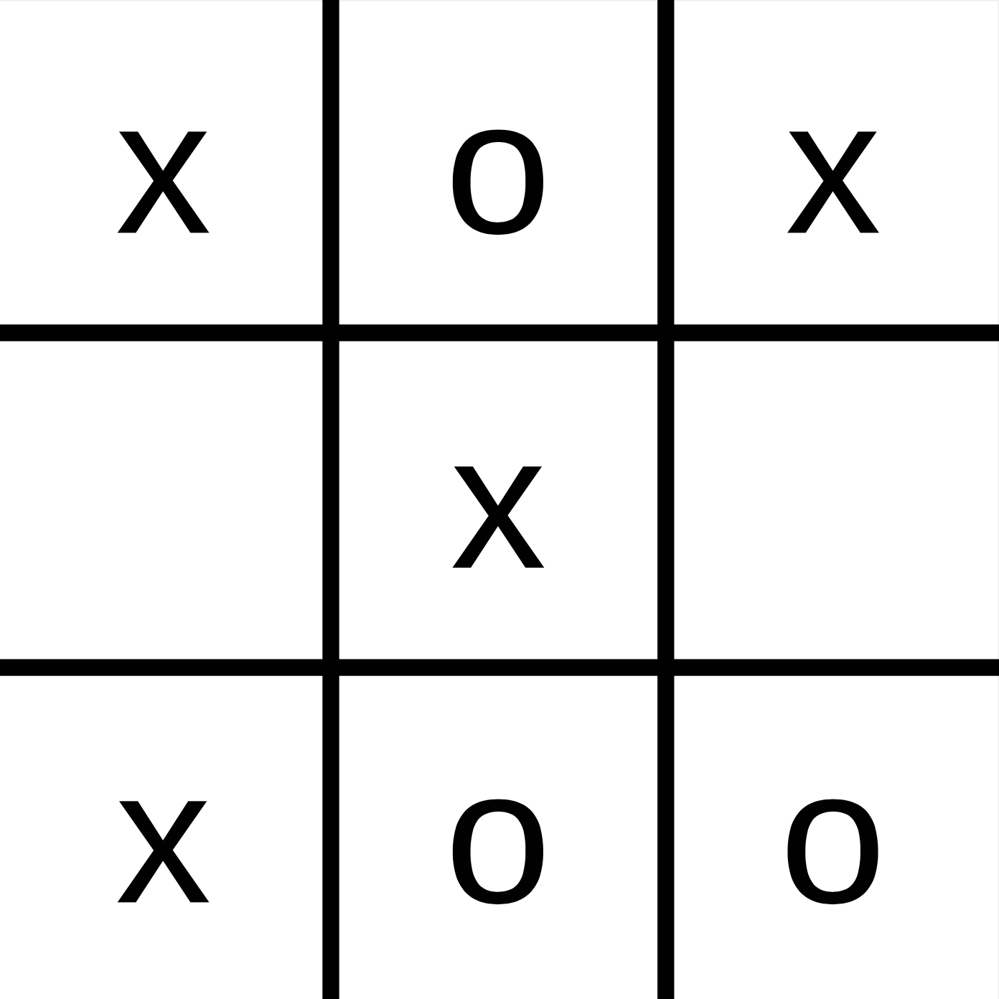

::: tldr
Spiele können als Suchproblem betrachtet werden. Dabei sind in der Regel mehrere
Spieler ("Agenten") beteiligt. Bei manchen Spielen ist die Umgebung (der
Spielzustand) vollständig einsehbar, bei anderen nur teilweise (Kartenspiele). Bei
manchen Spielen kommt eine Zufallskomponente zum Wirken.

Spiele sind in der KI deshalb so interessant, weil bei der Suche riesige Suchbäume
entstehen (bzw. durchsucht werden müssten). Da die Ressourcen normalerweise begrenzt
sind (denken Sie an die Reaktionszeit auf einen Zug des Gegners), muss man hier
intelligente Lösungen finden. (Einige davon werden wir in den folgenden Sitzungen
anschauen).
:::

::: youtube
-   [VL Einführung Optimale Spiele](https://youtu.be/wVYhbgtzxhs)
:::

# Backgammon: Zwei Spieler, was ist der beste Zug?

{width="60%"}

[[Backgammon lg.png](https://commons.wikimedia.org/wiki/File:Backgammon_lg.png)
by [Ptkfgs](https://commons.wikimedia.org/wiki/User:Ptkfgs) on Wikimedia Commons
([Public Domain](https://en.wikipedia.org/wiki/en:public_domain))]{.credits}

::: notes
Zwei Spieler, ein Spielstand und ein Würfelergebnis: **Was ist jetzt der beste
Zug?!**
:::

# Motivation: Unterschied zu Suche?!

{width="30%" web_width="10%"}

\pause
\bigskip

=\> Mehrere **konkurrierende** Agenten an Suche beteiligt!

=\> (Re-) Aktion des Gegners unbekannt/nicht vorhersehbar.

# Spiele und Umgebungen

|                      | Deterministisch   | Zufallskomponente        |
|:---------------------|:------------------|:-------------------------|
| Voll beobachtbar     | Schach, Go, ...   | Backgammon, Monopoly     |
| Partiell beobachtbar | Schiffe-versenken | Bridge, Poker, Skat, ... |

\bigskip

=\> Bis auf Roboterfußball in KI traditionell keine physischen Spiele!

# Brettspiele sind interessant für KI

-   Brettspiele gut abstrakt darstellbar:
    -   Zustände einfach repräsentierbar
    -   Aktionen wohldefiniert (und i.d.R. sehr einfach)
    -   Realisierung als Suchproblem möglich

\bigskip

-   **Problem**: Suchbäume werden in Praxis riesig

    Beispiel **Schach**:

    -   Im Mittel 35 Aktionen (*branching factor*) von jeder Position
    -   Oft mehr als 40 Züge pro Spieler =\> Suchbäume mit mehr als 80 Ebenen
    -   $35^{80} \approx 10^{123}$ mögliche Knoten!
    -   (Aber "nur" rund $10^{40}$ *verschiedene* Zustände)

    [[@Russell2021, pp. 193-196]]{.credits nolist=true}

# Eigenschaften guter Spielalgorithmen

-   Zeit begrenzt
    -   Irgendeine gute Entscheidung treffen! =\> Bewertungsfunktion [(auch für
        Zwischenzustände)]{.notes}

\smallskip

-   Speicher begrenzt
    -   Evaluierungsfunktion für Zwischenzustände
    -   Löschen von irrelevanten Zweigen

\smallskip

-   Strategien nötig
    -   Vorausschauend spielen (Züge "vorhersehen")

# Wrap-Up

-   Spiele kann man als Suchproblem betrachten
-   Merkmale:
    -   Mehrere Agenten beteiligt
    -   Beobachtbarkeit der Umgebung
    -   Zufallskomponente
    -   Spielstrategie
-   Problem: Riesige Spielbäume
-   Umgang mit begrenzten Ressourcen (Zeit, Speicher)

::: readings
-   @Russell2021: Einführung Spiele: Abschnitt 6.1
-   @Ertel2025
:::

::: outcomes
-   k2: Ich kann Spiele als Suchproblem formulieren
-   k2: Ich kann Eigenschaften guter Spielalgorithmen erklären
:::
