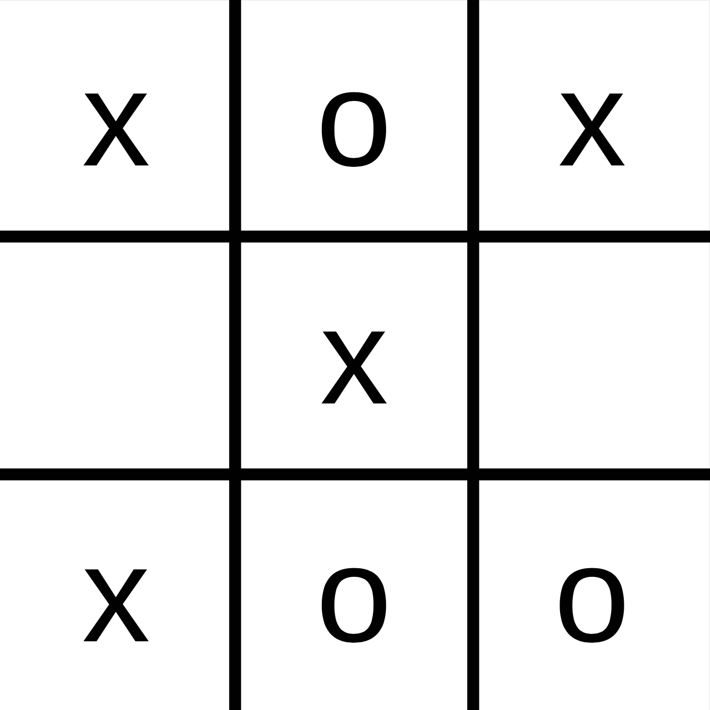

# Einführung Optimale Spiele

> [!NOTE]
> 

> 
<strong>🎯 TL;DR</strong>

>
> Spiele können als Suchproblem betrachtet werden. Dabei sind in der
> Regel mehrere Spieler ("Agenten") beteiligt. Bei manchen Spielen ist
> die Umgebung (der Spielzustand) vollständig einsehbar, bei anderen nur
> teilweise (Kartenspiele). Bei manchen Spielen kommt eine
> Zufallskomponente zum Wirken.
>
> Spiele sind in der KI deshalb so interessant, weil bei der Suche
> riesige Suchbäume entstehen (bzw. durchsucht werden müssten). Da die
> Ressourcen normalerweise begrenzt sind (denken Sie an die
> Reaktionszeit auf einen Zug des Gegners), muss man hier intelligente
> Lösungen finden. (Einige davon werden wir in den folgenden Sitzungen
> anschauen).
>
> 

> 

> 
<strong>🎦 Videos</strong>

>
> - [VL Einführung Optimale Spiele](https://youtu.be/wVYhbgtzxhs)
>
> 

## Backgammon: Zwei Spieler, was ist der beste Zug?

Quelle: ["position-backgammon-decembre"](https://www.flickr.com/photos/83436399@N04/11267311625)
by [serialgamer_fr](https://www.flickr.com/photos/83436399@N04) on
Flickr.com ([CC BY
2.0](https://creativecommons.org/licenses/by/2.0/?ref=ccsearch&atype=rich))

Zwei Spieler, ein Spielstand und ein Würfelergebnis: **Was ist jetzt der
beste Zug?!**

## Motivation: Unterschied zu Suche?!

=\> Mehrere **konkurrierende** Agenten an Suche beteiligt!

=\> (Re-) Aktion des Gegners unbekannt/nicht vorhersehbar.

## Spiele und Umgebungen

|                      | Deterministisch   | Zufallskomponente        |
|:---------------------|:------------------|:-------------------------|
| Voll beobachtbar     | Schach, Go, ...   | Backgammon, Monopoly     |
| Partiell beobachtbar | Schiffe-versenken | Bridge, Poker, Skat, ... |

=\> Bis auf Roboterfußball in KI traditionell keine physischen Spiele!

## Brettspiele sind interessant für KI

- Brettspiele gut abstrakt darstellbar:
  - Zustände einfach repräsentierbar
  - Aktionen wohldefiniert (und i.d.R. sehr einfach)
  - Realisierung als Suchproblem möglich

<!-- -->

- **Problem**: Suchbäume werden in Praxis riesig

  Beispiel **Schach**:

  - Im Mittel 35 Aktionen (*branching factor*) von jeder Position
  - Oft mehr als 40 Züge pro Spieler =\> Suchbäume mit mehr als 80
    Ebenen
  - $35^{80} \approx 10^{123}$ mögliche Knoten!
  - (Aber "nur" rund $10^{40}$ *verschiedene* Zustände)

  Quelle: ([Russell und Norvig 2020](#ref-Russell2020), pp. 193-196)

## Eigenschaften guter Spielalgorithmen

- Zeit begrenzt
  - Irgendeine gute Entscheidung treffen! =\> Bewertungsfunktion (auch
    für Zwischenzustände)

<!-- -->

- Speicher begrenzt
  - Evaluierungsfunktion für Zwischenzustände
  - Löschen von irrelevanten Zweigen

<!-- -->

- Strategien nötig
  - Vorausschauend spielen (Züge "vorhersehen")

## Wrap-Up

- Spiele kann man als Suchproblem betrachten
- Merkmale:
  - Mehrere Agenten beteiligt
  - Beobachtbarkeit der Umgebung
  - Zufallskomponente
  - Spielstrategie
- Problem: Riesige Spielbäume
- Umgang mit begrenzten Ressourcen (Zeit, Speicher)

## 📖 Zum Nachlesen

- Russell und Norvig ([2020](#ref-Russell2020)): Einführung Spiele:
  Abschnitt 6.1
- Ertel ([2017](#ref-Ertel2017))

------------------------------------------------------------------------

> [!TIP]
> 

> 
<strong>✅ Lernziele</strong>

>
> - k2: Spiele als Suchproblem
> - k2: Eigenschaften guter Spielalgorithmen
>
> 

------------------------------------------------------------------------

> [!NOTE]
> 

> 
<strong>👀 Quellen</strong>

>
> 
 entry-spacing="0">
>
> 

>
> Ertel, W. 2017. *Introduction to Artificial Intelligence*. 2nd
> edition. Springer. <https://doi.org/10.1007/978-3-319-58487-4>.
>
> 

>
> 

>
> Russell, S., und P. Norvig. 2020. *Artificial Intelligence: A Modern
> Approach*. 4th Edition. Pearson. <http://aima.cs.berkeley.edu>.
>
> 

>
> 

>
> 

------------------------------------------------------------------------

Unless otherwise noted, this work is licensed under CC BY-SA 4.0.

**Exceptions:**

- ["position-backgammon-decembre"](https://www.flickr.com/photos/83436399@N04/11267311625)
  by [serialgamer_fr](https://www.flickr.com/photos/83436399@N04) on
  Flickr.com ([CC BY
  2.0](https://creativecommons.org/licenses/by/2.0/?ref=ccsearch&atype=rich))
- ([Russell und Norvig 2020](#ref-Russell2020), pp. 193-196)

<blockquote>
<strong>Last modified:</strong> bd09fc4 (lecture: backgammon image is gone, 2025-07-24) 
</blockquote>
