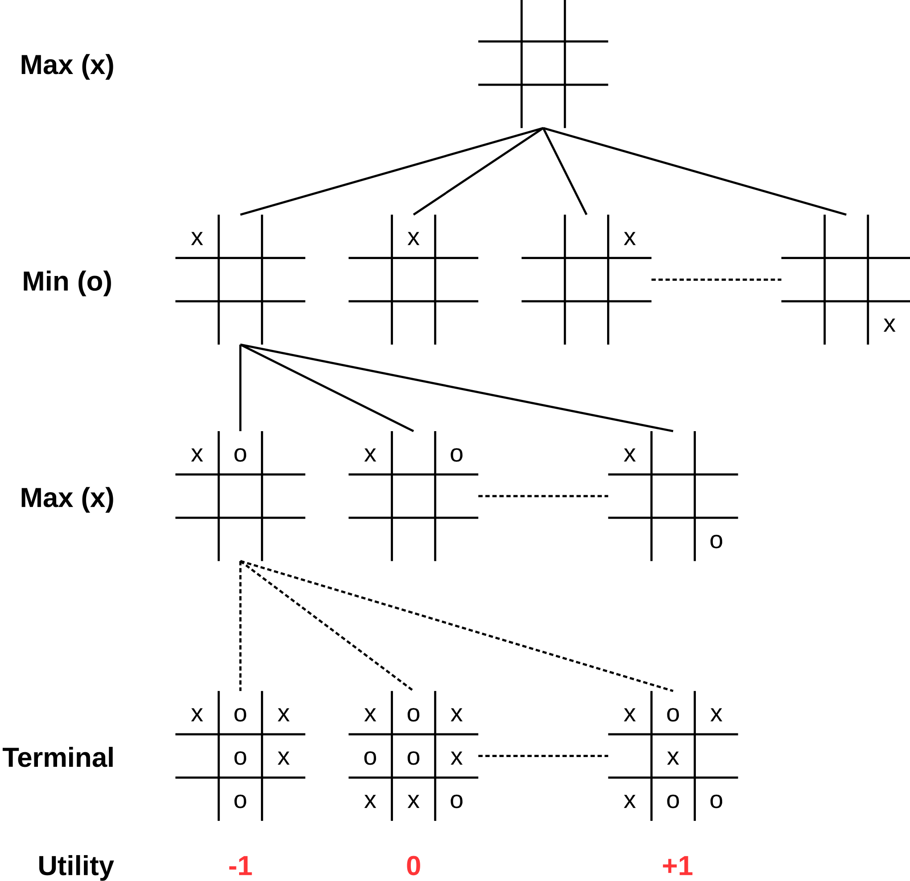

::: tldr
Mit dem Minimax-Algorithmus können optimale Züge berechnet werden. Dabei wird von
zwei Spielern `Max` und `Min` ausgegangen, die abwechselnd ziehen und beide optimal
spielen. Wenn `Max` gewonnen hat, wird der Spielausgang mit +1 bewertet, wenn `Min`
gewonnen hat mit -1, und mit 0 sonst. Damit hat man ein sogenanntes
"Nullsummenspiel" (der Gewinn des einen Spielers ist der Verlust des anderen) und
kann den Algorithmus so gestalten, dass `Max` stets den Zug wählt, der das
Spielergebnis maximiert und `Min` entsprechend den Zug wählt, der das Spielergebnis
minimiert (daher auch die Namen der Spieler).

Minimax baut den gesamten Spielbaum bis zu den Blättern auf. Die Blätter
(Spielausgang) werden mit einer `Utility`-Funktion bewertet, und diese Bewertung
wird dann im Spielbaum nach oben gereicht.
:::

::: youtube
-   [VL Minimax](https://youtu.be/)
:::

# Spiele als Suchproblem: Minimax

::: notes
## Terminologie

-   Zwei abwechselnd spielende Spieler: `MAX` und `MIN`, wobei `MAX` beginnt

    -   Beide Spieler spielen in jedem Zug optimal
    -   Spielergebnis wird aus Sicht von `MAX` bewertet:
        -   $+1$, wenn Spieler `MAX` gewinnt
        -   $-1$, wenn Spieler `MIN` gewinnt
        -   $0$, wenn unentschieden
    -   Spieler `MAX` versucht, das Spielergebnis zu **maximieren**
    -   Spieler `MIN` versucht, das Spielergebnis zu **minimieren**

-   Startzustand: Initialer Zustand des Spielbrettes

-   Aktionen: Legale Züge, abhängig vom Spielzustand

-   Zieltest: Ist das Spiel vorbei?

    =\> Startzustand und anwendbare Aktionen definieren den Zustandsraum.

-   Nutzenfunktion: $\mathop{\text{UTILITY}}(s,p)$: Wert des Spiels für Spieler $p$
    im Spielzustand $s$

-   Strategie: Spieler benötigen **Strategie**, um zu gewünschtem Endzustand zu
    kommen *(unabhängig von den Entscheidungen des Gegenspielers)* =\> einfacher
    Pfad von Start zu Ziel reicht nicht

*Hinweis*: Nullsummenspiel! (Der Gewinn des einen Spielers ist der Verlust des
anderen Spielers.)

Eine mit dem Minimax-Algorithmus berechnete Strategie wird auch *Minimax-Strategie*
genannt. Sie sichert dem betreffenden Spieler den höchstmöglichen Gewinn, der
**unabhängig** von der Spielweise des Gegners erreichbar ist.

Bei Nicht-Nullsummenspielen, bei denen die Niederlage des Gegners nicht zwangsläufig
mit dem eigenen Gewinn zusammenfällt (d.h. Gewinn des einen Spielers $\ne$ Verlust
des anderen Spielers), liefert der Minimax-Algorithmus nicht unbedingt eine optimale
Strategie.

## Spielbaum TTT
:::

{width="50%"}

::: notes
## Minimax (Idee)

1)  Erzeuge kompletten Suchbaum mit Tiefensuche
2)  Wende Nutzenfunktion (*Utility*) auf jeden Endzustand an
3)  Ausgehend von Endzuständen =\> Bewerte Vorgängerknoten:
    -   Knoten ist `Min`-Knoten: `\newline`{=tex} Nutzen ist das **Minimum** der
        Kindknoten
    -   Knoten ist `Max`-Knoten: `\newline`{=tex} Nutzen ist das **Maximum** der
        Kindknoten
4)  Startknoten: `Max` wählt den Zug, der zum Nachfolger mit der höchsten Bewertung
    führt

*Annahme*: Beide spielen perfekt. Fehler verbessern das Resultat für den Gegner.
:::

# Minimax-Algorithmus: Funktionen für MAX- und MIN-Knoten

``` python
def Max-Value(state):
    if Terminal-Test(state): return Utility(state)

    v = -INF
    for (a, s) in Successors(state):
        v = MAX(v, Min-Value(s))
    return v
```

\bigskip

``` python
def Min-Value(state):
    if Terminal-Test(state): return Utility(state)

    v = +INF
    for (a, s) in Successors(state):
        v = MIN(v, Max-Value(s))
    return v
```

::: notes
**Hinweis I**: Auf
[wikipedia.org/wiki/Minimax](https://en.wikipedia.org/wiki/Minimax#Pseudocode)
finden Sie eine Variante mit einem zusätzlichen Tiefenparameter, um bei einer
bestimmten Suchtiefe abbrechen zu können. Dies ist bereits eine erweiterte Version,
wo man beim Abbruch durch das Erreichen der Suchtiefe statt `Utility()` eine
`Eval()`-Funktion braucht (vgl. [Minimax: Heuristiken](games3-heuristics.md)).

Wenn man ohne Suchtiefenbeschränkung arbeiten will, braucht man diesen Parameter
nicht! Der Algorithmus terminiert auch ohne Suchtiefenbeschränkung!

**Hinweis II**: Im [@Russell2021, S. 196, Abb. 6.3] findet sich eine Variante, die
die auf der nächsten Folien gezeigte Startfunktion mit den hier gezeigten
`Min-Value()`- und `Max-Value()`-Funktionen verschmilzt. Dabei wird in den beiden
Hilfsfunktionen nicht nur der `min`- bzw. `max`-Wert optimiert, sondern auch der
jeweils beste Zug gespeichert und als Rückgabe zurückgeliefert.
:::

# Minimax-Algorithmus: Sonderbehandlung Startknoten

``` python
def Minimax(state):
    (val, action) = (-INF, null)
    for (a, s) in Successors(state):
        v = Min-Value(s)
        if (val <= v):
            (val, action) = (v, a)
    return action
```

::: notes
-   Startknoten ist ein MAX-Knoten
-   Nicht nur Kosten, sondern auch die zugehörige Aktion speichern
:::

# Minimax Beispiel

\bigskip
\bigskip

{width="90%" web_width="35%"}

[[Tafelbeispiel Handsimulation]{.ex}]{.slides}

::: notes
## Aufwand Minimax

-   maximale Tiefe des Spielbaums: $m$
-   in jedem Zustand $b$ gültige Züge
-   =\> Zeitkomplexität $O(b^m)$

\bigskip

Gedankenexperiment:

-   erster Zug: $b$ Möglichkeiten,
-   zweiter Zug: jeweils wieder $b$ Möglichkeiten $\rightarrow$ $b \star b = b^2$,
-   dritter Zug: jeweils wieder $b$ Möglichkeiten $\rightarrow$
    $b \star (b \star b) = b^3$,
-   ...,
-   $m$. Zug: jeweils wieder $b$ Möglichkeiten $\rightarrow$ $b^m$
:::

# Wrap-Up

-   Minimax: Entwickelt Spielbaum, bewertet Zustände entsprechend `Max` und `Min`
    -   Gewinn von `Max`: +1, Gewinn von `Min`: -1
    -   `Max` wählt das Maximum der möglichen Züge von `Min`
    -   `Min` wählt das Minimum der möglichen Züge von `Max`
    -   Spielbaum wird bis zu den Blättern entwickelt, Bewertung mit `Utility`

::: readings
-   @Russell2021: Minimax: Abschnitt 6.2
-   @Ertel2025
:::

::: outcomes
-   k3: Ich kann den Minimax-Algorithmus auf ein Beispiel anwenden
:::

::: quizzes
-   [Selbsttest Minimax
    (ILIAS)](https://www.hsbi.de/elearning/goto.php?target=tst_1106582&client_id=FH-Bielefeld)
:::

::: challenges
**Optimale Spiele und MiniMax**

Auf einem Tisch liegen nebeneinander 5 Streichhölzer. Es gibt zwei Spieler - Weiß
und Schwarz - die abwechselnd ein oder zwei Streichhölzer wegnehmen dürfen (es muss
mind. ein Streichholz genommen werden). Wer das letzte Streichholz nehmen muss, hat
verloren. Zu Beginn ist Weiß am Zug.

1.  Spielbaum

    Zeichnen Sie den **kompletten** Spielbaum auf. Geben Sie an den Kanten jeweils
    die Zahl der genommenen und der verbleibenden Hölzer an.

    *Beispiel*: Wenn in einem Zug ein Holz genommen wird und 3 Hölzer verbleiben,
    steht an der entsprechenden Kante "1/3". Geben Sie jeweils an, welcher Spieler
    am Zug ist.

2.  Minimax

    Geben Sie die Bewertung aller Spielzustände mit Hilfe des Minimax-Algorithmus
    an. Bewerten Sie die Endzustände mit +1, wenn Spieler Weiß gewonnen hat, mit
    -1, falls Schwarz gewonnen hat.

3.  Optimaler Zug

    Mit welchem Zug muss Weiß beginnen, um das Spiel garantiert zu gewinnen (beide
    Spieler verhalten sich stets optimal)? Argumentieren Sie mit der
    Minimax-Bewertung.
:::
