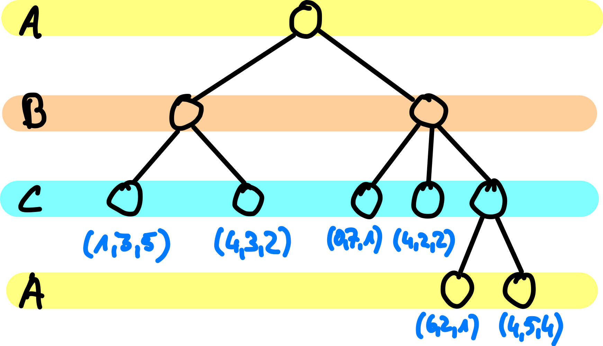
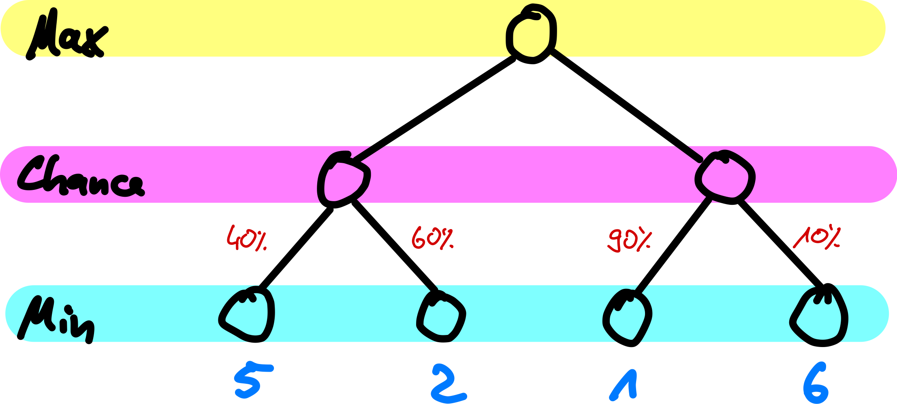

# Heuristiken

> [!IMPORTANT]
>
> <details open>
>
> <summary><strong>🎯 TL;DR</strong></summary>
>
> Minimax entwickelt den gesamten Spielbaum. Wenn nicht genug Zeit dafür
> zur Verfügung steht, kann man die Suchtiefe begrenzen. Für die
> Bewertung der Zustände benötigt man eine `Eval`-Funktion, die die
> Knoten in der selben Reihenfolge sortieren sollte wie es in der
> vollständigen Version über die `Utility`-Funktion geschieht. Die
> `Eval`-Funktion sollte zudem schnell zu berechnen sein. Typische
> Varianten für die `Eval`-Funktion sind gewichtete Features oder ein
> Nachschlagen in Spieldatenbanken (Spielzustand plus Bewertung).
>
> Minimax kann auf Spiele mit mehr als zwei Spielern erweitert werden.
> Dabei versucht dann jeder Spieler für sich, das Ergebnis des Spiels
> (aus seiner Sicht) zu maximieren.
>
> Bei Spielen mit Zufall (Würfelereignisse) kann man jedem
> Würfelereignis eine Wahrscheinlichkeit zuordnen und damit den jeweils
> erreichbaren `Max`- oder `Min`-Wert gewichten. Die Summe dieser
> gewichteten Bewertungen ist die Bewertung des entsprechenden
> “Chance”-Knotens, der dann in der darüberliegenden Ebene nach dem
> Minimax-Prinzip ausgewertet wird (=\> *Expectimax*).
>
> </details>

> [!TIP]
>
> <details>
>
> <summary><strong>🎦 Videos</strong></summary>
>
> - [VL Heuristiken](https://youtu.be/rKqNqYBXuK8)
>
> </details>

## Wenn die Zeit nicht reicht: Suchtiefe begrenzen

- Einführung neuer Funktionen:
  1.  `Cutoff-Test` statt `Terminal-Test`

      Beispielsweise bei erreichter Tiefe oder Zeitüberschreitung

  <!-- -->

  1.  `Eval` statt `Utility`

      Bewertung der erreichten Position (statt nur Bewertung des
      Endzustandes)

<!-- -->

- Bedingungen an `Eval`:
  1.  Endknoten in selber Reihenfolge wie bei `Utility`
  2.  Schnell zu berechnen (!)

## Beispiel Schach

- Mögliche Evaluierungskriterien:
  - Materialwert: Bauer 1, Läufer/Springer 3, Turm 5, Dame 9
  - Stellungsbewertung: Sicherheit des Königs, Stellung der Bauern
  - Daumenregeln: 3 Punkte Vorteil =\> sicherer Sieg

<!-- -->

- Nutzung gewichteter Features $`f_i`$:
  $`\mathop{\text{Eval}}(s) = w_1f_1(s) + w_2f_2(s) + \ldots`$

  - Beispiel: $`w_1 = 9`$ und $`f_1(s)`$ = (# weiße Königinnen) - (#
    schwarze Königinnen)

<!-- -->

- **Alternativ**: Speicherung von Positionen plus Bewertung in
  Datenbanken =\> Lookup mit $`\mathop{\text{Eval}}(s)`$ (statt
  Berechnung zur Laufzeit)

## Minimax mit mehreren Spielern



Hier maximiert jeder Spieler sein eigenes Ergebnis. Im Grunde müsste
diese Variante dann besser “Maximax” heissen …

Wenn es an einer Stelle im Suchbaum mehrere gleich gute (beste) Züge
geben sollte, kann der Spieler Allianzen bilden: Er könnte dann einen
Zug auswählen, der für einen der Mitspieler günstiger ist.

## Zufallsspiele

Quelle: [“position-backgammon-decembre”](https://www.flickr.com/photos/83436399@N04/11267311625)
by [serialgamer_fr](https://www.flickr.com/photos/83436399@N04) on
Flickr.com ([CC BY
2.0](https://creativecommons.org/licenses/by/2.0/?ref=ccsearch&atype=rich))

Backgammon: Was ist in dieser Situation der optimale Zug?

## Minimax mit Zufallsspielen: ZUFALLS-Knoten



Zusätzlich zu den MIN- und MAX-Knoten führt man noch Zufalls-Knoten ein,
um das Würfelergebnis repräsentieren zu können. Je möglichem
Würfelergebnis $`i`$ gibt es einen Ausgang, an dem die
Wahrscheinlichkeit $`P(i)`$ dieses Ausgangs annotiert wird.

=\> Für Zufallsknoten **erwarteten** Minimax-Wert (*Expectimax*) nutzen

## Minimax mit Zufall: Expectimax

Expectimax-Wert für Zufallsknoten $`C`$:

``` math
    \mathop{\text{Expectimax}}(C) = \sum_i P(i) \mathop{\text{Expectimax}}(s_i)
```

- $`i`$ mögliches Würfelergebnis
- $`P(i)`$ Wahrscheinlichkeit für Würfelergebnis
- $`s_i`$ Nachfolgezustand von $`C`$ gegeben Würfelergebnis $`i`$

Für die normalen Min- und Max-Knoten liefert `Expectimax()` die üblichen
Aufrufe von `Min-Value()` bwz. `Max-Value()`.

Auf
[wikipedia.org/wiki/Expectiminimax](https://en.wikipedia.org/wiki/Expectiminimax)
finden Sie eine Variante mit einem zusätzlichen Tiefenparameter, um bei
einer bestimmten Suchtiefe abbrechen zu können. Dies ist bereits eine
erweiterte Version, wo man beim Abbruch durch das Erreichen der
Suchtiefe statt `Utility()` eine `Eval()`-Funktion braucht. Zusätzlich
kombiniert der dort gezeigte Algorithmus die Funktionen `Expectimax()`,
`Min-Value()` und `Max-Value()` in eine einzige Funktion.

Eine ähnliche geschlossene Darstellung finden Sie im ([Russell und
Norvig 2020, 212](#ref-Russell2020)).

**Hinweis**: Üblicherweise sind die Nachfolger der Zufallsknoten gleich
wahrscheinlich. Dann kann man einfach mit dem Mittelwert der Bewertung
der Nachfolger arbeiten.

## Wrap-Up

- Minimax:
  - Kriterien zur Begrenzung der Suchtiefe, Bewertung `Eval` statt
    `Utility`
  - Erweiterung auf $`>2`$ Spieler
  - Erweiterung auf Spiele mit Zufall: *Expectimax*

## 📖 Zum Nachlesen

- Russell und Norvig ([2020](#ref-Russell2020)): Erweiterungen und
  Heuristiken: Abschnitte 6.2.2, 6.3, 6.5
- Ertel ([2017](#ref-Ertel2017))

> [!NOTE]
>
> <details>
>
> <summary><strong>✅ Lernziele</strong></summary>
>
> - k2: Minimax für mehr als zwei Spieler
> - k2: Minimax mit Zufallskomponente
> - k2: Optimierungsmöglichkeit: Sortierung der Nachfolger =\> Heuristik
> - k2: Optimierungsmöglichkeit: Suchtiefe beschränken =\> Übergang zu
>   Bewertungsfunktion
> - k2: Optimierungsmöglichkeit: Bewertung über Spieldatenbanken
> - k3: Minimax-Algorithmus
> - k3: Tiefenbeschränkung und Bewertungsfunktion bei Minimax
>
> </details>

------------------------------------------------------------------------

> [!NOTE]
>
> <details>
>
> <summary><strong>👀 Quellen</strong></summary>
>
> <div id="refs" class="references csl-bib-body hanging-indent"
> entry-spacing="0">
>
> <div id="ref-Ertel2017" class="csl-entry">
>
> Ertel, W. 2017. *Introduction to Artificial Intelligence*. 2nd
> edition. Springer. <https://doi.org/10.1007/978-3-319-58487-4>.
>
> </div>
>
> <div id="ref-Russell2020" class="csl-entry">
>
> Russell, S., und P. Norvig. 2020. *Artificial Intelligence: A Modern
> Approach*. 4th Edition. Pearson. <http://aima.cs.berkeley.edu>.
>
> </div>
>
> </div>
>
> </details>

------------------------------------------------------------------------


Unless otherwise noted, this work is licensed under CC BY-SA 4.0.

**Exceptions:**

- [“position-backgammon-decembre”](https://www.flickr.com/photos/83436399@N04/11267311625)
  by [serialgamer_fr](https://www.flickr.com/photos/83436399@N04) on
  Flickr.com ([CC BY
  2.0](https://creativecommons.org/licenses/by/2.0/?ref=ccsearch&atype=rich))

<blockquote><p><sup><sub><strong>Last modified:</strong> 6e35cb1 (markdown: replace 'operatorname' w/ mathop+text (workaround gh bug) (#441), 2025-08-12)<br></sub></sup></p></blockquote>
