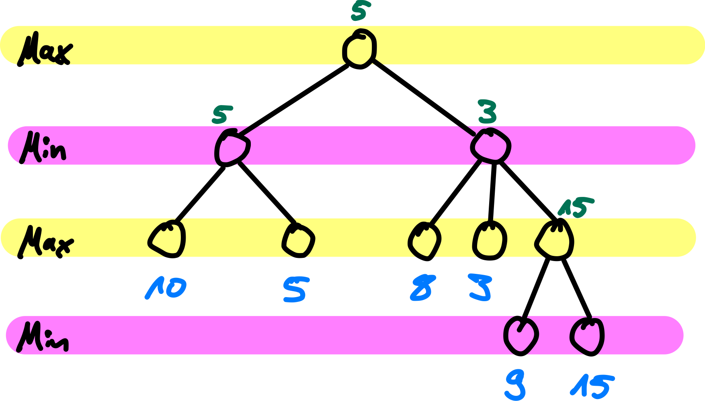

::: tldr
Minimax entwickelt den gesamten Spielbaum. Wenn man dabei die bisher besten Werte
für MAX und MIN als $\alpha$ und $\beta$ mitführt, beobachtet man, dass ein
$\alpha$-Wert nie kleiner wird und ein $\beta$-Wert nie größer wird. Dies kann man
ausnutzen und das Entwickeln von Pfaden abbrechen, wenn in einem MIN-Knoten der
$\beta$-Wert kleiner wird als der $\alpha$-Wert des MAX-Vorgängers: (a) kann der
$\beta$-Wert bei der weiteren Untersuchung der verbleibenden Nachfolger im
MIN-Knoten nur noch kleiner werden, und (b) würde der MAX-Vorgänger diesen
MIN-Knoten nie als Nachfolger in Betracht ziehen, da er bereits einen besseren Zug
gesehen hat (da sein $\alpha$ größer ist als das $\beta$ im Nachfolger). Deshalb
kann man hier sofort die Untersuchung der verbleibenden Nachfolger im MIN-Knoten
abbrechen ("Pruning"). Eine analoge Überlegung gilt für einen MAX-Nachfolger unter
einem MIN-Knoten.

Dabei bleibt das Endergebnis erhalten. Man schneidet nur Suchpfade weg, die das
Ergebnis von Minimax nicht verändern.

Die mögliche Effizienzsteigerung ist sehr stark abhängig von Sortierung der
Nachfolger! Deshalb stellt man häufig Heuristiken zur "richtigen" Sortierung der
Nachfolger auf ("Killer-Moves").

Zusätzlich kann man wie bei Minimax auch die Suchtiefe begrenzen und eine
Bewertungsfunktion (statt der Nutzenfunktion) einsetzen. Auch hier kann die
Bewertungsfunktion wieder gewichtete Features nutzen und/oder Positionen mit in
Datenbanken gespeicherten Positionen und Bewertungen abgleichen.
:::

::: youtube
-   [VL Alpha-Beta-Pruning](https://youtu.be/)
:::

# Verbesserung Minimax-Algorithmus

\bigskip
\bigskip

{width="80%" web_width="35%"}

\bigskip

=\> **Minimax-Baum**: Verbesserungen möglich?

[[Tafelbeispiel: Baum und Verbesserungen]{.ex}]{.slides}

# Alpha-beta-Pruning

Minimax-Algorithmus mit zusätzlichen Informationen:

-   $\alpha$: bisher bester Wert für MAX (höchster Wert)
-   $\beta$: bisher bester Wert für MIN (kleinster Wert)

\bigskip
\smallskip
\pause

=\> Beobachtungen:

1.  $\alpha$ für MAX-Knoten wird nie kleiner
2.  $\beta$ für MIN-Knoten wird nie größer

[[Tafelbeispiel: Beste Werte einzeichnen]{.ex}]{.slides}

# Pruning-Regeln

1.  Schneide (unter) MIN-Knoten ab, deren $\beta$ $\le$ dem $\alpha$ des
    MAX-Vorgängers ist.

\smallskip

2.  Schneide (unter) MAX-Knoten ab, deren $\alpha$ $\ge$ dem $\beta$ des
    MIN-Vorgängers ist.

\bigskip
\bigskip

::: center
Abbruch, wenn kein Platz mehr zwischen Alpha und Beta
:::

# Alpha-beta-Pruning -- Der Algorithmus (Skizze)

``` python
def Max-Value(state, alpha, beta):
    if Terminal-Test(state): return Utility(state)

    v = -INF
    for (a, s) in Successors(state):
        v = MAX(v, Min-Value(s, alpha, beta))
        if (v >= beta): return v
        alpha = MAX(alpha, v)
    return v
```

::: notes
``` python
def Min-Value(state, alpha, beta):
    if Terminal-Test(state): return Utility(state)

    v = +INF
    for (a, s) in Successors(state):
        v = MIN(v, Max-Value(s, alpha, beta))
        if (v <= alpha): return v
        beta = MIN(beta, v)
    return v
```
:::

\bigskip

Initialer Aufruf von `Max-Value()` mit $\alpha = -\infty$ und $\beta = +\infty$

::: notes
**Achtung**: Es kursieren Varianten von diesem Algorithmus, bei denen auf die
Hilfsvariable `v` verzichtet wird und stattdessen `alpha` bzw. `beta` direkt
modifiziert werden und als Rückgabewert dienen. Das *kann* zu anderen oder falschen
Ergebnissen führen! Sie können das in der Aufgabe auf Blatt 03 gut beobachten.
:::

[[Tafelbeispiel Handsimulation]{.ex}]{.slides}

# Alpha-beta-Pruning -- Eigenschaften

1.  Pruning beeinflusst nicht das Endergebnis!

2.  Sortierung der Nachfolger spielt große Rolle

3.  Perfekte Sortierung: $O(b^{d/2})$ =\> Verdopplung der Suchtiefe möglich

\bigskip

Für Schach immer noch zu aufwändig ...

# Verbesserungen für Alpha-beta-Pruning

-   "Killer-Move": Maximale Effizienz nur wenn **optimaler Zug immer zuerst**
    [untersucht]{.notes} `\newline`{=tex} =\> Zu untersuchende Züge
    **sortieren/priorisieren**, zb. Schach:
    a)  Figuren schlagen
    b)  Drohen
    c)  Vorwärts ziehen
    d)  Rückwärts ziehen

\smallskip

-   Verändern der Suchtiefe nach Spielsituation

\smallskip

-   Bewertungsfunktion `Eval`:
    -   Datenbanken mit Spielsituationen und Expertenbewertung:
        -   Eröffnungsspiele (besonders viele Verzweigungen)
        -   Endspiele
    -   Lernen der optimalen Gewichte für `Eval`-Funktion
    -   Berücksichtigung von Symmetrien

# Beispiel DeepBlue (IBM, 1997)

-   Alpha-beta-Pruning mit Tiefenbeschränkung: ca. 14 Halbzüge
-   Dynamische Tiefenbeschränkung (stellungsabhängig, max. ca. 40 Züge)
-   Heuristische Stellungsbewertung `Eval`:
    -   mehr als 8.000 Features
    -   ca. 4.000 Eröffnungsstellungen
    -   ca. 700.000 Spielsituationen (von Experten bewertet)
    -   Endspiel-Datenbank: alle Spiele mit 5 Steinen, viele mit 6 Steinen

[[@Russell2014, p. 185]]{.credits nolist=true}

# Beispiel AlphaGo (Google, 2016)

-   Beschränkung der Suchtiefe: Bewertung der Stellung durch *"Value Network"*
-   Beschränkung der Verzweigungsbreite: Bestimmung von Zugkandidaten durch *"Policy
    Network"*

\smallskip

-   Training dieser *"Deep Neural Networks"*:
    -   Überwachtes Lernen: "Analyse" von Spiel-Datenbanken
    -   Reinforcement-Lernen: Self-Play, Bewertung am Ende
        -   Züge mit Monte-Carlo-Baumsuche ausgewählt

[[@Silver2016], siehe auch
[deepmind.com/research/alphago/](https://deepmind.com/research/case-studies/alphago-the-story-so-far)]{.credits nolist=true}

# Wrap-Up

-   Alpha-beta-Pruning:
    -   Mitführen der bisher besten Werte für MAX und MIN: $\alpha$ und $\beta$
    -   Abschneiden von Pfaden, die Verschlechterung bewirken würden
    -   Endergebnis bleibt erhalten
    -   Effizienzsteigerung abhängig von Sortierung der Nachfolger

\smallskip

-   Viele Verbesserungen denkbar:
    -   Zu untersuchende Züge "richtig" sortieren (Heuristik)
    -   Suchtiefe begrenzen und Bewertungsfunktion (statt Nutzenfunktion)
    -   Positionen mit Datenbank abgleichen

::: readings
-   @Russell2021: Alpha-beta-Pruning: Abschnitt 6.2.3, Erweiterungen: Abschnitt 6.3
-   @Ertel2017
:::

::: outcomes
-   k3: Ich  kann Alpha-Beta-Pruning implementieren und anwenden
-   k2: Ich kann die Anwendung verschiedener von Minimax her bekannter
    Optimierungsmöglichkeiten auf Alpha-Beta-Pruning erklären: Sortierung der
    Nachfolger, Suchtiefe beschränken (Übergang zu Bewertungsfunktion),
    Spielzug-Bewertung über Spieldatenbanken

:::

::: quizzes
-   [Selbsttest Alpha-Beta-Pruning
    (ILIAS)](https://www.hsbi.de/elearning/goto.php?target=tst_1106584&client_id=FH-Bielefeld)
:::

::: challenges
**Optimale Spiele und MiniMax**

Auf einem Tisch liegen nebeneinander 5 Streichhölzer. Es gibt zwei Spieler - Weiß
und Schwarz - die abwechselnd ein oder zwei Streichhölzer wegnehmen dürfen (es muss
mind. ein Streichholz genommen werden). Wer das letzte Streichholz nehmen muss, hat
verloren. Zu Beginn ist Weiß am Zug.

1.  Spielbaum

    Zeichnen Sie den **kompletten** Spielbaum auf. Geben Sie an den Kanten jeweils die
    Zahl der genommenen und der verbleibenden Hölzer an.

    *Beispiel*: Wenn in einem Zug ein Holz genommen wird und 3 Hölzer verbleiben, steht
    an der entsprechenden Kante "1/3". Geben Sie jeweils an, welcher Spieler am Zug ist.

2.  Minimax

    Geben Sie die Bewertung aller Spielzustände mit Hilfe des Minimax-Algorithmus an.
    Bewerten Sie die Endzustände mit +1, wenn Spieler Weiß gewonnen hat, mit -1, falls
    Schwarz gewonnen hat.

3.  Alpha-Beta-Pruning

    Wenden Sie Alpha-Beta-Pruning auf den Spielbaum an. Werden damit mehr oder weniger
    oder gleich viele Spielzüge wie mit Minimax entwickelt? Begründen Sie Ihre Antwort.
:::
