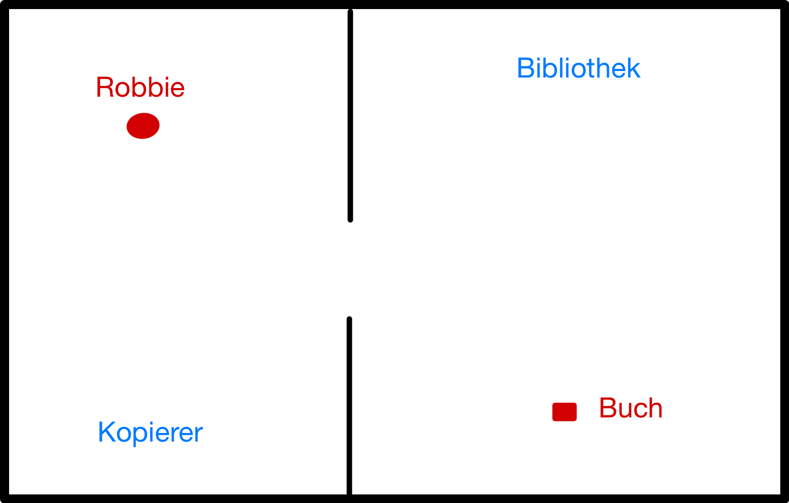
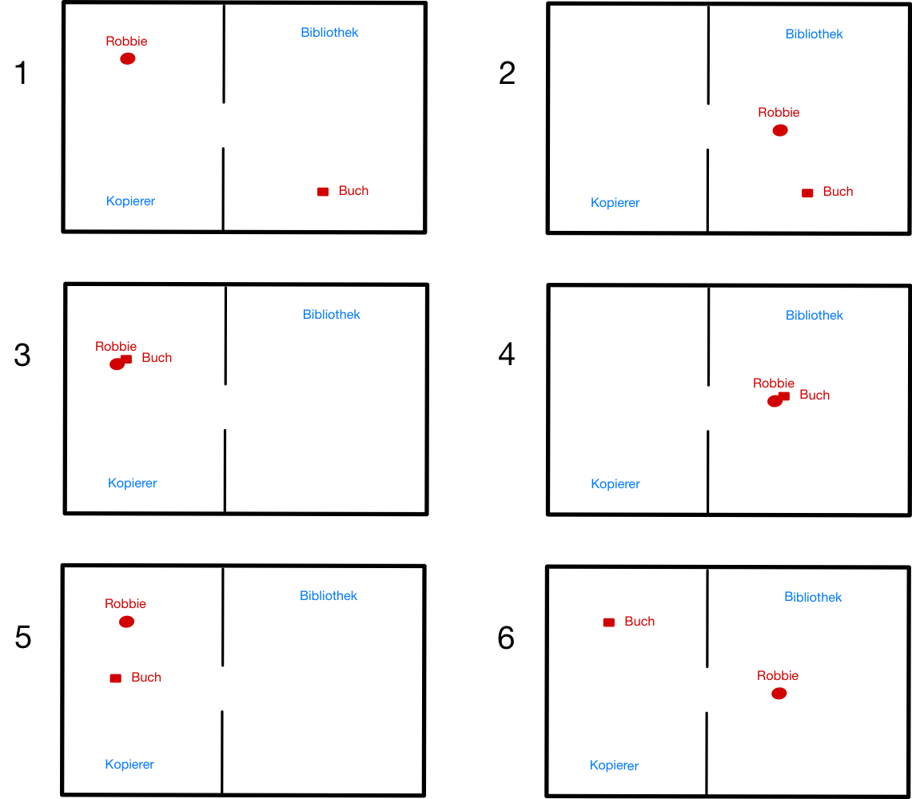
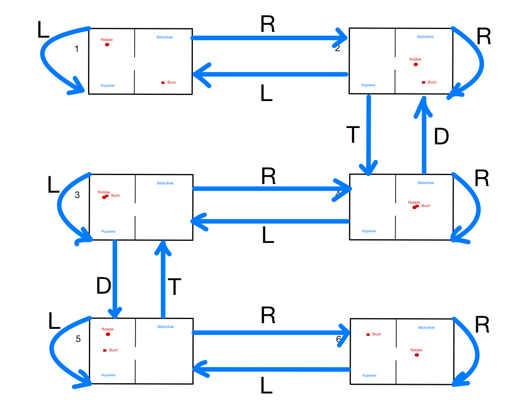

# Intro: Problemlösen

> [!IMPORTANT]
>
> 

>
> 
<strong>🎯 TL;DR</strong>

>
> Um ein Problem lösen zu können, muss es zunächst geeignet dargestellt
> werden. In der KI betrachten wir Zustände einer Welt, auf die Aktionen
> angewendet werden können und die die betrachtete Welt in den/einen
> Folgezustand bringen. Hier muss unterschieden werden zwischen
> deterministischen und stochastischen Welten, ebenso spielt die
> Beobachtbarkeit durch den Agenten (die die Welt betrachtende und durch
> die Aktionen auf die Welt einwirkende Instanz) eine Rolle: Kann der
> Agent die Welt komplett beobachten, nur einen Teil davon oder gar
> nichts? Es spielt auch eine Rolle, ob es diskrete Zustände gibt, oder
> ob man mit kontinuierlichen Variablen zu tun hat. Gibt es nur einen
> Agenten oder können mehrere Agenten beteiligt sein … (In dieser
> Veranstaltung werden wir uns auf deterministische und voll
> beobachtbare Welten mit diskreten Zuständen konzentrieren.)
>
> Dies alles muss bei der Modellierung betrachtet werden. Es empfiehlt
> sich, die Zustände und die Aktionen so abstrakt wie möglich zu
> beschreiben. Anderenfalls kann später die Lösung des Problems
> zumindest stark erschwert werden.
>
> Durch das wiederholte Anwenden der Aktionen auf den Startzustand bzw.
> auf die sich daraus ergebenden Folgezustände wird der Zustandsraum
> aufgebaut. Dabei ist zu beachten, dass Aktionen Vorbedingungen haben
> können, d.h. unter Umständen nicht auf alle Zustände angewendet werden
> können. Die entstehende Struktur (Zustandsraum) kann man formal als
> Graph repräsentieren: Die Zustände werden durch die Knoten und die
> Aktionen als (gerichtete) Kanten im Graph dargestellt (=\>
> Problemgraph).
>
> Das Problemlösen entspricht nun einer Suche im Problemgraphen: Man
> sucht einen Weg von einem Startknoten zu einem Zielknoten, d.h. eine
> Folge von Aktionen, die den Start- in den Zielzustand überführen. Der
> Weg entspricht dann der Lösung des Problems. Normalerweise will man
> eine bestimmte Qualität der Lösungen haben: Es sollen die kürzesten
> Wege (also die mit den wenigsten Zwischenstationen/Knoten) oder die
> billigsten Wege (die Summe der an den Kanten annotierten Gewichte soll
> minimal sein) gefunden werden.
>
> Zur Suche kann man bei den in dieser Veranstaltung betrachteten
> deterministischen Problemen mit diskreten Zuständen den einfachen
> “Tree-Search”-Algorithmus (Benennung in Anlehnung an ([Russell und
> Norvig 2021](#ref-Russell2021))) einsetzen, der allerdings
> Wiederholungen und Schleifen zulässt. Mit zwei Erweiterungen wird
> daraus der “Graph-Search”-Algorithmus (Benennung in Anlehnung an
> ([Russell und Norvig 2021](#ref-Russell2021))), der die wiederholte
> Untersuchung von bereits besuchten Knoten vermeidet. In beiden
> Algorithmen wird eine zentrale Datenstruktur eingesetzt (im ([Russell
> und Norvig 2021](#ref-Russell2021)) auch “Frontier” genannt), die die
> als Nächstes zu untersuchenden Knoten hält und die damit die Grenze
> zwischen dem bereits untersuchten Teil des Graphen und dem unbekannten
> Teil des Graphen bildet. Je nach Art der Datenstruktur und je nach den
> betrachteten Kosten ergeben sich eine Reihe unterschiedlicher
> Suchalgorithmen, die wir in einer späteren Sitzung betrachten.
>
> Die Suchverfahren können im Hinblick auf Optimalität, Vollständigkeit
> und Komplexität beurteilt werden.
> 

> [!TIP]
>
> 

>
> 
<strong>🎦 Videos</strong>

>
> - [VL Problemlösen](https://youtu.be/IhUmUUzR9lQ)
>
> 

## Motivation: Roboter in einer Bibliothek

<picture><source media="(prefers-color-scheme: light)" srcset="images/problem_light.png"><source media="(prefers-color-scheme: dark)" srcset="images/problem_dark.png"></picture>

**Aktionen:**

- Right (R)
- Left (L)
- Take (T)
- Drop (D)

**Wahrnehmungen:**

- In welchem Raum bin ich?
- Habe ich das Buch?

**Aufgabe:** Das Buch aus der Bibliothek holen und in den Kopiererraum
bringen.

Bemerkungen zur Umwelt:

- Beobachtbarkeit der Umwelt kann variieren: “voll beobachtbar” bis zu
  “unbeobachtbar”
- Umwelt kann “deterministisch” oder “stochastisch” sein: Führt eine
  Aktion in einem Zustand immer zum selben Folgezustand?
- Wann erfolgt die Rückmeldung an den Agenten über die Auswirkung der
  Aktionen? Sofort (“sequentiell”) oder erst am Ende einer Aktionsfolge
  (“episodisch”)?
- Wird die Umwelt nur durch die Aktionen des Agenten verändert
  (“statisch”)? Oder verändert sich die Umwelt zwischen den Aktionen
  eines Agenten, beispielsweise durch andere Agenten (“dynamisch”)?
- Gibt es diskrete Zustände (wie im Beispiel)?

## Zustände der Bibliotheks-Welt

<picture><source media="(prefers-color-scheme: light)" srcset="images/states_light.png"><source media="(prefers-color-scheme: dark)" srcset="images/states_dark.png"></picture>

**Problem:** Gegeben einen Startzustand, wie komme ich zum Ziel?

- Welche Aktionen können in einem Zustand (zb. Nr. 4) angewendet werden?
- Welche Aktionen können in den Folgezuständen angewendet werden?

Ergebnis:

- Zustandsraum: Menge aller von den Startzuständen aus erreichbaren
  Zustände
- Problemgraph: Repräsentation der Zustände und Aktionen als Knoten und
  (gerichtete) Kanten

## Suche im Problemgraphen

<picture><source media="(prefers-color-scheme: light)" srcset="images/state-space_light.png"><source media="(prefers-color-scheme: dark)" srcset="images/state-space_dark.png"></picture>

- Durch die Suche im Problemgraphen wird ein Suchbaum aufgespannt
- Varianten: Zustände können in einem Pfad wiederholt vorkommen
  vs. Wiederholungen werden ausgeschlossen

## Definition Zustand und Aktion

**Zustand:**  
(Formale) Beschreibung eines Zustandes der Welt

**Aktion:**  
(Formale) Beschreibung einer durch Agenten ausführbaren Aktion

- Anwendbar auf bestimmte Zustände
- Überführt Welt in neuen Zustand (“Nachfolge-Zustand”)

**Geeignete Abstraktionen wählen für Zustände und Aktionen!**

**Anmerkung:** ([Russell und Norvig 2021](#ref-Russell2021))
unterscheidet zw. Aktionen und Transitionsmodell; hier nur Aktionen!
D.h. die Aktionen und das Übergangsmodell aus dem ([Russell und Norvig
2021](#ref-Russell2021)) werden direkt zusammen betrachtet. Bei den hier
diskutierten Problemen ist das ohne Nachteile möglich, es wird lediglich
etwas Flexibilität genommen bzw. Komplexität vermieden (je nach
Sichtweise :-) …

## Definition Problem

Ein Problem besteht aus:

**Startzustände**  
Menge $`S_A \subset S`$

**Aktionen**  
Menge von Funktionen $`\mathop{\text{op}}: S \to S`$

**Zustandsraum**  
Menge aller Zustände $`S`$, die durch (wiederholte) Anwendung von
Aktionen von den Startzuständen aus erreichbar sind

<!-- -->

**Zieltest**  
Funktion $`\mathop{\text{goal}}: S \to \{0,1\}`$

**Zielzustände**  
Menge $`S_E \subseteq S`$ mit
$`\forall x \in S_E : \mathop{\text{goal}}(x)=1`$

<!-- -->

**Kosten**  
**Gesamtkosten**: $`f(n) = g(n) + h(n)`$

- $`n \in S`$ auf dem aktuellen Weg erreichter Knoten
- $`g(n)`$ tatsächliche Kosten für den Weg vom Start bis zu Knoten $`n`$
- $`h(n)`$ geschätzte Restkosten für den Weg von Knoten $`n`$ zum Ziel

## Hinweis: Unterschied Zustand und Knoten bzw. Zustandsraum und Problemgraph

- Zustände und Aktionen kann man als einen Graph darstellen:
  **Problemgraph**
  - Zustände werden als Knoten im Graphen abgebildet
  - Aktionen werden als (gerichtete) Kanten im Graphen abgebildet
- Unterscheidung “Zustand” und “Knoten”:
  - Zustand: Beschreibung/Modellierung eines Zustandes der Welt
  - Knoten: Datenstruktur, Bestandteil des Graphen, *symbolisiert* einen
    Zustand

Das bedeutet, dass der Problemgraph eine Repräsentation des
Zustandsraumes ist.

Die beiden Begriffe werden normalerweise synonym verwendet, sofern
eindeutig ist, was gemeint ist.

## Definition Problemlösen

Problemlösen  
Wegesuche im Graph vom Startknoten zu einem Zielknoten

- Spannt den **Suchbaum** auf

<!-- -->

**Lösung**  
Folge von Aktionen, die Start- in Zielzustand überführen

Ergebnis des Problemlösens

## Suche: Einfache Basisvariante

1.  Füge Startknoten in leere Datenstruktur (Stack, Queue, …) ein
2.  Entnehme Knoten aus der Datenstruktur:
    - Knoten ist gesuchtes Element: Abbruch, melde “*gefunden*”
    - Expandiere alle Nachfolger des Knotens und füge diese in die
      Datenstruktur ein
3.  Falls die Datenstruktur leer ist: Abbruch, melde “*nicht gefunden*”
4.  Gehe zu Schritt 2

Für die in dieser Veranstaltung betrachteten deterministischen Probleme
mit diskreten Zuständen ist diese Basisvariante der Suche eine Art
generischer Suchalgorithmus: Durch die Variation der eingesetzten
Datenstruktur und durch die Betrachtung unterschiedlicher Kosten erhält
man die in den nächsten Sitzungen betrachteten verschiedenen klassischen
Suchalgorithmen.

**Anmerkung**: Für Handsimulation besserer Überblick, wenn statt der
Knoten immer **partielle Wege** in Datenstruktur gespeichert werden!

**Anmerkung**: Im ([Russell und Norvig 2021, Abschn. 3.3.3,
S.92](#ref-Russell2021)) wird ein Algorithmus mit den vorgestellten
Eigenschaften als “**tree-like search**” bezeichnet. In Anlehnung an
([Russell und Norvig 2021](#ref-Russell2021)) wird diese Basisvariante
der Suche in dieser Lehrveranstaltung kurz als “Tree-Search”-Algorithmus
bezeichnet.

**Anmerkung**: Im ([Russell und Norvig 2021](#ref-Russell2021)) wird für
die Datenstruktur, mit der die Suche arbeitet, auch “*Frontier*”
genannt. Hier werden alle Knoten gehalten, die in einem der nächsten
Schritte betrachtet werden sollen, d.h. diese Knoten bilden die Grenze
zwischen dem bereits untersuchten Teil des Graphen und dem noch
unbekannten Teil des Graphen (deshalb auch “Frontier”).

## Erweiterung der Suche: Vermeiden von Wiederholungen

1.  Füge Startknoten in leere Datenstruktur (Stack, Queue, …) ein
2.  Entnehme Knoten aus der Datenstruktur:
    - Knoten ist gesuchtes Element: Abbruch, melde “*gefunden*”
    - Markiere aktuellen Knoten, und
    - Expandiere alle Nachfolger des Knotens und füge alle unmarkierten
      Nachfolger, die noch nicht in der Datenstruktur sind, in die
      Datenstruktur ein
3.  Falls die Datenstruktur leer ist: Abbruch, melde “*nicht gefunden*”
4.  Gehe zu Schritt 2

Dieser Algorithmus ist eine Erweiterung der einfachen Basisvariante der
Suche:

1.  Man markiert bereits besuchte (expandierte) Knoten und besucht diese
    nie wieder (man würde diese bei einer Expansion nicht wieder in die
    Datenstruktur aufnehmen).
2.  Außerdem vermeidet man, dass ein Knoten mehrfach in der
    Datenstruktur vorkommt: Dies würde bedeuten, dass man hier
    verschiedene Wege vom Start zu diesem Knoten in der Datenstruktur
    hat, die dann auch alle weiter untersucht werden müssten. In der
    Regel reicht aber ein Weg vom Start zu einem Zwischenknoten (meist
    wird der kürzeste genommen, dazu in einer späteren Sitzung mehr).

**Anmerkung**: Für Handsimulation besserer Überblick, wenn statt der
Knoten immer **partielle Wege** in Datenstruktur gespeichert werden!

**Anmerkung**: Im ([Russell und Norvig 2021, Abschn. 3.3.3,
S.92](#ref-Russell2021)) wird ein Algorithmus mit den vorgestellten
Eigenschaften als “**graph search**” bezeichnet. In Anlehnung an
([Russell und Norvig 2021](#ref-Russell2021)) wird diese erweiterter
Variante der Suche in dieser Lehrveranstaltung kurz als
“Graph-Search”-Algorithmus bezeichnet.

## Bewertung von Suchalgorithmen

**Vollständigkeit**  
Findet der Algorithmus eine Lösung, wenn es eine gibt?

**Optimalität**  
Findet der Algorithmus die beste Lösung?

**Zeitkomplexität**  
Wie lange dauert es eine Lösung zu finden?

**Speicherkomplexität**  
Wieviel Speicher benötigt die Suche?

**Größen zur Bewertung:**

- **b**: Verzweigungsfaktor
- **d**: Ebene (Tiefe) des höchsten Lösungsknotens
- **m**: Länge des längsten Pfades

## Wrap-Up

- Begriffe “Problem”, “Zustand”, “Aktion”, “Zustandsraum”,
  “Problemgraph”, “Suchbaum”

<!-- -->

- Problemlösen: Suche in Graphen nach Weg vom Start zum Ziel
  - Suche spannt einen Suchbaum auf
  - Unterschiedliche Kostenfunktionen möglich
  - Suchalgorithmen: Einfache Basisvariante, Erweiterung mit Vermeidung
    von Redundanzen
  - Beurteilung der Suchverfahren: Optimalität, Vollständigkeit,
    Komplexität

## 📖 Zum Nachlesen

- Russell und Norvig ([2021](#ref-Russell2021)): Problemlösen: Kapitel
  3.1 - 3.3

> [!NOTE]
>
> 

>
> 
<strong>✅ Lernziele</strong>

>
> - k2: Ich kann die Definition “Problem” erklären und dabei die
>   Begriffe Zustand, Aktion, Zustandsraum, Problemgraph und Suchbaum
>   erläutern
> - k2: Ich kann Problemlösen als Suche nach Wegen im Problemgraph
>   erklären
> - k2: Ich kann den Unterschied zw. Tree-Search und Graph-Search an
>   einem Beispiel erklären
>
> 

> [!TIP]
>
> 

>
> 
<strong>🧩 Quizzes</strong>

>
> - [Selbsttest Problemlösen
>   (ILIAS)](https://www.hsbi.de/elearning/goto.php?target=tst_1106586&client_id=FH-Bielefeld)
>
> 

> [!TIP]
>
> 

>
> 
<strong>🏅 Challenges</strong>

>
> Drei Elben und drei Orks befinden sich an einem Ufer eines Flusses und
> wollen diesen überqueren. Es steht dazu ein Pferd zur Verfügung,
> welches maximal zwei Wesen tragen kann. Das Pferd kann den Fluss nicht
> allein überqueren.
>
> Gesucht ist eine Möglichkeit, alle Elben und Orks über den Fluss zu
> bringen. Dabei darf zu keiner Zeit an keinem Ufer die Anzahl der sich
> dort befindlichen Orks größer sein als die der dort wartenden Elben,
> da es sonst zu Konflikten zwischen beiden Gruppen kommt.
>
> 1.  Formalisieren Sie das Problem (Zustände, Aktionen, Start- und
>     Endzustand).
> 2.  Skizzieren Sie den Problemgraph.
>
> 

------------------------------------------------------------------------

> [!NOTE]
>
> 

>
> 
<strong>👀 Quellen</strong>

>
> 

>
> 

>
> Russell, S., und P. Norvig. 2021. *Artificial Intelligence: A Modern
> Approach*. 4th Edition. Pearson. <http://aima.cs.berkeley.edu>.
>
> 

>
> 

>
> 

------------------------------------------------------------------------

Unless otherwise noted, this work is licensed under CC BY-SA 4.0.

<blockquote>
<strong>Last modified:</strong> f393f68 (lecture: fix publishing year of AIMA, 2025-09-27) 
</blockquote>
