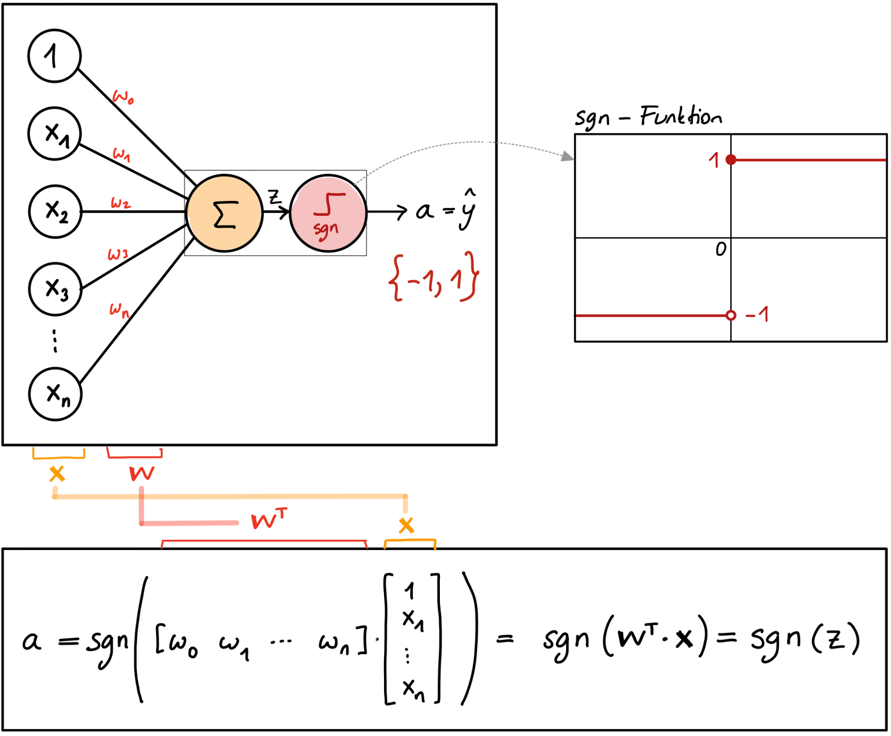
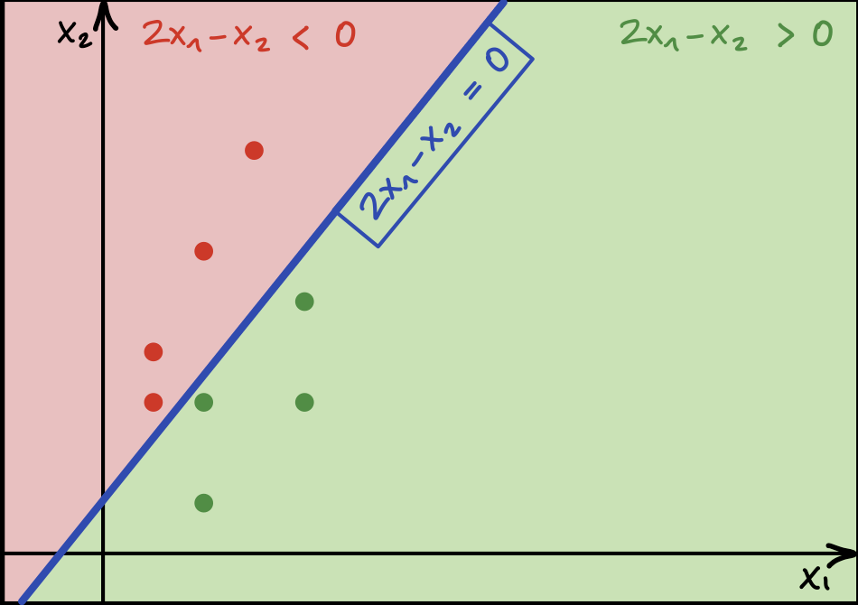

# NN01: Das Perzeptron

> [!TIP]
>
> <details open>
>
> <summary><strong>🎦 Videos</strong></summary>
>
> - [NN1.1 - Einführung](https://youtu.be/IJdiwITTC9Y)
> - [NN1.2 - Fallstudie und
>   Formalisierung](https://youtu.be/oWcvFyLgqYc)
> - [NN1.3 - Das Perzeptron Modell](https://youtu.be/ZvWpI0Doocc)
> - [NN1.4 - Perzeptron Beispiel](https://youtu.be/8Rdw2NBCCJk)
> - [NN1.5 - Der Perzeptron
>   Lernalgorithmus](https://youtu.be/JD8Qsg8_kQI)
>
> </details>

> [!NOTE]
>
> <details open>
>
> <summary><strong>🖇 Weitere Unterlagen</strong></summary>
>
> - [NN01-Das_Perzeptron.pdf](https://github.com/Artificial-Intelligence-HSBI-TDU/KI-Vorlesung/blob/master/lecture/nn/files/NN01-Das_Perzeptron.pdf)
> - [Perzeptron_Lernalgorithmus.ipynb](https://github.com/Artificial-Intelligence-HSBI-TDU/KI-Vorlesung/blob/master/lecture/nn/files/Perzeptron_Lernalgorithmus.ipynb)
>
> </details>

## Kurze Übersicht

### Definition “Maschinelles Lernen”

Fähigkeit zu lernen, ohne explizit programmiert zu werden. (Arthur
Samuel, 1959)

### Arten des Lernens

- Überwachtes Lernen (e.g. Klassifizierung, Regression)
- Unüberwachtes Lernen (e.g. Clustering, Dimensionsreduktion)
- Bestärkendes Lernen (e.g. Schach spielen)

Vergleiche auch [DTL: Machine Learning 101](../dtl/dtl1-mlbasics.md).

### Formalisierung

- Zielfunktion $`f`$
- Merkmalraum (input space)
- Ausgaberaum (output space)
- Datensatz $`\mathcal{D}`$
- Hypothesenmenge $`\mathcal{H}`$
- Lernalgorithmus $`\mathcal{A}`$

### Das Perzeptron

Das Perzeptron ist ein einfaches Modell für die **binäre
Klassifizierung**.

#### Hypothesenfunktion

- Die **Hypothesenfunktion** ist eine gewichtete Summe der
  Eingabemerkmale $`x_i`$ plus eine Konstante $`w_0`$, auf die als
  Aktivierung die Signumfunktion angewendet wird:

``` math
\begin{aligned}
h(\mathbf{x})
&= \text{sgn}(w_0 + w_1 x_1 + w_2 x_2 + \ldots + w_n x_n) \\
\\
&= \text{sgn}(\mathbf{w}^T \mathbf{x}) \\
\\
&=
\begin{cases}
1, & \text{wenn } \mathbf{w}^T \mathbf{x} \ge 0, \\
-1, & \text{wenn } \mathbf{w}^T \mathbf{x} < 0
\end{cases}
\end{aligned}
```

- Die **Ausgabe $`\hat{y}`$** des Modells ist somit eine Zahl aus der
  Menge $`\{1, -1\}`$.
- $`w_0, w_1, w_2, \ldots, w_n`$ sind die Parameter des Modells, die es
  zu optimieren gilt.

<p align="center"><picture><source media="(prefers-color-scheme: light)" srcset="images/perceptron-network_light.png"><source media="(prefers-color-scheme: dark)" srcset="images/perceptron-network_dark.png"></picture></p><p align="center">Perzeptron
Aufbau und Berechnung</p>

#### Lineare Entscheidungsgrenze

- Das Perzeptron erzeugt eine **lineare Entscheidungsgrenze** im
  Merkmalraum, die durch die folgende Gleichung definiert ist:

``` math
\mathbf{w}^T\mathbf{x} = w_0 + w_1x_1 + w_2x_2 + \ldots + w_nx_n = 0
```

- Für einen gegebenen Datensatz müssen nun jene Parameter identifiziert
  werden, die eine Entscheidungsgrenze definieren, die alle Datenpunkte
  korrekt klassifiziert. Dies ist natürlich nur dann möglich, sofern die
  Daten **linear separierbar** sind.

- Im zweidimensionalen Merkmalraum $`\mathbb{R}^2`$ entspricht die
  Entscheidungsgrenze einer **Geraden**. Die folgende Abbildung zeigt
  beispielsweise die Entscheidungsgrenze für die Parameter
  $`w_0 = 0, w_1 = 2`$ und $`w_3 = -1`$, entsprechend dem Modell
  $`h(\mathbf{x}) = \text{sgn}(2x_1 - x_2)`$.

<p align="center"><picture><source media="(prefers-color-scheme: light)" srcset="images/perceptron-boundary_light.png"><source media="(prefers-color-scheme: dark)" srcset="images/perceptron-boundary_dark.png"></picture></p><p align="center">Perzeptron
Entscheidungsgrenze</p>

### Der Perzeptron Lernalgorithmus

Der Perzeptron Lernalgorithmus (PLA) startet mit zufälligen
Gewichtsparametern und aktualisiert methodisch die Gewichte, bis die
Daten alle richtig klassifiziert sind (oder eine festgelegte obere
Schranke von Aktualisierungsschritten erreicht wird).

**Ablauf des PLA**:

1.  Starte mit zufälligen Gewichtsparametern $`\mathbf{w}`$.
2.  Wiederhole die folgenden Schritte, solange es falsch klassifizierte
    Punkte gibt:
    - Wähle einen beliebigen, falsch klassifizierten Punkt
      $`\mathbf{x}`$ aus. Sei $`y`$ das zugehörige Label (Zielwert).
    - **Aktualisiere den Gewichtsvektor** wie folgt:

``` math
\mathbf{w} \leftarrow \mathbf{w} + \alpha \cdot y \cdot \mathbf{x}
```

Hier bezeichnet $`\alpha`$ die **Lernrate** (auch Schrittweite genannt).
Sie steuert, wie stark die Parameter in jedem Schritt in Richtung
$`y \cdot \mathbf{x}`$ aktualisiert werden, und beeinflusst somit
maßgeblich die Konvergenzgeschwindigkeit und Stabilität des
Lernprozesses. Es existiert kein universell optimaler Wert für
$`\alpha`$; dieser muss problemabhängig empirisch ermittelt werden.
Typische Startwerte für Experimente liegen bei $`0.1`$, $`0.01`$ oder
$`0.001`$.

Die **Gewichtsaktualisierung** ist der Ort, wo das Lernen stattfindet.

### Nicht-Lineare Entscheidungsgrenze

Um **nicht-lineare Entscheidungsgrenzen** zu ermöglichen, können die
Originalmerkmale auf nicht-lineare Weise kombiniert (z. B.
$`x_1^2`$,$`x_2^2`$, $`x_1x_2`$, …) und diese neuen Werte als
zusätzliche Merkmale in den Vektor $`\mathbf{x}`$ aufgenommen werden.
Die Hypothesenfunktion bleibt dabei weiterhin **linear in den
Gewichten** $`w_i`$.

Im Fall von zwei Merkmalen kann beispielsweise die folgende
Hypothesenfunktion verwendet werden:

``` math
h(\mathbf{x}) =\text{sgn}(w_0 + w_1x_1 + w_2x_2 + w_3x_1^2 + w_4x_2^2).
```

Durch die Einbeziehung quadratischer Terme lassen sich nichtlineare
Entscheidungsgrenzen modellieren, darunter insbesondere kreisförmige
Entscheidungsgrenzen der Form

``` math
-4 + x_1^2 + x_2^2 = 0.
```

> [!NOTE]
>
> <details>
>
> <summary><strong>✅ Lernziele</strong></summary>
>
> - k2: Ich kann verschiedene Arten des maschinellen Lernens erklären
> - k2: Ich kann die Formalisierung eines ML-Problems, insbesondere der
>   Klassifizierung erklären und dabei insbesondere die Begriffe
>   Datensatz, Merkmalsraum, Hypothesenfunktion und Zielfunktion an
>   einem Beispiel erläutern
> - k2: Ich kann das Perzeptron als linearen Klassifikator verstehen und
>   erklären
> - k2: Ich kann den Begriff der Entscheidungsgrenze erklären
> - k3: Ich kann die Entscheidungsgrenze für ein konkretes Beispiel
>   berechnen
> - k3: Ich kann den Perzeptron Lernalgorithmus implementieren und
>   anwenden
>
> </details>

> [!TIP]
>
> <details>
>
> <summary><strong>🧩 Quizzes</strong></summary>
>
> - [Selbsttest Intro ML
>   (ILIAS)](https://www.hsbi.de/elearning/goto.php?target=tst_1106589&client_id=FH-Bielefeld)
>
> </details>

------------------------------------------------------------------------


Unless otherwise noted, this work is licensed under CC BY-SA 4.0.

<blockquote><p><sup><sub><strong>Last modified:</strong> 204d6e2 (lecture: add link to dtl intro (NN1), 2025-12-15)<br></sub></sup></p></blockquote>
