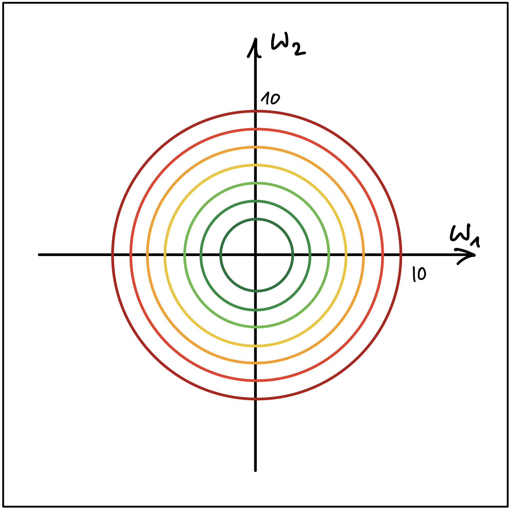
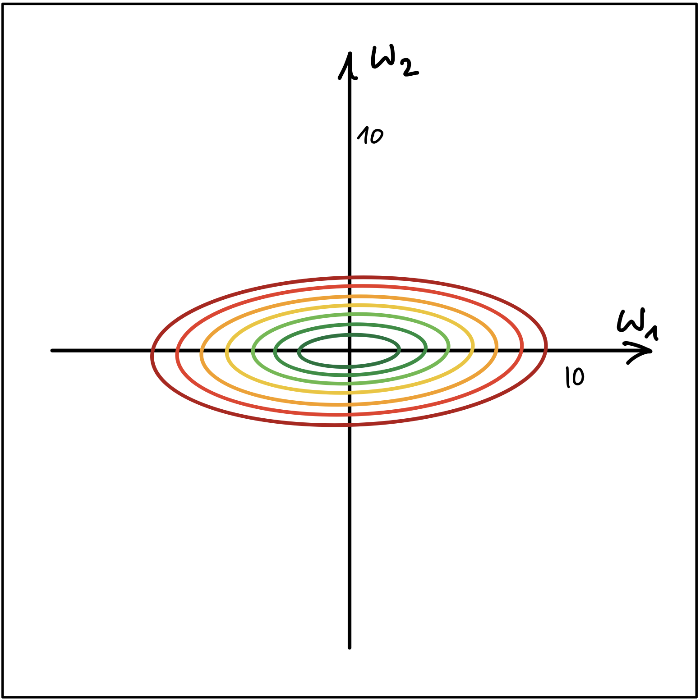

# NN02: Lineare Regression und Gradientenabstieg

> [!TIP]
>
> <details open>
>
> <summary><strong>🎦 Videos</strong></summary>
>
> - [NN2.1 - Lineare Regression - Intro](https://youtu.be/f-DTaKMnkj4)
> - [NN2.2 - Vergleich Perzeptron und Bsp](https://youtu.be/UnLjjMswNRo)
> - [NN2.3 - Kostenfunktiıon und
>   Gradientenvektor](https://youtu.be/H2YvYIaUW1Q)
> - [NN2.4 - Berechnung Gradientenvektor -
>   Beispiel](https://youtu.be/URaVsZnfppQ)
> - [NN2.5 - Berechnung Gradientenvektor -
>   Allgemein](https://youtu.be/5OZF3Qopous)
> - [NN2.6 - Skalierung der Merkmale](https://youtu.be/m-TnM13I-no)
>
> </details>

> [!NOTE]
>
> <details open>
>
> <summary><strong>🖇 Weitere Unterlagen</strong></summary>
>
> - [NN02-Lineare_Regression.pdf](https://github.com/Artificial-Intelligence-HSBI-TDU/KI-Vorlesung/blob/master/lecture/nn/files/NN02-Lineare_Regression.pdf)
> - [Lineare_Regression.ipynb](https://github.com/Artificial-Intelligence-HSBI-TDU/KI-Vorlesung/blob/master/lecture/nn/files/Lineare_Regression.ipynb)
>
> </details>

## Kurze Übersicht

### Formalisierung

- Ausgabe $`y`$ ist reelle Zahl aus einem stetigen Bereich (zum Beispiel
  Hauspreis)
- Die **Hypothesenfunktion** ist eine gewichtete Summe der Merkmale
  $`x_i`$ plus eine Konstante $`w_0`$:

``` math
h(\mathbf{x}) = \mathbf{w}^T\mathbf{x} = w_0 + w_1x_1 + w_2x_2 + \ldots + w_nx_n
```

- Der **Verlust** (engl. loss) für einen Datenpunkt $`\mathbf{x}`$ ist
  das **Fehlerquadrat**:

``` math
\mathcal{L} = (\hat{y} - y)^2 = (h(\mathbf{x}) - y)^2
```

- Die Kosten (engl. cost) sind der durchschnittliche Verlust über alle
  Datenpunkte:

``` math
J = \frac{1}{2m} \sum_{i=1}^{m} (\hat{y} - y)^2 = \frac{1}{2m} \sum_{i=1}^{m} (h(\mathbf{x}) - y)^2
```

### Der Gradient

- Der **Gradientenvektor** $`\nabla J(\mathbf{w})`$ setzt sich zusammen
  aus den partiellen Ableitungen der Kostenfunktion $`J`$ nach den
  Gewichten $`w_i`$ und zeigt in jedem Punkt $`\mathbf{w}`$ in die
  **Richtung des steilsten Aufstiegs**:

``` math
\nabla J = [ \partial J / \partial w_0
\quad \partial J / \partial w_1 \quad \ldots
\quad \partial J / \partial w_n]^T
```

- **Schlussfolgerung**: In die entgegengesetzte Richtung, i.e. in
  Richtung $`-\nabla J(\mathbf{w})`$ geht es am *steilsten bergab!*
- **IDEE**: Bewege $`\mathbf{w}`$ in Richtung $`-\nabla J(\mathbf{w})`$,
  um die Kosten $`J`$ möglichst schnell zu senken.

### Der Gradientenabstieg (engl. Gradient Descent)

1.  Starte mit zufälligen Gewichten $`\mathbf{w}`$
2.  Berechne den Gradientenvektor im aktuellen Punkt $`\mathbf{w}`$
3.  **Gewichtsaktualisierung**: Gehe einen *kleinen* Schritt in Richtung
    $`-\nabla J(\mathbf{w})`$ ($`\alpha`$: Lernrate/Schrittweite).

``` math
\mathbf{w} _{neu} := \mathbf{w} _{alt} - \alpha \cdot \nabla J(\mathbf{w} _{alt})
```

1.  Wiederhole Schritte 2-3, bis das globale Minimum von $`J`$ erreicht
    ist.

### Graphische Übersicht

- **Lineare Regression**

  <picture><source media="(prefers-color-scheme: light)" srcset="images/lin_reg_nn_light.png"><source media="(prefers-color-scheme: dark)" srcset="images/lin_reg_nn_dark.png"></picture>

- **Perzeptron**

  <picture><source media="(prefers-color-scheme: light)" srcset="images/perzeptron_nn_light.png"><source media="(prefers-color-scheme: dark)" srcset="images/perzeptron_nn_dark.png"></picture>

> [!NOTE]
>
> <details>
>
> <summary><strong>✅ Lernziele</strong></summary>
>
> - k2: Ich kann die lineare Regression aus Sicht neuronaler Netze
>   erklären und dabei auf die graphische Darstellung und den Vergleich
>   mit dem Perzeptron eingehen
> - k2: Ich kann die Formalisierung von linearer Regression erklären
> - k2: Ich kann den Begriff Verlust- und Kostenfunktion erklären
> - k2: Ich kann den Gradientenvektor an einem Beispiel erklären
> - k2: Ich kann den Begriff Lernrate erklären
> - k3: Ich kann den Gradientenabstieg an einem Beispiel anwenden
>
> </details>

> [!TIP]
>
> <details>
>
> <summary><strong>🧩 Quizzes</strong></summary>
>
> - [Selbsttest Lineare Regression
>   (ILIAS)](https://www.hsbi.de/elearning/goto.php?target=tst_1106590&client_id=FH-Bielefeld)
>
> </details>

> [!TIP]
>
> <details>
>
> <summary><strong>🏅 Challenges</strong></summary>
>
> **Skalierung der Merkmale**
>
> Abbildung 1 und Abbildung 2 zeigen die
> [Höhenlinien](https://de.wikipedia.org/wiki/H%C3%B6henlinie) ([Contour
> Lines](https://en.wikipedia.org/wiki/Contour_line)) von zwei
> Kostenfunktionen.
>
> <p align="center"><picture><source media="(prefers-color-scheme: light)" srcset="images/contour_plot_a_light.png"><source media="(prefers-color-scheme: dark)" srcset="images/contour_plot_a_dark.png"></picture></p><p align="center">Abbildung
> 1</p>
> <p align="center"><picture><source media="(prefers-color-scheme: light)" srcset="images/contour_plot_b_light.png"><source media="(prefers-color-scheme: dark)" srcset="images/contour_plot_b_dark.png"></picture></p><p align="center">Abbildung
> 2</p>
>
> - Erklären Sie, welcher der beiden Fälle nachteilhaft für den
>   Gradientenabstieg Algorithmus ist. Wo liegt der Nachteil? Wie kann
>   die Merkmalskalierung dem genannten Nachteil entgegenwirken?
> - Zeigen Sie unter Verwendung Ihrer eigenen, zufällig generierten
>   Datenpunkte aus dem Bereich $`[100, 300] \times [0, 2]`$, wie sich
>   Standardisierung, Min-Max Skalierung und Normalisierung auf die
>   Daten auswirken. Vergleichen Sie dazu die jeweiligen Streudiagramme
>   (scatterplots). Sie können hierzu das folgende [**Jupyter
>   Notebook**](https://github.com/Artificial-Intelligence-HSBI-TDU/KI-Vorlesung/blob/master/lecture/nn/files/Feature_Scaling_Starter.ipynb)
>   als Startpunkt benutzen.
>
> </details>

------------------------------------------------------------------------


Unless otherwise noted, this work is licensed under CC BY-SA 4.0.

<blockquote><p><sup><sub><strong>Last modified:</strong> ff43c3c (lecture: add jupyter notebook (Linear Regression) (#502), 2025-12-09)<br></sub></sup></p></blockquote>
