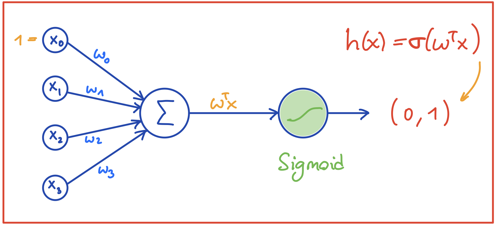
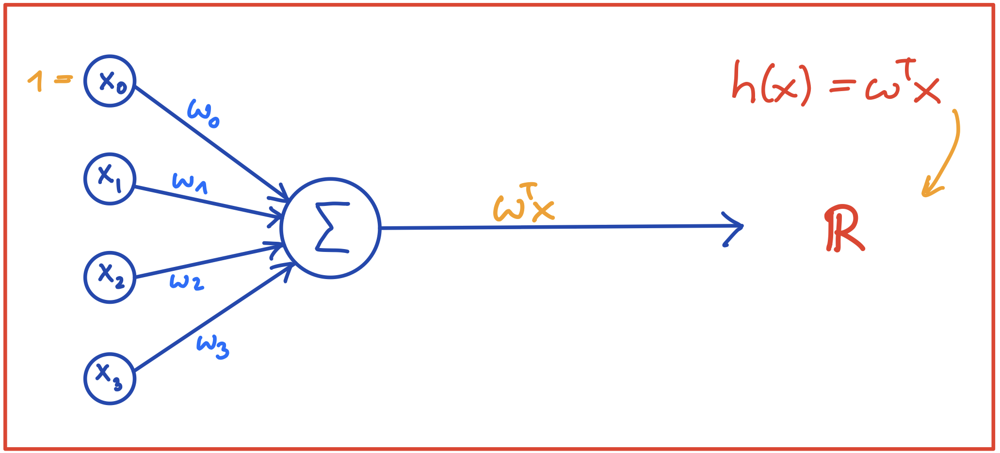
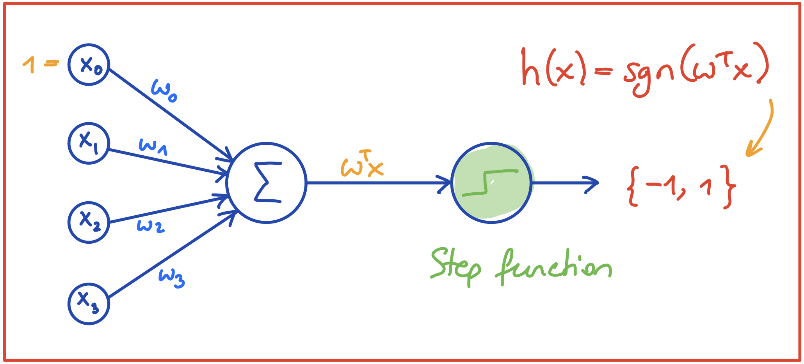

# NN03 - Logistische Regression

> [!NOTE]
>
> <details>
>
> <summary><strong>🎦 Videos</strong></summary>
>
> - [NN3.1 - Logistische Regression -
>   Intro](https://youtu.be/GpJmjrqA5RY)
> - [NN3.2 - Logistische Regression - Hypothesenfunktion und
>   Bsp](https://youtu.be/z-jFZeNWMRc)
> - [NN3.3 - Logistische Regression - Verlust und
>   Kosten](https://youtu.be/ruuCKupOhCE)
> - [NN3.4 - Logistische Regression -
>   Gradientenabstieg](https://youtu.be/kPAZsr-r1LA)
>
> </details>
>
> <details>
>
> <summary><strong>🖇 Unterlagen</strong></summary>
>
> - [NN03-Logistische_Regression.pdf](https://github.com/Artificial-Intelligence-HSBI-TDU/KI-Vorlesung/blob/master/lecture/nn/files/NN03-Logistische_Regression.pdf)
>
> </details>

## Kurze Übersicht

### Formalisierung

- Ausgabe $`y`$ ist reelle Zahl aus dem stetigen Bereich $`(0,1)`$

- Die **Hypothesenfunktion** ist:

``` math
h(\mathbf{x}) = \sigma (\mathbf{w}^T\mathbf{x}) = \sigma (w_0 + w_1x_1 + w_2x_2 + \ldots + w_nx_n) \tag{1}
```

- Der **Kreuzentropie Verlust** (engl. Cross-Entropy) für einen
  Datenpunkt $`\mathbf{x}`$: wobei hier $`a := \hat{y}`$ die Vorhersage
  ist.

``` math
\mathcal{L}(a, y) =  - y  \log(a) - (1-y)  \log(1-a)\tag{2}
```

- Die Kosten als durchschnittlicher Verlust über alle Datenpunkte
  $`x^{(1)}, \ldots, x^{(m)}`$:

``` math
J = \frac{1}{m} \sum_{i=1}^m \mathcal{L}(a^{(i)}, y^{(i)})\tag{3}
```

### Gradientenabstieg

- Der Gradient für einen Datenpunkt $`\mathbf{x}`$:

``` math
\frac{\partial \mathcal{L}}{\partial w} = (a-y)x \tag{4}
```

- Der Gradient für alle Datenpunkte $`X`$ in Matrix-Notation:

``` math
\nabla J = \frac{\partial J}{\partial w} = \frac{1}{m}X(A-Y)^T\tag{5}
```

### Graphische Übersicht

- Logistische Regression 
- Lineare Regression 
- Perzeptron 

------------------------------------------------------------------------

> [!TIP]
>
> <details>
>
> <summary><strong>✅ Lernziele</strong></summary>
>
> - k2: Logistische Regression aus Sicht neuronaler Netze: Graphische
>   Darstellung, Vergleich mit Perzeptron und linearer Regression
> - k2: Formalisierung
> - k2: Sigmoid-Aktivierungsfunktion
> - k2: Verlust- und Kosten (Cross-Entropy Loss)
> - k3: Gradientenabstieg für logistische Regression
>
> </details>
>
> <details>
>
> <summary><strong>🧩 Quizzes</strong></summary>
>
> - [Selbsttest Logistische Regression
>   (ILIAS)](https://www.hsbi.de/elearning/goto.php?target=tst_1106591&client_id=FH-Bielefeld)
>
> </details>

------------------------------------------------------------------------


Unless otherwise noted, this work is licensed under CC BY-SA 4.0.

<blockquote><p><sup><sub><strong>Last modified:</strong> 6672880 (markdown: switch to leaner yaml header (#438), 2025-08-09)<br></sub></sup></p></blockquote>
