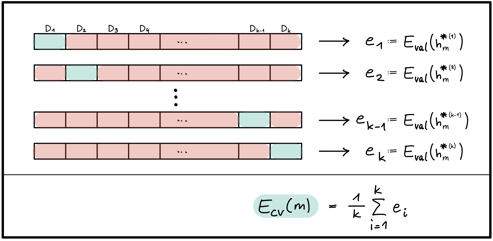

# NN07: Training & Testing

> [!TIP]
>
> <details open>
>
> <summary><strong>🎦 Videos</strong></summary>
>
> - [NN7.1 - Training, Testing,
>   Validierung](https://youtu.be/PUw-TvLJULI)
> - [NN7.2 - Kreuzvalidierung](https://youtu.be/DqjdZ8HaDSo)
> - [NN7.3 - Beispiel](https://youtu.be/7XATTMNI-gI)
>
> </details>

> [!NOTE]
>
> <details open>
>
> <summary><strong>🖇 Weitere Unterlagen</strong></summary>
>
> - [NN07-Testing-Validierung.pdf](https://github.com/Artificial-Intelligence-HSBI-TDU/KI-Vorlesung/blob/master/lecture/nn/files/NN07-Testing-Validierung.pdf)
>
> </details>

## Kurze Übersicht

### Training und Testing

- Der tatsächliche **Erfolg** eines Modells wird nicht durch niedrige
  Trainingskosten gemessen, sondern durch geringe Kosten auf ungesehenen
  Daten, d.h. **hohe Vorhersagekraft, gute Generalisierung**!

- Die Menge aller gelabelten Daten in **Trainingsset und Testset**
  aufteilen, Testset nicht während des Trainings einsetzen!.

  - $`E_{in}`$ bezeichnet den Fehler auf dem Trainingsset, auch
    **in-sample error**.
  - $`E_{out}`$ bezeichnet den Fehler auf dem gesamten Eingaberaum
    $`X`$, auch **out-of-sample error**. $`E_{out}`$ ist der eigentliche
    Indikator für den zukünftigen Erfolg des Modells, ist uns aber nicht
    zugänglich.
  - $`E_{test}`$ bezeichnet den Fehler auf dem Testset und ist eine
    **Näherung** für $`E_{out}`$.

> [!TIP]
>
> **Analogie**:
>
> $`E_{in}`$ : Erfolg in Übungsaufgaben und Probeprüfungen.
>
> $`E_{test}`$ : Erfolg in Endprüfung.

- Die Näherung $`E_{test}`$ sollte möglichst genau sein, damit es als
  ein verlässliches **Gütesiegel** dienen kann.

  - Das Testset sollte genug Daten enthalten. Üblicher Anteil an
    Testdaten:
    - bei $`|D| \approx 100.000 \rightarrow`$ ca. 20%
    - bei $`|D| \approx 10.000.000 \rightarrow`$ ca. 1%
    - Beispiel: Hat man 1000 Beispiele im Testset, wird $`E_{test}`$ mit
      $`\ge 98\%`$ Wahrscheinlichkeit in der $`\pm 5\%`$ Umgebung von
      $`E_{out}`$ liegen (für theoretische Grundlagen und Herleitung
      siehe ([Abu-Mostafa u. a. 2012, 39–69](#ref-AbuMostafa2012))).
  - Trainingsdaten und Testdaten sollten möglichst aus derselben
    Verteilung kommen, wie die zukünftigen **Real-World-Daten**.

- **Wichtige Bemerkung**:

  - Testdaten nicht anfassen, bis das Modell Einsatzbereit ist!
  - Die Testdaten dürfen in **keinster Weise** bei der Auswahl der
    endgültigen Hypothese eingesetzt werden, weder bei der Berechnung
    der Parameter (Training), noch bei der Bestimmung der Hyperparameter
    (Hyperparameter-Tuning).
  - Sobald der Testfehler die Auswahl der endgültigen Hypothese
    beeinflusst, kann sie nicht mehr als “Gütesiegel” eingesetzt
    werden.  
    **CHECK**: Hätte man zufällig andere Testdaten gewählt, könnte sich
    dadurch die endgültige Hypothese ändern?

### Validierung und Modellauswahl

- Das Ziel ist es, das Modell mit bester Generalisierung, also kleinstem
  $`E_{out}`$ zu bestimmen. $`E_{out}`$ ist jedoch unbekannt und die
  Näherung $`E_{test}`$ *darf nicht* bei der Modellauswahl eingesetzt
  werden.

- LÖSUNG: Einen weiteren Teil der Daten als **Validierungsset** (auch
  *development set*) beiseitelegen und nicht für das Training
  (i.e. Minimierung des Trainingsfehlers $`E_{in}`$) verwenden!

- **Bemerkung**:

  Das Wort **Modell** kann je nach Kontext unterschiedliche Bedeutungen
  annehmen.  
  Ein Modell im aktuellen Kontext ist als ein Paar
  $`(\mathcal{H},\mathcal{A})`$ von Hypothesenraum (bzw.
  **Modellarchitektur**) und **Lernalgorithmus** definiert.

  - Die Auswahl eines Modells kann aus einer Menge von Modellen
    unterschiedlicher Art erfolgen (z.B. lineare Modelle, polynomiale
    Modelle, neuronale Netze), oder von Modellen derselben Art aber mit
    unterschiedlichen Hyperparametern (z.B. Neuronale Netze mit
    unterschiedlicher Anzahl von versteckten Schichten).
  - Außerdem kann dieselbe Modellarchitektur $`\mathcal{H}`$ mit
    unterschiedlichen Lernalgorithmen trainiert werden, was wiederum die
    endgültige Hypothese beeinflussen kann. Die Bestimmung der
    Hyperparameter von $`{\mathcal{A}}`$ (wie z.B. Optimierungsfunktion,
    Lernrate, Kostenfunktion, Regularisierungsparameter usw.) sind daher
    auch Teil der Modellauswahl.

- Der **Validierungsfehler $`E_{val}`$** kann nun als
  Entscheidungsgrundlage an verschiedenen Stellen des Lernrpozesses
  eingesetzt werden, wie zum Beispiel:

  - Bei der **Auswahl geeigneter Hyperparameter** wie z.B. Anzahl
    Schichten, Anzahl Zellen/Schicht, Aktivierungsfunktion,
    Regularisierungsparameter (siehe Abbildung 1).

  <p align="center"><picture><source media="(prefers-color-scheme: light)" srcset="images/val1_light.png"><source media="(prefers-color-scheme: dark)" srcset="images/val1_dark.png"></picture></p><p align="center">Abbildung
  1 - Einsatz der Validierung für das Hyperparameter-Tuning</p>

  - Bei der **Auswahl der endgültigen Hypothese** ($`\rightarrow`$
    Parameterauswahl!): unter allen Hypothesen, die während des
    Trainings durchlafen werden, wähle jene mit kleinstem $`E_{val}`$
    (siehe Abbildung 2).

  <p align="center"><picture><source media="(prefers-color-scheme: light)" srcset="images/val2_light.png"><source media="(prefers-color-scheme: dark)" srcset="images/val2_dark.png"></picture></p><p align="center">Abbildung
  2 - Einsatz der Validierung bei der Auswahl der entgültigen
  Hypothese</p>

  - Bei der graphischen **Darstellung von Lernkurven** für die Diagnose
    von Über- und Unteranpassung (siehe Abbildung 3).

  <p align="center"><picture><source media="(prefers-color-scheme: light)" srcset="images/val3_light.png"><source media="(prefers-color-scheme: dark)" srcset="images/val3_dark.png"></picture></p><p align="center">Abbildung
  3 - Lernkurven</p>

- Übliche train/val/test Aufteilung der Daten (in Prozent):

  - bei $`|D| \approx 100.000 \rightarrow`$ ca. 60/20/20
  - bei $`|D| \approx 10.000.000 \rightarrow`$ ca. 98/1/1

- **Bemerkung**:

  Das Modell ist trainiert für gute Ergebnisse auf Trainingsdaten und
  “fine-tuned” für gute Ergebnisse auf den Validierungsdaten. Ergebnisse
  auf Testdaten werden mit hoher wahrscheinlichkeit schlechter
  ausfallen, als auf Validierungsdaten ($`E_{val}`$ ist eine zu
  optimistische Näherung).

- Sind Validierungs- und/oder Trainingsset zu klein, führt das zu
  schlechten Näherungen $`E_{val}`$ und folglich zu schlechten
  Entscheidungen.

  - Bei der Aufteilung muss ein gutes Trade-off gefunden werden.
  - Wenn kein Gütesiegel notwendig ist, kann man auf das Testset
    verzichten und die Daten in Trainings- und Validierungsset
    aufteilen.
  - Für eine bessere Näherung mit weniger Validierungsdaten kann k-fache
    Kreuzvalidierung eingesetzt werden (wenn genug Rechenkapazität
    vorhanden ist).

### K-fache Kreuzvalidierung (engl. k-fold cross-validation):

- Das Modell $`(\mathcal{H_m},\mathcal{A_m})`$ wird $`k`$ mal trainiert
  und validiert, jedes mal mit unterschiedlichen Trainings- und
  Validierungsmengen:

  - Die Trainingsdaten werden in $`k`$ disjunkte Teilmengen
    $`D_1, D_2, ..., D_k`$ aufgeteilt.

  - Bei dem $`i`$-ten Training werden die Teilmenge $`D_i`$ für die
    Berechnung des Validierungsfehlers $`e_i := E_{val}(h_m^{*(i)})`$
    und die restlichen $`k-1`$ Teilmengen für das Training verwendet.

  - Der **Kreuzvalidierungsfehler** des Modells
    $`(\mathcal{H_m},\mathcal{A_m})`$ ist der Durchschnitt der $`k`$
    Validierungsfehler $`e_1, e_2, ..., e_k`$ (siehe Abbildung 4).

  <p align="center"><picture><source media="(prefers-color-scheme: light)" srcset="images/val4_light.png"><source media="(prefers-color-scheme: dark)" srcset="images/val4_dark.png"></picture></p><p align="center">Abbildung
  4 - Kreuzvalidierung</p>

``` math
E_{CV}(m) := \frac{1}{k} \sum_{i=1}^{k} e_i = \frac{1}{k} \sum_{i=1}^{k} E_{val}(h_m^{*(i)})
```

- Bemerkung: Die Kreuzvalidierung wird nur bei der Modellauswahl
  eingesetzt: es liefert verlässlichere Näherungen für $`E_{out}`$ und
  führt daher zu besseren Entscheidungen. Das zuletzt ausgewählte Modell
  wird danach wie gewohnt auf den gesamten Trainigsdaten (ausgenommen
  Testdaten) trainiert und zum Schluss mit den Testdaten evaluiert.

> [!NOTE]
>
> <details>
>
> <summary><strong>✅ Lernziele</strong></summary>
>
> - k2: Ich kann die Begriffe Trainings-, Validierungs- und Testfehler
>   erklären
> - k2: Ich kann den Zweck einer Testmenge erläutern
> - k2: Ich kann das Verfahren der Kreuzvalidierung erklären
> - k2: Ich kann den Begriff Hyperparameter-Tuning erklären
> - k3: Ich kann verschiedene Lernkurven interpretieren
>
> </details>

> [!TIP]
>
> <details>
>
> <summary><strong>🧩 Quizzes</strong></summary>
>
> - [Selbsttest Training & Testing
>   (ILIAS)](https://www.hsbi.de/elearning/goto.php?target=tst_1106594&client_id=FH-Bielefeld)
>
> </details>

------------------------------------------------------------------------

> [!NOTE]
>
> <details>
>
> <summary><strong>👀 Quellen</strong></summary>
>
> <div id="refs" class="references csl-bib-body hanging-indent">
>
> <div id="ref-AbuMostafa2012" class="csl-entry">
>
> Abu-Mostafa, Y. S., M. Magdon-Ismail, und H. Lin. 2012. *Learning From
> Data*. AMLBook. <https://work.caltech.edu/telecourse>.
>
> </div>
>
> </div>
>
> </details>

------------------------------------------------------------------------


Unless otherwise noted, this work is licensed under CC BY-SA 4.0.

<blockquote><p><sup><sub><strong>Last modified:</strong> 578b7ff (lecture: fix links to attachments, 2025-11-17)<br></sub></sup></p></blockquote>
