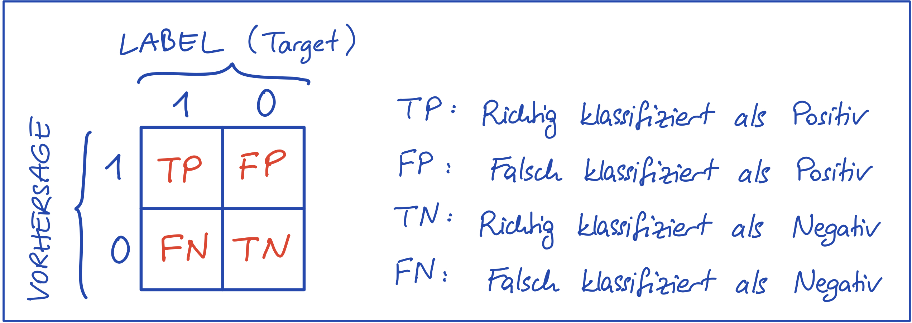

# NN08: Performanzanalyse

> [!TIP]
>
> <details open>
>
> <summary><strong>🎦 Videos</strong></summary>
>
> - [NN8.1 - Confusion Matrix](https://youtu.be/T-WYL28iwdU)
> - [NN8.2 - Precision und Recall](https://youtu.be/fpsNzn4Moow)
> - [NN8.3 - Precision Recall Trade-off](https://youtu.be/Wx_HAuIXTAQ)
> - [NN8.4 - F1-Score](https://youtu.be/UAV7EpdIe6Q)
> - [NN8.5 - Harmonisches Mittel-
>   Intuition](https://youtu.be/vsmoYiArtrA)
>
> </details>

> [!NOTE]
>
> <details open>
>
> <summary><strong>🖇 Weitere Unterlagen</strong></summary>
>
> - [NN08-Performanzanalyse.pdf](https://github.com/Artificial-Intelligence-HSBI-TDU/KI-Vorlesung/blob/master/lecture/nn/files/NN08-Performanzanalyse.pdf)
>
> </details>

## Kurze Übersicht

### Performanzmetriken für Klassifizierungsprobleme

#### Wahrheitsmatrix (engl. Confusion Matrix)

- Gibt eine Übersicht über die Anzahl von richtig und falsch
  klassifizierten Datenpunkten (bei binärer Klassifizierung)
  - $`TP =`$ \# True Positives $`=`$ Anzahl richtiger 1-Vorhersagen
  - $`FP =`$ \# False Positives $`=`$ Anzahl falscher 1-Vorhersagen
  - $`FN =`$ \# False Negatives $`=`$ Anzahl falscher 0-Vorhersagen
  - $`TN =`$ \# True Negatives $`=`$ Anzahl richtiger 0-Vorhersagen
- Bei Klassifizierungsproblemen mit $`N`$ Klassen hat man eine
  $`N \times N`$ Matrix, die in Position $`(i,j)`$ die Anzahl der
  Klasse-$`j`$-Beispiele enthält, die als Klasse-$`i`$ vorhergesagt
  wurden.

<p align="center"><picture><source media="(prefers-color-scheme: light)" srcset="images/nn8-1_light.png"><source media="(prefers-color-scheme: dark)" srcset="images/nn8-1_dark.png"></picture></p><p align="center">Abbildung
1 - Wahrheitsmatrix bei binärer Klassifizierung</p>

#### Treffergenauigkeit (engl. Accuracy)

- Anzahl richtig klassifizierter Datenpunkte, Erfolgsrate (engl. correct
  rate)

``` math
Accuracy = \frac{TP+TN}{TP+TN+FP+FN}
```

- Accuracy vermittelt ein falsches Bild des Erfolges bei unausgewogenen
  Datensätzen

  Beispiel:

  - Klasse 1 hat 10, Klasse 0 hat 990 Beispiele.
  - Ein Modell, das immer 0 ausgibt, hat $`990/1000 = 0.99`$
    Treffergenauigkeit, ist aber offensichtlich kein gutes Modell!

#### Precision

- Positive Predictive Value (PPV)
- Antwort auf: Von allen **positiven Vorhersagen**, wie viele sind
  richtig?

``` math
Precision = \frac{TP}{TP + FP}
```

- Wahrscheinlichkeit, dass ein positiv klassifiziertes Beispiel auch
  tatsächlich positiv ist.
- Je näher an 1, desto besser.
- Accuracy of **positive predictions**.

#### Recall

- True Positive Rate, auch Sensitivität (engl. Sensitivity)
- Antwort auf: Von allen **positiven Beispielen**, wie viele wurden
  richtig klassifiziert?

``` math
Recall = \frac{TP}{TP + FN}
```

- Wahrscheinlichkeit, dass ein positives Beispiel tatsächlich als
  solches erkannt wird.
- Je näher an 1, desto besser.
- Accuracy of **positive examples**.

#### Precision-Recall Trade-off

- Ein gutes Modell sollte hohe Precision und zugleich hohes Recall
  haben.
- Man kann die Precision eines Modells beliebig erhöhen (durch das
  Vergrößern des Schwellenwertes bei der Klassifizierung), jedoch wird
  dabei der Recall abnehmen.
- Genau so kann man den Recall eines Modells beliebig erhöhen (durch das
  Verkleinern des Schwellenwertes bei der Klassifizierung), jedoch wird
  dabei die Precision abnehmen.
- Es gilt ein gutes Trade-off zu finden.
- Eine Zwei-Zahlen-Metrik erschwert den Entscheidungsprozess bei
  Evaluierung und Modellauswahl.

#### $`F_1`$-Score (Harmonisches Mittel)

- Fasst Precision (P) und Recall (R) in einer Metrik zusammen
  (Harmonisches Mittel von P und R):

``` math
F_1-Score = \frac{2}{\frac{1}{P} + \frac{1}{R}} = 2 \cdot \frac{PR}{P + R}
```

- Der $`F_1`$-Score wird nur dann hoch sein, wenn P und R beide hoch
  sind.
- Je näher an 1, desto besser.
- Sehr kleine P und R Werte ziehen den $`F_1`$-Score sehr stark
  herunter. In dieser Hinsicht gibt diese Metrik ein akkurates Bild über
  den Erfolg eines Modells.

> [!NOTE]
>
> <details>
>
> <summary><strong>✅ Lernziele</strong></summary>
>
> - k2: Ich kann die betrachteten Performanzmetriken für die Evaluierung
>   von Klassifizierungsmodellen erläutern
> - k2: Ich kann die Wahrheitsmatrix (engl. Confusion Matrix) erklären
> - k2: Ich kann den Begriff Treffergenauigkeit (engl. Accuracy)
>   erklären
> - k2: Ich kann den Begriff Precision (engl. Precision) erklären
> - k2: Ich kann den Begriff Recall erklären
> - k2: Ich kann den Begriff F_1-Score (Harmonisches Mittel) erklären
> - k3: Ich kann Precision und Recall berechnen und deuten
> - k3: Ich kann den F_1-Score berechnen und deuten
> - k3: Ich kann die Performanzmetriken bei der Evaluierung und Auswahl
>   von Modellen einsetzen
>
> </details>

------------------------------------------------------------------------


Unless otherwise noted, this work is licensed under CC BY-SA 4.0.

<blockquote><p><sup><sub><strong>Last modified:</strong> 578b7ff (lecture: fix links to attachments, 2025-11-17)<br></sub></sup></p></blockquote>
