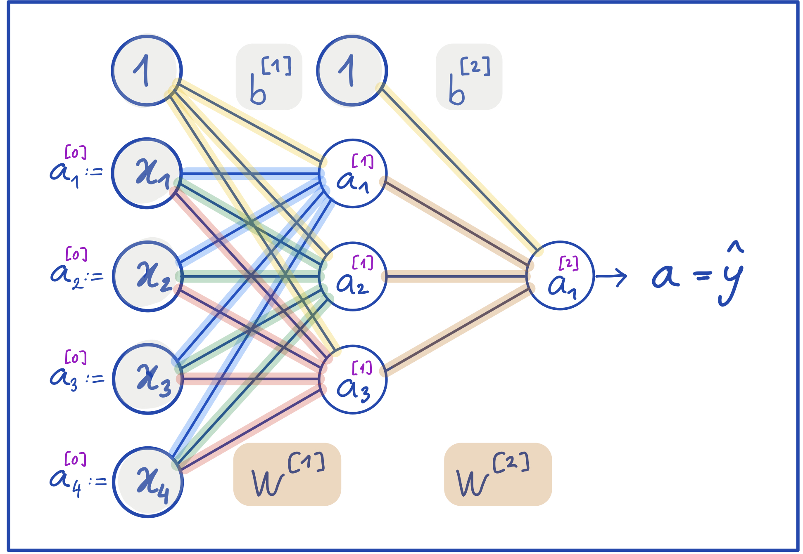

## Kurze Übersicht

### Multilayer Perzeptron (MLP)
*   Das Perzeptron kann nur linear separable Daten korrekt klassifizieren.
*   Durch das Zusammenschließen von mehreren Perzeptronen kann man ein mehrschichtiges Perzeptron (engl. Multilayer Perceptron) aufstellen, das komplexere Funktionen modellieren kann.
*   Ein MLP wird oft auch als **Feed Forward Neural Network** oder  als **Fully Connected Neural Network** bezeichnet.
*   Die "inneren" Schichten eines solchen Netzwerkes sind sogenannte **versteckte Schichten** (engl. hidden layer). Das sind alle Schichten ausgenommen die Eingangs- und Ausgangsschicht.

### Graphische Übersicht und Vorwärtslauf
*   Ein Multi-Layer Perzeptron
    
    Ein Vorwärtslauf (forward pass):
    $$a^{[1]} = ReLU \left( W^{[1]} \cdot \mathbb{x} + b^{[1]} \right) \tag{1}$$
    $$\hat{y} := a^{[2]} = \sigma \left( W^{[2]} \cdot a^{[1]} + b^{[2]} \right) \tag{2}$$
