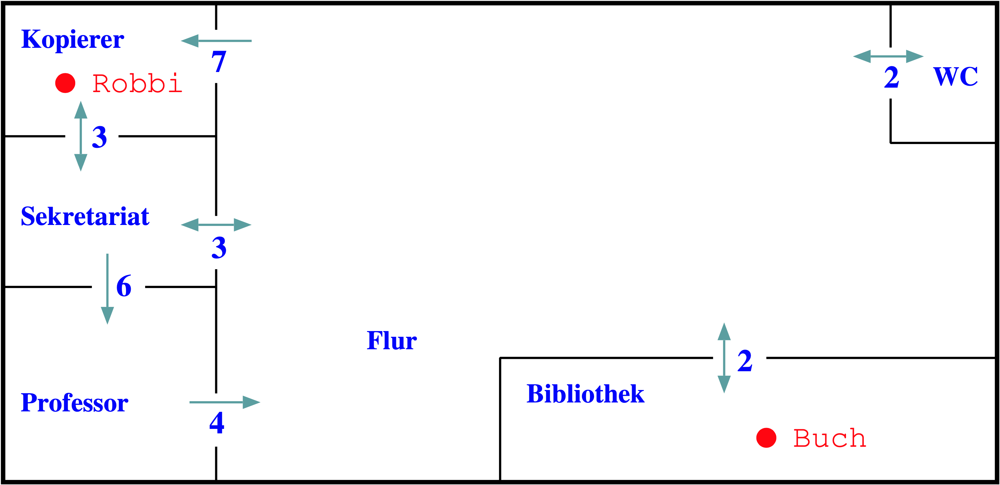

::: tldr
Die Tiefensuche gehört zu den "Uninformierten Suchverfahren": Es werden keine
weiteren Pfadkosten, sondern nur die Anzahl der Schritte berücksichtigt.

Die Tiefensuche entsteht, wenn man bei der Tree-Search oder der Graph-Search für die
Datenstruktur einen **Stack** benutzt: Expandierte Nachfolger werden immer **oben**
auf den Stack gelegt, und der nächste zu expandierende Knoten wird **oben** vom Stack
genommen. Dadurch verfolgt die Tiefensuche einen Pfad immer erst in die Tiefe.

Bei Sackgassen erfolgt automatisch ein Backtracking, d.h. es wird zum letzten Knoten
mit einer Alternative zurückgegangen. Dies liegt daran, dass bei einer Sackgasse
keine Nachfolger expandiert und oben auf den Stack gelegt werden.
:::

::: youtube
-   [VL Tiefensuche](https://youtu.be/NzTugnuHSZ8)
:::

# Hole das Buch

::: center
{width="60%"}
:::

::: notes
Das Beispiel ist ein Büroflur in der Uni. Neben den Büros gibt es eine Bibliothek und
einen Kopiererraum, wo auch der Roboter sich gerade aufhält. Die Aufgabe für den
Roboter lautet: Hole das Buch aus der Bibliothek (und bringe es zum Kopier). (Damit
das Beispiel und der sich daraus ergebende Problemgraph nicht zu groß und zu
unübersichtlich werden, soll das Ziel hier darin liegen, dass der Roboter das Buch in
der Bibliothek aufnimmt.)

Es stehen zwei Aktionen zur Verfügung:

1.  Der Roboter kann von einem in den nächsten Raum wechseln (Kosten siehe Pfeile)
2.  Der Roboter kann das Buch aufnehmen (Kosten: 3)

Dabei sind die Durchgänge teilweise nur in einer Richtung zu benutzen
(Pfeilrichtung).
:::

# Problemgraph zum Kopiererbeispiel

::: center
{width="60%"}
:::

::: notes
=\> **Problemlösen == Suche im Graphen**
:::

\bigskip
\bigskip

**Uninformierte ("blinde") Suche**:

Keine Informationen über die Kosten eines Pfades: Nur die Pfadlänge (Anzahl der
Schritte) zählt.

::: notes
Varianten:

-   **Tiefensuche**
-   [Breitensuche](search2-bfs.md)
:::

::: notes
# Anmerkungen Wegesuche (Landkarte)

Bei der Wegesuche hat man den Problemgraphen bereits durch die Orte und die
Verbindungen (Straßen) zwischen ihnen gegeben. Es gibt nur eine ausführbare Aktion:
"*fahre nach*".

Dabei können nur die Anzahl der Zwischenstationen auf dem Weg gezählt werden
("uninformierte Suche"), oder man ordnet den Kanten Kosten zu (bei der Wegesuche
wären dies die Entfernungen zwischen den Orten oder die Zeit, die man von A nach B
braucht) und landet damit bei der "informierten Suche".

Normalerweise hat man eine Ordnung auf den Aktionen, d.h. für einen Knoten ergibt
sich daraus eine Reihenfolge, in der die Aktionen angewendet werden und die
Nachfolger expandiert werden. Bei der Wegesuche hat man dies nicht, insofern muss man
willkürlich eine Ordnung festlegen. In dieser Veranstaltung ist dies die
alphabetische Reihenfolge der Knoten (Orte).
:::

# Tiefensuche (*TS*, *DFS*)

::: notes
**Erinnerung Tree-Search**
:::

1.  Füge Startknoten in leere Datenstruktur (Stack, Queue, ...) ein
2.  Entnehme Knoten aus der Datenstruktur:
    -   Knoten ist gesuchtes Element: Abbruch, melde "*gefunden*"
    -   Expandiere alle Nachfolger des Knotens und füge diese in die Datenstruktur
        ein
3.  Falls die Datenstruktur leer ist: Abbruch, melde "*nicht gefunden*"
4.  Gehe zu Schritt 2

\bigskip

=\> Was passiert, wenn wir einen **Stack** einsetzen?

:::: notes
::: center
{width="90%"}
:::
::::

[[Tafelbeispiel Tiefensuche (Stack, Suchbaum, Backtracking, Zyklen)]{.ex}]{.slides}

<!-- XXX
* Beispiel mit *gerichteten* Kanten, um lange Zyklen an Tafelbeispiel zu vermeiden
* Sackgasse möglichst "früh" (A-B-C (C: Sackgasse), A-B-D, und von D geht's weiter ...)
* Diskussion: Zyklen sind normalerweise möglich (wenn eine Aktion den Vorgängerzustand "erreicht")
-->

::: notes
# Bemerkungen

-   Nachfolger eines Knotens: Alle von diesem Zustand durch Aktionen erreichbare
    Zustände

-   Suchalgorithmus mit **Stack** als Datenstruktur =\> **Tiefensuche**

    -   Zu betrachtender Knoten in Schritt 2 wird *oben* vom Stack genommen
    -   Expandierte Knoten werden in Schritt 2.a *oben* auf den Stack gelegt Dabei
        i.A. die vorgegebene Reihenfolge der Nachfolgeknoten beachten!

    Auswirkung: Weg wird in die **Tiefe** verfolgt (deshalb "Tiefensuche")

-   Im [@Russell2020] wird die Datenstruktur zum Halten der zu expandierenden Knoten
    (also hier im Fall der Tiefensuche der Stack) auch "**Frontier**" genannt.

-   **Backtracking**: Wenn der Weg in eine Sackgasse führt, d.h. ein Knoten keine
    Nachfolger hat, werden bei der Expansion des Knotens keine Nachfolger auf den
    Stack gelegt. Die Evaluation des nächsten Knotens auf dem Stack bewirkt deshalb
    ein *Zurückspringen* im Suchbaum zum letzten Knoten auf dem aktuellen Weg mit
    noch offenen Alternativen ...

# Konventionen für diese Lehrveranstaltung

In der Beschreibung der Algorithmen werden häufig nur die letzten Knoten der
partiellen Wege in den Datenstrukturen mitgeführt (das gilt auch für die Beschreibung
im [@Russell2020]). Dies erschwert die Nachvollziehbarkeit, wenn man die Queue oder
den Stack schrittweise aufschreibt. Deshalb wird für diese Veranstaltung die
Konvention eingeführt, immer die **partiellen Wege** aufzuschreiben.

Nicht Bestandteil der Algorithmen, dient aber der Nachvollziehbarkeit: Expandierte
Knoten sollen alphabetisch sortiert an der korrekten Stelle in der Datenstruktur
auftauchen, dabei soll aber natürlich die Reihenfolge der ursprünglich in der
Datenstruktur enthaltenen Knoten nicht modifiziert werden. (Bei "echten" Problemen
wird die Reihenfolge der expandierten Nachfolger in der Regel durch eine Reihenfolge
der anwendbaren Operationen bestimmt.)

# Weitere Hinweise

-   Die Tiefensuche wurde zufällig am Beispiel Tree-Search eingeführt. Man kann auch
    Graph-Search einsetzen. Wichtig ist nur, dass als Datenstruktur ein **Stack**
    genutzt wird.

-   Bei Tree-Search werden bereits besuchte Knoten u.U. immer wieder besucht. Zyklen
    im aktuell entwickelten Pfad sind also möglich! Außerdem sind mehrere Wege zum
    selben (Zwischen-/End-) Knoten in der Datenstruktur möglich!

-   Im [@Russell2020] wird der Begriff "Backtracking" für den rekursiven
    Tiefensuche-Algorithmus verwendet. Dies steht im Gegensatz zum üblichen
    Sprachgebrauch in der KI!
:::

# Tiefensuche (rekursive Variante)

1.  Startknoten ist gesuchtes Element: Abbruch, melde "*gefunden*"
2.  Für jeden Nachfolger des Startknotens:
    -   Rufe Tiefensuche für aktuellen (Nachfolger-) Knoten auf
    -   Ergebnis "*gefunden*": Abbruch, melde "*gefunden*"
3.  Abbruch, melde "*nicht gefunden*"

::: notes
## Bemerkungen

-   Eigenschaften wie "normale" Tiefensuche
-   Einfacher zu implementieren: Nutzung des Stacks wird auf den Compiler verlagert
    (Funktionsaufruf, Stack des Prozesses ...)
-   Speicherbedarf: Für jeden Knoten wird nur der nächste Knoten expandiert, plus
    Speicher für die Funktion
:::

::: notes
# Eigenschaften der Tiefensuche

Siehe [Breitensuche](search2-bfs.md)
:::

# Wrap-Up

-   Uninformierte Suchverfahren
    -   Keine weiteren Pfadkosten (nur Anzahl der Schritte)
    -   Tiefensuche: Verfolge einen Pfad zuerst in die Tiefe
    -   Backtracking bei Sackgassen (automatisch durch den Stack)

::: readings
-   @Russell2020: Tiefensuche: Abschnitt 3.4.3
:::

::: outcomes
-   k2: Verwendete Datenstrukturen
-   k2: Algorithmische Abläufe, Terminierung
-   k2: Optimalität, Vollständigkeit und Komplexität
-   k3: Uninformierte Suchverfahren: Tiefensuche
:::

::: quizzes
-   [Selbsttest Tiefensuche
    (ILIAS)](https://www.hsbi.de/elearning/goto.php?target=tst_1106596&client_id=FH-Bielefeld)
:::
