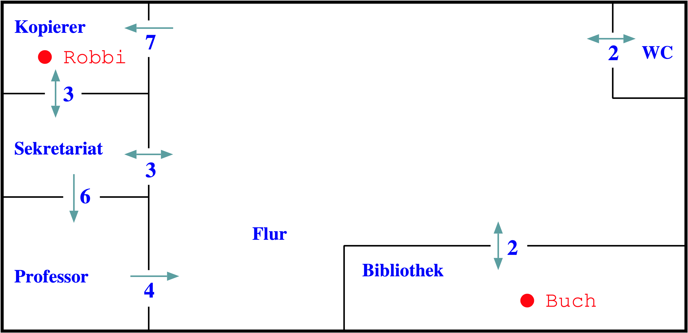
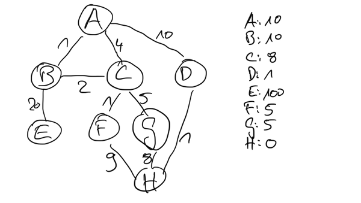

# Search: Suche mit Tiefensuche

> [!IMPORTANT]
>
> 

>
> 
<strong>🎯 TL;DR</strong>

>
> Die Tiefensuche gehört zu den “Uninformierten Suchverfahren”: Es
> werden keine weiteren Pfadkosten, sondern nur die Anzahl der Schritte
> berücksichtigt.
>
> Die Tiefensuche entsteht, wenn man bei der Tree-Search oder der
> Graph-Search für die Datenstruktur einen **Stack** benutzt:
> Expandierte Nachfolger werden immer **oben** auf den Stack gelegt, und
> der nächste zu expandierende Knoten wird **oben** vom Stack genommen.
> Dadurch verfolgt die Tiefensuche einen Pfad immer erst in die Tiefe.
>
> Bei Sackgassen erfolgt automatisch ein Backtracking, d.h. es wird zum
> letzten Knoten mit einer Alternative zurückgegangen. Dies liegt daran,
> dass bei einer Sackgasse keine Nachfolger expandiert und oben auf den
> Stack gelegt werden.
>
> 

> [!TIP]
>
> 

>
> 
<strong>🎦 Videos</strong>

>
> - [VL Tiefensuche](https://youtu.be/NzTugnuHSZ8)
>
> 

## Hole das Buch

<picture><source media="(prefers-color-scheme: light)" srcset="images/scene_light.png"><source media="(prefers-color-scheme: dark)" srcset="images/scene_dark.png"></picture>

Das Beispiel ist ein Büroflur in der Uni. Neben den Büros gibt es eine
Bibliothek und einen Kopiererraum, wo auch der Roboter sich gerade
aufhält. Die Aufgabe für den Roboter lautet: Hole das Buch aus der
Bibliothek (und bringe es zum Kopier). (Damit das Beispiel und der sich
daraus ergebende Problemgraph nicht zu groß und zu unübersichtlich
werden, soll das Ziel hier darin liegen, dass der Roboter das Buch in
der Bibliothek aufnimmt.)

Es stehen zwei Aktionen zur Verfügung:

1.  Der Roboter kann von einem in den nächsten Raum wechseln (Kosten
    siehe Pfeile)
2.  Der Roboter kann das Buch aufnehmen (Kosten: 3)

Dabei sind die Durchgänge teilweise nur in einer Richtung zu benutzen
(Pfeilrichtung).

## Problemgraph zum Kopiererbeispiel

<picture><source media="(prefers-color-scheme: light)" srcset="images/graph_light.png"><source media="(prefers-color-scheme: dark)" srcset="images/graph_dark.png"></picture>

=\> **Problemlösen == Suche im Graphen**

**Uninformierte (“blinde”) Suche**:

Keine Informationen über die Kosten eines Pfades: Nur die Pfadlänge
(Anzahl der Schritte) zählt.

Varianten:

- **Tiefensuche**
- [Breitensuche](search2-bfs.md)

## Anmerkungen Wegesuche (Landkarte)

Bei der Wegesuche hat man den Problemgraphen bereits durch die Orte und
die Verbindungen (Straßen) zwischen ihnen gegeben. Es gibt nur eine
ausführbare Aktion: “*fahre nach*”.

Dabei können nur die Anzahl der Zwischenstationen auf dem Weg gezählt
werden (“uninformierte Suche”), oder man ordnet den Kanten Kosten zu
(bei der Wegesuche wären dies die Entfernungen zwischen den Orten oder
die Zeit, die man von A nach B braucht) und landet damit bei der
“informierten Suche”.

Normalerweise hat man eine Ordnung auf den Aktionen, d.h. für einen
Knoten ergibt sich daraus eine Reihenfolge, in der die Aktionen
angewendet werden und die Nachfolger expandiert werden. Bei der
Wegesuche hat man dies nicht, insofern muss man willkürlich eine Ordnung
festlegen. In dieser Veranstaltung ist dies die alphabetische
Reihenfolge der Knoten (Orte).

## Tiefensuche (*TS*, *DFS*)

**Erinnerung Tree-Search**

1.  Füge Startknoten in leere Datenstruktur (Stack, Queue, …) ein
2.  Entnehme Knoten aus der Datenstruktur:
    - Knoten ist gesuchtes Element: Abbruch, melde “*gefunden*”
    - Expandiere alle Nachfolger des Knotens und füge diese in die
      Datenstruktur ein
3.  Falls die Datenstruktur leer ist: Abbruch, melde “*nicht gefunden*”
4.  Gehe zu Schritt 2

=\> Was passiert, wenn wir einen **Stack** einsetzen?

<picture><source media="(prefers-color-scheme: light)" srcset="images/tafelbeispiel_light.png"><source media="(prefers-color-scheme: dark)" srcset="images/tafelbeispiel_dark.png"></picture>

## Bemerkungen

- Nachfolger eines Knotens: Alle von diesem Zustand durch Aktionen
  erreichbare Zustände

- Suchalgorithmus mit **Stack** als Datenstruktur =\> **Tiefensuche**

  - Zu betrachtender Knoten in Schritt 2 wird *oben* vom Stack genommen
  - Expandierte Knoten werden in Schritt 2.a *oben* auf den Stack gelegt
    Dabei i.A. die vorgegebene Reihenfolge der Nachfolgeknoten beachten!

  Auswirkung: Weg wird in die **Tiefe** verfolgt (deshalb “Tiefensuche”)

- Im ([Russell und Norvig 2021](#ref-Russell2021)) wird die
  Datenstruktur zum Halten der zu expandierenden Knoten (also hier im
  Fall der Tiefensuche der Stack) auch “**Frontier**” genannt.

- **Backtracking**: Wenn der Weg in eine Sackgasse führt, d.h. ein
  Knoten keine Nachfolger hat, werden bei der Expansion des Knotens
  keine Nachfolger auf den Stack gelegt. Die Evaluation des nächsten
  Knotens auf dem Stack bewirkt deshalb ein *Zurückspringen* im Suchbaum
  zum letzten Knoten auf dem aktuellen Weg mit noch offenen Alternativen
  …

## Konventionen für diese Lehrveranstaltung

In der Beschreibung der Algorithmen werden häufig nur die letzten Knoten
der partiellen Wege in den Datenstrukturen mitgeführt (das gilt auch für
die Beschreibung im ([Russell und Norvig 2021](#ref-Russell2021))). Dies
erschwert die Nachvollziehbarkeit, wenn man die Queue oder den Stack
schrittweise aufschreibt. Deshalb wird für diese Veranstaltung die
Konvention eingeführt, immer die **partiellen Wege** aufzuschreiben.

Nicht Bestandteil der Algorithmen, dient aber der Nachvollziehbarkeit:
Expandierte Knoten sollen alphabetisch sortiert an der korrekten Stelle
in der Datenstruktur auftauchen, dabei soll aber natürlich die
Reihenfolge der ursprünglich in der Datenstruktur enthaltenen Knoten
nicht modifiziert werden. (Bei “echten” Problemen wird die Reihenfolge
der expandierten Nachfolger in der Regel durch eine Reihenfolge der
anwendbaren Operationen bestimmt.)

## Weitere Hinweise

- Die Tiefensuche wurde zufällig am Beispiel Tree-Search eingeführt. Man
  kann auch Graph-Search einsetzen. Wichtig ist nur, dass als
  Datenstruktur ein **Stack** genutzt wird.

- Bei Tree-Search werden bereits besuchte Knoten u.U. immer wieder
  besucht. Zyklen im aktuell entwickelten Pfad sind also möglich!
  Außerdem sind mehrere Wege zum selben (Zwischen-/End-) Knoten in der
  Datenstruktur möglich!

- Im ([Russell und Norvig 2021](#ref-Russell2021)) wird der Begriff
  “Backtracking” für den rekursiven Tiefensuche-Algorithmus verwendet.
  Dies steht im Gegensatz zum üblichen Sprachgebrauch in der KI!

## Tiefensuche (rekursive Variante)

1.  Startknoten ist gesuchtes Element: Abbruch, melde “*gefunden*”
2.  Für jeden Nachfolger des Startknotens:
    - Rufe Tiefensuche für aktuellen (Nachfolger-) Knoten auf
    - Ergebnis “*gefunden*”: Abbruch, melde “*gefunden*”
3.  Abbruch, melde “*nicht gefunden*”

### Bemerkungen

- Eigenschaften wie “normale” Tiefensuche
- Einfacher zu implementieren: Nutzung des Stacks wird auf den Compiler
  verlagert (Funktionsaufruf, Stack des Prozesses …)
- Speicherbedarf: Für jeden Knoten wird nur der nächste Knoten
  expandiert, plus Speicher für die Funktion

## Eigenschaften der Tiefensuche

Siehe [Breitensuche](search2-bfs.md)

## Wrap-Up

- Uninformierte Suchverfahren
  - Keine weiteren Pfadkosten (nur Anzahl der Schritte)
  - Tiefensuche: Verfolge einen Pfad zuerst in die Tiefe
  - Backtracking bei Sackgassen (automatisch durch den Stack)

## 📖 Zum Nachlesen

- Russell und Norvig ([2021](#ref-Russell2021)): Tiefensuche: Abschnitt
  3.4.3

> [!NOTE]
>
> 

>
> 
<strong>✅ Lernziele</strong>

>
> - k2: Ich kann erklären, welche Datenstrukturen in der Tiefensuche
>   verwendet werden und wie diese sich auswirken
> - k2: Ich kann die algorithmische Abläufe und die Terminierung der
>   Tiefensuche erklären
> - k2: Ich kann Optimalität, Vollständigkeit und Komplexität für die
>   Tiefensuche erklären
> - k3: Ich kann die Tiefensuche implementieren und auf ein konkretes
>   Beispiel anwenden
>
> 

> [!TIP]
>
> 

>
> 
<strong>🧩 Quizzes</strong>

>
> - [Selbsttest Tiefensuche
>   (ILIAS)](https://www.hsbi.de/elearning/goto.php?target=tst_1106596&client_id=FH-Bielefeld)
>
> 

------------------------------------------------------------------------

> [!NOTE]
>
> 

>
> 
<strong>👀 Quellen</strong>

>
> 
 entry-spacing="0">
>
> 

>
> Russell, S., und P. Norvig. 2021. *Artificial Intelligence: A Modern
> Approach*. 4th Edition. Pearson. <http://aima.cs.berkeley.edu>.
>
> 

>
> 

>
> 

------------------------------------------------------------------------

Unless otherwise noted, this work is licensed under CC BY-SA 4.0.

<blockquote>
<strong>Last modified:</strong> f393f68 (lecture: fix publishing year of AIMA, 2025-09-27) 
</blockquote>
