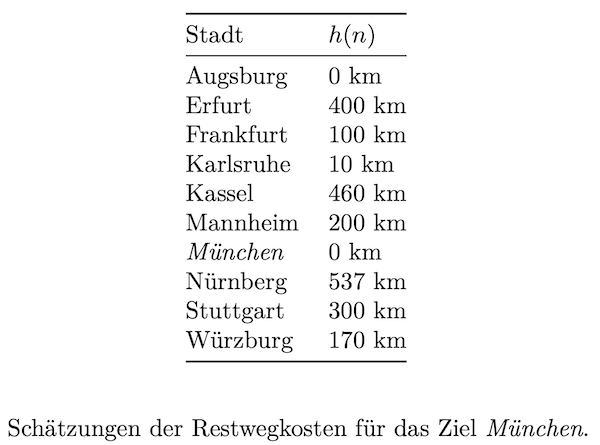

# Search: Suche mit Best First

> [!IMPORTANT]
>
> 

>
> 
<strong>🯠TL;DR</strong>

>
> Best First gehört wie Branch-and-Bound zu den “Informierten
> Suchverfahren”: Es werden Pfadkosten (in diesem Fall Schätzungen)
> statt der Anzahl der Schritte berücksichtigt.
>
> Best First arbeitet algorithmisch wie Branch-and-Bound, allerdings
> werden immer nur die geschätzten Restkosten eines Knotens zum Ziel
> berücksichtigt.
> 

> [!TIP]
>
> 

>
> 
<strong>🦠Videos</strong>

>
> - [VL Best First](https://youtu.be/dNyLOQuD_aI)
>
> 

## Hole das Buch

<picture><source media="(prefers-color-scheme: light)" srcset="images/graph_light.png"><source media="(prefers-color-scheme: dark)" srcset="images/graph_dark.png"></picture>

=\> **Problemlösen == Suche im Graphen**

**Informierte Suche: Nutzung der Kostenfunktion**:

**Gesamtkosten**: $`f(n) = g(n) + h(n)`$

- $`n \in S`$ auf aktuellem Weg erreichter Knoten
- $`g(n)`$ tatsächliche Kosten für Weg vom Start bis Knoten $`n`$
- $`h(n)`$ geschätzte Restkosten für Weg von Knoten $`n`$ zum Ziel =\>
  $`h(n)`$ wird auch “heuristische Funktion” oder “Heuristik” genannt

Varianten:

- [Branch-and-Bound](search3-branchandbound.md)
- **Best First**
- [A\*](search5-astar.md)

## Best-First (*BF*, *BFS*)

- Idee: Expandiere den partiellen Weg, der verspricht, dem Ziel am
  nächsten zu sein (**Heuristik**)

<!-- -->

- Kostenfunktion: $`f(n) = h(n)`$
- Datenstruktur: **sortierte Queue** (Prioritätsqueue)

<!-- -->

- Voraussetzungen: $`h(n)`$ positiv, $`h(n) = 0`$ für den Zielknoten

## Konventionen BF

In der Beschreibung der Algorithmen werden häufig nur die letzten Knoten
der partiellen Wege in den Datenstrukturen mitgeführt (das gilt auch für
die Beschreibung im ([Russell und Norvig 2021](#ref-Russell2021))). Dies
erschwert die Nachvollziehbarkeit, wenn man die Queue oder den Stack
schrittweise aufschreibt. Deshalb wird für diese Veranstaltung die
Konvention eingeführt, immer die **partiellen Wege** aufzuschreiben.

Auf dem Papier sortiert sich die Queue schlecht, deshalb können Sie
darauf verzichten, wenn Sie den im nächsten Schritt zu expandierenden
Weg unterstreichen. Wer nicht mit Unterstreichen arbeiten will, muss
eben dann manuell sortieren …

Wenn bei der Graph-Search-Variante ein Weg nicht in die Queue
aufgenommen wird, weil bereits ein anderer (günstigerer) Weg zum selben
(Zwischen-/End-) Knoten bereits in der Queue enthalten ist, schreiben
Sie dies geeignet auf. Dies gilt auch für den analogen Fall, wenn ein
Weg aus der Queue entfernt wird, weil ein günstigerer Weg zum selben
(Zwischen-/End-) Knoten eingefügt werden soll.

## Eigenschaften von BF

Siehe [A\*](search5-astar.md)

## Wrap-Up

- Informierte Suchverfahren
  - Nutzen reale Pfadkosten und/oder Schätzungen der Restkosten
  - Best-First: nur Schätzungen $`h(n)`$

## 📖 Zum Nachlesen

- Russell und Norvig ([2021](#ref-Russell2021)): Best First: Abschnitt
  3.5.1, Heuristiken: Kapitel 3.6

> [!NOTE]
>
> 

>
> 
<strong>✅ Lernziele</strong>

>
> - k2: Ich kann erklären, welche Datenstrukturen in Best First
>   verwendet werden und wie diese sich auswirken
> - k2: Ich kann die algorithmische Abläufe und die Terminierung von
>   Best First erklären
> - k2: Ich kann Optimalität, Vollständigkeit und Komplexität für Best
>   First erklären
> - k3: Ich kann Best First implementieren und auf ein konkretes
>   Beispiel anwenden
>
> 

> [!TIP]
>
> 

>
> 
<strong>🧩 Quizzes</strong>

>
> - [Selbsttest Best First
>   (ILIAS)](https://www.hsbi.de/elearning/goto.php?target=tst_1106599&client_id=FH-Bielefeld)
>
> 

> [!TIP]
>
> 

>
> 
<strong>🅠Challenges</strong>

>
> Betrachten Sie folgende Landkarte und Restwegschätzungen:
>
> 
>
> Quelle: [MapGermanyGraph.svg](https://commons.wikimedia.org/wiki/File:MapGermanyGraph.svg)
> by [Regnaron](https://de.wikipedia.org/wiki/Benutzer:Regnaron) and
> [Jahobr](https://commons.wikimedia.org/wiki/User:Jahobr) on Wikimedia
> Commons ([Public
> Domain](https://en.wikipedia.org/wiki/en:public_domain))
>
> <picture><source media="(prefers-color-scheme: light)" srcset="images/challenge_light.png"><source media="(prefers-color-scheme: dark)" srcset="images/challenge_dark.png"></picture>
>
> Finden Sie mit der **Best-First-Suche** jeweils einen Weg von Würzburg
> nach München. Vergleichen Sie das Ergebnis mit der Gradienten-Suche.
> 

------------------------------------------------------------------------

> [!NOTE]
>
> 

>
> 
<strong>👀 Quellen</strong>

>
> 

>
> 

>
> Russell, S., und P. Norvig. 2021. *Artificial Intelligence: A Modern
> Approach*. 4th Edition. Pearson. <http://aima.cs.berkeley.edu>.
>
> 

>
> 

>
> 

------------------------------------------------------------------------

Unless otherwise noted, this work is licensed under CC BY-SA 4.0.

**Exceptions:**

- [MapGermanyGraph.svg](https://commons.wikimedia.org/wiki/File:MapGermanyGraph.svg)
  by [Regnaron](https://de.wikipedia.org/wiki/Benutzer:Regnaron) and
  [Jahobr](https://commons.wikimedia.org/wiki/User:Jahobr) on Wikimedia
  Commons ([Public
  Domain](https://en.wikipedia.org/wiki/en:public_domain))

<blockquote>
<strong>Last modified:</strong> 756a3aa (lecture: use local images for challenges (Search4), 2025-10-15) 
</blockquote>
