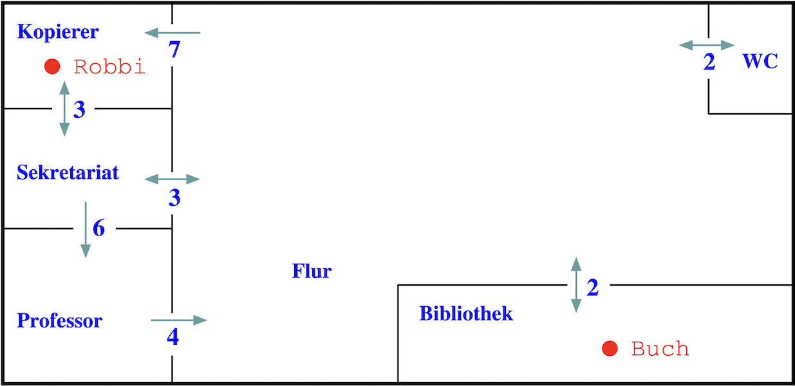

# Search: Suche mit A\*

> [!IMPORTANT]
>
> <details open>
>
> <summary><strong>🎯 TL;DR</strong></summary>
>
> A\* zählt zu den Verfahren der informierten Suche. Dabei verwendet A\*
> sowohl die realen Pfadkosten als auch die Schätzungen der Restkosten,
> d.h. die Kostenfunktion für A\* ist $`f(n) = g(n)+h(n)`$.
>
> A\* ist vollständig und optimal, allerdings muss die Heuristik bei der
> Tree-Search-Variante **zulässig** sein (d.h. sie muss *unterschätzen*,
> beispielsweise die Luft-Linie) und bei der Graph-Search-Variante muss
> sie **konsistent** sein (d.h. für jeden Knoten die
> Dreiecks-Ungleichung erfüllen).
>
> A\* hat wie BnB exponentiellen Aufwand. Durch die zusätzliche
> Verwendung der Heuristik werden die partiellen Pfade in der Queue aber
> geschickter sortiert, so dass A\* in der Regel mit weniger
> Suchschritten als BnB auskommt.
> </details>

> [!TIP]
>
> <details open>
>
> <summary><strong>🎦 Videos</strong></summary>
>
> - [VL A\*](https://youtu.be/eMkEN-HtEs8)
>
> </details>

## Hole das Buch

<div align="center">

<picture><source media="(prefers-color-scheme: light)" srcset="images/graph_light.png"><source media="(prefers-color-scheme: dark)" srcset="images/graph_dark.png"></picture>

</div>

=\> **Problemlösen == Suche im Graphen**

**Informierte Suche: Nutzung der Kostenfunktion**:

**Gesamtkosten**: $`f(n) = g(n) + h(n)`$

- $`n \in S`$ auf aktuellem Weg erreichter Knoten
- $`g(n)`$ tatsächliche Kosten für Weg vom Start bis Knoten $`n`$
- $`h(n)`$ geschätzte Restkosten für Weg von Knoten $`n`$ zum Ziel =\>
  $`h(n)`$ wird auch “heuristische Funktion” oder “Heuristik” genannt

Varianten:

- [Branch-and-Bound](search3-branchandbound.md)
- [Best First](search4-bestfirst.md)
- **A\***

## A\*-Suche

- Kombination aus Branch-and-Bound und Best-First-Suche

<!-- -->

- Kostenfunktion: $`f(n) = g(n) + h(n)`$
- Datenstruktur: **sortierte Queue** (Prioritätsqueue)

<!-- -->

- Voraussetzung:
  1.  Alle Aktionen haben positive Kosten ($`g(n) \ge \epsilon`$)
  2.  Heuristik $`h(n)`$ muss *zulässig/konsistent* sein

<div align="center">

<picture><source media="(prefers-color-scheme: light)" srcset="images/tafelbeispiel_light.png"><source media="(prefers-color-scheme: dark)" srcset="images/tafelbeispiel_dark.png"></picture>

</div>

## Konventionen für diese Lehrveranstaltung

In der Beschreibung der Algorithmen werden häufig nur die letzten Knoten
der partiellen Wege in den Datenstrukturen mitgeführt (das gilt auch für
die Beschreibung im ([Russell und Norvig 2021](#ref-Russell2021))). Dies
erschwert die Nachvollziehbarkeit, wenn man die Queue oder den Stack
schrittweise aufschreibt. Deshalb wird für diese Veranstaltung die
Konvention eingeführt, immer die **partiellen Wege** aufzuschreiben.

Notieren Sie die Bestandteile der Kosten für jeden partiellen Weg in der
Queue einzeln: “$`g(n) + h(n) = f(n)`$”. Das erleichtert Ihnen die
weiteren Schritte, da Sie dort ja nur mit $`g(n)`$ weiter rechnen
dürfen. Gleichzeitig erleichtert es die Nachvollziehbarkeit.

Auf dem Papier sortiert sich die Queue schlecht, deshalb können Sie
darauf verzichten, wenn Sie den im nächsten Schritt zu expandierenden
Weg unterstreichen. Wer nicht mit Unterstreichen arbeiten will, muss
eben dann manuell sortieren …

Wenn bei der Graph-Search-Variante ein Weg nicht in die Queue
aufgenommen wird, weil bereits ein anderer (günstigerer) Weg zum selben
(Zwischen-/End-) Knoten bereits in der Queue enthalten ist, schreiben
Sie dies geeignet auf. Dies gilt auch für den analogen Fall, wenn ein
Weg aus der Queue entfernt wird, weil ein günstigerer Weg zum selben
(Zwischen-/End-) Knoten eingefügt werden soll.

## A\*-Suche – Anforderungen an Heuristik (Tree-Search)

**Tree-Search-Variante**: Die Heuristik muss **zulässig** sein:

- Seien $`h^\star(n)`$ die tatsächlichen optimalen Restkosten von einem
  Knoten $`n`$ zum nächsten Ziel.
- Dann muss für jeden beliebigen Knoten $`n`$ gelten:

``` math
h(n) \le h^\star(n)
```

- Außerdem muss gelten:
  - $`h(n) \ge 0`$ für jeden Knoten $`n`$
  - $`h(n) = 0`$ für jeden Zielknoten $`n`$

=\> Beispiel: Luftlinie als Abschätzung

**Hinweis**: Im der englischen Ausgabe des ([Russell und Norvig
2021](#ref-Russell2021)) wird die **zulässige Heuristik** auch
“**admissible heuristic**” genannt.

## A\* ist optimal

A\* (Tree-Search-Variante) mit zulässiger Heuristik ist optimal.

Beweis siehe Übung :-)

## Einfache Verbesserungen A\* (Tree-Search)

- Dynamische Programmierung: Behalte von mehreren Pfaden zum gleichen
  Knoten nur den günstigsten in der Queue

- Pfade, deren Endknoten bereits früher im Pfad vorkommt (Schleifen),
  werden in Schritt 2 nicht in die Queue aufgenommen

<!-- -->

- Übergang zur Graph-Search-Variante und Markierung von Knoten

  =\> Achtung: Dann schärfere Anforderungen an Heuristik (Konsistenz)

## A\*-Suche – Anforderungen an Heuristik (Graph-Search)

**Graph-Search-Variante**: Die Heuristik muss **konsistent** sein:

Für jeden Knoten $`n`$ und jeden durch eine Aktion $`a`$ erreichten
Nachfolger $`m`$ gilt:
``` math
h(n) \le c(n,a,m) + h(m)
```
mit $`c(n,a,m)`$ Schrittkosten für den Weg von $`n`$ nach $`m`$ mit
Aktion $`a`$.

Außerdem muss gelten:

- $`h(n) \ge 0`$ für jeden Knoten $`n`$
- $`h(n) = 0`$ für jeden Zielknoten $`n`$

=\> Eine konsistente Heuristik ist gleichzeitig zulässig.

**Hinweis**: Im der englischen Ausgabe des ([Russell und Norvig
2021](#ref-Russell2021)) wird die **konsistente Heuristik** auch
“**consistent heuristic**” genannt.

## Eigenschaften Branch-and-Bound, Best-First, A\*

|  | **Branch-and-Bound** | **Best-First** | **A\*** |
|:---|:---|:---|:---|
| Kosten | $`f(n) = g(n)`$ | $`f(n) = h(n)`$ | $`f(n) = g(n) + h(n)`$ |
| Vollständigkeit | ja[^1] | nein[^2] | ja |
| Optimalität | ja | nein | ja |
| Aufwand | exponentiell | exponentiell | exponentiell |
| Bemerkung | Probiert erst alle “kleinen” Pfade | Suchverlauf stark abh. v. Heuristik | Heuristik: zulässig bzw. konsistent |

## Wrap-Up

- Informierte Suchverfahren
  - Nutzen reale Pfadkosten und/oder Schätzungen der Restkosten
  - A\*: komplette Kostenfunktion $`f(n) = g(n)+h(n)`$ =\> besondere
    Anforderungen an die Heuristik! (Tree-Search: *zulässige* Heuristik;
    Graph-Search: *konsistente* Heuristik)

<!-- -->

- Ausblick auf Verbesserungen der vorgestellten Suchverfahren:
  - Beschränkung der Suchtiefe (“Depth-Limited-Search”)
  - Iterative Vertiefung der Suchtiefe (“Iterative-Deepening-Search”),
    beispielsweise IDA\* (“Iterative-Deepening A\*”)
  - Beschränkung des verwendeten Speichers, beispielsweise SMA
    *(“Simplified Memory-Bounded A*”)

## 📖 Zum Nachlesen

- Russell und Norvig ([2021](#ref-Russell2021)): A\*: Abschnitt 3.5.2,
  Heuristiken: Kapitel 3.6

> [!NOTE]
>
> <details>
>
> <summary><strong>✅ Lernziele</strong></summary>
>
> - k2: Ich kann erklären, welche Datenstrukturen in A\* verwendet
>   werden und wie diese sich auswirken
> - k2: Ich kann die algorithmische Abläufe und die Terminierung von A\*
>   erklären
> - k2: Ich kann Optimalität, Vollständigkeit und Komplexität für A\*
>   erklären
> - k2: Ich kann die Bedingung(en) an Restkostenabschätzung bei A\*
>   erklären
> - k3: Ich kann A\* implementieren und auf ein konkretes Beispiel
>   anwenden
>
> </details>

> [!TIP]
>
> <details>
>
> <summary><strong>🧩 Quizzes</strong></summary>
>
> - [Selbsttest A\*
>   (ILIAS)](https://www.hsbi.de/elearning/goto.php?target=tst_1106600&client_id=FH-Bielefeld)
>
> </details>

> [!TIP]
>
> <details>
>
> <summary><strong>🏅 Challenges</strong></summary>
>
> **Informierte und uninformierte Suche**
>
> Betrachten Sie folgendes Problem:
>
> <picture><source media="(prefers-color-scheme: light)" srcset="images/challenges_robby_light.png"><source media="(prefers-color-scheme: dark)" srcset="images/challenges_robby_dark.png"></picture>
>
> Dargestellt ist eine typische Büroumgebung mit verschiedenen Räumen
> und einem Flur. Die Pfeile in den Durchgängen geben an, in welche
> Richtung der jeweilige Durchgang durchschritten werden darf. Die Werte
> an den Pfeilen geben die Kosten für den Übergang von einem Raum in den
> anderen an.
>
> Ein Roboter `Robbi`, der sich zunächst im Kopierer-Raum aufhält, soll
> den Weg zur Bibliothek finden und dort das Buch aufnehmen. Der Roboter
> kann sich immer nur entlang den Pfeilen in einen Nachbarraum bewegen
> (Aktion `move`). Die Kosten für das Aufnehmen des Buches betragen 3
> Einheiten (Aktion `take`). Weitere Aktionen gibt es nicht.
>
> 1.  Zeichnen Sie den Problemgraphen. Markieren Sie Start- und
>     Zielknoten.
> 2.  Finden Sie den Weg mit Tiefensuche und mit Breitensuche
>     (Tree-Search). Welche Unterschiede stellen Sie fest?
> 3.  Welche Wege würden mit der jeweiligen Graph-Search-Variante nicht
>     weiter untersucht?
> 4.  Suchen Sie nun einen Weg mit A\* (Tree-Search). Definieren Sie
>     zunächst Restkostenschätzungen. Was müssen Sie dabei beachten?
>
> </details>

------------------------------------------------------------------------

> [!NOTE]
>
> <details>
>
> <summary><strong>👀 Quellen</strong></summary>
>
> <div id="refs" class="references csl-bib-body hanging-indent">
>
> <div id="ref-Russell2021" class="csl-entry">
>
> Russell, S., und P. Norvig. 2021. *Artificial Intelligence: A Modern
> Approach*. 4th Edition. Pearson. <http://aima.cs.berkeley.edu>.
>
> </div>
>
> </div>
>
> </details>

------------------------------------------------------------------------


Unless otherwise noted, this work is licensed under CC BY-SA 4.0.

<blockquote><p><sup><sub><strong>Last modified:</strong> a6551fa (lecture: use local images for challenges (Search5), 2025-10-15)<br></sub></sup></p></blockquote>

[^1]: BnB vollständig: Kosten größer Epsilon (positiv)

[^2]: gilt für Tree-Search-Variante; vollständig bei Graph-Search und
    endlichen Problemräumen
