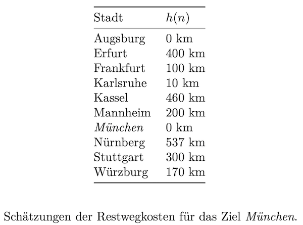

# Search: Lokale Suche - Gradientensuche

> [!IMPORTANT]
>
> 

>
> 
<strong>🎯 TL;DR</strong>

>
> Lokale Suchverfahren: Nur das Ergebnis zählt! Nicht der Weg ist das
> Ziel, sondern nur das Erreichen des Ziels.
>
> In Analogie zum Bergsteigen: Gehe in Richtung des stärksten Anstiegs
> kann man die Suche so formulieren, dass man in jedem Suchschritt den
> Nachfolgeknoten nach dem stärksten Anstieg der Kostenfunktion
> auswählen. Dieses Verfahren nennt sich auch **Hill-Climbing** (bzw.
> Gradientensuche).
> 

> [!TIP]
>
> 

>
> 
<strong>🎦 Videos</strong>

>
> - [VL Gradientensuche](https://youtu.be/TcTF9xdW3WU)
>
> 

## Unterschiede in den Suchproblemen?

<picture><source media="(prefers-color-scheme: light)" srcset="images/graph_light.png"><source media="(prefers-color-scheme: dark)" srcset="images/graph_dark.png"></picture>

<picture><source media="(prefers-color-scheme: light)" srcset="images/screenshot_stundenplan_light.png"><source media="(prefers-color-scheme: dark)" srcset="images/screenshot_stundenplan_dark.png"></picture>

Bisher betrachtete Suchverfahren:

- Systematische Erkundung des Suchraums
- **Weg** zur Lösung wichtig

=\> Oft aber nur das **Ziel an sich** interessant! (Und nicht, wie man
dort hin gelangt.)

Beispiel: Stundenplan

## Analogie: Bergsteigen ohne Karte und Pfade

<picture><source media="(prefers-color-scheme: light)" srcset="images/hill-climbing_light.png"><source media="(prefers-color-scheme: dark)" srcset="images/hill-climbing_dark.png"></picture>

**Gradienten-Suche**: “Gehe in Richtung des steilsten Anstiegs der
Zielfunktion.”

=\> Schrittweise Verbesserung des aktuellen Zustands (Lokale Suche)

- Verschiedene Namen: “Hill-climbing”, “Greedy local search”
- Kann auch als Minimierung angewendet werden

## Pseudoalgorithmus Gradientensuche

“*Wie Bergsteigen am Mount Everest in dickem Nebel mit
Gedächtnisverlust*”

1.  Setze `currNode` auf den Startknoten
2.  `currNode` ist gesuchtes Element: Abbruch, melde “*gefunden*”
    - Expandiere alle Nachfolger von `currNode`
    - Setze `nextNode` auf Nachfolger mit höchster Bewertung
    - Falls Bewertung von `nextNode` $`\leq`$ Bewertung von `currNode`:
      Abbruch, melde “*nicht gefunden*”
    - Setze `currNode` auf `nextNode`
3.  Gehe zu Schritt 2

<picture><source media="(prefers-color-scheme: light)" srcset="images/tafelbeispiel_light.png"><source media="(prefers-color-scheme: dark)" srcset="images/tafelbeispiel_dark.png"></picture>

## Beispiel Gradientensuche: $`n`$-Damen

- **Ziel**: Setze $`n`$ Damen auf ein $`n \times n`$-Spielfeld ohne
  Konflikte
- **Start**: Setze $`n`$ Damen auf ein $`n \times n`$-Spielfeld (mit
  Konflikten)
- **Suche**: Bewege jeweils eine Dame so, daß die Anzahl der Konflikte
  reduziert wird

Schauen Sie sich auch Abb. 4.3 auf Seite 130 im Russell und Norvig
([2021](#ref-Russell2021)) an!

**Hinweis**: Alle Damen stehen von Anfang an auf dem Brett und werden
nur verschoben =\> “vollständige Zustandsformulierung”

### Eigenschaften 8-Damen-Problem ($`n=8`$)

- Zustandsraum: $`8^8 \approx 17`$ Millionen Zustände!
- Beginnend mit zufällig erzeugtem Startzustand:
  - bleibt in 86% der Fälle stecken, d.h.
  - findet Lösung nur in 14% der Fälle.
- Beobachtung: Lösung nach durchschnittlich 4 Schritten, oder Verfahren
  bleibt nach durchschnittlich 3 Schritten stecken.

Quelle: nach ([Russell und Norvig 2021](#ref-Russell2021), p. 131)

## Eigenschaften Gradientensuche

- Vollständigkeit: nein
- Optimalität: nein
- Komplexität: linear in der Anzahl der zu expandierenden Knoten

**Zielfunktion (Bewertung) nötig!**

<picture><source media="(prefers-color-scheme: light)" srcset="images/hill-climbing_light.png"><source media="(prefers-color-scheme: dark)" srcset="images/hill-climbing_dark.png"></picture>

**Problem**: lokale Maxima und Plateaus

- Lokale Maxima/Minima: Algorithmus findet nur eine suboptimale Lösung
- Plateaus: Hier muss der Algorithmus mit zufälligen Zügen explorieren

## Wrap-Up

Lokale Suchverfahren: Nur das Ergebnis zählt!

- Gradientenverfahren: Gehe in Richtung des stärksten Anstiegs der
  Kostenfunktion

## 📖 Zum Nachlesen

- Russell und Norvig ([2021](#ref-Russell2021)): Gradientenabstieg:
  Abschnitt 4.1.1

> [!NOTE]
>
> 

>
> 
<strong>✅ Lernziele</strong>

>
> - k2: Ich kann die Problematik der lokalen Minima bei
>   Gradientenverfahren erklären
> - k3: Ich kann die lokale Suche (Gradientenabstieg) auf ein konkretes
>   Problem anwenden
>
> 

> [!TIP]
>
> 

>
> 
<strong>🧩 Quizzes</strong>

>
> - [Selbsttest Gradientensuche
>   (ILIAS)](https://www.hsbi.de/elearning/goto.php?target=tst_1106601&client_id=FH-Bielefeld)
>
> 

> [!TIP]
>
> 

>
> 
<strong>🏅 Challenges</strong>

>
> Betrachten Sie folgende Landkarte und Restwegschätzungen:
>
> 
>
> Quelle: <a href="https://commons.wikimedia.org/wiki/File:MapGermanyGraph.svg"
> width="40%">MapGermanyGraph.svg</a> by
> [Regnaron](https://de.wikipedia.org/wiki/Benutzer:Regnaron) and
> [Jahobr](https://commons.wikimedia.org/wiki/User:Jahobr) on Wikimedia
> Commons ([Public
> Domain](https://en.wikipedia.org/wiki/en:public_domain))
>
> <picture><source media="(prefers-color-scheme: light)" srcset="images/challenge_light.png"><source media="(prefers-color-scheme: dark)" srcset="images/challenge_dark.png"></picture>
>
> Finden Sie mit der **Gradienten-Suche** jeweils einen Weg von Würzburg
> nach München. Vergleichen Sie das Ergebnis mit der Best-First-Suche.
> 

------------------------------------------------------------------------

> [!NOTE]
>
> 

>
> 
<strong>👀 Quellen</strong>

>
> 

>
> 

>
> Russell, S., und P. Norvig. 2021. *Artificial Intelligence: A Modern
> Approach*. 4th Edition. Pearson. <http://aima.cs.berkeley.edu>.
>
> 

>
> 

>
> 

------------------------------------------------------------------------

Unless otherwise noted, this work is licensed under CC BY-SA 4.0.

**Exceptions:**

- <a href="https://commons.wikimedia.org/wiki/File:MapGermanyGraph.svg"
  width="40%">MapGermanyGraph.svg</a> by
  [Regnaron](https://de.wikipedia.org/wiki/Benutzer:Regnaron) and
  [Jahobr](https://commons.wikimedia.org/wiki/User:Jahobr) on Wikimedia
  Commons ([Public
  Domain](https://en.wikipedia.org/wiki/en:public_domain))

<blockquote>
<strong>Last modified:</strong> 6a8bc1e (lecture: use local images for challenges (Search6), 2025-10-15) 
</blockquote>
