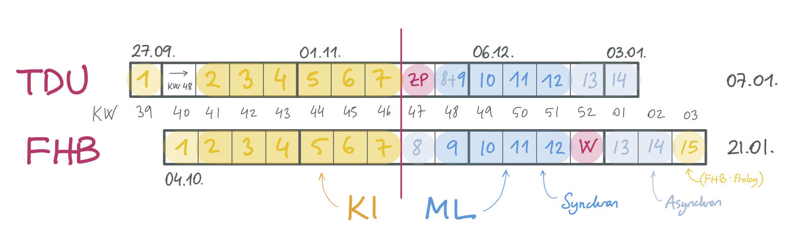

# IFM 5.14 / TBD: Künstliche Intelligenz (Winter 2022/23)

## Kursbeschreibung

TBD

## Team

### Dozenten

-   [Canan Yıldız](mailto:canan.yildiz@tau.edu.tr)
-   [Carsten Gips](https://www.fh-bielefeld.de/minden/ueber-uns/personenverzeichnis/carsten-gips)

### Mitarbeiter/Lehrbeauftragte

-   TBD (TDU)

## Kursformat

{width="90%"}

### Vorlesung: 2 SWS

| FHB                        | TDU                        |
|:---------------------------|:---------------------------|
| Mi, 09:30 - 11:00 Uhr (DE) | Mi, 10:30 - 12:00 Uhr (TR) |
| online/J101                | online/TBD                 |

Durchführung als **Flipped Classroom**: Sitzungen per Zoom (**Zugangsdaten siehe [ILIAS]**)

### Übung / Praktikum: 2 SWS

|    | FHB                          | TDU                        |
|:---|:-----------------------------|:---------------------------|
| G1 | Mi, 11:30 bis 13:00 Uhr (DE) | Mi, 12:30 - 14:00 Uhr (TR) |
| G2 | Mi, 13:00 bis 14:30 Uhr (DE) | Mi, 14:00 - 15:30 Uhr (TR) |
| G2 | -                            | Mi, XX:XX - XX:XX Uhr (TR) |
|    | online/J101                  | online/TBD                 |

Sitzungen per Zoom (**Zugangsdaten siehe [ILIAS]**)

### Zeitumstellung

**_TDU_: Alle Zeiten ab 31.10.22 _+1 Stunde_ später!**

[ILIAS]: https://www.fh-bielefeld.de/elearning/goto.php?target=crs_1091712&client_id=FH-Bielefeld

### Prüfungsform

Siehe `["Hinweise zur Prüfung"]()`{=markdown} zu Details.

## Materialien

Siehe `["Ressourcen"]()`{=markdown} zu Details.

## Fahrplan

``{=markdown}
