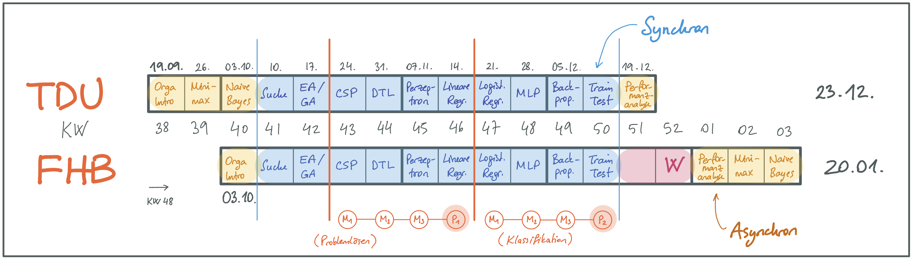

# IFM 5.14 / INF701: Künstliche Intelligenz (Winter 2022/23)

{width="60%"}

[Quelle: ["künstliche intelligenz"](https://pixabay.com/de/illustrations/k%c3%bcnstliche-intelligenz-netzwerk-3706562/) by [Gerd Altmann (geralt)](https://pixabay.com/de/users/geralt-9301/) on Pixabay.com ([Pixabay License](https://pixabay.com/de/service/license/))]{.origin}

## Kursbeschreibung

Ausgehend von den Fragen "Was ist _Intelligenz_?" und "Was ist _künstliche_ Intelligenz?"
werden wir uns in diesem Modul mit verschiedenen Teilgebieten der KI beschäftigen und
uns anschauen, welche Methoden und Algorithmen es gibt und wie diese funktionieren. Dabei
werden wir auch das Gebiet _Machine Learning_ berühren, aber auch andere wichtige Gebiete
betrachten. Sie erarbeiten sich im Laufe der Veranstaltung einen Methoden-Baukasten zur
Lösung unterschiedlichster Probleme und erwerben ein grundlegendes Verständnis für die
Anwendung in Spielen, Navigation, Planung, smarten Assistenten, autonomen Fahrzeugen, ...

Siehe `["Syllabus"]()`{=markdown} zu Details.

## Kooperation zw. FHB und TDU

Über das Projekt "Digital Mobil @ FH Bielefeld" der Fachhochschule Bielefeld (FHB) ist im
Sommer 2020 eine Kooperation mit der Türkisch-Deutschen Universität in Istanbul (TDU) im
Modul "Künstliche Intelligenz" gestartet.

Wir werden in diesem Semester die Vorlesungen und auch die Übungen/Praktika wieder im
Co-Teaching durchführen. In den Zoom-Sitzungen nehmen deshalb alle Studierenden
gemeinsam (TDU und FHB) teil.

## Team

-   [Carsten Gips](https://www.fh-bielefeld.de/minden/ueber-uns/personenverzeichnis/carsten-gips)
-   [Canan Yıldız](http://people.tau.edu.tr/people.show/cananyildiz/de)
-   [Ayşe Betül Yüce](http://people.tau.edu.tr/people.show/abyuce/de) (TDU)

## Kursformat

{width="80%"}

### Vorlesung: 2 SWS

| FHB (03.10.22 - 20.01.23)  | TDU (19.9.22 - 28.10.22)   | TDU (31.10.22 - 23.12.22)  |
|:---------------------------|:---------------------------|:---------------------------|
| Mi, 09:30 - 11:00 Uhr (DE) | Mi, 10:30 - 12:00 Uhr (TR) | Mi, 11:30 - 13:00 Uhr (TR) |
| online/J101                | online                     | online                     |

Durchführung als **Flipped Classroom**: Sitzungen per Zoom (**Zugangsdaten siehe [ILIAS]/[Moodle]**)

### Übung / Praktikum: 2 SWS

|    | FHB (03.10.22 - 20.01.23)    | TDU (19.9.22 - 28.10.22)   | TDU (31.10.22 - 23.12.22)  |
|:---|:-----------------------------|:---------------------------|:---------------------------|
| G1 | Mi, 11:30 bis 13:00 Uhr (DE) | Mi, 12:30 - 14:00 Uhr (TR) | Mi, 13:30 - 15:00 Uhr (TR) |
| G2 | Mi, 13:00 bis 14:30 Uhr (DE) | Mi, 14:00 - 15:30 Uhr (TR) | Mi, 15:00 - 16:30 Uhr (TR) |
| G3 | -                            | Mi, 16:30 - 18:00 Uhr (TR) | Mi, 17:30 - 19:00 Uhr (TR) |
|    | online/J101                  | online                     | online                     |

**Zugangsdaten siehe [ILIAS]/[Moodle]**

[ILIAS]: https://www.fh-bielefeld.de/elearning/goto.php?target=crs_1091712&client_id=FH-Bielefeld
[Moodle]: https://muh.moodle.tau.edu.tr/course/view.php?id=3

### Prüfungsform, Note und Credits

Hier finden Sie Informationen zum Ablauf der Übungen bzw. der Praktika sowie zu den jeweiligen Prüfungsformen:

| FHB                                                               | TDU                                                               |
|:------------------------------------------------------------------|:------------------------------------------------------------------|
| `[Note und Credits]()`{=markdown}   | `[Note und Credits]()`{=markdown}   |
| `[Prüfungsvorbereitung]()`{=markdown} | `[Prüfungsvorbereitung]()`{=markdown} |

## Materialien

1.  ["**Artificial Intelligence: A Modern Approach**"](http://aima.cs.berkeley.edu/) (_AIMA_).
    Russell, S. und Norvig, P., Pearson, 2020.
    ISBN [978-0134610993](https://www.digibib.net/openurl/Bi10?isbn=978-0134610993).

2.  "Introduction to Artificial Intelligence".
    Ertel, W., Springer, 2017.
    ISBN [978-3-319-58487-4](https://www.digibib.net/openurl/Bi10?isbn=978-3-319-58487-4).
    DOI [10.1007/978-3-319-58487-4](https://doi.org/10.1007/978-3-319-58487-4).

Weitere empfohlene Literatur siehe `["Ressourcen"]()`{=markdown}.

## Fahrplan

``{=markdown}

**Hinweis**: Abgabe der Hausaufgaben bis jeweils 08:00 Uhr (DE), Deadline für das Feedback
je bis 04:00 Uhr (DE) am angegebenen Tag (jeweils im ILIAS). Studierende der TDU beachten
bitte die Zeitverschiebung: bis 28.10.22 +1 h, ab 31.10.22 +2 h.
