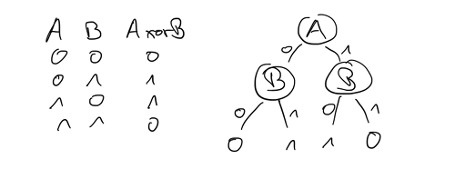

## Entscheidungsbäume: Klassifikation

::: center
{width="80%"}
:::

\bigskip

*   Attribute als Knoten im Baum
*   Ausprägungen als Test (Ausgang, Verzweigung)
*   Klasse (Funktionswert) als Blatt

::: notes
Erinnern Sie sich an das Beispiel mit der Auto-Reparatur aus der letzten Sitzung.

Die relevanten Eigenschaften (Merkmale) eines Autos würden als Knoten im Baum
repräsentiert. Beispiel: "Motor startet" oder "Farbe".

Jedes Merkmal hat eine Anzahl von möglichen Ausprägungen, diese entsprechen den
Verzweigungen am Knoten. Beispiel: "startet", "startet nicht" oder "rot", "weiß", "silber", ... .

Entsprechend kann man durch Abarbeiten des Entscheidungsbaumes am Ende zu einer
Diagnose gelangen (Klasse).

Eine andere Sichtweise ist die Nutzung als Checkliste für eine Reparatur ...
:::

## Definition Entscheidungsbaum

\bigskip

*   Erinnerung: **Merkmalsvektor** für Objekt $v$:
    $$
        \mathbf{x}(v) = (x_1, x_2, \ldots, x_n)
    $$

    *   $n$ Merkmale (Attribute)
    *   Attribut $x_t$ hat $m_t$ mögliche Ausprägungen
    *   Ausprägung von $v$ bzgl. $x_t$: $\quad x_t(v) = i \quad$ (mit $i = 1 \ldots m_t$)

\smallskip

*   **Alphabet** für Baum:
    $$
        \lbrace x_t | t=1,\ldots,n \rbrace \cup \lbrace \kappa | \kappa = \ast,A,B,C,\ldots \rbrace \cup \lbrace (,) \rbrace
    $$

\smallskip

*   **Entscheidungsbaum** $\alpha$:
    $$
        \alpha = \left\lbrace  \begin{array}{ll}
            \kappa  & \text{Terminalsymbole: } \kappa = \ast,A,B, \ldots\\
            x_t(\alpha_1, \alpha_2, \ldots, \alpha_{m_t}) & x_t \text{ Testattribut mit } m_t \text{ Ausprägungen}
        \end{array}\right.
    $$

::: notes
*Anmerkung*: Stellen Sie sich die linearisierte Schreibweise wieder
wie den (verschachtelten) Aufruf von Konstruktoren vor. Es gibt die
Oberklasse `Baum`, von der für jedes Attribut eine Klasse abgeleitet
wird. D.h. der Konstruktor für eine Attributklasse erzeugt letztlich
ein Objekt vom Obertyp `Baum`. Außerdem sind die Terminalsymbole `A`,
`B`, ... Objekte vom Typ `Blatt`, welches eine Unterklasse von `Baum`
ist ...

Dabei wird die Anzahl der möglichen Ausprägungen für ein Attribut
berücksichtigt: Jede Ausprägung hat einen Parameter im Konstruktor.
Damit werden die Unterbäume beim Erzeugen des Knotens übergeben.
:::

## Induktion von Entscheidungsbäumen: CAL2

1)  Anfangsschritt: $\alpha^{(0)} = \ast$ (totales Unwissen)

2)  $n$-ter Lernschritt: Objekt $v$ mit Klasse $k$, Baum $\alpha^{(n-1)}$
    gibt $\kappa$ aus
    -   $\kappa = \ast$: ersetze $\ast$ durch $k$
    -   $\kappa = k$: keine Aktion nötig
    -   $\kappa \neq k$: Fehler
        *   Ersetze $\kappa$ mit neuem Test: $\kappa \gets x_{t+1}(\ast, \ldots, \ast, k, \ast, \ldots, \ast)$
        *   $x_{t+1}$: nächstes Attribut, auf dem aktuellen Pfad noch nicht verwendet
        *   Symbol $k$ an Position $i$ wenn $x_{t+1}(v) = i$

::: notes
$\alpha^{(n)}$ bezeichnet den Baum im $n$-ten Lernschritt.

CAL2 ist ein **Meta-Algorithmus**: Es ist ein Algorithmus, um einen Algorithmus
zu lernen :-)
:::

## Beispiel mit CAL2

| $x_1$ | $x_2$ | $x_3$ | $k$ |
|:------|:------|:------|:----|
| 0     | 0     | 1     | A   |
| 1     | 0     | 0     | A   |
| 0     | 1     | 4     | B   |
| 1     | 1     | 2     | B   |
| 0     | 0     | 3     | A   |

[Tafelbeispiel CAL2]{.bsp}

\bigskip
\pause

**Ergebnis**: $x_1(x_2(A, B), x_2(A, B))$

::: notes
*Anmerkung*: Denken Sie an die Analogie von oben. $x_1$ kann als
Konstruktor einer Klasse `x1` betrachtet werden, die eine Unterklasse
von `Baum` ist. Durch den Aufruf des Konstruktors wird als ein `Baum`
erzeugt.

Es gibt in $x_1$ zwei mögliche Ausprägungen, d.h. der Baum hat in
diesem Knoten zwei alternative Ausgänge. Diese Unterbäume werden
dem Konstruktor von `x1` direkt beim Aufruf übergeben (müssen also
Referenzen vom Typ `Baum` sein).
:::

## CAL2: Bemerkungen

*   Nur für diskrete Merkmale und disjunkte Klassen

\smallskip

*   Zyklischer Durchlauf durch Trainingsmenge
*   Abbruch:
    *   Alle Trainingsobjekte richtig klassifiziert \newline
        => Kein Fehler in einem kompletten Durchlauf
    *   (Differenzierung nötig, aber alle Merkmale verbraucht)
    *   (Lernschrittzahl überschritten)

## Wrap-Up

*   Darstellung der Hypothese als Entscheidungsbaum
*   CAL2: diskrete Attribute, disjunkte Klassen

<!-- DO NOT REMOVE - THIS IS A LAST SLIDE TO INDICATE THE LICENSE AND POSSIBLE EXCEPTIONS (IMAGES, ...). -->
::: slides
## LICENSE

Unless otherwise noted, this work is licensed under CC BY-SA 4.0.
:::
