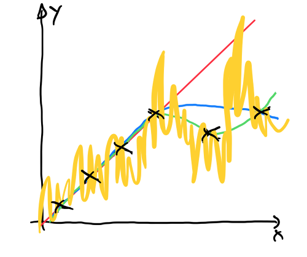

## Was ist Lernen?

\pause

\Large

> Verhaltensänderung eines Agenten in Richtung der Optimierung eines
> Gütefunktionals (Bewertungsfunktion) durch Erfahrung.

\normalsize

::: notes
## Warum Lernen?

*   Nicht alle Situationen vorhersehbar
*   Nicht alle Details modellierbar
*   Lösung oder Lösungsweg unbekannt, nicht explizit programmierbar
*   Data Mining: Entdeckung neuen Wissens durch Analyse der Daten
*   Selbstanpassende Programme

\bigskip

=> Lernen wichtige Eigenschaft lebender Wesen :-)
:::

[[Warum Lernen?]{.bsp}]{.slides}

## Learning Agent

::: center
{height="80%"}

TODO => Umwelt/Agent/Feedback-Schleife
:::

## Feedback während des Lernens

*   **Überwachtes Lernen**
    *   Lernen durch Beobachtung
    *   Vorgabe von Beispielen:  Ein- und Ausgabewerte

    => Regression, [Klassifikation]{.alert}

\bigskip

*   **Unüberwachtes Lernen**
    *   Erkennen von Mustern in den Inputdaten, Clustering
    *   Kein Feedback (!)

\bigskip

*   **Reinforcement Lernen**
    *   Bewertung der Aktionen des Agenten am Ende einer Aktionsfolge

[Analogie Lernen beim Kleinkind]{.bsp}

::: notes
**Beispiel Kleinkind**: Lernen von Klassen/Konzepten durch Beispiele

*   zuerst ist alles "Katze" (Übergeneralisierung)
*   Differenzierung durch Feedback der Umwelt; Erkennung unterschiedlicher Ausprägungen
:::

## Beispiel: Kreditrisiko

*   Bankkunde beantragt Kredit
*   Soll er aus Sicht der Bank den Kredit bekommen?

\smallskip

*   Bankangestellter betrachtet (relevante) Merkmale des Kunden:
    *   Alter, Einkommen, sozialer Status
    *   Kundenhistorie bei der Bank
    *   Höhe des Kredits

\bigskip

*   Bewertung des Kreditrisikos:
    *   **Klassifikation**: Guter oder schlechter Kunde  [(Binäre Entscheidung: 2 Klassen)]{.notes}
    *   **Regression**: Vorhersage Gewinn/Verlust für die Bank  [(Höhe des Gewinns/Verlusts interessant)]{.notes}

::: notes
*   Bewertung soll verbessert/angepasst werden:
    *   Vorgabe von Kundenbeschreibungen und Bewertung aus der Vergangenheit
    *   Lernen: Anpassung der internen Regeln, Bewertungen, ...
    *   Anwendung: Bessere Vorhersage für neue Kunden
:::

[[Anpassung/Verbesserung der Bewertung]{.bsp}]{.slides}

## Beispiel: Autoreparatur

*   **Gegeben**: Eigenschaften eines Autos

    => Eigenschaften: Ausprägungen der Merkmale

\bigskip

*   **Gesucht**: Diagnose und Reparaturanleitung

    => Hypothese über den Merkmalen (Funktion $\operatorname{h}$)

## Lernen durch Beobachten: Lernen einer Funktion $\operatorname{f}$

::: notes
Funktionsapproximation: Lernen einer Funktion $\operatorname{f}$ anhand von Beispielen
:::

*   Ein Beispiel ist ein Tupel $\left(\mathbf{x}, \operatorname{f}(\mathbf{x})\right)$, etwa
    $\left(\begin{array}{ccc}
        \text{O}&\text{O}&\text{X} \\
        \text{.}&\text{X}&\text{.} \\
        \text{X}&\text{.}&\text{.}
    \end{array}, +1\right)$

\bigskip

*   Aufgabe: Baue Hypothese $\operatorname{h}$ auf, so dass $\operatorname{h} \approx \operatorname{f}$.
    *   Benutze dazu Menge von Beispielen => [**Trainingsdaten**]{.alert}.

\bigskip

*   Ziele:
    1.  **Konsistente Hypothese**: Übereinstimmung bei Trainingsdaten
    2.  **Generalisierende Hypothese**: Korrekte Vorhersage bei
        unbekannten Daten

::: notes
*Anmerkung*: Stark vereinfachtes Modell realen Lernens!
:::

## Konstruieren einer konsistenten Hypothese

::: center
{width="60%"}

[Quelle: nach [@Russell2014]]{.origin}
:::

::: notes
Welcher Zusammenhang ist hier dargestellt? Offenbar eine Art Funktionsverlauf ...
:::

## Konstruieren einer konsistenten Hypothese (cnt.)

::: center
{width="60%"}

[Quelle: nach [@Russell2014]]{.origin}
:::

::: notes
Die einfachste Approximation wäre eine lineare Funktion. Allerdings werden hierbei
einige Werte mehr oder weniger stark nicht korrekt widergegeben, d.h. man hat einen
relativ hohen (Trainings-) Fehler.
:::

## Konstruieren einer konsistenten Hypothese (cnt.)

::: center
{width="60%"}

[Quelle: nach [@Russell2014]]{.origin}
:::

::: notes
Die Hyperbel erklärt die Trainingsdaten bis auf den einen Punkt sehr gut.
Die Frage ist, ob dieser eine Punkt zum zu lernenden Zusammenhang gehört
oder ein Ausreißer ist, den man gefahrlos ignorieren kann?
:::

## Konstruieren einer konsistenten Hypothese (cnt.)

::: center
{width="60%"}

[Quelle: nach [@Russell2014]]{.origin}
:::

::: notes
Die grüne Hypothese ist von allen bisher gezeigten die komplexeste, erklärt
aber alle Datenpunkte. D.h. hier wäre der Trainingsfehler Null. Zwischen den
Trainingsdaten zeigt das Modell eine "glatte" Approximation, d.h. es wird auch
neue Daten, die es beim Training nicht gesehen hat, relativ gut erklären.
(Dabei liegt freilich die Annahme zugrunde, dass alle relevanten Daten in der
Trainingsmenge vorhanden sind, d.h. dass es insbesondere zwischen den Datenpunkten
keine Ausreißer o.ä. gibt.)
:::

## Konstruieren einer konsistenten Hypothese (cnt.)

::: center
{width="60%"}

[Quelle: nach [@Russell2014]]{.origin}
:::

::: notes
Diese Hypothese erklärt ebenfalls sämtliche Trainingsdaten. Allerdings schwingt
die Funktion zwischen den Daten stark hin und her. Vermutlich entspricht dies
nicht dem zu lernenden Funktionsverlauf. Der Trainingsfehler wäre wie bei der
deutlich einfacheren Hypthese aus dem letzten Schritt Null. Der Generalisierungsfehler
(sprich die Abweichung, wenn man das Modell nach Daten zwischen den Trainingspunkten
fragt) dürfte erheblich höher liegen.

D.h. hier hat das Modell einfach die Trainingsdaten auswendig gelernt, aber nicht
den Zusammenhang zwischen den Daten! Dies ist in der Regel unerwünscht!
:::

## Occam's Razor

\large

**Bevorzuge die einfachste konsistente Hypothese!**

\normalsize

::: notes
1.  Wenn es mehrere mögliche Erklärungen für einen Sachverhalt gibt, ist die
    einfachste Erklärung allen anderen vorzuziehen.
2.  Eine Erklärung ist "einfach", wenn sie möglichst wenige Variablen und
    Annahmen enthält und wenn diese in klaren logischen Beziehungen zueinander
    stehen, aus denen der zu erklärende Sachverhalt logisch folgt.
:::

## Trainingsdaten und Merkmalsvektoren

Lehrer gibt Beispiele vor: Eingabe $\mathbf{x}$ und passende Ausgabe $\operatorname{f}(\mathbf{x})$

\smallskip

*   Ausgabe: typischerweise Skalar (Funktionswert oder Klasse) \newline
    => Beispiel: Bewertung eines Spielstandes bei TicTacToe

\smallskip

*   Eingabe: (Beschreibung des) Objekt(s) oder Situation, die zur Ausgabe gehört \newline
    => Beispiel: Spielstand bei TicTacToe

\bigskip
\bigskip

**Merkmalsvektoren**:

*   Zusammenfassen der [relevanten Merkmale]{.alert} zu [Vektoren]{.alert}

## Beispiel: Schwimmen im See

| Beispiel | Himmel  | Lufttemp. | Wassertemp. | Wind      | Schwimmen? |
|:---------|:--------|:----------|:------------|:----------|:-----------|
| 1        | sonnig  | warm      | warm        | windstill | ja         |
| 2        | sonnig  | kalt      | warm        | stürmisch | nein       |
| 3        | sonnig  | warm      | warm        | brise     | ja         |
| 4        | bewölkt | kalt      | kalt        | windstill | nein       |
| 5        | regen   | kalt      | warm        | windstill | ja         |

TODO

[Quelle: nach [@Mitchell2010]]{.origin}

\bigskip

*   Trainingsbeispiel 1:
    *   Eingabe: Merkmalsvektor `(sonnig, warm, warm, windstill)`
    *   Ausgabe: Klasse `ja`

## Trainingsdaten -- Merkmalsvektoren

**Generell**: Merkmalsvektor für Objekt $v$:
$$
    \mathbf{x}(v) = (x_1, x_2, \ldots, x_n)
$$

*   $n$ Merkmale (Attribute)
*   Attribut $x_t$ hat $m_t$ mögliche Ausprägungen
*   Ausprägung von $v$ bzgl. $x_t$: $\quad x_t(v) = i \quad$ (mit $i = 1 \ldots m_t$)

::: notes
*Anmerkung*: Stellen Sie sich den Merkmalsvektor \mathbf{x} vielleicht wie
einen Konstruktor einer Klasse `x` vor: Die einzelnen Attribute $x_t$ sind
die Parameter, aus denen der Merkmalsvektor aufgebaut ist/wird. Jedes der
Attribute hat einen Typ und damit eine bestimmte Anzahl erlaubter Werte
("Ausprägungen") ...
:::

\bigskip
\bigskip

**Trainingsbeispiel**:

*   Tupel aus Merkmalsvektor und zugehöriger Klasse: $\left(\mathbf{x}(v), k\right)$

[[Analogie Konstruktor Klasse $x$]{.bsp}]{.slides}

## Wrap-Up

*   Lernen ist Verhaltensänderung, Ziel: Optimierung einer Gütefunktion
    *   Aufbau einer Hypothese, die beobachtete Daten erklären soll
    *   Arten: Überwachtes Lernen, Unüberwachtes Lernen, Reinforcement Lernen

\smallskip

*   Merkmalsvektoren gruppieren Eigenschaften des Problems bzw. der Objekte
*   Trainingsdaten: Beispielobjekte (durch Merkmalsvektoren beschrieben) plus Vorgabe vom Lehrer

<!-- DO NOT REMOVE - THIS IS A LAST SLIDE TO INDICATE THE LICENSE AND POSSIBLE EXCEPTIONS (IMAGES, ...). -->
::: slides
## LICENSE

Unless otherwise noted, this work is licensed under CC BY-SA 4.0.

### Exceptions
*   TODO (what, where, license)
:::
