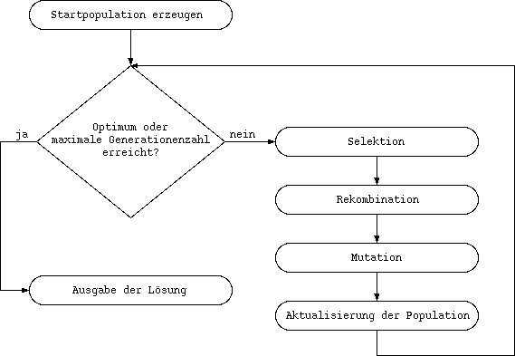

## Evolution sehr erfolgreich bei Anpassung

::: center
{width="80%"}
[[Human_evolution_scheme.svg](https://lizenzhinweisgenerator.de/wiki/File:Human_evolution_scheme.svg): [M. Garde](https://commons.wikimedia.org/wiki/User:Mgarde) derivative work: [Gerbil](https://commons.wikimedia.org/wiki/User:Gerbil) [(talk)](https://lizenzhinweisgenerator.de/wiki/User_talk:Gerbil), [Human evolution scheme (2)](https://commons.wikimedia.org/wiki/File:Human_evolution_scheme_(2).jpg), [CC BY-SA 3.0](https://creativecommons.org/licenses/by-sa/3.0/legalcode)]{.origin}
:::

::: cbox
[**Wie funktioniert's?**]{.alert}
:::

[kurze Diskussion]{.bsp}

## EA -- Zutaten und Mechanismen

*   Zutaten:
    *   **Individuen**: Kodierung möglicher Lösungen
    *   **Population** von Individuen
    *   **Fitnessfunktion**: Bewertung der Angepasstheit

\smallskip

*   Mechanismen ("Operatoren"):
    *   Selektion
    *   Rekombination (Crossover)
    *   Mutation

## EA -- Allgemeiner Ablauf

::: center

:::

## EA -- Beispiel

::: center
{width="70%"}
[Quelle: "Artificial Intelligence: A Modern Approach (Figures from text)" [@Russell2020figs, Fig. 4.5, S. 30][, Wiedergabe mit freundlicher Erlaubnis der Autoren]{.notes}]{.origin}
:::

::: notes
Jedes Individuum kodiert ein Spielfeld mit einer konkreten Anordnung **aller**
Königinnen => **Vollständige Zustandsbeschreibung**.

Dabei korrespondiert der Index in das Array des Individuums mit der jeweiligen
Spalte des Spielfelds. Die Zahl an einer Arrayposition gibt dann an, in welcher
Zeile in dieser Spalte eine Königin ist.
:::

::: center
{width="70%"}
[Quelle: "Artificial Intelligence: A Modern Approach (Figures from text)" [@Russell2020figs, Fig. 4.6, S. 30][, Wiedergabe mit freundlicher Erlaubnis der Autoren]{.notes}]{.origin}
:::

::: notes
Crossover: Die ausgewählten Individuen werden an der selben Stelle aufgetrennt
und die Hälften verkreuzt zu zwei neuen Individuen zusammengesetzt. Es entstehen
zwei neue Anordnungen der Königinnen (zwei neue Spielfelder).
:::

## EA -- Strömungen

1.  **Genetische Algorithmen** (GA)
    *   Holland und Goldberg (ab 1960)
    *   Binäre Lösungsrepräsentation (Bitstring): $\mathbf{g} = (g_1, \dots, g_m)\in \{ 0,1\}^m$
    *   Fitnessbasierte stochastische Selektion
    *   $\mu$ Eltern erzeugen $\mu$ Kinder

\smallskip

2.  **Evolutionsstrategien** (ES)
    *   Rechenberg und Schwefel (ab 1960)
    *   Kodierung reellwertiger Parameter: $\mathbf{g} = (\mathbf{x}, \sigma)$
        mit $\mathbf{x} = (x_1, \dots, x_n) \in \mathbb{R}^n$       <!-- XXX eigentlich $\mathbf{\sigma}$, aber das erkennt die Übersetzung nach HTML nicht -->
    *   $\mu$ Eltern erzeugen $\lambda$ Kinder mit $\mu \le \lambda$

\smallskip

3.  **Evolutionäre Programmierung** (EP)

::: notes
*Hinweis*: Häufig finden sich Mischformen, beispielsweise GA mit reellwertigen Parametern

*Hinweis*: Im Folgenden werden **Genetische Algorithmen** (GA) betrachtet. Sie
finden jeweils Hinweise auf die Gestaltung der Operatoren bei ES.
:::

### Anwendungsbeispiele für Evolutionäre Algorithmen

*   Berechnung und Konstruktion komplexer Bauteile: beispielsweise
    Tragflächenprofile (Flugzeuge), Brücken oder Fahrzeugteile unter
    Berücksichtigung bestimmter Nebenbedingungen
*   Scheduling-Probleme: Erstellung von Stunden- und Raumplänen oder Fahrplänen
*   Berechnung verteilter Netzwerktopologien: Wasserversorgung, Stromversorgung,
    Mobilfunk
*   Layout elektronischer Schaltkreise

## Wrap-Up

Lokale Suchverfahren: Nur das Ergebnis zählt!

\bigskip

*   Evolutionäre Algorithmen: Unterschied GA und ES (grober Überblick)

<!-- DO NOT REMOVE - THIS IS A LAST SLIDE TO INDICATE THE LICENSE AND POSSIBLE EXCEPTIONS (IMAGES, ...). -->
::: slides
## LICENSE

Unless otherwise noted, this work is licensed under CC BY-SA 4.0.

### Exceptions
*   TODO (what, where, license)
:::
