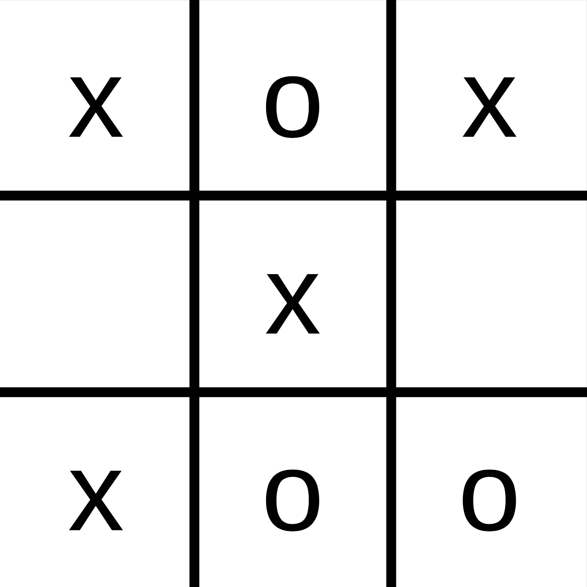

## Backgammon: Zwei Spieler, was ist der beste Zug?

::: center
{width="60%"}

[Quelle: ["position-backgammon-decembre"](https://www.flickr.com/photos/83436399@N04/11267311625) by [serialgamer_fr](https://www.flickr.com/photos/83436399@N04), licensed under [CC BY 2.0](https://creativecommons.org/licenses/by/2.0/?ref=ccsearch&atype=rich)]{.origin}
:::

::: notes
Zwei Spieler, ein Spielstand und ein Würfelergebnis: [**Was ist jetzt der beste Zug?!**]{.alert}
:::

## Motivation: Unterschied zu Suche?!

::: center
{width="30%"}
:::

\pause

\bigskip
=> Mehrere [**konkurrierende**]{.alert} Agenten an Suche beteiligt!

=> (Re-) Aktion des Gegners unbekannt/nicht vorhersehbar.

## Spiele und Umgebungen

|                      | Deterministisch   | Zufallskomponente        |
|:---------------------|:------------------|:-------------------------|
| Voll beobachtbar     | Schach, Go, ...   | Backgammon, Monopoly     |
| Partiell beobachtbar | Schiffe-versenken | Bridge, Poker, Skat, ... |

\bigskip
=> Bis auf Roboterfußball in KI traditionell keine physischen Spiele!

## Brettspiele sind interessant für KI

*   Brettspiele gut abstrakt darstellbar:
    *   Zustände einfach repräsentierbar
    *   Aktionen wohldefiniert (und i.d.R. sehr einfach)
    *   Realisierung als Suchproblem möglich

\bigskip

*   **Problem**: Suchbäume werden in Praxis riesig

    Beispiel **Schach**:
    -   Im Mittel 35 Aktionen (*branching factor*) von jeder Position
    -   Oft mehr als 40 Züge pro Spieler => Suchbäume mit mehr als 80 Ebenen
    -   $35^{80} \approx 10^{123}$ mögliche Knoten!
    -   (Aber "nur" rund $10^{40}$ _verschiedene_ Zustände)

    [Quelle: [@Russell2020, pp. 193-196]]{.origin}

## Eigenschaften guter Spielalgorithmen

*   Zeit begrenzt
    *   Irgendeine gute Entscheidung treffen! => Bewertungsfunktion [(auch für Zwischenzustände)]{.notes}

\smallskip

*   Speicher begrenzt
    *   Evaluierungsfunktion für Zwischenzustände
    *   Löschen von irrelevanten Zweigen

\smallskip

*   Strategien nötig
    *   Vorausschauend spielen (Züge "vorhersehen")

## Wrap-Up

*   Spiele kann man als Suchproblem betrachten
*   Merkmale:
    -   Mehrere Agenten beteiligt
    -   Beobachtbarkeit der Umgebung
    -   Zufallskomponente
    -   Spielstrategie
*   Problem: Riesige Spielbäume
*   Umgang mit begrenzten Ressourcen (Zeit, Speicher)

<!-- DO NOT REMOVE - THIS IS A LAST SLIDE TO INDICATE THE LICENSE AND POSSIBLE EXCEPTIONS (IMAGES, ...). -->
::: slides
## LICENSE

Unless otherwise noted, this work is licensed under CC BY-SA 4.0.

### Exceptions
*   Image ["position-backgammon-decembre"](https://www.flickr.com/photos/83436399@N04/11267311625) by [serialgamer_fr](https://www.flickr.com/photos/83436399@N04), licensed under [CC BY 2.0](https://creativecommons.org/licenses/by/2.0/?ref=ccsearch&atype=rich)
:::
