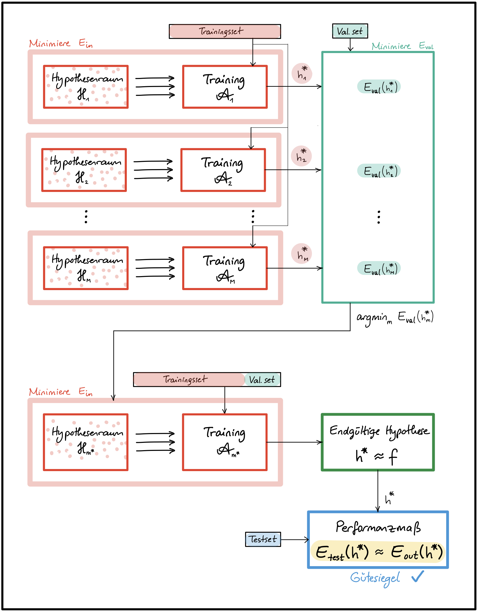

## Kurze Übersicht

### Training und Testing
*	Der tatsächliche **Erfolg** eines Modells wird nicht durch niedrige Trainingskosten gemessen, sondern durch geringe Kosten auf ungesehenen Daten, d.h. **hohe Vorhersagekraft, gute Generalisierung**!

*   Die Menge aller gelabelten Daten  in **Trainingsset und Testset** aufteilen, Testset nicht während des Trainings einsetzen!.
    *	$E_{in}$ bezeichnet den Fehler auf dem Trainingsset, auch **in-sample error**.
    *	$E_{out}$ bezeichnet den Fehler auf dem gesamten Eingaberaum $X$, auch **out-of-sample error**. $E_{out}$ ist der eigentliche Indikator für den zukünftigen Erfolg des Modells, ist uns aber nicht zugänglich.
    *	$E_{test}$ bezeichnet den Fehler auf dem Testset und ist eine **Näherung** für $E_{out}$.

    >   Analogie:\
    >   $E_{in}$ : Erfolg in Übungsaufgaben und Probeprüfungen.\
    >   $E_{test}$ : Erfolg in Endprüfung.

*	Die Näherung $E_{test}$ sollte möglichst genau sein, damit es als ein verlässliches **Gütesiegel** dienen kann.
	*	Das Testset sollte genug Daten enthalten. Üblicher Anteil an Testdaten:
		*	bei  $|D| \approx 100.000 \rightarrow$  ca. 20%
		*	bei  $|D| \approx 10.000.000 \rightarrow$  ca. 1%
	    *	Beispiel: Hat man 1000 Beispiele im Testset, wird $E_{test}$ mit $\ge 98\%$ Wahrscheinlichkeit in der $\pm 5\%$ Umgebung von $E_{out}$ liegen (für theoretische Grundlagen und Herleitung siehe [@AbuMostafa2012, S. 39-69]).
	*	Trainingsdaten und Testdaten sollten möglichst aus derselben Verteilung kommen, wie die zukünftigen **Real-World-Daten**.

*	**Wichtige Bemerkung**:
    *   Testdaten nicht anfassen, bis das Modell Einsatzbereit ist!
    *   Die Testdaten dürfen in **keinster Weise** bei der Auswahl der endgültigen Hypothese eingesetzt werden, weder bei der Berechnung der Parameter (Training), noch bei der Bestimmung der Hyperparameter (Hyperparameter-Tuning).
    *   Sobald der Testfehler die Auswahl der endgültigen Hypothese beeinflusst, kann sie nicht mehr als "Gütesiegel" eingesetzt werden.\
    **CHECK**: Hätte man zufällig andere Testdaten gewählt, könnte sich dadurch  die endgültige Hypothese ändern?

### Validierung und Modellauswahl

*	Das Ziel ist es, das Modell mit bester Generalisierung, also kleinstem $E_{out}$ zu bestimmen. $E_{out}$ ist jedoch unbekannt und die Näherung $E_{test}$ *darf nicht* bei der Modellauswahl eingesetzt werden.

*	LÖSUNG: Einen weiteren Teil der Daten als **Validierungsset** (auch development set) beiseitelegen und nicht für das Training (i.e. Minimierung des Trainingsfehlers $E_{in}$) verwenden!

*   **Bemerkung**:\
    Das Wort **Modell** kann je nach Kontext unterschiedliche Bedeutungen annehmen.\
    Ein Modell im aktuellen Kontext ist als ein Paar $(\mathcal{H},\mathcal{A})$ von Hypothesenraum (bzw. **Modellarchitektur**) und **Lernalgorithmus** definiert.
	*	Die Auswahl eines Modells kann aus einer Menge von Modellen unterschiedlicher Art erfolgen (z.B. lineare Modelle, polynomiale Modelle, neuronale Netze), oder von Modellen derselben Art aber mit unterschiedlichen Hyperparametern (z.B. Neuronale Netze mit unterschiedlicher Anzahl von versteckten Schichten).
	*	Außerdem kann dieselbe Modellarchitektur $\mathcal{H}$ mit unterschiedlichen Lernalgorithmen trainiert werden, was wiederum die endgültige Hypothese beeinflussen kann. Die Bestimmung der Hyperparameter von  ${\mathcal{A}}$ (wie z.B. Optimierungsfunktion, Lernrate, Kostenfunktion, Regularisierungsparameter usw.) sind daher auch Teil der Modellauswahl.

*   Der **Validierungsfehler $E_{val}$** kann nun als Entscheidungsgrundlage an verschiedenen Stellen des Lernrpozesses eingesetzt werden, wie zum Beispiel:

    *   Bei der **Auswahl geeigneter Hyperparameter** wie z.B. Anzahl Schichten, Anzahl Zellen/Schicht, Aktivierungsfunktion, Regularisierungsparameter (siehe Abbildung 1).

    

    *   Bei der **Auswahl der endgültigen Hypothese** ($\rightarrow$ Parameterauswahl!): unter allen Hypothesen, die während des Trainings durchlafen werden, wähle jene mit kleinstem $E_{val}$ (siehe Abbildung 2).

    

    *   Bei der graphischen **Darstellung von Lernkurven** für die Diagnose von Über- und Unteranpassung (siehe Abbildung 3).

    

*   Übliche train/val/test Aufteilung der Daten (in Prozent):
    *	bei  $|D| \approx 100.000 \rightarrow$  ca. 60/20/20
    *	bei  $|D| \approx 10.000.000 \rightarrow$  ca. 98/1/1

*	**Bemerkung**:\
    Das Modell ist trainiert für gute Ergebnisse auf Trainingsdaten und "fine-tuned" für gute Ergebnisse auf den Validierungsdaten. Ergebnisse auf Testdaten werden mit hoher wahrscheinlichkeit schlechter ausfallen, als auf Validierungsdaten ($E_{val}$ ist eine zu optimistische Näherung).

*   Sind Validierungs- und/oder Trainingsset zu klein, führt das zu schlechten Näherungen $E_{val}$  und folglich zu schlechten Entscheidungen.
    *   Bei der Aufteilung muss ein gutes Trade-off gefunden werden.
    *   Wenn kein Gütesiegel notwendig ist, kann man auf das Testset verzichten und die Daten in Trainings- und Validierungsset aufteilen.
    *   Für eine bessere Näherung mit weniger Validierungsdaten kann k-fache Kreuzvalidierung eingesetzt werden (wenn genug Rechenkapazität vorhanden ist).

### K-fache Kreuzvalidierung (engl. k-fold cross-validation):
*   Das Modell $(\mathcal{H_m},\mathcal{A_m})$ wird $k$ mal trainiert und validiert, jedes mal mit unterschiedlichen Trainings- und Validierungsmengen:
    *	Die Trainingsdaten werden in $k$ disjunkte Teilmengen $D_1, D_2, ..., D_k$ aufgeteilt.
    *	Bei dem $i$-ten Training werden die Teilmenge $D_i$ für die Berechnung des Validierungsfehlers $e_i := E_{val}(h_m^{*(i)})$ und die restlichen $k-1$ Teilmengen für das Training verwendet.

    *   Der **Kreuzvalidierungsfehler** des Modells $(\mathcal{H_m},\mathcal{A_m})$ ist der Durchschnitt der $k$ Validierungsfehler $e_1, e_2, ..., e_k$ (siehe Abbildung 4).
    $$ E_{CV}(m) := \frac{1}{k} \sum_{i=1}^{k} e_i = \frac{1}{k} \sum_{i=1}^{k} E_{val}(h_m^{*(i)})$$

    

*   Bemerkung: Die Kreuzvalidierung wird nur bei der Modellauswahl eingesetzt: es liefert verlässlichere Näherungen für $E_{out}$ und führt daher zu besseren Entscheidungen. Das zuletzt ausgewählte Modell wird danach wie gewohnt auf den gesamten Trainigsdaten (ausgenommen Testdaten) trainiert und zum Schluss mit den Testdaten evaluiert.

