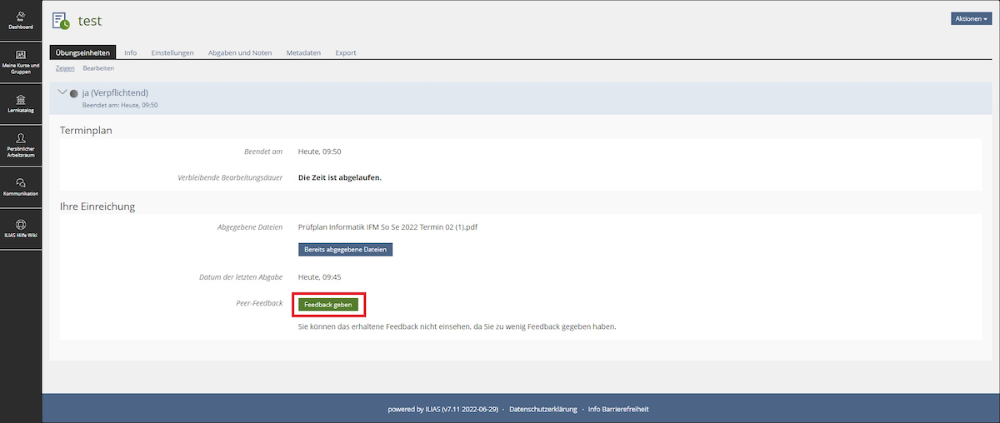
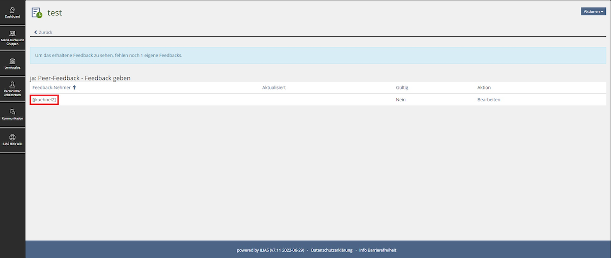
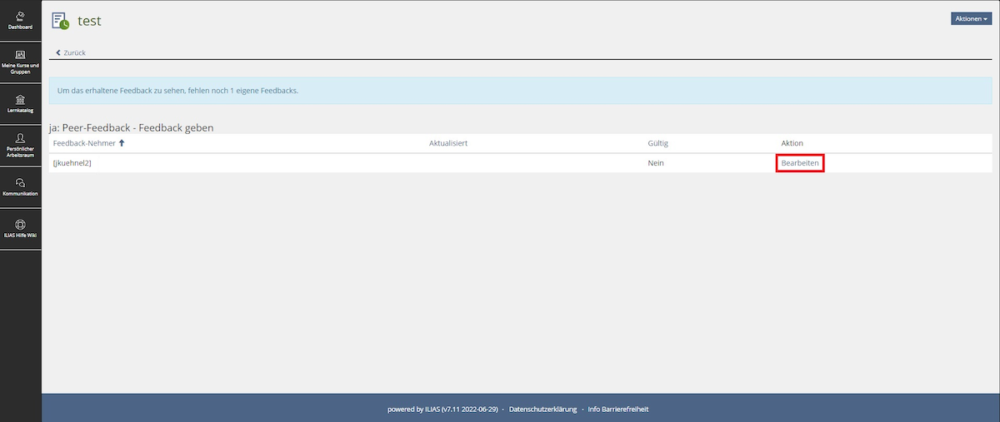
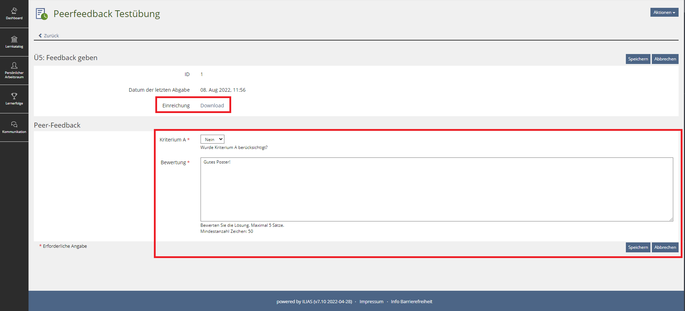
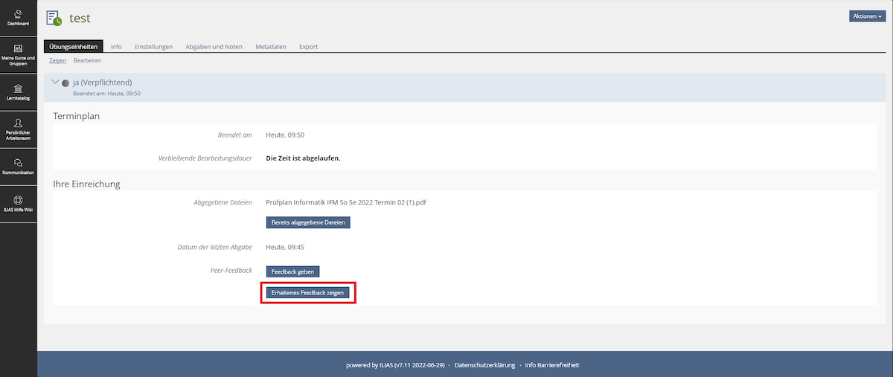

## Co-Teaching und Online-Unterricht

Wir werden die Vorlesungen an beiden Hochschulen (TDU, FHB) im Co-Teaching gemeinsam
durchführen. Deshalb werden alle Sitzungen (Vorlesung/Sprechstunde und Übung/Praktikum)
online über Zoom durchgeführt.

## Flipped Classroom

Wir drehen die Vorlesungen vom Ablauf her "um" - daher die Bezeichnung "Flipped Classroom".

Beim Flipped Classroom arbeiten Sie sich **vor der jeweiligen Vorlesung** selbstständig
durch das für die jeweilige Woche bereitgestellte Material: Skript, Videos, Quizzes,
Literaturhinweise, ..., gern auch bereits durch die Übungsaufgaben.

In der gemeinsamen Vorlesungssitzung präsentieren wir keinen neuen Stoff, sondern können
gemeinsam auf Ihre Fragen zum aktuellen Thema eingehen und im Plenum oder in Kleingruppen
passende Fallstudien lösen.

Das setzt voraus, dass Sie vorbereitet in die Stunde kommen und sich aktiv einbringen.

## Bearbeitung der Übungsaufgaben

Die Übungsaufgaben sollen in internationalen 2er-Teams (oder anderenfalls einzeln)
bearbeitet und gelöst werden.

Das gegenseitige Kennenlernen und die Team-Bildung für die Bearbeitung der Übungsaufgaben
erfolgt in der ersten Übung/im ersten Praktikum am Mittwoch, dem 12.10.2022 (Woche 41).

## Gruppenwahl

Wir haben in diesem Semester an der FHB zwei Praktikumstermine (G1 und G2) und an der
TDU drei Übungstermine (G1, G2, G3). Jede Person ist vom Stundenplan her einem dieser
Termine zugeordnet.

In jedem Übungs-/Praktikumstermin werden mehrere feste Kleingruppen gebildet, die dann
gemeinsam im Semester in Breakout-Sessions arbeiten.

In G1 und G2 werden je 3..4 Studierende der TDU und 4..5 Studierende der FHB gemeinsam
in den Breakout-Sessions arbeiten. In G3 werden die Kleingruppen mit 10..11 Studierenden
der TDU gebildet.

Hierzu treten Sie bitte am Anfang des Semesters einmalig im Kursraum im ILIAS einer der
dort angebotenen Kleingruppen bei, die zu Ihrem Stundenplan-Zeitslot passt. Die Passwörter
werden per Ankündigung in der Lehrveranstaltung bekannt gegeben.

*   FHB: Beitritt zu den Breakout-Gruppen in G1 und G2 vom 05.10.2022 11:00 Uhr bis
    08.10.2022 16:00 Uhr (DE)
*   TDU: Beitritt zu den Breakout-Gruppen in G1, G2 und G3 vom 08.10.2022 19:00 Uhr
    bis 11.10.2022 23:55 Uhr (TR)

Die Kleingruppen im ILIAS haben eine Kennzeichnung, die wir auch im Zoom für die
Breakout-Sessions nutzen. So finden Sie im Zoom zu "Ihrer" Kleingruppe und können
selbstständig in "Ihre" Breakout-Session gehen.

## Abgabe der Lösungen

Bitte laden Sie Ihre Lösung als eine **PDF-Datei** oder ein **Zip-Archiv** in die
jeweilige Aufgabe im ILIAS hoch. Wenn Sie in einem internationalen 2er-Team arbeiten,
muss bitte jeder Teampartner die Lösung selbst hochladen.

Dies ist die Voraussetzung für die darauf folgenden Leistungen: Vorstellen der Lösung
in der Übung/im Praktikum und das Erteilen von Peer-Feedback!

## Vorstellung der Lösungen

In der Übung/im Praktikum gehen Sie in "Ihre" Breakout-Session und stellen sich
gegenseitig Ihre Lösungen vor und diskutieren darüber.

Für die Teilnahme und die Bereitschaft, Ihre Lösung vorzustellen, gibt es Punkte.
Wer zwar anwesend ist, aber seine Lösung nicht vorstellen kann/will, kann diese
Punkte nicht bekommen.

**Bitte beachten Sie die von Ihnen gewählte bzw. die Ihnen zugewiesene Breakout-Gruppe.
Ein Wechsel der (Breakout-) Gruppen ist nicht möglich.**

## How to Review

Sobald die Abgabefrist für eine Aufgabe abgelaufen ist, verteilt ILIAS automatisch
an alle, die selbst eine Lösung hochgeladen haben, zufällige Aufforderungen zum
Review anderer Abgaben.

Die Reviews werden automatisch innerhalb Ihrer Kleingruppe (Breakout-Gruppe)
verteilt. Sie finden die angeforderten Reviews im ILIAS in der jeweiligen Aufgabe.

{width="80%"}

Gehen Sie **nach der Deadline** und **vor Ihrer Übung/Ihrem Praktikum** bitte ins
ILIAS in die Aufgabe und klicken auf den Button "Feedback geben", um nachzuschauen,
wem Sie ein Peer-Feedback geben sollen. Da hier lediglich die ILIAS-Kürzel angezeigt
werden, müssen Sie zudem zu Begin der Übung bzw. des Praktikums innerhalb Ihrer
Gruppe klarstellen, wem welches Kürzel zuzuordnen ist.

{width="80%"}

Indem Sie auf "Bearbeiten" klicken, finden Sie hier die Kriterien für die Reviews
in Form von kurzen Checklisten, sowie die Abgabe des zu bewertenden Peers, welche
Sie über den Download-Button herunterladen können. Hier ist später das Feedback
einzutragen.

{width="80%"}
{width="80%"}

In der Übung/im Praktikum füllen Sie Ihre Checklisten beim Zuhören aus und
übertragen diese bis spätestens zur angegebenen Frist ins ILIAS. Feedback-Fragen
zu den von anderen Personen vorgestellten Aufgabenteilen beantworten Sie bitte
anhand der Abgaben ihrer Feedback-Empfänger.

Unter Umständen kann es passieren, dass ILIAS Ihnen die Lösung Ihres eigenen Teams
(konkret: Ihren Teampartner) zuweist. In diesem Fall führen Sie bitte kein
vollständiges Review durch, sondern wählen Sie den entsprechenden Punkt auf der
Checkliste aus ("eigenes Team"). Außerdem kann es passieren, dass ILIAS Ihnen zwei
Mal eine Lösung des gleichen Teams zuweist, da jedes Mitglied einer Gruppe die Lösung
einzeln hochladen muss. In diesem Fall vergeben Sie bitte zwei Mal das gleiche Feedback.

Nachdem Sie fristgemäß die geforderte Anzahl an Feedbacks vergeben haben, wird in der
Aufgabe ein weiterer Button "Erhaltenes Feedback zeigen" freigeschaltet, über welchen
Sie das an Sie vergebene Feedback einsehen können.

{width="80%"}

Die Reviews sollen Ihnen zusätzlich zur Diskussion über die Lösungen in der Übung/im
Praktikum helfen, Ihre Lösung zu reflektieren und einzuordnen. Beim Erstellen der
Feedbacks sehen Sie anhand der Kriterien, welche Aspekte wichtig waren und wo Sie
vielleicht noch einmal nachschauen sollten. Das von den anderen Studierenden empfangene
Feedback kann Sie beim Lernprozess unterstützen.

## Poster

Für die beiden Poster-Sessions führen Sie die Ergebnisse der jeweiligen Meilensteine
zusammen und erstellen Sie ein Poster, welches Sie dann als Lösung abgeben, vorstellen
und wofür Sie sich gegenseitig Feedback erteilen.

Eine Vorlage finden Sie hier: **TODO**.

## TDU, G3

Für die TDU-Studierenden wird der Termin "G3" nur mit TDU-Studierenden besetzt sein
(es gibt nur zwei Termine an der FHB).

Die Übungen in Termin "G3" werden abweichend in **Google Meet** durchgeführt (nicht im
Zoom).

Für den Termin "G3" gibt es keine zusätzliche Zeitverschiebung/-änderung ab dem
31.10.2022 durch die Umstellung auf Winterzeit, d.h. diese Gruppe bleibt das ganze
Semester über bei Mi, 16:30 - 18:00 Uhr (TR).

Die restlichen Regeln finden hier aber dennoch Anwendung.

## Verspätete Abgaben, Krankheit

Es gibt keine verspäteten Abgaben. Das sind 0P.

**Ausnahme**: Für die beiden Poster gibt es eine Nachfrist von jeweils einer Woche, d.h.
die beiden Poster können bis zu eine Woche später abgegeben werden. Dabei können dann
aber nur noch **maximal 7P je in der Nachfrist eingereichtes Poster** erreicht werden
(1P für die Abgabe, bis zu 6P von den Dozenten für die inhaltliche und formale Qualität)!

Bei Krankheit/familiären Notfällen: Es ist bei den Übungsaufgaben ein gewisser Puffer für
Notfälle oder Krankheitsfälle eingeplant. Sie könnten also je nach Punktestand einmal
eine Woche fehlen und immer noch Ihr Testat (FHB) oder eine "1.0" (TDU) erreichen.

Wenn die persönliche Ausnahmesituation länger vorliegen sollte, müssen ggf. andere
Lösungen gefunden werden, um das Semester erfolgreich abschließen zu können. Nehmen
Sie in diesem Fall zeitnah Kontakt zu Ihren Dozenten auf.

Bei 2er-Teams arbeitet bitte der jeweilige Teampartner normal weiter (Abgabe der Lösung,
Vorstellung der Lösung, Feedback), um die Punkte zu erhalten.

Die beiden Poster-Sessions bauen inhaltlich auf den jeweils davor liegenden Meilensteinen
auf. Wenn Sie einmal einen Meilenstein verpasst haben, holen Sie die Aufgabe entsprechend
bei der Erstellung des Posters nach.
