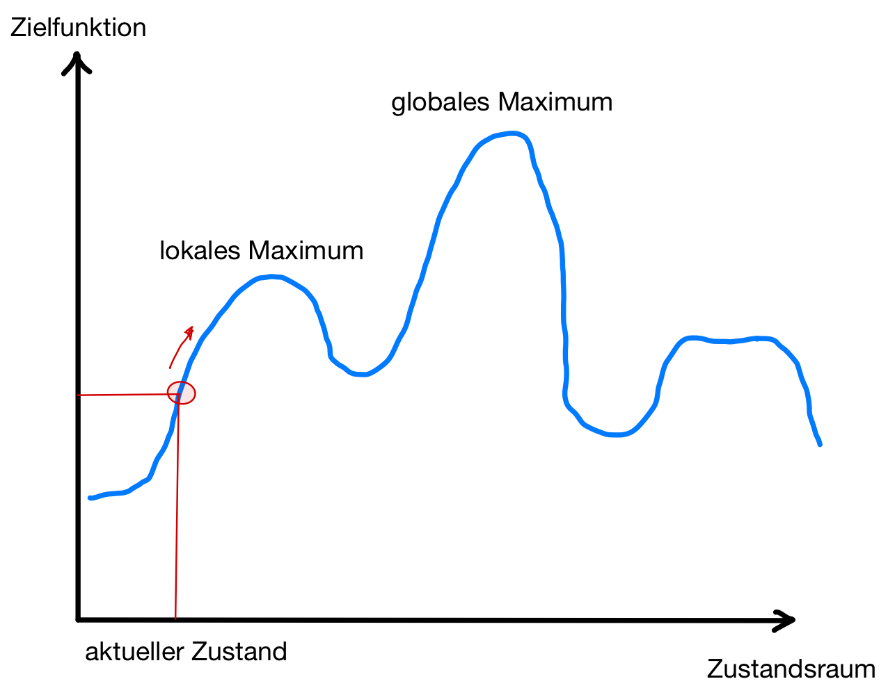

## Unterschiede in den Suchproblemen?

::::: columns
::: {.column width="46%"}
{width="80%"}
:::
::: {.column width="46%"}
{width="80%"}
:::
::::::

::: notes
Bisher betrachtete Suchverfahren:

*   Systematische Erkundung des Suchraums
*   [**Weg**]{.alert} zur Lösung wichtig

\smallskip

=> Oft aber nur das [**Ziel**]{.alert} **an sich** interessant! \newline
(Und nicht, wie man dort hin gelangt.)

\bigskip
Beispiel: Stundenplan
:::

## Analogie: Bergsteigen ohne Karte und Pfade

::: center
{width="50%"}
:::

\bigskip
\bigskip

**Gradienten-Suche**:
"Gehe in Richtung des [steilsten Anstiegs]{.alert} der [Zielfunktion]{.alert}."

=> Schrittweise Verbesserung des aktuellen Zustands (Lokale Suche)

::: notes
*   Verschiedene Namen: "Hill-climbing", "Greedy local search"
*   Kann auch als Minimierung angewendet werden
:::

## Pseudoalgorithmus Gradientensuche

::: cbox
"*Wie Bergsteigen am Mount Everest in dickem Nebel mit Gedächtnisverlust*"
:::

\bigskip
\bigskip

1.  Setze `currNode` auf den Startknoten
2.  `currNode` ist gesuchtes Element: Abbruch, melde "*gefunden*"
    -   Expandiere alle Nachfolger von `currNode`
    -   Setze `nextNode` auf Nachfolger mit höchster Bewertung
    -   Falls Bewertung von `nextNode` $\leq$ Bewertung von `currNode`: \newline
        Abbruch, melde "*nicht gefunden*"
    -   Setze `currNode` auf `nextNode`
3.  Gehe zu Schritt 2

:::::: notes
:::center
{width="90%"}
:::
::::::

[Tafelbeispiel Gradientensuche, Bewertung: Restkostenschätzung]{.bsp}

::: notes
## Beispiel Gradientensuche: $n$-Damen

*   **Ziel**: Setze $n$ Damen auf ein $n \times n$-Spielfeld ohne Konflikte
*   **Start**: Setze $n$ Damen auf ein $n \times n$-Spielfeld (mit Konflikten)
*   **Suche**: Bewege jeweils eine Dame so, daß die Anzahl der Konflikte reduziert wird

Schauen Sie sich auch Abb. 4.3 auf Seite 130 im @Russell2020 an!

**Hinweis**: Alle Damen stehen von Anfang an auf dem Brett und werden nur verschoben
=> "[vollständige Zustandsformulierung]{.alert}"

### Eigenschaften 8-Damen-Problem ($n=8$) (nach [@Russell2020, S.131])

*   Zustandsraum: $8^8 \approx 17$ Millionen Zustände!
*   Beginnend mit zufällig erzeugtem Startzustand:
    *   bleibt in 86% der Fälle stecken, d.h.
    *   findet Lösung nur in 14% der Fälle.
*   Beobachtung: Lösung nach durchschnittlich 4 Schritten, oder Verfahren bleibt
    nach durchschnittlich 3 Schritten stecken.

[Quelle: [@Russell2020, S.131]]{.origin}
:::

## Eigenschaften Gradientensuche

::: notes
*   Vollständigkeit: nein
*   Optimalität: nein
*   Komplexität: linear in der Anzahl der zu expandierenden Knoten

\smallskip

[**Zielfunktion (Bewertung) nötig!**]{.alert}
:::

::: center
{width="60%"}
:::

\bigskip

[**Problem**]{.alert}: lokale Maxima und Plateaus

::: notes
*   Lokale Maxima/Minima: Algorithmus findet nur eine suboptimale Lösung
*   Plateaus: Hier muss der Algorithmus mit zufälligen Zügen explorieren
:::

## Wrap-Up

Lokale Suchverfahren: Nur das Ergebnis zählt!

\bigskip

*   Gradientenverfahren: Gehe in Richtung des stärksten Anstiegs der
    Kostenfunktion

<!-- DO NOT REMOVE - THIS IS A LAST SLIDE TO INDICATE THE LICENSE AND POSSIBLE EXCEPTIONS (IMAGES, ...). -->
::: slides
## LICENSE

Unless otherwise noted, this work is licensed under CC BY-SA 4.0.
:::
