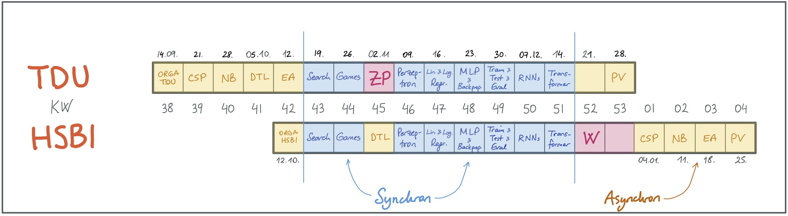

# Syllabus HSBI

{width="60%"}

[["künstliche
intelligenz"](https://pixabay.com/de/illustrations/k%c3%bcnstliche-intelligenz-netzwerk-3706562/)
by [Gerd Altmann (geralt)](https://pixabay.com/de/users/geralt-9301/) on Pixabay.com
([Pixabay License](https://pixabay.com/de/service/license/))]{.credits}

## Kursbeschreibung

Ausgehend von den Fragen "Was ist *Intelligenz*?" und "Was ist *künstliche*
Intelligenz?" werden wir uns in diesem Modul mit **verschiedenen Teilgebieten der
KI** beschäftigen und uns anschauen, welche **Methoden und Algorithmen** es gibt und
wie diese funktionieren. Dabei werden wir auch das Gebiet *Machine Learning*
berühren, aber auch andere wichtige Gebiete betrachten. Sie erarbeiten sich im Laufe
der Veranstaltung einen **Methoden-Baukasten** zur Lösung unterschiedlichster
Probleme und erwerben ein grundlegendes Verständnis für die Anwendung in Spielen,
Navigation, Planung, smarten Assistenten, autonomen Fahrzeugen, ...

## Überblick Modulinhalte

1.  Problemlösen
    -   Zustände, Aktionen, Problemraum
    -   Suche (blind, informiert): Breiten-, Tiefensuche, Best-First,
        Branch-and-Bound, A-Stern
    -   Lokale Suche: Gradientenabstieg, Genetische/Evolutionäre Algorithmen (GA/EA)
    -   Spiele: Minimax, Alpha-Beta-Pruning, Heuristiken
    -   Constraints: Backtracking, Heuristiken, Propagation, AC-3
2.  Maschinelles Lernen
    -   Merkmalsvektor, Trainingsmenge, Trainingsfehler, Generalisierung
    -   Entscheidungsbäume: CAL2, CAL3, ID3, C4.5
    -   Neuronale Netze
        -   Perzeptron, Lernregel
        -   Feedforward Multilayer Perzeptron (MLP), Backpropagation, Trainings-
            vs. Generalisierungsfehler
        -   Steuerung des Trainings: Kreuzvalidierung, Regularisierung
        -   Ausblick: Support-Vektor-Maschinen
    -   Naive Bayes Klassifikator
3.  ~~Inferenz, Logik~~ (**entfällt im W26**)
    -   ~~Prädikatenlogik: Modellierung, semantische und formale Beweise,
        Unifikation, Resolution~~
    -   ~~Ausblick: Anwendung in Prolog~~

## Team

-   [Carsten
    Gips](https://www.hsbi.de/minden/ueber-uns/personenverzeichnis/carsten-gips)
    (HSBI, Sprechstunde nach Vereinbarung)
-   [Canan Yıldız](http://people.tau.edu.tr/people.show/cananyildiz/de) (TDU)

## Kursformat (HSBI)

{width="80%"}

| Vorlesung (2 SWS)          | Praktikum (2 SWS)              |
|:---------------------------|:-------------------------------|
| Mo, 09:00 - 10:30 Uhr (DE) | G1: Mo, 10:45 - 12:15 Uhr (DE) |
| (*Flipped Classroom*)      | G2: Mi, 15:45 - 17:15 Uhr (DE) |
|                            | G3: Mo, 14:00 - 15:30 Uhr (DE) |
|                            | G4: Do, 14:00 - 15:30 Uhr (DE) |

Alle Sitzungen online per Zoom (**Zugangsdaten siehe
[ILIAS](https://www.hsbi.de/elearning/goto.php/crs/1634793)**).

## Fahrplan (HSBI)

Abgabe der Übungsblätter jeweils **Montag bis 09:00 Uhr** im
[ILIAS](https://www.hsbi.de/elearning/goto.php/exc/1582797). Vorstellung der Lösung
im jeweiligen Praktikum in der Abgabewoche.

| Monat | Woche vom | Vorlesung (Mo) | Praktikum (Mo/Mi/Do) |
|-----|:----------|:------------------------------------|:-------------------------------|
| Oktober | 12\. ... | [Orga](readme_hsbi.md) \|\| [Einführung KI & Problemlösen](lecture/intro/readme.md) |  |
|  | 19\. ... | [Suche (Search)](lecture/searching/readme.md) |  |
|  | 26\. ... | [Gradientensuche](lecture/searching/search6-gradient.md) & [Simulated Annealing](lecture/searching/search7-annealing.md) \|\| [Evolutionäre Algorithmen (EA)](lecture/ea/readme.md) |  |
| November | 02\. ... | [Optimale Spiele (Games)](lecture/games/readme.md) |  |
|  | 09\. ... | [Entscheidungsbäume (DTL)](lecture/dtl/readme.md) |  |
|  | 16\. ... | [Constraints (CSP)](lecture/csp/readme.md) |  |
|  | 23\. ... | [Perzeptron](lecture/nn/nn01-perceptron.md) |  |
| Dezember | 30\. ... | [Lineare Regression und Gradientenabstieg](lecture/nn/nn02-linear-regression.md) |  |
|  | 07\. ... | [Logistische Regression](lecture/nn/nn03-logistic-regression.md) |  |
|  | 14\. ... | [Overfitting und Regularisierung](lecture/nn/nn04-overfitting.md) \|\| [Multilayer Perceptron (MLP)](lecture/nn/nn05-mlp.md) |  |
|  | *21. ...* | ***Weihnachtspause*** |  |
|  | *28. ...* | ***Weihnachtspause*** |  |
| Januar | 04\. ... | [Backpropagation](lecture/nn/nn06-backprop.md) |  |
|  | 11\. ... | [Training & Testing](lecture/nn/nn07-training-testing.md) \| [Performanzanalyse](lecture/nn/nn08-testing.md) |  |
|  | 18\. ... | [Naive Bayes (NB)](lecture/naivebayes/readme.md) |  |
|  | 25\. ... | [Prüfungsvorbereitung HSBI](admin/exams-hsbi.md) \| Rückblick |  |

## Prüfungsform, Note und Credits (HSBI)

**(Digitale) Klausur plus Studienleistung (Portfolio)**, 5 ECTS

-   **Studienleistung**: "Portfolio" - Kriterien je Person:

    1.  Teilnahme an der Internationalen Projektwoche "AI Connect" mit aktiver
        Beteiligung (Meeting 1: Team-Building/Kick-Off, Meeting 2: Project Launch,
        Teamarbeit, Meeting 3: Team-Präsentationen (Vortrag/Video))
    2.  Mind. fünf Übungsblätter erfolgreich bearbeitet
    3.  Video-Vortrag zum erfolgreich bearbeiteten Mini-Projekt ("AI Connect") am
        Fr, 19.12., ab 10:30 Uhr, a 2 Minuten (pro Team)

    Je Kriterium: Abgabe eines Post Mortem im ILIAS (**jede Person individuell**)

-   **Gesamtnote**: (Digitale) Klausur im B40 (90 Minuten)

::: {.details title="Hinweise"}
-   Die Bearbeitung der Leistungen erfolgt individuell (außer "AI Connect"
    Projektwoche).
-   Für die "AI Connect" Projektwoche werden gemischte Teams aus den beteiligten
    Hochschulen gebildet.
-   Die Post Mortems sind individuell zu erstellen und abzugeben.
-   "Aktive Beteiligung" umfasst Anwesenheit und sachbezogene Beiträge;
    Anwesenheit/Beteiligung werden dokumentiert.
-   "Erfolgreiche Bearbeitung" eines Blattes umfasst Bearbeitung aller Aufgaben des
    Blattes und fristgerechte Abgabe des ausreichenden Post Mortems im ILIAS. Die
    intensive Beschäftigung mit den Aufgaben muss erkennbar sein.

\smallskip

-   **Post Mortem**: Jede Person beschreibt individuell(!) die Bearbeitung des
    jeweiligen Kriteriums bzw. die Teilnahme an den drei Meetings des "AI
    Connect"-Mini-Projekts zurückblickend mit mind. 150 bis max. 400 Wörtern
    (Nutzlast; Überschriften und Links zählen nicht mit). Gehen Sie dabei
    aussagekräftig und nachvollziehbar auf folgende Punkte ein:

    1.  Zusammenfassung: Was wurde gemacht bzw. was wurde auf dem Meeting
        besprochen?
    2.  Details: Kurze Beschreibung besonders interessanter Aspekte.
    3.  Reflexion: Was war der schwierigste Teil? Wie haben Sie dieses Problem
        gelöst?
    4.  Reflexion: Was haben Sie gelernt oder (besser) verstanden?
    5.  Link zu Ihrem Repo mit den relevanten Artefakten (Lösung, Slides für den
        Vortrag, ...).

    Für die "AI Connect"-Meetings passen Sie bitte die Punkte (1) bis (4)
    entsprechend inhaltlich an, (5) entfällt für die ersten beiden Meetings (für das
    dritte Meeting (Team-Präsentation) geben Sie bitte einen Link zu Ihrem Repo mit
    den Artefakten (Lösung, Vortrag, Video) an).

    Die Post Mortems geben Sie bitte pro Person bis spätestens zur jeweiligen
    Deadline im [ILIAS](https://www.hsbi.de/elearning/goto.php/exc/1582797) ab.

    Siehe auch
    https://github.com/Artificial-Intelligence-HSBI-TDU/KI-Vorlesung-W25/discussions/3.
:::

## Materialien

1.  ["**Artificial Intelligence: A Modern Approach**"](http://aima.cs.berkeley.edu/)
    (*AIMA*). Russell, S. und Norvig, P., Pearson, 2021. ISBN
    [978-0134610993](https://fhb-bielefeld.digibib.net/openurl?isbn=978-0134610993).
2.  "Grundkurs Künstliche Intelligenz". Ertel, W., Springer, 2025. ISBN
    [978-3-658-44955-1](https://fhb-bielefeld.digibib.net/openurl?isbn=978-3-658-44955-1).
    DOI [10.1007/978-3-658-44955-1](https://doi.org/10.1007/978-3-658-44955-1).
3.  "An Introduction to Machine Learning". Kubat, M., Springer, 2017. ISBN
    [978-3-319-63913-0](https://fhb-bielefeld.digibib.net/openurl?isbn=978-3-319-63913-0).
    DOI [10.1007/978-3-319-63913-0](https://doi.org/10.1007/978-3-319-63913-0).
