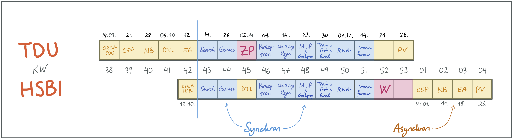

# Syllabus HSBI

{width="60%"}

[["künstliche
intelligenz"](https://pixabay.com/de/illustrations/k%c3%bcnstliche-intelligenz-netzwerk-3706562/)
by [Gerd Altmann (geralt)](https://pixabay.com/de/users/geralt-9301/) on Pixabay.com
([Pixabay License](https://pixabay.com/de/service/license/))]{.credits}

## Kursbeschreibung

Ausgehend von den Fragen "Was ist *Intelligenz*?" und "Was ist *künstliche*
Intelligenz?" werden wir uns in diesem Modul mit **verschiedenen Teilgebieten der
KI** beschäftigen und uns anschauen, welche **Methoden und Algorithmen** es gibt und
wie diese funktionieren. Dabei werden wir auch das Gebiet *Machine Learning*
berühren, aber auch andere wichtige Gebiete betrachten. Sie erarbeiten sich im Laufe
der Veranstaltung einen **Methoden-Baukasten** zur Lösung unterschiedlichster
Probleme und erwerben ein grundlegendes Verständnis für die Anwendung in Spielen,
Navigation, Planung, smarten Assistenten, autonomen Fahrzeugen, ...

## Überblick Modulinhalte

1.  Problemlösen
    -   Zustände, Aktionen, Problemraum
    -   Suche (blind, informiert): Breiten-, Tiefensuche, Best-First,
        Branch-and-Bound, A-Stern
    -   Lokale Suche: Gradientenabstieg, Genetische/Evolutionäre Algorithmen (GA/EA)
    -   Spiele: Minimax, Alpha-Beta-Pruning, Heuristiken
    -   Constraints: Backtracking, Heuristiken, Propagation, AC-3
2.  Maschinelles Lernen
    -   Merkmalsvektor, Trainingsmenge, Trainingsfehler, Generalisierung
    -   Entscheidungsbäume: CAL2, ID3/C4.5, Random Forest
    -   Neuronale Netze
        -   Perzeptron, Lernregel
        -   Feedforward Multilayer Perzeptron (MLP), Backpropagation, Trainings-
            vs. Generalisierungsfehler
        -   Steuerung des Trainings: Kreuzvalidierung, Regularisierung
        -   Ausblick: Support-Vektor-Maschinen
    -   Naive Bayes Klassifikator
3.  ~~Inferenz, Logik~~ (**entfällt im W26**)
    -   ~~Prädikatenlogik: Modellierung, semantische und formale Beweise,
        Unifikation, Resolution~~
    -   ~~Ausblick: Anwendung in Prolog~~

## Team

-   [Carsten
    Gips](https://www.hsbi.de/minden/ueber-uns/personenverzeichnis/carsten-gips)
    (HSBI, Sprechstunde nach Vereinbarung)
-   [Canan Yıldız](http://people.tau.edu.tr/people.show/cananyildiz/de) (TDU)

## Kursformat (HSBI)

{width="80%"}

| Vorlesung (2 SWS)          | Praktikum (2 SWS)              |
|:---------------------------|:-------------------------------|
| Mo, 09:00 - 10:30 Uhr (DE) | G1: Mo, 10:45 - 12:15 Uhr (DE) |
| (*Flipped Classroom*)      | G2: Mi, 15:45 - 17:15 Uhr (DE) |
|                            | G3: Mo, 14:00 - 15:30 Uhr (DE) |
|                            | G4: Do, 14:00 - 15:30 Uhr (DE) |

Alle Sitzungen online per Zoom (**Zugangsdaten siehe
[ILIAS](https://www.hsbi.de/elearning/goto.php/crs/1634793)**).

## Fahrplan (HSBI)

| Monat    | Woche vom | Thema       | Vorlesung (Mo)                                                                                                                                                                                                                                                                                                                            | Praktikum (Mo/Mi/Do)                             |
|----------|:----------|:------------|:------------------------------------------------------------------------------------------------------------------------------------------------------------------------------------------------------------------------------------------------------------------------------------------------------------------------------------------|:-------------------------------------------------|
| Oktober  | 12.10.    | Orga        | [Orga HSBI](readme_hsbi.md) \| [Einführung KI](lecture/intro/intro1-overview.md) \| [Einführung Jupyter Notebook](lecture/intro/intro3-jupyternotebooks.md)                                                                                                                                                                               | \-                                               |
|          | 19.10.    | Search      | [Problemlösen](lecture/intro/intro2-problemsolving.md) \| [Tiefensuche](lecture/searching/search1-dfs.md) \| [Breitensuche](lecture/searching/search2-bfs.md) \| [Branch-and-Bound](lecture/searching/search3-branchandbound.md) \| [Best First](lecture/searching/search4-bestfirst.md) \| [A-Stern](lecture/searching/search5-astar.md) | [Suche](homework/sheet-search.md)                |
|          | 26.10.    | Games       | [Optimale Spiele](lecture/games/games1-intro.md) \| [Games mit Minimax](lecture/games/games2-minimax.md) \| [Minimax und Heuristiken](lecture/games/games3-heuristics.md) \| [Alpha-Beta-Pruning](lecture/games/games4-alphabeta.md)                                                                                                      | [Games](homework/sheet-games.md)                 |
| November | 02.11.    | DTL         | [Machine Learning 101](lecture/dtl/dtl1-mlbasics.md) \| [CAL2](lecture/dtl/dtl2-cal2.md) \| [Entropie](lecture/dtl/dtl5-entropy.md) \| [ID3 und C4.5](lecture/dtl/dtl6-id3.md) \| [Random Forest](lecture/dtl/dtl7-randomforest.md)                                                                                                       | [DTL](homework/sheet-dtl.md)                     |
|          | 09.11.    | Perzeptron  | [Perzeptron](lecture/nn/nn01-perceptron.md)                                                                                                                                                                                                                                                                                               | [Perzeptron](homework/sheet-nn-perceptron.md)    |
|          | 16.11.    | Regression  | [Lineare Regression und Gradientenabstieg](lecture/nn/nn02-linear-regression.md) \| [Logistische Regression](lecture/nn/nn03-logistic-regression.md)                                                                                                                                                                                      | [Regression](homework/sheet-nn-regression.md)    |
|          | 23.11.    | MLP         | [Multilayer Perceptron (MLP)](lecture/nn/nn05-mlp.md) \| [Backpropagation](lecture/nn/nn06-backprop.md)                                                                                                                                                                                                                                   | [MLP](homework/sheet-nn-mlp.md)                  |
| Dezember | 30.11.    | Train&Test  | [Overfitting und Regularisierung](lecture/nn/nn04-overfitting.md) \| [Training & Testing](lecture/nn/nn07-training-testing.md) \| [Performanzanalyse](lecture/nn/nn08-testing.md)                                                                                                                                                         | [Backpropagation](homework/sheet-nn-backprop.md) |
|          | 07.12.    | RNN         | [RNN](lecture/nn/nn11-rnn.md)                                                                                                                                                                                                                                                                                                             | \-                                               |
|          | 14.12.    | Transformer | [Transformer](lecture/nn/nn12-transformer.md)                                                                                                                                                                                                                                                                                             | \-                                               |
|          | *21.12.*  | \-          | ***Weihnachtspause***                                                                                                                                                                                                                                                                                                                     | \-                                               |
|          | *28.12.*  | \-          | ***Weihnachtspause***                                                                                                                                                                                                                                                                                                                     | \-                                               |
| Januar   | 04.01.    | CSP         | [Einführung Constraints](lecture/csp/csp1-intro.md) \| [Lösen von diskreten CSP](lecture/csp/csp2-backtrackingsearch.md) \| [CSP und Heuristiken](lecture/csp/csp3-heuristics.md) \| [Kantenkonsistenz und AC-3](lecture/csp/csp4-ac3.md) \| [Min-Conflicts Heuristik](lecture/csp/csp5-minconflicts.md)                                  | [CSP](homework/sheet-csp.md)                     |
|          | 11.01.    | NB          | [Wahrscheinlichkeitstheorie](lecture/naivebayes/nb1-probability.md) \| [Naive Bayes](lecture/naivebayes/nb2-naivebayes.md) \| [Textklassifikation mit NB](lecture/naivebayes/nb3-nb-text.md)                                                                                                                                              | [Naive Bayes](homework/sheet-nb.md)              |
|          | 18.01.    | EA          | [Gradientensuche](lecture/searching/search6-gradient.md) \| [Simulated Annealing](lecture/searching/search7-annealing.md) \|\| [Intro EA/GA](lecture/ea/ea1-intro.md) \| [Genetische Algorithmen](lecture/ea/ea2-ga.md)                                                                                                                   | [EA/GA](homework/sheet-ea.md)                    |
|          | 25.01.    | PV          | Rückblick \| [Prüfungsvorbereitung HSBI](admin/exams-hsbi.md)                                                                                                                                                                                                                                                                             | \-                                               |

## Prüfungsform, Note und Credits (HSBI)

**(Digitale) Klausur plus Studienleistung (Portfolio)**, 5 ECTS

### **Studienleistung**: "Portfolio

Die Studienleistung ist eine unbenotete Leistung und setzt sich aus mehreren
Komponenten zusammen:

1.  Erfolgreiche Bearbeitung von mind. **sechs Übungsblättern** inkl. fristgerechter
    Abgabe des zugehörigen **Post Mortems** (s.u.).

Abgabe der Post Mortems: Spätestens eine Woche nach der Übung im
[ILIAS](https://www.hsbi.de/elearning/goto.php/exc/1737956).

### **Gesamtnote**: (Digitale) Klausur im B40 (90 Minuten)

Sie können die Prüfung in der ersten oder in der zweiten Prüfungsphase ablegen. In
beiden Prüfungszeiträumen wird je eine digitale Klausur im B40 mit 90 Minuten Dauer
angeboten. Die Note ergibt sich aus der Leistung in der Klausur.

### Hinweise

-   Die Bearbeitung der Aufgaben erfolgt individuell.
-   Im Praktikum beginnen wir gemeinsam mit der Bearbeitung der Übungsblätter und
    diskutieren über Lösungsansätze. Die Lösung soll anschließend individuell
    fertiggestellt werden und kann auf Wunsch im nächsten Praktikum von Ihnen
    vorgestellt werden.
-   "Erfolgreiche Bearbeitung" eines Blattes umfasst die Bearbeitung aller Aufgaben
    des Blattes und die fristgerechte Abgabe des ausreichenden Post Mortems im
    ILIAS. Die intensive Beschäftigung mit den Aufgaben muss erkennbar sein.
-   Die Teilnahme am Praktikum ist freiwillig, wird aber deutlich empfohlen.
-   Eine Bewertung einzelner Übungsblätter findet nicht statt.
-   Die Post Mortems sind individuell zu erstellen und abzugeben.
-   "Aktive Beteiligung" umfasst Anwesenheit und sachbezogene Beiträge;
    Anwesenheit/Beteiligung werden dokumentiert.

\smallskip

-   **Post Mortem**: Jede Person beschreibt individuell(!) die Bearbeitung des
    jeweiligen Blattes zurückblickend mit mind. 150 bis max. 400 Wörtern (Nutzlast!
    Überschriften und Links zählen nicht mit). Gehen Sie dabei aussagekräftig und
    nachvollziehbar auf folgende Punkte ein:

    1.  **Zusammenfassung**: Was wurde gemacht?
    2.  **Details**: Kurze Beschreibung besonders interessanter Aspekte.
    3.  **Reflexion**: Was war der schwierigste Teil? Wie haben Sie dieses Problem
        gelöst?
    4.  **Reflexion**: Was haben Sie gelernt oder (besser) verstanden?

    Die Post Mortems geben Sie bitte pro Person bis spätestens zur jeweiligen
    Deadline im [ILIAS](https://www.hsbi.de/elearning/goto.php/exc/1582797) ab.

## Materialien

1.  ["**Artificial Intelligence: A Modern Approach**"](http://aima.cs.berkeley.edu/)
    (*AIMA*). Russell, S. und Norvig, P., Pearson, 2021. ISBN
    [978-0134610993](https://fhb-bielefeld.digibib.net/openurl?isbn=978-0134610993).
2.  ["Hands-On Machine Learning with Scikit-Learn, Keras, and
    TensorFlow"](https://learning.oreilly.com/library/view/hands-on-machine-learning/9781098125967/).
    Géron, A., O'Reilly, 2023. ISBN
    [978-1-098-12597-4](https://fhb-bielefeld.digibib.net/openurl?isbn=978-1-098-12597-4).
    [Online](https://learning.oreilly.com/library/view/hands-on-machine-learning/9781098125967/)
    über die [O'Reilly-Lernplattform](https://www.oreilly.com/library-access/).
